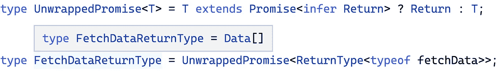
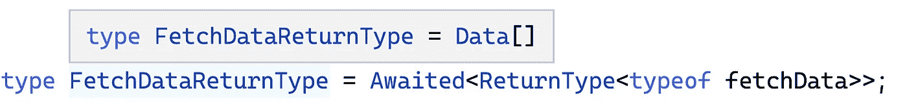
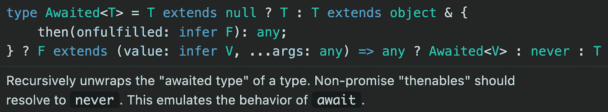

# 具有代码挑战的高级类型脚本:等待类型

> 原文：<https://javascript.plainenglish.io/advanced-typescript-with-code-challenges-awaited-type-e823a3b3dc3d?source=collection_archive---------3----------------------->

## 学习高级的 Typescript 特性，并将它们应用到实际的代码练习中。

Photo template by [Rachel Claire](https://www.pexels.com/de-de/@rachel-claire?utm_content=attributionCopyText&utm_medium=referral&utm_source=pexels) from [Pexels](https://www.pexels.com/de-de/foto/natur-feld-trocken-tier-4577793/?utm_content=attributionCopyText&utm_medium=referral&utm_source=pexels)

TypeScript 太牛了！越来越多的项目将它作为主要的编程语言。尤其是在前端开发领域，构建大型应用程序变得至关重要。虽然像 Angular 这样的框架提供 TypeScript 作为主要语言，但所有已知的库，如 React 或 Vue.js，都支持静态类型语言。

> 它不仅是最流行的语言之一，也是发展最快的语言之一。— [GitHub](https://www.businessinsider.com/most-popular-programming-languages-github-2019-11#7-typescript-4)

作为发展最快的编程语言之一，越来越多的功能被不断添加。每增加一项新功能，它都会变得更加强大。掌握它们会让你的代码更健壮、更整洁、更容易重构。在本文中，我们将了解 Typescript 4.5 中引入的等待类型**。这个新的**实用程序类型**在解开承诺方面帮了我们很多，这在过去需要使用[推断关键字](/advanced-typescript-with-code-challenges-infer-keyword-5ef686d77a3c)来完成。**

> […]它非常类似于 JavaScript，但是具有更强大的功能，可以帮助开发人员构建大规模的应用程序。”— [GitHub](https://www.businessinsider.com/most-popular-programming-languages-github-2019-11#7-typescript-4)

要了解关于高级 TypeScript 特性的更多信息，请查看我的其他文章。以下是一个概述:

Overview — Articles

 [## 网络亮点- PDF 和网络荧光笔

### Web Highlights 是一个在 Web 上突出显示文本的工具，可以更有效地组织您的研究。提升你的…

web-highlights.com](https://web-highlights.com/) 

# 等待的类型

`Awaited`实用类型非常简单，帮助我们获得承诺的回报类型。为了理解为什么这个新的**实用程序类型**如此强大，我们应该首先看看在 Typescript 4.5 发布之前这个问题是如何解决的。

**使用** `**infer**` **关键字和< 4.5** 打字稿解包承诺

假设有这个函数，我们想解析`fetchData`函数的返回类型`Data[]`:

在过去，使用小于 4.5 的 Typescript 版本，我们可以像这样使用`infer`关键字构建我们自己的实用程序类型:

如果对`infer`关键字不熟悉，可以通过通读这篇文章详细了解:[带代码挑战的高级类型脚本:推断关键字](/advanced-typescript-with-code-challenges-infer-keyword-5ef686d77a3c)。

然后我们可以使用我们的`UnwrappedPromise`助手类型从我们的`fetchData`函数中提取返回类型`Data[]`:

你可以看到，我们成功地从函数中推断出了`Data[]`类型:

**用** `**Awaited**` **关键字拆封承诺，打字稿≤ 4.5**

有了 Typescript 4.5，许多工作从我们手中拿走了，因为新的实用程序类型`Awaited`为我们解开了承诺。现在，我们不再需要使用`infer`关键字构建我们自己的实用程序类型。我们可以像这样简单地使用`Awaited`类型:

你可以看到，我们再次成功地从函数中推断出了`Data[]`类型:

如果我们查看使用 VS 代码的`Awaited`实用程序类型的文档，我们可以看到 Typescript 做了一些非常类似于我们对助手类型`UnwrappedPromise`所做的事情。它们通过使用`infer`关键字递归地展开“等待的类型”:

Typescript docs of the Awaited type

# 代码挑战💻

你可以在这个[打字本操场(起始码)](https://www.typescriptlang.org/play?ts=4.5.5#code/PQKhCgAJshJA7SB7ArgJ0gQwA7YDYCWAxpgC4FLwA0kA7gKaQDmSpkAzkgLaN71OYiAT0hEkAE3o1aAC2Iy6mdqLT0y9cXQKkFmREjySMAFSHZ67ImgLY2AN3pp2FeADpIUGJ+gA5JLWlGFGxxdU1SJEhTc0trW0gAFlcAVix4TVo9NgjIVQAzQQiMTh5kPOR0UQl6dwB1Rkz4bMimejZrTSRyksZ2ejw8gFoAIxQCPDYUckJSEVmYjxhIAn1KsUlhpUYclHhaNBxIbDRuAj72GiU6RhJEeH9IFD7IHUZR8dJBlcgAQUztDQvMw1byLGAAUQAHkRHEQzvQAFzgUFLACM7gASvQuEgHC8ZL1+kMuJhJJAAAonLjwrGkdDwaJBabaObAlEwABMmIsBjxmDweCB5kgjhOTmRkBAwGRK1IjgKMIpjk4iAA3qD4JgeAiOKRrPAmABucAAX2RSiE8CIkDyuyI5EoNraRBk5OVlHYAAoAJQ6ymnPoAHjdTkoAG0ALoAPkg6qWYng7DY5lDib97vgkcgAF5IGH2dA40ti9BNdrIAByACymGsTwrVALkDNSwjoNUdLQiBTKvYxrN4HmjH91L6tPpjMDxhjueMIshcvSyhH8MDKzyjkg467MYA-Fu2vTIDrjMbB8DIAAxZ2ujPbhkX3MrseHruT++ToddJ2kF0h3tRlGZ4JkmHC8vQxhyOwjLgmgYrpqmWa5qqJpYMouwANb3LQiBXNev63qmH7AoaQA)解决练习。如果你被卡住了，你会在这个[打字游戏场(解决方案代码)](https://www.typescriptlang.org/play?ts=4.5.5#code/PQKhCgAJshJA7SB7ArgJ0gQwA7YDYCWAxpgC4FLwA0kA7gKaQDmSpkAzkgLaN71OYiAT0hEkAE3o1aAC2Iy6mdqLT0y9cXQKkFmREjySMAFSHZ67ImgLY2AN3pp2FeADpIUGJ+gA5JLWlGFGxxdU1SJEhTc0trW0gAFlcAVix4TVo9NgjIVQAzQQiMTh5kPOR0UQl6dwB1Rkz4bMimejZrTSRyksZ2ejw8gFoAIxQCPDYUckJSEVmYjxhIAn1KsUlhpUYclHhaNBxIbDRuAj72GiU6RhJEeH9IFD7IHUZR8dJBlcgAQUztDQvMw1byLGAAUQAHkRHEQzvQAFzgUFLACM7gASvQuEgHC8ZL1+kMuJhJJAAAonLjwrGkdDwaJBabaObAlEwABMmIsBjxmDweCB5kgjhOTmRkBAwGRK1IjgKMIpjk4iAA3qD4JgeAiOKRrPAmABucAAX2RSiE8CIkDyuyI5EoNraRBk5OVlHYAAoAJQ6ymnPoAHjdTkoAG0ALoAPkg6qWYng7DY5lDib97vgkcgAF5IJHQao6WhECmVexjWbwPNGAAxZ2ujO0+mMnO-f5y8SBpvFxmB6tdJ2kF0hstRqPG8AJpMcXn0YxydiM8FoMXp1NZ3Oqk1YZS7ADW91oiCudaHDdT3YZwMNQA)找到解决方案。当然，你也可以复制&粘贴类型脚本代码到你选择的 IDE 中。

## 介绍

在我们的应用程序中，我们得到了一些遗留代码，这些代码是用旧的 Typescript 版本创建的。现在，我们更新到了 Typescript 4.5，并希望重构一些代码。我们希望在我们的代码库中去掉一些自建的实用程序类型来解开承诺，因为我们现在可以使用内置的`Awaited`类型。

## 锻炼

1.  移除自制的`PromiseReturnType`工具类型
2.  解决所有类型错误

## 密码

下面是该练习的 [**起始码**](https://www.typescriptlang.org/play?ts=4.5.5#code/PQKhCgAJshJA7SB7ArgJ0gQwA7YDYCWAxpgC4FLwA0kA7gKaQDmSpkAzkgLaN71OYiAT0hEkAE3o1aAC2Iy6mdqLT0y9cXQKkFmREjySMAFSHZ67ImgLY2AN3pp2FeADpIUGJ+gA5JLWlGFGxxdU1SJEhTc0trW0gAFlcAVix4TVo9NgjIVQAzQQiMTh5kPOR0UQl6dwB1Rkz4bMimejZrTSRyksZ2ejw8gFoAIxQCPDYUckJSEVmYjxhIAn1KsUlhpUYclHhaNBxIbDRuAj72GiU6RhJEeH9IFD7IHUZR8dJBlcgAQUztDQvMw1byLGAAUQAHkRHEQzvQAFzgUFLACM7gASvQuEgHC8ZL1+kMuJhJJAAAonLjwrGkdDwaJBabaObAlEwABMmIsBjxmDweCB5kgjhOTmRkBAwGRK1IjgKMIpjk4iAA3qD4JgeAiOKRrPAmABucAAX2RSiE8CIkDyuyI5EoNraRBk5OVlHYAAoAJQ6ymnPoAHjdTkoAG0ALoAPkg6qWYng7DY5lDib97vgkcgAF5IGH2dA40ti9BNdrIAByACymGsTwrVALkDNSwjoNUdLQiBTKvYxrN4HmjH91L6tPpjMDxhjueMIshcvSyhH8MDKzyjkg467MYA-Fu2vTIDrjMbB8DIAAxZ2ujPbhkX3MrseHruT++ToddJ2kF0h3tRlGZ4JkmHC8vQxhyOwjLgmgYrpqmWa5qqJpYMouwANb3LQiBXNev63qmH7AoaQA) :

Starter code

## 解决办法

下面是 [**解**](https://www.typescriptlang.org/play?ts=4.5.5#code/PQKhCgAJshJA7SB7ArgJ0gQwA7YDYCWAxpgC4FLwA0kA7gKaQDmSpkAzkgLaN71OYiAT0hEkAE3o1aAC2Iy6mdqLT0y9cXQKkFmREjySMAFSHZ67ImgLY2AN3pp2FeADpIUGJ+gA5JLWlGFGxxdU1SJEhTc0trW0gAFlcAVix4TVo9NgjIVQAzQQiMTh5kPOR0UQl6dwB1Rkz4bMimejZrTSRyksZ2ejw8gFoAIxQCPDYUckJSEVmYjxhIAn1KsUlhpUYclHhaNBxIbDRuAj72GiU6RhJEeH9IFD7IHUZR8dJBlcgAQUztDQvMw1byLGAAUQAHkRHEQzvQAFzgUFLACM7gASvQuEgHC8ZL1+kMuJhJJAAAonLjwrGkdDwaJBabaObAlEwABMmIsBjxmDweCB5kgjhOTmRkBAwGRK1IjgKMIpjk4iAA3qD4JgeAiOKRrPAmABucAAX2RSiE8CIkDyuyI5EoNraRBk5OVlHYAAoAJQ6ymnPoAHjdTkoAG0ALoAPkg6qWYng7DY5lDib97vgkcgAF5IJHQao6WhECmVexjWbwPNGAAxZ2ujO0+mMnO-f5y8SBpvFxmB6tdJ2kF0hstRqPG8AJpMcXn0YxydiM8FoMXp1NZ3Oqk1YZS7ADW91oiCudaHDdT3YZwMNQA) 为练习题:

Solution code

# 最后的想法

我希望你喜欢阅读这篇文章。我将在后续文章中发布更多关于高级 TypeScript 特性的文章。我还写关于 Web 组件、前端框架、软件设计原则和许多其他主题的文章。跟着我不要错过他们。🙏

我总是很乐意回答问题，也乐于接受批评。请随时联系我😊

***如果你想支持我的写作，*** [***成为中等会员***](https://medium.com/@mariusbongarts/membership) ***。如果你这样做，我会得到一小笔佣金。谢谢！***

 [## 通过我的推荐链接加入 Medium-Marius bong arts

### 作为一个媒体会员，你的会员费的一部分会给你阅读的作家，你可以完全接触到每一个故事…

medium.com](https://medium.com/@mariusbongarts/membership) 

关注我，不要错过我的下一篇文章。我写了关于 Typescript、Web 组件、前端框架、软件设计模式、Chrome 扩展以及更多的主题！🙏

# 关于我

我是埃森哲互动公司的软件工程分析师。我喜欢创造有价值的内容和产品，让人们的生活更轻松。例如，[**Web Highlights Chrome Extension**](https://chrome.google.com/webstore/detail/web-highlights-%20-bookmark/hldjnlbobkdkghfidgoecgmklcemanhm)使您能够在浏览器中高亮显示您访问的每个页面或 PDF 上的文本。您可以提供标签来对您的研究进行分组，并非常容易地重新找到它。你所有的精彩瞬间都会同步到 web-highlights.com[的相应网络应用上。看看吧！](https://web-highlights.com/)

通过**[**LinkedIn**](https://www.linkedin.com/in/marius-bongarts-6b3638171/)**联系我或者在 [**Twitter**](https://twitter.com/MariusBongarts) 上关注我。****

**** [## Web 亮点— PDF 和 Web 荧光笔

### 在每个网站或 PDF 上创建亮点、书签、标签和文件夹。以结构化的方式组织您的想法和研究…

chrome.google.com](https://chrome.google.com/webstore/detail/web-highlights-pdf-web-hi/hldjnlbobkdkghfidgoecgmklcemanhm)**** 

## ****进一步阅读****

**** [## Web 组件会取代前端框架吗？

### 它们是为解决不同的问题而构建的。

javascript.plainenglish.io](/will-web-components-replace-frontend-frameworks-535891d779ba)  [## 带有类型脚本示例的设计模式:工厂方法

### 工厂方法有助于编程接口，而不是实现。

javascript.plainenglish.io](/design-patterns-with-typescript-examples-factory-method-4d145887b141)  [## 用 Web 组件构建自己的博客组合:基础

### 第 1 部分—定制元素、阴影 DOM 和 HTML 模板

javascript.plainenglish.io](/showcase-your-medium-articles-with-web-components-part-1-basics-d2c6618e9482) 

*更内容于* [***普通英语***](https://plainenglish.io/) *。报名参加我们的* [***免费周报***](http://newsletter.plainenglish.io/) *。* [***推特***](https://twitter.com/inPlainEngHQ) *和*[***LinkedIn***](https://www.linkedin.com/company/inplainenglish/)*追随我们。查看我们的* [***社区不和***](https://discord.gg/GtDtUAvyhW) *并加入我们的* [***人才集体***](https://inplainenglish.pallet.com/talent/welcome) *。*****