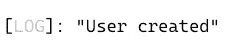
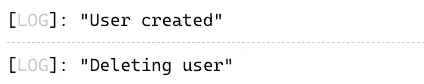

# 具有代码挑战的高级类型脚本:类装饰器

> 原文：<https://javascript.plainenglish.io/advanced-typescript-with-code-challenges-class-decorators-afd9043d41f6?source=collection_archive---------4----------------------->

## 装饰器提供了一种为类声明和成员添加注释的方法。

Photo template by [Rachel Claire](https://www.pexels.com/de-de/@rachel-claire?utm_content=attributionCopyText&utm_medium=referral&utm_source=pexels) from [Pexels](https://www.pexels.com/de-de/foto/natur-feld-trocken-tier-4577793/?utm_content=attributionCopyText&utm_medium=referral&utm_source=pexels)

在这篇文章中，我们将学习打字稿**装饰**。Decorator 遵循同名结构软件[的设计原则 **Decorator**](/software-design-patterns-with-typescript-examples-decorator-cb6160ddbeb9) ，为扩展功能提供了子类化的灵活替代方案。

要了解关于高级 TypeScript 特性的更多信息，请查看我的其他文章。以下是一个概述:

Overview TypeScript Features

 [## Web 亮点— PDF 和 Web 荧光笔

### Web Highlights 是一个在 Web 上突出显示文本的工具，可以更有效地组织您的研究。提升你的…

web-highlights.com](https://web-highlights.com/) 

# 装饰者

**结构** **装饰**模式非常强大，帮助我们防止子类的**爆炸。**

装饰模式的目的是动态地给一个对象附加额外的责任，并为扩展功能提供一个灵活的子类化替代方案。

装饰模式在许多用例中被广泛使用和应用。只要您想，就使用该模式:

*   创建大量的子类。有时太多的子类是不切实际的，并导致子类**的爆炸**来支持每一种组合。
*   在不影响其他对象的情况下，动态地为单个对象**添加职责**。
*   在运行时给对象**分配额外的行为**，而不破坏使用这些对象的代码。

 [## 带有类型脚本示例的软件设计模式:装饰器

### 装饰模式为扩展功能提供了子类化的灵活替代方案

javascript.plainenglish.io](/software-design-patterns-with-typescript-examples-decorator-cb6160ddbeb9) 

# 打字稿装饰者

由于类是在 Typescript 和 ES6 中引入的，Typescript 也想提供支持用 Decorators 注释或修改类和类成员的可能性。

实验性的 Typescript Decorator 特性帮助我们修饰**类**、**方法**、**属性**、**访问器**和**参数**。

> 注释装饰器是一个实验性的特性，在未来的版本中可能会改变。——[typescriptlang.org](https://www.typescriptlang.org/docs/handbook/decorators.html)

由于这个特性仍然是实验性的，我们首先需要通过在我们的`tsconfig.json`的`compilerOptions`中设置`experimentalDecorators`到`true`来启用它:

一旦这个额外的设置完成，我们就可以创建装饰函数，可以在它前面加一个`@`来使用。

> 装饰者使用形式`@expression`，其中`expression`必须计算出一个函数，这个函数将在运行时用被装饰声明的信息来调用。——[typescriptlang.org](https://www.typescriptlang.org/docs/handbook/decorators.html#method-decorators)

首先，这里有一个非常简单的例子，说明如何创建一个名为`logMessage`的**类** **装饰器**函数，一旦创建了该类的一个对象，该函数将返回一个内部函数来简单地打印出一个`message`。

拥有一个内部函数的概念叫做**装饰工厂**，它使我们能够传递参数。

> *要配置你的装饰者在某个场景中有不同的行为，你可以使用一个叫做* ***装饰者工厂*** *的概念。—*[*blog . log rocket . com/a-practical-guide-to-typescript-decorators*](https://blog.logrocket.com/a-practical-guide-to-typescript-decorators/)

我们现在可以使用`@logMessage('some Message')`注释任何类。假设我们有一个`User`类，我们像这样使用装饰器:

每次创建新用户时，我们都会在控制台中看到一条新消息:

Screenshot console

这里是上面例子的打字稿 playground 。

这是一个非常简单的例子。但是 Typescript decorators 可能更有用，也更复杂。有五种装饰者:

*   **类装修工**
*   [**方法装饰者**](/advanced-typescript-with-code-challenges-method-decorators-dd87b0897d5e)
*   [**访问者装饰者**](https://medium.com/p/88c757cd3435)
*   **物业装修工**
*   **参数装饰者**

在我看来，详细查看每种类型的装饰器是有意义的，因为 Typescript 装饰器是更复杂的特性之一。在本文中，我们将仔细观察**类装饰器**和做一个代码挑战来内在化这个特性。

在接下来的文章中，我们将会看到我在这里链接的其他类型的装饰者。你也可以只 [**订阅**](https://medium.com/subscribe/@mariusbongarts) 我的故事，以免错过。

# 班级装饰者

在前面的例子中，我们已经看到了一个非常简单的类装饰器。让我们通过扩展我们的`User`类的构造函数来创建一个更有用的。我们想创建一个`@admin`装饰器来给我们的类添加一些功能。

下面是我们的`User`类目前的样子:

User class

当您将一个函数作为装饰器附加到一个类时，您会收到作为第一个参数的**类构造函数**。

如果您想在类中覆盖或添加新的属性，您可以返回一个扩展其构造函数的新类:

Class decorators

现在，让我们创建我们的`@admin`装饰器:

Admin decorator

这个函数现在可以在我们的`User`类中进行修饰，并将`onlyAdminsFunction`添加到这个类中:

请注意，您可以轻松地向一个类中添加多个 decorators。创建一个新的`User`类对象将使我们能够调用`onlyAdminsFunction()`:

以下是日志:

请注意，装饰器没有更改该类的 Typescript 类型，因此我们会看到以下 Typescript 错误:

> 类型“User”上不存在属性“onlyAdminsFunction”。

不幸的是，装饰者不能影响 Typescript 类型的结构。这意味着我们必须在这里与`@ts-ignore`合作。如果在这里实现类型安全是可能的，请留下评论。我很想知道！

[这里是 class decorator 示例的类型脚本 playground](https://www.typescriptlang.org/play?ts=4.4.4#code/GYVwdgxgLglg9mABAGzgcwLIFMDOOCGaWAFALa4FEBciOUATjGGgJQ0DCy+eAIlhHHr4ogxAG8AUIkT0sUEPSShIsBImJtEANzgwAJuKnTEAsDjjIsAOlRoyFQlhZGAvhLcTTdRPj2kmiAC86iA4WPTsCHT0INCCNGBYAO7qLEEAfIgAqmH0mokpGhnZuYgAZOKICMgAngCCfkw4AGLg0PBgNEWBmTr6iC7FktKy8oomXHiIWAAeUFhgejiIoeGRZgyxIvSGxlVgtQ3+Zq0qHUXDeyZRFta2xADkfJawzCu5DywA3EbSbn-uCQSAACvmOINs2DwjkeOXCJlkwiwek+nkmyzhO0uWFI+BgyAAhDRokw0D8PJ4olB3vDggUSuEND8JAB6FmIABycHmiCgAAthLy+VhEHp+IJhKIAPp6OC4RBgblSkwC5gi-kigAqNQADlgAMoQRg66lQXVYVns-CLWhwIUi+k6+hwPX0M2IAAGsh1gleaCyACUADIexAwZaK6kAa0VSTAlt5do1vPNtBqdBxVAkq3oVmq9UaJzaqjATKAA) 。

# 代码挑战💻

我们已经学习了如何通过使用我们的`@admin`装饰器对具有`onlyAdminsFunction()`函数的`User`类进行注释来扩展它。

现在，我们希望我们的`User`类有额外的属性。我们希望它有一个`image`和`displayName`属性，但不想修改现有的类。这就是为什么我们将创建一个`@displayable`装饰器来动态修改我们的类。

新的`displayable` decorator 函数应该接受两个参数，并将它们传递给新创建的`class`对象的属性。注意，decorators 不改变 TypeScript 类型，所以可以使用`@ts-ignore`来访问新的属性。

## 密码

这里是的 [**启动代码**](https://www.typescriptlang.org/play?ts=4.4.4#code/PQKgUGDqCmAEAWBDAbnRAbATtRATAnrOjpgHbS4ID2A7rAC5WzQAe90plVArprAKoBnaHwDG6RIMEIUAS1IBzWIlhgqpdPgCCuALbzBAMW6lR9WeoAUASlgAzE2YulYAI0KJSpKvUTnFsLL0sNyC8ko8fAACePouuNCiVJh+yQB0qmAAcrQANLA0cDSewZECwmISUgxMSKjKuLhBzhiwAA6YVG0i5tCCGVBFJYHBjDL1noG6iAponLBNgm0S+FmIumj09JiyrtzsbvsL6gDkwcWko0xgulRNdoT08HCssoL+SuKS-bAAKkj0AAG0ho8EIhQKsnQ6FgomwfjQsCii2WiHwiFcxAWiWSqT4YDGt3uhDKX2qBFI61kogwmjSEH+cHIdBRKwxWISSRSjD4DlM5nUsEE8B46EovgA1nB5AxngwaEw2ogUht2JhpGBPJQldUntBdDVZXAOl0erI+rAqHYjbBmZpYfD2JQydIqK4AFaJegDbI+alwJ5+bFcvHSXBMbzBURIRQBuW-fDdADKcNkbVGibggiYgeCQUC0js8jgBKYCswEshTyR9EEAFpZApvNhDYhRKI+tI9bboHQTd1ML1+hAQMAIHynIL0FQFABZTszaCWDZSRcALiF23C1g3AGEqoIACI47nJWAAbzAsFg2HovBcE4FLhsG+QVFklEv1+vSVI2eIaTTgoy4LrM1hXrAAC+YDQWAv7vA0cSwAAvLAlihCIu7qO8mDcGYyQbsyaG2MhAB85QiDuPZ0DYKHkUIIiwAAZBeloaNoegGMY-LOButFkbAb4flBdEXhBt73rCB7MGwHC4NIGGYFhf7bHhPJid+bGaDocRGI4T60V+mmwthVAAUBlgnMexAfCEFQnNYADcEHXtBrkwRAyJvKi6KYkuJwAFKCoeVDQCc+QnNmGwNtMsxpG0igOWAMScaQyVAfOq6zJZDFiI6FBJS6FF8EZ+qIFCACEG44eEzmwXB2HBIpKHUcVNjOWAwDALAOQHLmNqcri6kAPrhhakbDbCMazDaCbJqm6YMJmnXdVqQo5nKRH9j0hCAtgbTJB8-AAEoADKAgWto+LAEreDQaVdYa3b0JmQr4O8+pritNb1o2zbQGAilpOo2mpXpPFWE5ECPVEtYNk2yQA-BZnQIBM7oRUaSsmiawbFDMNw39iMNX+KNo8BQOyLF0BOUAA) ，它包含一些错误，可以通过创建正确的`displayable`类装饰函数来修复。

## 解决办法

下面是 [**解**](https://www.typescriptlang.org/play?ts=4.4.4#code/PQKgUGDqCmAEAWBDAbnRAbATtRATAnrOjpgHbS4ID2A7rAC5WzQAe90plVArprAKoBnaHwDG6RIMEIUAS1IBzWIlhgqpdPgCCuALbzBAMW6lR9WeoAUASlgAzE2YulYAI0KJSpKvUTnFsLL0sNyC8ko8fAACePouuNCiVJh+yQB0qmAAcrQANLA0cDSewZECwmISUgxMSKjKuLhBzhiwAA6YVG0i5tCCGVBFJYHBjDL1noG6iAponLBNgm0S+FmIumj09JiyrtzsbvsL6gDkwcWko0xgulRNdoT08HCssoL+SuKS-bAAKkj0AAG0ho8EIhQKsnQ6FgomwfjQsCii2WiHwiFcxAWiWSqT4YDGt3uhDKX2qBFI61kogwmjSEH+cHIdBRKwxWISSRSjD4DlM5nUsEE8B46EovgA1nB5AxngwaEw2ogUht2JhpGBPJQldUntBdDVZXAOl0erI+rAqHYjbBmZpYfD2JQydIqK4AFaJegDbI+alwJ5+bFcvHSXBMbzBURIRQBuW-fDdADKcNkbVGibggiYgeCQUC0js8jgBKYCswEshTyR9EEAFpZApvNhDYhRKI+tI9bboHQTd1ML1+hAQMAIHynIL0FQFABZTszaCWDZSRcALiF23C1g3AGEqoIACI47nJWAAbzAsFg2HovBcE4FLhsG+QVFklEv1+vSVI2eIaTTgoy4LrM1hXrAAC+YDQWAv7vA0cSwAAvLAlihCIu7qO8mDcGYyQbsyaG2MhAB85QiDuPZ0DYKHkUIIiwAAZBeloaNoegGMY-LOButFkbAb4flBdEXhBt73rCB7MGwHC4NIGGYFhf7bHhPJid+bGaDocRGI4T60V+mmwthVAAUBlgnMexAfCEFQnNYADcEHXtBrkweO+nOAsbyouimJLqyaJrBsG44eE+SyNMsxhVuii2EZElkPYXmCuhFTKThakEdRxGiQxmAJS5N7QHeyUujJ7CcApGXYap+F8EZmlBas6xwKhLUhdAznGVMi4oX1sw9d+blQR5YDIr5bIBZZABSgqHlQ0AnPkJzZhsDbRdAaRtIoDkTbE8gTUB86rrMlkFQ6OBOvtFWXUZ+qIFCACEsU7IozmwXBdV2YxqFEQVNjOWAwDALAOQHLmNqcri6kAPrhhakZw7CMazDaCbJqm6YMJmINg1qQo5nKRH9j0hCAtgbTJB8-AAEoADKAgWto+LAEreDQpD44a3b0JmQr4O8+prjzUS1g2TbJNAYCKWk6jaZxf7cZOpBAxAoM1vWjbNjL8FmdtFly51bVOWLEs69L31-gbgEzulIhpFFi5OUAA) 为练习题:

这个练习的棘手之处在于，我们需要在我们的装饰器周围包装另一个函数，因为我们将参数传递给了`@displayable`注释。那是我们的**装潢厂**。

之后，我们可以扩展`User`类，使其具有额外的属性`displayName`和`image`，并为函数的参数赋值。

# 最后的想法

我希望你喜欢阅读这篇文章。我总是乐于回答问题，并乐于接受批评。随时欢迎联系我！通过**[**LinkedIn**](https://www.linkedin.com/in/marius-bongarts-6b3638171/)**，**关注我**[**Twitter**](https://twitter.com/MariusBongarts)或 [**订阅**](https://medium.com/subscribe/@mariusbongarts) 通过电子邮件获取我的故事。****

****[**这里是无限制访问媒体**](https://medium.com/@mariusbongarts/membership) 上每一个内容的链接。如果你注册使用这个链接，我会赚一小笔钱，不需要你额外付费。****

**** [## 通过我的推荐链接加入 Medium-Marius bong arts

### 作为一个媒体会员，你的会员费的一部分会给你阅读的作家，你可以完全接触到每一个故事…

medium.com](https://medium.com/@mariusbongarts/membership)**** 

## ****关于作者****

****我是埃森哲软件工程分析师宋。我们一直在寻找最好的开发人员，所以如果你有兴趣加入我们，请随时联系我们！****

****最驱动我的是我想创造一些对他人有帮助和改变生活的东西的冲动🙌比如你是否厌倦了浏览自己的历史来寻找前几天看到的信息？我的 [**网站重点介绍 Chrome 扩展**](https://chrome.google.com/webstore/detail/web-highlights-%20-bookmark/hldjnlbobkdkghfidgoecgmklcemanhm) 覆盖了你，并且将通过以结构化和高效的方式组织你的研究来提高你的生产力。就像你在书和文章上做的那样，突出显示任何网页或 PDF 上的文本。你的精彩片段会直接同步到 web-highlights.com 的网络应用上，你可以在任何地方找到它们。****

## ****进一步阅读****

**** [## 我的第一个 9.99 美元之旅与我的副业

### Chrome 扩展带来的被动收入

medium.com](https://medium.com/@mariusbongarts/my-journey-to-the-first-9-99-with-my-side-project-3edc13dd1f2d)  [## Web 组件会取代前端框架吗？

### 它们是为解决不同的问题而构建的。

medium.com](https://medium.com/@mariusbongarts/will-web-components-replace-frontend-frameworks-535891d779ba) 

*更多内容请看*[***plain English . io***](https://plainenglish.io/)*。报名参加我们的* [***免费周报***](http://newsletter.plainenglish.io/) *。关注我们关于*[***Twitter***](https://twitter.com/inPlainEngHQ)[***LinkedIn***](https://www.linkedin.com/company/inplainenglish/)*[***YouTube***](https://www.youtube.com/channel/UCtipWUghju290NWcn8jhyAw)*[***不和***](https://discord.gg/GtDtUAvyhW) *。对增长黑客感兴趣？检查* [***电路***](https://circuit.ooo/) *。*******