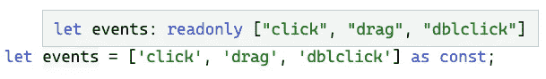

# 具有代码挑战的高级类型脚本:常量断言

> 原文：<https://javascript.plainenglish.io/advanced-typescript-with-code-challenges-const-assertions-84f51b934756?source=collection_archive---------6----------------------->

## 学习高级的 TypeScript 特性，并将它们应用到实际的代码练习中。

Photo template by [Rachel Claire](https://www.pexels.com/de-de/@rachel-claire?utm_content=attributionCopyText&utm_medium=referral&utm_source=pexels) from [Pexels](https://www.pexels.com/de-de/foto/natur-feld-trocken-tier-4577793/?utm_content=attributionCopyText&utm_medium=referral&utm_source=pexels)

TypeScript 太牛了！越来越多的项目将它作为主要的编程语言。尤其是在前端开发领域，构建大型应用程序变得至关重要。虽然像 Angular 这样的框架提供 TypeScript 作为主要语言，但所有已知的库，如 React 或 Vue.js，都支持静态类型语言。

*“它不仅是最流行的语言之一，也是发展最快的语言之一。”——*[*GitHub*](https://www.businessinsider.com/most-popular-programming-languages-github-2019-11#7-typescript-4)

作为发展最快的编程语言之一，越来越多的功能被不断添加。每增加一项新功能，它都会变得更加强大。掌握它们会让你的代码更健壮、更整洁、更容易重构。在本文中，我们将学习`infer`关键字，这是 TypeScript 中较为复杂的概念之一。之后，我们将在一次实际的代码挑战中应用我们所学的知识。

[……]它与 JavaScript 非常相似，但具有更强大的功能，可以帮助开发人员构建大规模的应用程序。”—[*GitHub*](https://www.businessinsider.com/most-popular-programming-languages-github-2019-11#7-typescript-4)

要了解关于高级 TypeScript 特性的更多信息，请查看我的其他文章。以下是一个概述:

Overview Typescript Features

 [## 网络亮点- PDF 和网络荧光笔

### Web Highlights 是一个在 Web 上突出显示文本的工具，可以更有效地组织您的研究。提升你的…

web-highlights.com](https://web-highlights.com/) 

# 常量断言

在 Typescript 3.4 中，Typescript 为文字值引入了一个新的构造，称为 **const assertions** 。对我来说，这个特性很长一段时间都没有被发现。但是最近，它对我来说非常方便。这是提供类型安全的类似枚举的模式的一种很好的方式。

它的语法是用`const`代替类型名的类型断言(例如`let x = 123 as const`)。当使用 const 断言时，我们告诉 Typescript 去[推断](/advanced-typescript-with-code-challenges-infer-keyword-5ef686d77a3c)它能为一个表达式指定的最具体的类型。如果您关闭它，编译器将使用其默认的类型推断行为，可能会产生一个*更宽的*或*更通用的*类型(例如，字符串或数字)。这听起来可能很复杂，但是 const 断言很简单，最好用一个例子来解释。让我们看看这个简单的变量:

Automatic Type inference in TypeScript

Typescript 利用其自动类型检测。`myName`变量的类型被推断为最通用的类型`string`。

***类型推断*** *是指自动检测形式语言中表达式的类型。——*[【en.wikipedia.org/wiki/Type_inference】T21](https://en.wikipedia.org/wiki/Type_inference)

现在，让我们看看使用**常量断言**会发生什么:

Type inference with const assertion

你可以看到我们使用`as const`语法告诉 TypeScript 从变量中推断出最具体的类型。取代了`string`，TypeScript 现在将一个精确的字符串文字推断给`myName`变量。将不同的值赋给变量现在会显示一个错误:

Type inference with const assertion

关于**常量断言**的伟大之处在于，我们还可以将它们应用于对象和数组。由此，我们向打字稿发出信号:

*   **对象**文字获取`readonly`属性
*   **数组**文字变成`readonly`元组

## 目标

让我们看一个 const 断言如何与**对象**一起工作的例子。这是我们的普通变量，我们给它分配了一个对象:

Typescript object

TypeScript 推断对象的键及其最常见的类型`string`和`number`。让我们再次使用一个**常量断言**:

Typescript object with const assertion

可以看到 TypeScript 将所有属性声明为`readonly`，并从属性值中推断出最具体的类型。

这种行为非常实用，因为它允许我们在不使用 TypeScript 的`enum`构造的情况下从对象创建枚举。

## 数组

常量断言也适用于**数组**。当在数组上使用 const 断言时，Typescript 会将文字锁定为它们的显式值，它们成为`readonly`元组。这里有一个例子:

Typescript array

Typescript 自动检测数组中最常见的**类型**，即`string[]`。

Typescript array with const assertion

现在，当使用**常量断言**时，TypeScript 推断出**最具体的类型**，并推断出`readonly`元组的数组文字。

## 组合数组和对象

当组合数组和对象时，const 断言的真正威力变得很明显。让我们将一些事件放入一个数组，并使用一个**常量断言**:

现在，我们想要导出一个字符串[联合类型](https://medium.com/@mariusbongarts/advanced-typescript-with-code-challenges-union-types-2474c6e62097) `EventIds`，它组合了所有事件的 id。由于我们在事件数组中使用了 **const 断言**，我们可以像这样轻松地完成:

String union type of event ids

这真的很实用，可以节省我们一些重复的代码。

# 代码挑战💻

你可以在这个[打字稿操场(起始码)](https://www.typescriptlang.org/play?ts=4.4.4&ssl=5&ssc=48&pln=5&pc=4#code/PQKhCgAIUh1BTSALAhgN0QZwPYFtEoAOhANgJYDGKALmdgHaQXYAmi1q1TDmZm1mSNgBmkFIxQAnSSgCeQ0fAz0BAOkhQYCZOgKR4AD3gUArtXgBRZV2En6FWg0gcazlAGt4gjoiXwVAAaCZCzO2PpGpubOSL7Wqpoa0JAAQmYANDGIzGyQfJCYSNgA7mT0AOZizrKEXhSSZIRc8NLYkgBciQDkAIKS5Sb4KgrVtZBd-A0VXXmC9NhcKJi85fQoAEYk7OGEUij45pIj1DWIXVb+1ACSLJhdXYmJFgYULRR88J3JkACM6gCqmD0zHo-DEyxajkYTh8YhIJAuKkEUhk8mo4WEZAMWUgABVTph6o1mq1JIlIAAmdRXejCFo4vzDEKCYRtHGI663UbbAq6Ap4RAsEykSg0eChHLwTTAcDgEFglDwjmCAC8kAA2lBINqAN5a7UGvIsdrjCjkCjuLrpfWGyAkDbwEgmrqA+lmyjuQS4bAmIFWm2GzyyADCrE+v2thoAvpGDXrbQaQs6WOt3Rb-Qntfb1o7na6jiwfZt4ABaNOeyDe33wDOZoOhtgmimx7UxjQAXQA3LLwCcxhybqrTebLZAAD7jFPlrrd8C2exQiLGMyWawACiTkAHtwAlJB4wb5dgtqoSNhymuAs9l7QKvprJBShwjeMACQ6kJRqMBHfgKOyxUEWsTBVFZSQLBQCgkDXRkuBVAA+JcolXS4YPiEIdx3bsgA)里解习题。如果你被卡住了，你可以在这个[类型脚本游乐场(解决方案代码)](https://www.typescriptlang.org/play?ts=4.4.4#code/PQKhCgAIUh1BTSALAhgN0QZwPYFtEoAOhANgJYDGKALmdgHaQXYAmi1q1TDmZm1mSNgBmkFIxQAnSSgCeQ0fAz0BAOkhQYCZOgKR4AD3gUArtXgBRZV2En6FWg0gcazlAGt4gjoiXwVAAaCZCzO2PpGpubOSL7Wqpoa0JAAQmYANDGIzGyQfJCYSNgA7mT0AOZizrKEXhSSZIRc8NLYkgBciQDkAIKS5Sb4KgrVtZBd-A0VXXmC9NhcKJi85fQoAEYk7OGEUij45pIj1DWIXVb+1ACSLJhdXYmJFgYULRR88J3JkACM6gCqmD0zHo-DEyxajkYTh8YhIJAuKkEUhk8mo4WEZAMWUgABVTph6o1mq1JIlIAAmdRXejCFo4vzDEKCYRtHGI663UbbAq6Ap4RAsEykSg0eChHLwTTAcDgEFglDwjmCAC8kAA2lBINqAN5a7UGvIsdrjCjkCjuLrpfWGyAkDbwEgmrqA+lmyjuQS4bAmIFWm2GzyyADCrE+v2thoAvpGDXrbQaQs6WOt3Rb-Qntfb1o7na6jiwfZt4ABaNOeyDe33wDOZoOhtgmimx7UxjQAXXB3FB1AA3LLwCcxhybqruSI4QjrJh1fRBjnJO31V0Ql12-3wLZ7FCIsYzJZrAAKJOQEe3ACUkHjBvl2C2qhI2HKh4Czz3tAq+mskFKHCN4wAEh1EIoyjAJz3AKNZUVKdLkwVRWUkCwUAoJBD0ZLgVQAPl3KID0udD4hCc9z37IA)中找到解决方案。当然，你也可以复制&粘贴类型脚本代码到你选择的 IDE 中。

## 介绍

我们有一些由一系列事件组成的应用程序代码。我们有一个`executeEvent`函数，它获取事件的 id 来执行事件。

但是，代码显示了一个 TypeScript 错误:

*类型为“字符串”的参数不能赋给类型为“事件 id”的参数*

## 锻炼

1.  在`allEvents`数组上使用**常量断言**来修复类型脚本错误
2.  推断`EventIds`类型的事件 id 以保存一些重复的代码

下面是本练习的 [**起始码**](https://www.typescriptlang.org/play?ts=4.4.4&ssl=5&ssc=48&pln=5&pc=4#code/PQKhCgAIUh1BTSALAhgN0QZwPYFtEoAOhANgJYDGKALmdgHaQXYAmi1q1TDmZm1mSNgBmkFIxQAnSSgCeQ0fAz0BAOkhQYCZOgKR4AD3gUArtXgBRZV2En6FWg0gcazlAGt4gjoiXwVAAaCZCzO2PpGpubOSL7Wqpoa0JAAQmYANDGIzGyQfJCYSNgA7mT0AOZizrKEXhSSZIRc8NLYkgBciQDkAIKS5Sb4KgrVtZBd-A0VXXmC9NhcKJi85fQoAEYk7OGEUij45pIj1DWIXVb+1ACSLJhdXYmJFgYULRR88J3JkACM6gCqmD0zHo-DEyxajkYTh8YhIJAuKkEUhk8mo4WEZAMWUgABVTph6o1mq1JIlIAAmdRXejCFo4vzDEKCYRtHGI663UbbAq6Ap4RAsEykSg0eChHLwTTAcDgEFglDwjmCAC8kAA2lBINqAN5a7UGvIsdrjCjkCjuLrpfWGyAkDbwEgmrqA+lmyjuQS4bAmIFWm2GzyyADCrE+v2thoAvpGDXrbQaQs6WOt3Rb-Qntfb1o7na6jiwfZt4ABaNOeyDe33wDOZoOhtgmimx7UxjQAXQA3LLwCcxhybqrTebLZAAD7jFPlrrd8C2exQiLGMyWawACiTkAHtwAlJB4wb5dgtqoSNhymuAs9l7QKvprJBShwjeMACQ6kJRqMBHfgKOyxUEWsTBVFZSQLBQCgkDXRkuBVAA+JcolXS4YPiEIdx3bsgA) :

Starter code

## 解决办法

下面是本练习的 [**解法代码**](https://www.typescriptlang.org/play?ts=4.4.4#code/PQKhCgAIUh1BTSALAhgN0QZwPYFtEoAOhANgJYDGKALmdgHaQXYAmi1q1TDmZm1mSNgBmkFIxQAnSSgCeQ0fAz0BAOkhQYCZOgKR4AD3gUArtXgBRZV2En6FWg0gcazlAGt4gjoiXwVAAaCZCzO2PpGpubOSL7Wqpoa0JAAQmYANDGIzGyQfJCYSNgA7mT0AOZizrKEXhSSZIRc8NLYkgBciQDkAIKS5Sb4KgrVtZBd-A0VXXmC9NhcKJi85fQoAEYk7OGEUij45pIj1DWIXVb+1ACSLJhdXYmJFgYULRR88J3JkACM6gCqmD0zHo-DEyxajkYTh8YhIJAuKkEUhk8mo4WEZAMWUgABVTph6o1mq1JIlIAAmdRXejCFo4vzDEKCYRtHGI663UbbAq6Ap4RAsEykSg0eChHLwTTAcDgEFglDwjmCAC8kAA2lBINqAN5a7UGvIsdrjCjkCjuLrpfWGyAkDbwEgmrqA+lmyjuQS4bAmIFWm2GzyyADCrE+v2thoAvpGDXrbQaQs6WOt3Rb-Qntfb1o7na6jiwfZt4ABaNOeyDe33wDOZoOhtgmimx7UxjQAXXB3FB1AA3LLwCcxhybqruSI4QjrJh1fRBjnJO31V0Ql12-3wLZ7FCIsYzJZrAAKJOQEe3ACUkHjBvl2C2qhI2HKh4Czz3tAq+mskFKHCN4wAEh1EIoyjAJz3AKNZUVKdLkwVRWUkCwUAoJBD0ZLgVQAPl3KID0udD4hCc9z37IA) :

Solution code

# 最后的想法

我希望你喜欢阅读这篇文章。我将在后续文章中发布更多关于高级 TypeScript 特性的文章。我还写关于 Web 组件、前端框架、软件设计原则和许多其他主题的文章。跟着我不要错过他们。🙏

我总是乐于回答问题，并乐于接受批评。请随时联系我。😊

[**这里是无限制访问媒体上每一个内容的链接**](https://medium.com/@mariusbongarts/membership) 。如果你注册使用这个链接，我会赚一小笔钱，不需要你额外付费。

 [## 通过我的推荐链接加入 Medium-Marius bong arts

### 作为一个媒体会员，你的会员费的一部分会给你阅读的作家，你可以完全接触到每一个故事…

medium.com](https://medium.com/@mariusbongarts/membership) 

# 关于我

我是埃森哲软件工程分析师宋。最驱动我的是我想创造一些可能对他人有帮助并改变他人生活的东西的冲动。例如，[**Web Highlights Chrome Extension**](https://chrome.google.com/webstore/detail/web-highlights-%20-bookmark/hldjnlbobkdkghfidgoecgmklcemanhm)使您能够在浏览器中高亮显示您访问的每个页面或 PDF 上的文本。您可以提供标签来对您的研究进行分组，以便轻松地重新查找。你所有的精彩瞬间都会同步到 web-highlights.com[的相应网络应用上。看看吧！](https://web-highlights.com/)

 [## 网络亮点- PDF 和网络荧光笔

### 通过有条理和有效的方式组织你的研究来提高你的生产力。就像你在书上做的那样…

chrome.google.com](https://chrome.google.com/webstore/detail/web-highlights-pdf-web-hi/hldjnlbobkdkghfidgoecgmklcemanhm) 

通过**[**LinkedIn**](https://www.linkedin.com/in/marius-bongarts-6b3638171/)**联系我或者在 [**Twitter**](https://twitter.com/MariusBongarts) 上关注我。****

## ****进一步阅读****

**** [## Web 组件会取代前端框架吗？

### 它们是为解决不同的问题而构建的。

javascript.plainenglish.io](/will-web-components-replace-frontend-frameworks-535891d779ba)  [## 带有类型脚本示例的设计模式:工厂方法

### 工厂方法有助于编程接口，而不是实现。

javascript.plainenglish.io](/design-patterns-with-typescript-examples-factory-method-4d145887b141)  [## 用 Web 组件构建自己的博客组合:基础

### 第 1 部分—定制元素、阴影 DOM 和 HTML 模板

javascript.plainenglish.io](/showcase-your-medium-articles-with-web-components-part-1-basics-d2c6618e9482) 

*更多内容请看*[***plain English . io***](https://plainenglish.io/)*。报名参加我们的* [***免费周报***](http://newsletter.plainenglish.io/) *。关注我们关于*[***Twitter***](https://twitter.com/inPlainEngHQ)*和*[***LinkedIn***](https://www.linkedin.com/company/inplainenglish/)*。查看我们的* [***社区不和谐***](https://discord.gg/GtDtUAvyhW) *加入我们的* [***人才集体***](https://inplainenglish.pallet.com/talent/welcome) *。*****