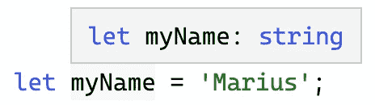

# 具有代码挑战的高级类型脚本:推断关键字

> 原文：<https://javascript.plainenglish.io/advanced-typescript-with-code-challenges-infer-keyword-5ef686d77a3c?source=collection_archive---------5----------------------->

## 学习高级的 TypeScript 特性，并将它们应用到实际的代码练习中。

Photo template by [Rachel Claire](https://www.pexels.com/de-de/@rachel-claire?utm_content=attributionCopyText&utm_medium=referral&utm_source=pexels) from [Pexels](https://www.pexels.com/de-de/foto/natur-feld-trocken-tier-4577793/?utm_content=attributionCopyText&utm_medium=referral&utm_source=pexels)

TypeScript 太牛了！越来越多的项目将它作为主要的编程语言。尤其是在前端开发领域，构建大型应用程序变得至关重要。虽然像 Angular 这样的框架提供 TypeScript 作为主要语言，但所有已知的库，如 React 或 Vue.js，都支持静态类型语言。

> 它不仅是最流行的语言之一，也是发展最快的语言之一。— [GitHub](https://www.businessinsider.com/most-popular-programming-languages-github-2019-11#7-typescript-4)

作为发展最快的编程语言之一，越来越多的功能被不断添加。每增加一项新功能，它都会变得更加强大。掌握它们会让你的代码更健壮、更整洁、更容易重构。在本文中，我们将学习`infer`关键字，这是 TypeScript 中较为复杂的概念之一。之后，我们将在一次实际的代码挑战中应用我们所学的知识。

> […]它非常类似于 JavaScript，但是具有更强大的功能，可以帮助开发人员构建大规模的应用程序。“— [GitHub](https://www.businessinsider.com/most-popular-programming-languages-github-2019-11#7-typescript-4)

要了解关于高级 TypeScript 特性的更多信息，请查看我的其他文章。以下是一个概述:

Overview Typescript Features

 [## 网络亮点- PDF 和网络荧光笔

### Web Highlights 是一个在 Web 上突出显示文本的工具，可以更有效地组织您的研究。提升你的…

web-highlights.com](https://web-highlights.com/) 

# 类型推理

在我们看一下`infer`关键字之前，让我们回到基础来理解**类型推理**是如何工作的。

类型推断是一个不仅存在于 TypeScript 中的概念。像 C++、Java、Scala 等静态类型语言都包含它来自动检测表达式的类型。维基百科对类型推理的定义如下:

> **类型推理**是指自动检测形式语言中表达式的类型。—[https://en.wikipedia.org/wiki/Type_inference](https://en.wikipedia.org/wiki/Type_inference)

让我们看一个例子来理解自动类型推断在 TypeScript 中是如何工作的:

Automatic Type inference in TypeScript

`myName`变量的类型被推断为`string`。这种推理发生在初始化变量和成员、设置参数默认值以及确定函数返回类型时。

> 在大多数情况下，类型推断是简单的—[typescriptlang.org](https://www.typescriptlang.org/docs/handbook/type-inference.html)

# 推断关键字

注意，`infer`关键字总是在条件类型的`extends`子句中使用。如果你不熟悉条件类型，我强烈推荐你先阅读我的文章。

 [## 具有代码挑战的高级类型脚本:条件类型

### 学习高级的 TypeScript 特性，并将它们应用到实际的代码练习中

javascript.plainenglish.io](/advanced-typescript-with-code-challenges-conditional-types-8dd4e63818a5) 

`infer`关键字非常强大，可以用来解包和存储类型。如果我们使用第三方 TypeScript 代码，并且需要使用嵌套类型和接口，这可能会很有帮助。

> 条件类型为我们提供了一种方法，使用`infer`关键字从我们在真实分支中比较的类型中进行推断。—[typescriptlang.org](https://www.typescriptlang.org/docs/handbook/2/conditional-types.html)

理解`infer`这个关键词可能有点挑战性。我会用一个例子尽量直白的解释。也许您知道可以用索引访问类型来展平数组类型:

Array flattening with index type

现在，我们可以通过使用`infer`关键字构建一个通用的助手类型来达到同样的目的:

Array flattening with infer keyword

我们使用条件泛型类型来检查给定的类型是否从数组中扩展。如果它不是一个数组，我们将只返回 else 块中的给定类型。如果是，我们将通过使用`infer`关键字来推断特定的类型并分配新的类型`Item`。然后我们会返回推断出的类型`Item`。

让我们看一个稍微复杂一点的例子。我们正在使用一个外部函数，如下所示:

现在，我们想使用外部函数`transformObject`的第一个参数的接口`UnaccessibleInterface`。要使用它，我们可以创建一个条件类型来推断任何函数的第一种类型:

现在，我们可以利用我们的条件类型来访问`UnaccessibleInterface`。

请注意，您还可以通过传递索引来访问函数类型。但是，条条大路通罗马，在这篇文章中，我想指出如何使用`infer`关键字。

# 代码挑战💻

你可以在这个[打字本操场(起始码)](https://www.typescriptlang.org/play?ts=4.4.4#code/PQKhCgAJodQSwC4AtIBUCeAHApgZQMYBOcmCkALAHQCskAhpAHbYDukArgnADaLqQIs2SPjrdu2ACYCkwgIIs6iKQKGRFAZ0hxGCQgHtJ7fFMqQo0VEjplBOSLO6Yt7LQn0dGLQnUyQACgYAtnAa2FqE2PjshBpwAG7Y3OiUFubQkDDCAOb6ZBr6QcLYAB6hXIzZIobYADSQAEacngBm+oQI7Iw2Sej1+jHVktgNdGHaLnGV6ZZCGkQkZFTL9QXqwqKMTHkc48jyisrSdthmAEKc9cg2E9uQmAYNEkEzjVF0rsIswnSRkC10EK8X7qRAofbaRgtbCESAAa2w6BY7WkdEY0k2jXYPGkiH+7UgA1iSUSGlSaQAoiUTIR8KFsAAuNKvSAARjMACVsJhuHQTDIDkoECoTqDkPRqujEHB9N1uKp7GjcVCYQLIJFOoQtqL9C01Q9CvTUhlIAAmTnhfTcRL0cQK4qEAyxcBQEDAF06YWEAH8-wwgpbADezO6RQZkA0eh02QA3OAAL4usboRj4f5dfBcWX-bAIfBIP2xWUaAAUAEpw4FDWEADyFgMAbQAugA+SDBk34YtkHBFxgaSv+2XNyAAXkgzeZGpiW17AY0ccT4FFVZCYS5msYGBwNdQbfHCiFUl3Lbjy7UADFc-n67KNzPt8Jx6v6fetY+a2+t0IayddTm8wLId+xbU8XS7ft8itRIrFCR8KUddpBz7Edx0DeN6BcRg4UYfQWC2MZICvQDb0YL9HxjIA)解决练习。如果你卡住了，你可以在这个[类型脚本游乐场(解决方案代码)](https://www.typescriptlang.org/play?ts=4.4.4&ssl=14&ssc=4&pln=1&pc=1#code/PQKhCgAJodQSwC4AtIBUCeAHApgZQMYBOcmCkALAHQCskAhpAHbYDukArgnADaLqQIs2SPjrdu2ACYCkwgIIs6iKQKGRFAZ0hxGCQgHtJ7fFMqQo0VEjplBOSLO6Yt7LQn0dGLQnUyQACgYAtnAa2FqE2PjshBpwAG7Y3OiUFubQkDDCAOb6ZBr6QcLYAB6hXIzZIobYADSQAEacngBm+oQI7Iw2Sej1+jHVktgNdGHaLnGV6ZZCGkQkZFTL9QXqwqKMTHkc48jyisrSdthmAEKc9cg2E9uQmAYNEkEzjVF0rsIswnSRkC10EK8X7qRAofbaRgtbCESAAa2w6BY7WkdEY0k2jXYPGkiH+7UgA1iSUSGlSaQAoiUTIR8KFsAAuNKvSAARjMACVsJhuHQTDIDkoECoTqDkPRqujEHB9N1uKp7GjcVCYQLIJFOoQtqL9C01Q9CvTUhlIAAmTnhfTcRL0cQK4qEAyxcBQEDAF06YWEAH8-wwgpbADezO6RQZkA0eh02QA3OAAL4usboRj4f5dfBcWX-bAIfBIP2xWUaAAUAEpw4FDWEADyFgMAbQAugA+SDBk34YtkHBFxgaSv+2XNyAAXkgDeZJo7Jtn0FDjMgAHIALK-OCuJe1KcZRMmpvMjUxLa9gMaOOJ8CiqshMJczWMDA4GuoNvj1CQUrC9FaG-0ms6NCsL3sebYAPyQCBWqQOGqBxleagAGK5vm9aylBj5qOOf53rmx5PtgNYYQRNYnLqOZ5gWQ79i2LbwV2-b5FaiRWKEBEUo67SDn2I7joG8b0C4jBwow+gsFsYyQMhlFoYwxFCDGQA)中找到解决方案。当然，你也可以复制&粘贴类型脚本代码到你选择的 IDE 中。

## 介绍

在 TypeScript 4.5 中，引入了一种称为`Awaited`类型的新实用程序类型。这种类型帮助我们递归地解开承诺。

我们得到了一些现有的代码，但不幸的是，我们的代码库使用的是 TypeScript 4.4.4，所以我们不能使用`Awaited`类型。但是，这没有问题，因为我们熟悉`infer`关键字，可以为自己构建它。

## 锻炼

1.  用条件类型替换`Awaited`类型，推断承诺的返回类型。
2.  解决所有类型错误

## 密码

下面是该练习的 [**起始码**](https://www.typescriptlang.org/play?ts=4.4.4#code/PQKhCgAJodQSwC4AtIBUCeAHApgZQMYBOcmCkALAHQCskAhpAHbYDukArgnADaLqQIs2SPjrdu2ACYCkwgIIs6iKQKGRFAZ0hxGCQgHtJ7fFMqQo0VEjplBOSLO6Yt7LQn0dGLQnUyQACgYAtnAa2FqE2PjshBpwAG7Y3OiUFubQkDDCAOb6ZBr6QcLYAB6hXIzZIobYADSQAEacngBm+oQI7Iw2Sej1+jHVktgNdGHaLnGV6ZZCGkQkZFTL9QXqwqKMTHkc48jyisrSdthmAEKc9cg2E9uQmAYNEkEzjVF0rsIswnSRkC10EK8X7qRAofbaRgtbCESAAa2w6BY7WkdEY0k2jXYPGkiH+7UgA1iSUSGlSaQAoiUTIR8KFsAAuNKvSAARjMACVsJhuHQTDIDkoECoTqDkPRqujEHB9N1uKp7GjcVCYQLIJFOoQtqL9C01Q9CvTUhlIAAmTnhfTcRL0cQK4qEAyxcBQEDAF06YWEAH8-wwgpbADezO6RQZkA0eh02QA3OAAL4usboRj4f5dfBcWX-bAIfBIP2xWUaAAUAEpw4FDWEADyFgMAbQAugA+SDBk34YtkHBFxgaSv+2XNyAAXkgzeZGpiW17AY0ccT4FFVZCYS5msYGBwNdQbfHCiFUl3Lbjy7UADFc-n67KNzPt8Jx6v6fetY+a2+t0IayddTm8wLId+xbU8XS7ft8itRIrFCR8KUddpBz7Edx0DeN6BcRg4UYfQWC2MZICvQDb0YL9HxjIA) :

Starter code

## 解决办法

下面是 [**解**](https://www.typescriptlang.org/play?ts=4.4.4&ssl=14&ssc=4&pln=1&pc=1#code/PQKhCgAJodQSwC4AtIBUCeAHApgZQMYBOcmCkALAHQCskAhpAHbYDukArgnADaLqQIs2SPjrdu2ACYCkwgIIs6iKQKGRFAZ0hxGCQgHtJ7fFMqQo0VEjplBOSLO6Yt7LQn0dGLQnUyQACgYAtnAa2FqE2PjshBpwAG7Y3OiUFubQkDDCAOb6ZBr6QcLYAB6hXIzZIobYADSQAEacngBm+oQI7Iw2Sej1+jHVktgNdGHaLnGV6ZZCGkQkZFTL9QXqwqKMTHkc48jyisrSdthmAEKc9cg2E9uQmAYNEkEzjVF0rsIswnSRkC10EK8X7qRAofbaRgtbCESAAa2w6BY7WkdEY0k2jXYPGkiH+7UgA1iSUSGlSaQAoiUTIR8KFsAAuNKvSAARjMACVsJhuHQTDIDkoECoTqDkPRqujEHB9N1uKp7GjcVCYQLIJFOoQtqL9C01Q9CvTUhlIAAmTnhfTcRL0cQK4qEAyxcBQEDAF06YWEAH8-wwgpbADezO6RQZkA0eh02QA3OAAL4usboRj4f5dfBcWX-bAIfBIP2xWUaAAUAEpw4FDWEADyFgMAbQAugA+SDBk34YtkHBFxgaSv+2XNyAAXkgDeZJo7Jtn0FDjMgAHIALK-OCuJe1KcZRMmpvMjUxLa9gMaOOJ8CiqshMJczWMDA4GuoNvj1CQUrC9FaG-0ms6NCsL3sebYAPyQCBWqQOGqBxleagAGK5vm9aylBj5qOOf53rmx5PtgNYYQRNYnLqOZ5gWQ79i2LbwV2-b5FaiRWKEBEUo67SDn2I7joG8b0C4jBwow+gsFsYyQMhlFoYwxFCDGQA) 为练习题:

Solution code

# 最后的想法

我希望你喜欢阅读这篇文章。我将在后续文章中发布更多关于高级 TypeScript 特性的文章。我还写关于 Web 组件、前端框架、软件设计原则和许多其他主题的文章。跟着我不要错过他们。🙏

我总是乐于回答问题，乐于接受批评。随时联系我！通过**[**LinkedIn**](https://www.linkedin.com/in/marius-bongarts-6b3638171/)**跟我上**[Twitter](https://twitter.com/MariusBongarts)，或 [**订阅**](https://medium.com/subscribe/@mariusbongarts) 通过电子邮件获取我的故事。******

****[**这里有一个链接，可以在**](https://medium.com/@mariusbongarts/membership)**media 上无限制地访问这里的每一个内容。**如果你使用这个链接注册，我就能赚到一笔不需要你额外付费的小钱。****

**** [## 使用我的推荐链接加入 media—Marius Bongarts

### 作为 Medium 会员，您的会员费的一部分将支付给您阅读的作者，您可以完全访问每个故事……

medium.com](https://medium.com/@mariusbongarts/membership)**** 

# ****关于作者****

****我是埃森哲软件工程分析师宋。最让我激动的是，我迫切希望创造出一种能够帮助别人、改变别人生活的东西。****

****例如，你是否厌倦了浏览你的历史来寻找你几天前看到的信息？我的 [**Web 亮点 Chrome Extension**](https://chrome.google.com/webstore/detail/web-highlights-%20-bookmark/hldjnlbobkdkghfidgoecgmklcemanhm) 已经覆盖了你的业务，它将以结构化和高效的方式组织你的研究，从而提高你的工作效率。就像你在书籍和文章中所做的一样，在任何网页或 PDF 中突出显示文本。你的精彩片段会直接同步到 web-highlights.com的网络应用程序上，你可以在任何地方找到它们。****

**** [## 网络亮点——PDF 和网络荧光笔

### 在每个网站或 PDF 上创建亮点、书签、标签和文件夹。有条理地组织你的想法和研究…

chrome.google.com](https://chrome.google.com/webstore/detail/web-highlights-pdf-web-hi/hldjnlbobkdkghfidgoecgmklcemanhm)**** 

## ****进一步阅读****

**** [## Web 组件会取代前端框架吗？

### 它们的建立是为了解决不同的问题。

javascript.plainenglish.io](/will-web-components-replace-frontend-frameworks-535891d779ba)  [## 使用 TypeScript 的设计模式示例:工厂方法

### Factory 方法有助于编程到接口，而不是实现。

javascript.plainenglish.io](/design-patterns-with-typescript-examples-factory-method-4d145887b141)  [## 用 Web 组件构建自己的博客投资组合:基础

### 第 1 部分—自定义元素、影子 DOM 和 HTML 模板

javascript.plainenglish.io](/showcase-your-medium-articles-with-web-components-part-1-basics-d2c6618e9482) 

*更多内容请看*[***plain English . io***](https://plainenglish.io/)*。报名参加我们的* [***免费周报***](http://newsletter.plainenglish.io/) *。关注我们关于*[***Twitter***](https://twitter.com/inPlainEngHQ)*和*[***LinkedIn***](https://www.linkedin.com/company/inplainenglish/)*。查看我们的* [***社区不和谐***](https://discord.gg/GtDtUAvyhW) *加入我们的* [***人才集体***](https://inplainenglish.pallet.com/talent/welcome) *。*****