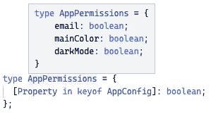
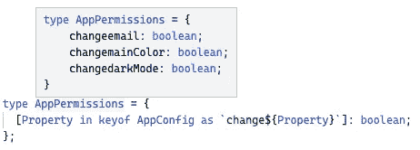
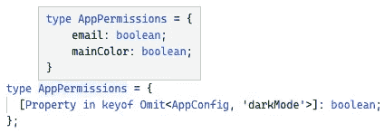

# 具有代码挑战的高级类型脚本:映射类型

> 原文：<https://javascript.plainenglish.io/advanced-typescript-with-code-challenges-mapped-types-6825c7fc984a?source=collection_archive---------4----------------------->

## 学习高级的 TypeScript 特性，并将它们应用到实际的代码练习中。

Photo template by [Rachel Claire](https://www.pexels.com/de-de/@rachel-claire?utm_content=attributionCopyText&utm_medium=referral&utm_source=pexels) from [Pexels](https://www.pexels.com/de-de/foto/natur-feld-trocken-tier-4577793/?utm_content=attributionCopyText&utm_medium=referral&utm_source=pexels)

TypeScript 太牛了！越来越多的项目将它作为主要的编程语言。特别是在前端开发领域，构建大型应用程序已经变得非常重要。虽然像 Angular 这样的框架提供 TypeScript 作为主要语言，但所有已知的库，如 React 或 Vue.js，都支持静态类型语言。

> 它不仅是最流行的语言之一，也是发展最快的语言之一。— [GitHub](https://www.businessinsider.com/most-popular-programming-languages-github-2019-11#7-typescript-4)

作为发展最快的编程语言之一，越来越多的功能被不断添加。每增加一项新功能，它都会变得更加强大。掌握它们会让你的代码更健壮、更整洁、更容易重构。在本文中，我们将了解映射类型，这是 TypeScript 中较为复杂的概念之一。之后，我们将在一次实际的代码挑战中应用我们所学的知识。

> […]它非常类似于 JavaScript，但是具有更强大的功能，可以帮助开发人员构建大规模的应用程序。”——[GitHub](https://www.businessinsider.com/most-popular-programming-languages-github-2019-11#7-typescript-4)

要了解关于高级 TypeScript 特性的更多信息，请查看我的其他文章。以下是一个概述:

Overview Typescript Features

 [## 网络亮点- PDF 和网络荧光笔

### Web Highlights 是一个在 Web 上突出显示文本的工具，可以更有效地组织您的研究。提升你的…

web-highlights.com](https://web-highlights.com/) 

# 映射类型

软件开发中最重要的原则之一是[干原则](https://medium.com/@mariusbongarts/dry-your-wet-typescript-code-e3c777b3daf9) — **不要重复自己**。 [DRY 原则](https://medium.com/@mariusbongarts/dry-your-wet-typescript-code-e3c777b3daf9)指出应该避免代码中的重复和重复，即存在于两个地方并重复相同的知识和业务逻辑。当我们需要将一个类型基于另一个类型时，Typescript 中的映射类型可以帮助我们避免重复。值得注意的是，当这些类型需要保持同步时，它们可以帮助我们很多。

> **映射类型**建立在索引签名语法的基础上，索引签名用于声明尚未提前声明的属性类型——[typescriptlang.org](https://www.typescriptlang.org/docs/handbook/2/mapped-types.html)

让我们看一个例子。想象一下，我们有一个应用程序，在`AppConfig`类型中存储了一些配置设置:

现在，我们想要创建一个`AppPermissions`类型，它检查每个配置用户是否有更改的权限。我们的类型可能是这样的:

那么，这里的问题是什么？每次我们添加新的配置时，我们也需要相应地调整权限。

**映射类型**可以通过迭代`AppConfig`类型的键来帮助我们。在本例中，我们将从`AppConfig`类型中获取所有属性，并将它们的值更改为`boolean`:

Mapped Types

您可以看到，我们基于我们的`AppConfig`类型创建了一个新类型，包含所有带有`boolean`值的属性键:

Mapped Types

但是，我们还想要一样东西。我们的钥匙不应该与我们`AppConfig`的钥匙完全相同。相反，我们希望拥有以*【变更】*开头的权限密钥，如`changeEmail`、`changeMainColor`和`changeDarkMode`。

映射类型与其他 Typescript 功能配合得很好。例如，我们可以使用[条件类型](/advanced-typescript-with-code-challenges-conditional-types-8dd4e63818a5)或[模板文字类型](https://medium.com/@mariusbongarts/advanced-typescript-with-code-challenges-template-literal-types-479f56496daa)来创建映射类型。后者可以用来从以前的属性名创建新的属性名。

**通过**重新映射按键`**as**`

让我们使用模板文字类型来更改我们的属性名，首先是，*“change”*。我们可以通过用一个`as`子句重新映射我们的键来做到这一点:

Key Remapping via **as**

> 在 TypeScript 4.1 及更高版本中，您可以使用映射类型中的`as`子句来重新映射映射类型中的键——typescriptlang.org

现在，我们可以看到我们成功地创建了一个权限类型，而没有重复代码:

Key Remapping via **as**

每当我们改变`AppConfig`类型，我们的`AppPermissions`类型就会相应地更新。

**过滤键**

如果我们想过滤掉键，我们可以通过条件类型产生`never`来过滤掉它们:

像`Exclude`、`Pick`或`Omit`这样的实用程序类型在这里也是有用的:

您可以看到我们成功地从我们的`AppPermissions`类型中排除了键`darkMode`:

Filtering keys

# 代码挑战💻

你可以在这个[打字稿操场(起始码)](https://www.typescriptlang.org/play?ts=4.7.4#code/PQKhCgAJoeQVwE6QMYHsAmBTARgQwM6YqoB2ALrgJYn6S6QAKmC+pAIgCoySrYBWmZGUgB3SmQAWkVgFsiuMmQSVscMpnwA6KNB2QAcqhEAaUURG5ykMqkiYAHktxDrEoiUwjrATwAORAGFSCiE2BXoAMwRUGR5EHn5BYUkFSD00cioaYkyXagjUBBkFSlI6bFQ1Okh-FlJNNOhG6AAxRElmGULMU1wAGz6ff1pUCNdUjy8yPyJ8CUq+9EhsWaVqAHNtPQBRe2RmZEpCAC49ZugARgaAhEwFd08hwODnMjCKM4AmBoBZXABrZ65N7hJ48Eh9bw5CjUVwaIiSW5EQHefDHOzFSh9AAFpl88w8uMgXWwWMwZwAzL8AfIBk9aDZlkRRmD8GsSOszgAWBotSj2Oh0jgzfDIZS+YTMaIscBQEDAWXgajqBARZxEJh1EhsRkAbx0EUoLDI+lwcnRbOUHIA3Do+gQTWbMBb2etbdBMJi+i6rW6dPjSM7ICQ4DIVgh3cTeGT0SGw8xbQBfWVpab+SBBYHvegAXkYzFY2pstvAGTZkEN9g4EiOwv82wQ0vRus9VG90ldeIJQctG1MJJjHd9icged1I4IkDgJH+JCMJDotEzIRBFGtaXAQA)里解习题。如果你被卡住了，你可以在这个[类型脚本游乐场(解决方案代码)](https://www.typescriptlang.org/play?ts=4.7.4#code/PQKhCgAJoeQVwE6QMYHsAmBTARgQwM6YqoB2ALrgJYn6S6QAKmC+pAIgCoySrYBWmZGUgB3SmQAWkVgFsiuMmQSVscMpnwA6KNB2QAcqhEAaUURG5ykMqkiYAHktxDrEoiUwjrATwAORAGFSCiE2BXoAMwRUGR5EHn5BYUkFSD00cioaYkyXagjUBBkFSlI6bFQ1Okh-FlJNNOhG6AAxRElmGULMU1wAGz6ff1pUCNdUjy8yPyJ8CUq+9EhsWaVqAHNtPQBRe2RmZEpCAC49ZugARgaAhEwFd08hwODnMjCKM4AmBoBZXABrZ65N7hJ48Eh9bw5CjUVwaIiSW5EQHefDHOzFSh9AAFpl88w8uMgXWwWMwZwAzL8AfIBk9aDZlkRRmD8GsSOszgAWBotSj2Oh0jgzfDIZS+YTMaIscBQEDAWXgajqBARZxEJh1EhsRkAbx0EUoLDI+lwcnRbOUHIA3Do+gQTWbMBb2etbdBMJi+i6rW6dPjSM7ICQ4DIVgh3cTeGT0SGw8xbQBfWVpab+SBBYHvegAXkg+ugAG0GNFatNILCUSyGJRkP8ADya1jamymADkAY8bcgAB9IG2SWTu32256qH02wA+AC6Po2SdlGTZkEN9g4EiOwv82wQ0vRurHWLnHLxBKDlo2pkHfXPrsTkDzuvvBEgcBI-xIRhIdFomZCIIoa00nAIA)中找到解决方案。当然，你也可以复制&粘贴类型脚本代码到你选择的 IDE 中。

## 介绍

我们的代码库包含一个带有一些属性的`PersonDTO`对象:

现在，我们想从包含一个人的联系信息的对象中提取新的类型`ContactData`。此外，所有类型的新类型应该是`string`。

1.  创建新类型`ContactData`
2.  使`ContactData`类型只包含这三个键:`email`、`phone`、`mobile`
3.  使所有类型成为类型`string`
4.  修复所有类型脚本错误

## 密码

下面是该练习的 [**起始码**](https://www.typescriptlang.org/play?ts=4.7.4#code/PQKhCgAJoeQVwE6QMYHsAmBTARgQwM6YqoB2ALrgJYn6S6QAKmC+pAIgCoySrYBWmZGUgB3SmQAWkVgFsiuMmQSVscMpnwA6KNB2QAcqhEAaUURG5ykMqkiYAHktxDrEoiUwjrATwAORAGFSCiE2BXoAMwRUGR5EHn5BYUkFSD00cioaYkyXagjUBBkFSlI6bFQ1Okh-FlJNNOhG6AAxRElmGULMU1wAGz6ff1pUCNdUjy8yPyJ8CUq+9EhsWaVqAHNtPQBRe2RmZEpCAC49ZugARgaAhEwFd08hwODnMjCKM4AmBoBZXABrZ65N7hJ48Eh9bw5CjUVwaIiSW5EQHefDHOzFSh9AAFpl88w8uMgXWwWMwZwAzL8AfIBk9aDZlkRRmD8GsSOszgAWBotSj2Oh0jgzfDIZS+YTMaIscBQEDAWXgajqBARZxEJh1EhsRkAbx0EUoLDI+lwcnRbOUHIA3Do+gQTWbMBb2etbdBMJi+i6rW6dPjSM7ICQ4DIVgh3cTeGT0SGw8xbQBfWVpab+SBBYHvegAXkYzFY2pstvAGTZkEN9g4EiOwv82wQ0vRus9VG90ldeIJQctG1MJJjHd9icged1I4IkDgJH+JCMJDotEzIRBFGtaXAQA) :

Starter code

## 解决办法

下面是 [**解**](https://www.typescriptlang.org/play?ts=4.7.4#code/PQKhCgAJoeQVwE6QMYHsAmBTARgQwM6YqoB2ALrgJYn6S6QAKmC+pAIgCoySrYBWmZGUgB3SmQAWkVgFsiuMmQSVscMpnwA6KNB2QAcqhEAaUURG5ykMqkiYAHktxDrEoiUwjrATwAORAGFSCiE2BXoAMwRUGR5EHn5BYUkFSD00cioaYkyXagjUBBkFSlI6bFQ1Okh-FlJNNOhG6AAxRElmGULMU1wAGz6ff1pUCNdUjy8yPyJ8CUq+9EhsWaVqAHNtPQBRe2RmZEpCAC49ZugARgaAhEwFd08hwODnMjCKM4AmBoBZXABrZ65N7hJ48Eh9bw5CjUVwaIiSW5EQHefDHOzFSh9AAFpl88w8uMgXWwWMwZwAzL8AfIBk9aDZlkRRmD8GsSOszgAWBotSj2Oh0jgzfDIZS+YTMaIscBQEDAWXgajqBARZxEJh1EhsRkAbx0EUoLDI+lwcnRbOUHIA3Do+gQTWbMBb2etbdBMJi+i6rW6dPjSM7ICQ4DIVgh3cTeGT0SGw8xbQBfWVpab+SBBYHvegAXkg+ugAG0GNFatNILCUSyGJRkP8ADya1jamymADkAY8bcgAB9IG2SWTu32256qH02wA+AC6Po2SdlGTZkEN9g4EiOwv82wQ0vRurHWLnHLxBKDlo2pkHfXPrsTkDzuvvBEgcBI-xIRhIdFomZCIIoa00nAIA) 为练习题:

Solution code

# 最后的想法

我希望你喜欢阅读这篇文章。我将在后续文章中发布更多关于高级 TypeScript 特性的文章。我还写关于 Web 组件、前端框架、软件设计原则和许多其他主题的文章。

我总是乐于回答问题，并乐于接受批评。请随时联系我😊通过 [LinkedIn](https://www.linkedin.com/in/marius-bongarts-6b3638171/) 联系我，在 [Twitter](https://twitter.com/MariusBongarts) 关注我，或者[订阅](https://medium.com/subscribe/@mariusbongarts)通过电子邮件获取我的故事。

[**这里是无限制访问媒体上每一个内容的链接**](https://medium.com/@mariusbongarts/membership) **。如果你用这个链接注册，我会赚一小笔钱，不需要你额外付费。**

 [## 通过我的推荐链接加入 Medium-Marius bong arts

### 作为一个媒体会员，你的会员费的一部分会给你阅读的作家，你可以完全接触到每一个故事…

medium.com](https://medium.com/@mariusbongarts/membership) 

# 关于作者

我是埃森哲软件工程分析师宋。最驱动我的是我想创造一些可能对他人有帮助并改变他人生活的东西的冲动。

比如你是否厌倦了浏览自己的历史来寻找前几天看到的信息？我的 [**网站重点介绍 Chrome 扩展**](https://chrome.google.com/webstore/detail/web-highlights-%20-bookmark/hldjnlbobkdkghfidgoecgmklcemanhm) 覆盖了你，并将通过以结构化和高效的方式组织你的研究来提高你的生产力。就像你在书和文章上做的那样，突出显示任何网页或 PDF 上的文本。你的精彩片段会直接同步到 web-highlights.com[的网络应用上，你可以在任何地方找到它们。](https://web-highlights.com/)

 [## Web 亮点— PDF 和 Web 荧光笔

### 在每个网站或 PDF 上创建亮点、书签、标签和文件夹。以结构化的方式组织您的想法和研究…

chrome.google.com](https://chrome.google.com/webstore/detail/web-highlights-pdf-web-hi/hldjnlbobkdkghfidgoecgmklcemanhm) 

## 进一步阅读

 [## 我的第一个 9.99 美元之旅与我的副业

### Chrome 扩展带来的被动收入

medium.com](https://medium.com/@mariusbongarts/my-journey-to-the-first-9-99-with-my-side-project-3edc13dd1f2d)  [## Web 组件会取代前端框架吗？

### 它们是为解决不同的问题而构建的。

javascript.plainenglish.io](/will-web-components-replace-frontend-frameworks-535891d779ba)  [## 用 Web 组件构建自己的博客组合:基础

### 第 1 部分—定制元素、阴影 DOM 和 HTML 模板

javascript.plainenglish.io](/showcase-your-medium-articles-with-web-components-part-1-basics-d2c6618e9482) 

*更多内容看* [***说白了就是 io***](https://plainenglish.io/) *。报名参加我们的* [***免费周报***](http://newsletter.plainenglish.io/) *。关注我们关于*[***Twitter***](https://twitter.com/inPlainEngHQ)*和*[***LinkedIn***](https://www.linkedin.com/company/inplainenglish/)*。查看我们的* [***社区不和谐***](https://discord.gg/GtDtUAvyhW) *加入我们的* [***人才集体***](https://inplainenglish.pallet.com/talent/welcome) *。*