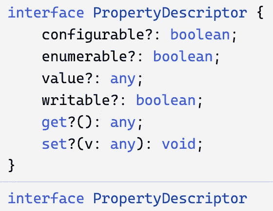

# 具有代码挑战的高级类型脚本:方法装饰器

> 原文：<https://javascript.plainenglish.io/advanced-typescript-with-code-challenges-method-decorators-dd87b0897d5e?source=collection_archive---------8----------------------->

## 装饰器提供了一种为类声明和成员添加注释的方法。

Photo template by [Rachel Claire](https://www.pexels.com/de-de/@rachel-claire?utm_content=attributionCopyText&utm_medium=referral&utm_source=pexels) from [Pexels](https://www.pexels.com/de-de/foto/natur-feld-trocken-tier-4577793/?utm_content=attributionCopyText&utm_medium=referral&utm_source=pexels)

在这篇文章中，我们将学习打字稿**方法** **装饰器**。Decorator 遵循同名结构软件[的设计原则 **Decorator** 和](/software-design-patterns-with-typescript-examples-decorator-cb6160ddbeb9)为扩展功能提供了子类化的灵活替代方案。

要了解关于高级 TypeScript 特性的更多信息，请查看我的其他文章。以下是一个概述:

Overview TypeScript Features

 [## Web 亮点— PDF 和 Web 荧光笔

### Web Highlights 是一个在 Web 上突出显示文本的工具，可以更有效地组织您的研究。提升你的…

web-highlights.com](https://web-highlights.com/) 

# 装饰者

**结构** **装饰**模式非常强大，帮助我们防止子类的**爆炸。**

装饰模式的目的是动态地给一个对象附加额外的责任，并为扩展功能提供一个灵活的子类化替代方案。

装饰模式在许多用例中被广泛使用和应用。只要您想，就使用该模式:

*   创建大量的子类。有时太多的子类是不切实际的，并导致子类**的爆炸**来支持每一种组合。
*   在不影响其他对象的情况下，动态地为单个对象**添加职责**。
*   在运行时给对象分配额外的行为，而不破坏使用这些对象的代码。

 [## 带有类型脚本示例的软件设计模式:装饰器

### 装饰模式为扩展功能提供了子类化的灵活替代方案

javascript.plainenglish.io](/software-design-patterns-with-typescript-examples-decorator-cb6160ddbeb9) 

# 打字稿装饰者

由于类是在 Typescript 和 ES6 中引入的，Typescript 也想提供支持用 Decorators 注释或修改类和类成员的可能性。

实验性的 Typescript Decorator 特性帮助我们修饰**类**、**方法**、**属性**、**访问器**和**参数**。

> 注释装饰器是一个实验性的特性，在未来的版本中可能会改变。——[typescriptlang.org](https://www.typescriptlang.org/docs/handbook/decorators.html)

由于这个特性仍然是实验性的，我们首先需要通过在我们的`tsconfig.json`的`compilerOptions`中设置`experimentalDecorators`到`true`来启用它:

一旦这个额外的设置完成，我们就可以创建装饰函数，可以在它前面加一个`@`来使用。

> 装饰者使用形式`*@expression*`，其中`*expression*`必须计算出一个函数，这个函数将在运行时用被装饰声明的信息来调用。—[typescriptlang.org](https://www.typescriptlang.org/docs/handbook/decorators.html#method-decorators)

对于初学者来说，这里有一个非常简单的例子，说明如何创建一个名为`logMessage`的**方法** **装饰**函数，该函数将返回一个内部函数，以便在调用该函数后简单地打印出一个`message`。

外部函数`logMessage`是我们的装饰工厂，它使我们能够传递一些参数。我们的装饰工厂简单地接受一个`message`参数，并将其传递给内部函数，该函数将在运行时被装饰器调用。

> **装饰工厂**是一个返回装饰者的函数。—[blog . log rocket . com/a-practical-guide-to-typescript-decorators/](https://blog.logrocket.com/a-practical-guide-to-typescript-decorators/)

装饰器接受三个参数:

1.`**target**` = `User`类

2.`**propertyKey**`是“更新电子邮件”

3.`**descriptor**`是我们的`PropertyDescriptor`

`PropertyDescriptor`界面如下所示:

PropertyDescriptor interface

我们现在可以使用`@logMessage('some Message')`注释任何方法。假设我们有一个`User`类，我们像这样使用装饰器:

每次我们对用户调用`setEmail`时，我们都会在控制台中看到一条新消息:

这里是上面例子的打字稿 playground 。

这是一个非常简单的例子。但是 Typescript decorators 可能更有用，也更复杂。有五种装饰者:

*   [**类装修工**](/advanced-typescript-with-code-challenges-class-decorators-afd9043d41f6)
*   **方法装饰者**
*   [**访问者装饰者**](https://medium.com/p/88c757cd3435)
*   **物业装修工**
*   **参数装饰器**

在我看来，详细查看每种类型的装饰器是有意义的，因为 Typescript 装饰器是更复杂的特性之一。在本文中，我们将仔细观察**方法装饰者**和做一个代码挑战来内在化这个特性。

在接下来的文章中，我们将会看到我在这里链接的其他类型的装饰者。你也可以直接 [**订阅**](https://medium.com/subscribe/@mariusbongarts) 我的故事，这样就不会错过了。

# 方法装饰者

在前面的例子中，我们已经看到了一个非常简单的方法装饰器。让我们创建一个更有用的。

假设我们想在赋值之前先验证我们的`email`。验证是 decorators 的常见用例之一，有许多验证库使用这种方法。

让我们构建自己的`@validateEmail`装饰器来检查给定的电子邮件是否有效:

Validate Email Decorator

在这个例子中，我们再次用一个**装饰工厂**包装原始函数。这一次，它不包含任何参数。棘手的部分是我们通过访问`PropertyDescriptor`值来修改原来的`updateEmail`方法。从它的参数中，我们得到给定的电子邮件地址，并在电子邮件无效的情况下打印一个错误。否则，我们只需将给定的参数应用于原始方法。

现在，我们可以通过用`@validateEmail()`注释我们的`setEmail`函数来使用装饰函数:

每当我们在任何`User`对象上调用`updateEmail(some@email.de)`时，它首先检查电子邮件的有效性。如果电子邮件有效，它将被分配给私有的`email`属性。否则，一个错误会被打印到控制台，并且用户的`email`属性不会改变。

例如，如果我们创建一个用户并执行以下两个`updateEmail`调用:

日志如下所示:

Logs

[这里是 class decorator 示例的类型脚本 playground](https://www.typescriptlang.org/play?ts=4.4.4#code/FAegVGwARlDKBLAtgBwDYIGYIKYBMockBDBNKAN2Iz2IBcEB7AOwDppYOoBhACxwDGAawDOUTIwBOUOrwRiU9OjknMAXFGLMAniLqSEzAOYABLbv2Gjrc3oPGOIYJgCuzAQxZR5AURJkANWoEPAAKIlI0DTsrAEooAG9oSmJpSRwoAF4oEAAdOABqE3yC3NYSkABuZPS6F1UodNZlPXD-NFjqgF9gZzcPJmYUmnocP0jQ+KSoRpw6htd3TyHQulSjOY1zABooFElGFBU6bQBpHG1oy2NdvBwRAQMUOikNAAUDo8kTgBF7x4QzykU2SMwELD0UCkCCMhmoAFk5rxGARsncHk8XpJWFQ0C4cNVQVB0QCgdjcfisuJ+ssoKFWAz1iINABtGLGAC6IJmPKg4OYkIiZCpTJZAAYOYTeTMsHSAIS+dpBGhtSKxbnSsEQxhoHCsFQHSShAAGAHEEBQcEMheRQgASBI2rrxPCMe5QZiMOhQEh0AS8PZKFRDADktmupnD9msUasIdYxs6RN5tXqzGqmp6mtTDWhsOYCKRKJsKHQ2lWchEuyZSaJXQzUHrwB6fSWgygaEYRkRIhExA2oSQ9z7Gyu0Y1OaGiwGXlW602mh0u32h2OZwuY6st3+mNeUA+q++2j+GMBWI1WoFOr1naMg+H-ZwSZmTZbAjQxF7UAAqiIVIlkhtOVN2MKUoBMXEQlGcYyEmZITFvHsRxwE1vxQWgGGMQh2kTZIXHQ6D2lCZgcAAdxgqIoHZIwLxkSt9XaKkSPI9oG0vERr1YW8TTgFwBAEYdXDQNBtCgfCMPwbDIhkRgNAdWR5AYyIulwl9m16flIRcP9pGyZifx0yZqm0lRWHEwiJhDAArFgTEMSC8BDJMTOxczlAo0JrNslo6FYcEkCc6ogA) 。

# 代码挑战💻

我们已经为我们的类创建了一个`validateEmail`装饰器。现在我们给我们的`User`类添加了一个新的`password`属性。对于这个新属性，我们想要创建一个`@validatePassword(minLength)`装饰器，它简单地检查给定的密码是否具有最小字符长度:

**小旁注**:在生产环境中存储密码时，有两个简单的规则:

1.  不要以纯文本格式存储密码
2.  不要以纯文本格式存储密码

总是在数据库中散列密码。但是让我们忽略这个简单的例子。继续，创建`validatePassword`装饰函数并解决所有的类型脚本错误。

## 密码

下面是该练习的 [**起始码**](https://www.typescriptlang.org/play?ts=4.4.4#code/GYVwdgxgLglg9mABDAzgUQLYEMYBsBqWuMAJgBQCm2eAXIilAE4xgDmAlIgN4BQiiANyyNEjCogC8iAPQAdAMoBqAAILFsgHRrpAbj6iKUEIyRiNUCg0rVc7PQF8ePUJFgJBRUlguYcuMpy8-GJGJogu0PBIZFDCrIZ0WGAAngA0iAAOjHAZFIxQyQDSFMl0DMxs6SSWEMwZUHCMdAAK2bn5yQAiNXUNjIH6-BAIDIiNMKwsRACyhgAWcCSSiNUotTD1jRpCuCAUeoMrPRt920R7yxFu0Rq3cSh0ANrlLKwAugP8X4jDYKNUfmW90eAAY3gdvvwYMBEGQAISoXx4QjEcgAvDsT6QoYjOC4CgaPLZRhkAAGAHEYAIKEh0bhYQASLh0+ycEhwSyIMBwKCIbBQCBzTLeCxhADkSWSLzYykl0tYGjlTFeYo0pLsh2+IWMYD02Mc2O1YXGkzAM3mi0VGQyuGSMTmqHS9w1h3sesQbp4jmc4Ei7lwcFYsxQKCw8TIGEsofiZWVbCxRqQVyisNijHiUESKXSWRyeQKxVK9DjrCqx02TUQrTzHW6a16jSxOL+eIJAdYEajYYoGv4nu9EFwWBDiAAqig8tx9HS4bGKqx3RlhygAO6NEiz4vziGIZQ7LwWZrLteMcgARhB7H0ynbwejFDJo4yJG8r0QdPV+hAz+8FCPIZPcglwA9c51eJtECgB0UA0YDV3XZY4MA91mxQVsNHbMl5BACAICjUBcFtRBvxfCwliQhCGjoJkoNQWDj3XexPz7Jx+D3TxSIoJF-CvNjby7cNSSfUi3w-XjiJ-HwbDIMAKBXbiwPjKdvlomC6WWWT5JsFCflxfEMMDLCcLwkMCKIkjfyWdSqMQGjoMJGwmPExwBxGXkQAnEQpE0sdPICPQPLyDQLKkvwyDFAArBBlBYfcSDFDVAsYYLJK46TIuiiwGA0YYMASg4kpSzj-3g09woo098p4QqQr-BiyrFCqSHkJgEFYNBuRAVg5jPAAmABmKqgA) :

Starter code

## 解决办法

下面是 [**解**](https://www.typescriptlang.org/play?ts=4.4.4#code/GYVwdgxgLglg9mABDAzgUQLYEMYBsBqWuMAJgBQCm2eAXIilAE4xgDmAlIgN4BQiiANyyNEjCogC8iAPQAdAMoBqAAILFsgHRrpAbj6iKUEIyRiNUCg0rVc7PQF8ePUJFgJBRUlguYcuMpy8-GJGJogu0PBIZFDCrIZ0WGAAngA0iAAOjHAZFIxQyQDSFMl0DMxs6SSWEMwZUHCMdAAK2bn5yQAiNXUNjIH6-BAIDIiNMKwsRACyhgAWcCSSiNUotTD1jRpCuCAUeoMrPRt920R7yxFu0Rq3cSh0ANrlLKwAugP8X4jDYKNUfmW90eAAY3gdvvwYMBEGQAISoXx4QjEcgAvDsT6QoYjOC4CgaPLZRhkAAGAHEYAIKEh0bhYQASLh0+ycEhwSyIMBwKCIbBQCBzTLeCxhADkSWSLzYykl0tYGjlTFeYo0pLsh2+IWMYD02Mc2O1YXGkzAM3mi0VGQyuGSMTmqHS9w1h3sesQbp4jmc4Ei7h2XgszSwKBQAHdGuQMCwADI01hQOZ0MAgDAAIzyWKNSCuUVhsUY8SgiRS6SyOTyBWKpXoysqRzWvUaLTala6x02-W4h1+oxNU1ws0Ti2Wq3WnbOu32Tm+Y6bjEnFykufcZFuisLD0Qzzr7yx317vIyIfDkaBm9B4JnkMPwtDEcYJAAkigUaRlsf75GNPi2InEAAfFI0ZgHGf5zBCkLQrCcKfqej4vm+JD7jeuL4oSjDEmSlLUkgcEPksZBMvhkassgKBcjytbZGwiA0nAICsHMUCquq7qGoYOrsV8BqQtmYzMKa5rDiQVo2naiaOogzqQfwnpyQ4TgrkguBwKwsyhlg8RkBglgoFpFBlLuWacWEyn5nECTSaWmSth01ZGRUrBVB2fQthWHTdI2JyNChvZ4gSqmsDpekGRqClek4EC4CeiAAKooHk3b8HScKOa87okY+aXURl17KAGJDeBQwZfo+ZAAIwguw+jKEFGn6dppJxRkRWwLRpXwSQ6r6CArXFZ1BFkFlJDpWwKGSSgGgjR+J4Edx-noUFZLyCAEAQHpoC4LaiB9W1FBLDNDR0Eyk3TXNpE9XJ+WFcVSL+DV-B1WpDUGWSLVta8dE2Fdu39T4NhkGAFBhvdY0cMlXxnXSyzA6DNgLWhgVqSta0baGW07XtxVLDDx2IKdDpTSyv2ON6t4gIlIhSHD8VUwEeiU3kGjYwDfhkGKABWCDKCwhVihqTMLqzFD3Rz3NgMoFgMBowwYALBxCyz-0lRd5ViiNCs8ErIuDZGHMjfITAIKwaDcoxcwVQATAAzFrQA) 为练习题:

Solution Code

# 最后的想法

我希望你喜欢阅读这篇文章。我总是乐于回答问题，并乐于接受批评。随时欢迎联系我！通过**[**LinkedIn**](https://www.linkedin.com/in/marius-bongarts-6b3638171/)**，**关注我**[**Twitter**](https://twitter.com/MariusBongarts)或 [**订阅**](https://medium.com/subscribe/@mariusbongarts) 通过电子邮件获取我的故事。****

****[**这里是无限制访问**](https://medium.com/@mariusbongarts/membership) 媒体上每一个内容的链接。如果你注册使用这个链接，我会赚一小笔钱，不需要你额外付费。****

**** [## 通过我的推荐链接加入 Medium-Marius bong arts

### 作为一个媒体会员，你的会员费的一部分会给你阅读的作家，你可以完全接触到每一个故事…

medium.com](https://medium.com/@mariusbongarts/membership)**** 

## ****关于作者****

****我是埃森哲软件工程分析师宋。我们一直在寻找最好的开发人员，所以如果你有兴趣加入我们，请随时联系我们！****

****最驱动我的是我想创造一些对他人有帮助和改变生活的东西的冲动🙌比如你是否厌倦了浏览自己的历史来寻找前几天看到的信息？我的 [**网站重点介绍 Chrome 扩展**](https://chrome.google.com/webstore/detail/web-highlights-%20-bookmark/hldjnlbobkdkghfidgoecgmklcemanhm) 覆盖了你，并将通过以结构化和高效的方式组织你的研究来提高你的生产力。就像你在书和文章上做的那样，突出显示任何网页或 PDF 上的文本。你的精彩片段会直接同步到 web-highlights.com 的网络应用上，你可以在任何地方找到它们。****

## ****进一步阅读****

**** [## 具有代码挑战的高级类型脚本:类装饰器

### 装饰器提供了一种为类声明和成员添加注释的方法。

javascript.plainenglish.io](/advanced-typescript-with-code-challenges-class-decorators-afd9043d41f6)  [## 我的第一个 9.99 美元之旅与我的副业

### Chrome 扩展带来的被动收入

medium.com](https://medium.com/@mariusbongarts/my-journey-to-the-first-9-99-with-my-side-project-3edc13dd1f2d) 

*更多内容请看*[***plain English . io***](https://plainenglish.io/)*。报名参加我们的* [***免费周报***](http://newsletter.plainenglish.io/) *。关注我们关于*[***Twitter***](https://twitter.com/inPlainEngHQ)[***LinkedIn***](https://www.linkedin.com/company/inplainenglish/)*[***YouTube***](https://www.youtube.com/channel/UCtipWUghju290NWcn8jhyAw)***，以及****[***不和***](https://discord.gg/GtDtUAvyhW) ******