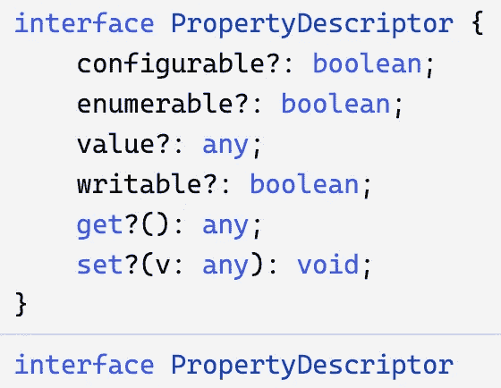

# 具有代码挑战的高级类型脚本:属性装饰器

> 原文：<https://javascript.plainenglish.io/advanced-typescript-with-code-challenges-property-decorators-4650d0ab8369?source=collection_archive---------2----------------------->

## 装饰器提供了一种为类声明和成员添加注释的方法。

Photo template by [Rachel Claire](https://www.pexels.com/de-de/@rachel-claire?utm_content=attributionCopyText&utm_medium=referral&utm_source=pexels) from [Pexels](https://www.pexels.com/de-de/foto/natur-feld-trocken-tier-4577793/?utm_content=attributionCopyText&utm_medium=referral&utm_source=pexels)

在这篇文章中，我们将学习打字稿**属性** **装饰者**。Decorator 遵循同名 **Decorator** 的结构软件[设计原则，为扩展功能提供了子类化的灵活替代方案。](/software-design-patterns-with-typescript-examples-decorator-cb6160ddbeb9)

要了解关于高级 TypeScript 特性的更多信息，请查看我的其他文章。以下是一个概述:

Overview TypeScript Features

 [## Web 亮点— PDF 和 Web 荧光笔

### Web Highlights 是一个在 Web 上突出显示文本的工具，可以更有效地组织您的研究。提升你的…

web-highlights.com](https://web-highlights.com/) 

# 装饰者

**结构** **装饰**模式引人注目，有助于我们防止子类爆炸。

装饰模式的目的是动态地将额外的责任附加到一个对象上，并为扩展功能提供一个灵活的子类化替代方案。

装饰模式在许多用例中被广泛使用和应用。只要您想，就使用该模式:

*   创建大量的子类。有时太多的子类是不切实际的，并导致子类**的爆炸**来支持每一种组合。
*   在不影响其他对象的情况下，动态地为单个对象**添加职责**。
*   在运行时给对象**分配额外的行为**，而不破坏使用这些对象的代码。

 [## 带有类型脚本示例的软件设计模式:装饰器

### 装饰模式为扩展功能提供了子类化的灵活替代方案

javascript.plainenglish.io](/software-design-patterns-with-typescript-examples-decorator-cb6160ddbeb9) 

# 打字稿装饰者

由于类是在 Typescript 和 ES6 中引入的，Typescript 也想提供支持用 Decorators 注释或修改类和类成员的可能性。

实验性的 Typescript Decorator 特性帮助我们修饰**类**、**方法**、**属性**、**访问器**和**参数**。

> 注释装饰器是一个实验性的特性，在未来的版本中可能会改变。——[typescriptlang.org](https://www.typescriptlang.org/docs/handbook/decorators.html)

由于这个特性仍然是实验性的，我们首先需要通过在我们的`tsconfig.json`的`compilerOptions`中设置`experimentalDecorators`到`true`来启用它:

一旦这个额外的设置完成，我们就可以创建装饰函数，可以在它前面加一个`@`来使用。

> 装饰者使用形式`*@expression*`，其中`*expression*`必须计算出一个函数，这个函数将在运行时用被装饰声明的信息来调用。—[typescriptlang.org](https://www.typescriptlang.org/docs/handbook/decorators.html#method-decorators)

首先，这里有一个非常简单的例子，说明如何创建一个名为`logMessage`的**property****decorator**函数，一旦声明了该类的属性，该函数将返回一个内部函数来简单地打印出一个`message`。

Property Decorator

外部函数`logMessage`是我们的装饰工厂，它使我们能够传递一些参数。我们的 Decorator factory 简单地接受一个`message`参数，并将其传递给 Decorator 将在运行时调用的内部函数。

> 装饰工厂是一个返回装饰者的函数。—[blog . log rocket . com/a-practical-guide-to-typescript-decorators/](https://blog.logrocket.com/a-practical-guide-to-typescript-decorators/)

我们现在可以使用`@logDeclaration('Email declared')`注释任何属性。假设我们有一个`User`类，我们像这样使用装饰器:

Property Decorator

内部装饰器看起来类似于[方法装饰器](/advanced-typescript-with-code-challenges-method-decorators-dd87b0897d5e) s。

1.`**target**` = `User`类

2.`**propertyKey**`是“更新电子邮件”

但是您没有得到**属性描述符:**

> 这是因为在定义原型的成员时，目前没有机制来描述实例属性，也没有方法来观察或修改属性的初始化器。返回值也被忽略。因此，属性装饰器只能用于观察已经为一个类声明了特定名称的属性。—[typescriptlang.org](https://www.typescriptlang.org/docs/handbook/decorators.html#property-decorators)

[这里是上面例子的 Typescript playground](https://www.typescriptlang.org/play?ts=4.4.4&ssl=10&ssc=2&pln=1&pc=1#code/GYVwdgxgLglg9mABAGzgcwCIFMLIIYBOesCAFALZYDOVeaWAXIlVATGGgJRMAKBcABywEoAT2wQ4RKFMQBvAFCJEksFTjIsAOlRoK1WvU4BuJYgJYoIAklCQSSUlEL0oTPGFEAaRAP5CRUQBpLFEmFjYORAAfZlFyACMNTnkzAF9TNIUFXDwaRABVKmFU5QABXQl8aXgwUgByAFFyPBhkRAATHGqsDvrOMywWtoBCcNZ2NEzs1RZEEGKCRABeRDAsAHdCxdITBQXhLSHW9tX6gCsEMo64bS767KA) 。

这是一个非常简单的例子。但是 Typescript decorators 可能更有用，也更复杂。有五种装饰者:

*   [**类装修工**](/advanced-typescript-with-code-challenges-class-decorators-afd9043d41f6)
*   [**方法装饰者**](/advanced-typescript-with-code-challenges-method-decorators-dd87b0897d5e)
*   [**访问者装饰者**](https://medium.com/p/88c757cd3435)
*   **物业装修工**
*   **参数装饰器**

在我看来，详细查看每种类型的装饰器是有意义的，因为 Typescript 装饰器是更复杂的特性之一。在本文中，我们将仔细观察**属性修饰者**和做一个代码挑战来内化这个特性。

在接下来的文章中，我们将会看到我在这里链接的其他类型的装饰者。你也可以直接 [**订阅**](https://medium.com/subscribe/@mariusbongarts) 我的故事，这样就不会错过了。

# **物业**装修工

在前面的例子中，我们已经看到了一个非常简单的属性装饰器。让我们创建一个更有用的。

假设我们希望我们的`User`类对于每个对象都有一个唯一的`id`:

User class

为此，我们将构建自己的`@id()`装饰器，为每个用户对象生成唯一的 id。

在这个例子中，我们再次用一个**装饰器工厂**包装原始函数。这一次，它不包含任何参数。棘手的部分是我们创建了自己的`PropertyDescriptor`，因为它不包含在我们的内部装饰函数中。因此，我们通过用自己的`descriptor`定义一个新的属性来覆盖给定的`id`属性。

`PropertyDescriptor`界面看起来像这样:

PropertyDescriptor interface

在`descriptor`声明中，我们返回了一个`get`函数，该函数通过调用我们的`uuid()`助手方法来生成一个惟一的 id:

生成的`private_id`然后被存储在引用的`User`类中，以便下次调用 getter 时使用。我们在`id`前面加上了`private_`，以免与现有的类字段发生冲突。之后，我们通过调用`this[propertyName]`返回初始化的私有字段。

现在，让我们创建两个用户，看看他们是否都包含唯一的`id`属性:

以下是日志:

Logs

您可以看到，我们成功地为我们的两个用户生成了唯一的 id。[这里是 class decorator 示例的类型脚本 playground](https://www.typescriptlang.org/play?ts=4.4.4&ssl=10&ssc=2&pln=7&pc=1#code/GYVwdgxgLglg9mABAGzgcwCIFMLIIYBOesCAFALZYDOVeaWAXIlVATGGgJRMAKBcABywEoAT2wQ4RKFMQBvAFCJEksFTjIsAOlRoK1WvU4BuJYgJYoIAklCQSSUlEL0oTPGFEAaRAP5CRUQBpLFEmFjYORAAfZlFyACMNTnkzAF9TNIUFO2h4JBAQGAATUm5mVnY0VOVVFkQisCgAZgAmRABeRAB3dmK4bq0IAlEBGS1XACUPfvIANTxkEGpSMCxuxABVdhbWgEECIlFSAEZOTgBtAAYAXVNlCysbBp22rRkAZUqOU4A2EwUWRy4DyCEQJTKvH8wjEEikxFkigelmsjmcBFc7k8PjAeEo4W+1ViVHiSWQ5Q8ok6AD4asoVAh6sVqMMYGMpFDBDDxCy2OyCJ1UmZ6YhXE4ABYwKhY0QpJEi+l1KC+aGBAByeKwgoABn4YAA3YhYAD6ABI5F9InpcZROGltfcFcooJKqBc-Fz1ZqboLChCAU7kU8kC6pe7VWINZQ7sL6WkvLHlFgwCBKEQEpomKxlgmnapgDA0NY8BnGIhs1hc3HTLGAPIJABWOCgWmZBbWfE9YicLksOM1PmZVFZ-IDiAygOyuDwNC2VGEdIAAv7wcUAIQEq015SL3QSfDSfKkADkAFFyHgYMhEMzpxZisfOGYsBerxuKlvJwolQ15wQToKawbJsf5lKYP4gH+7RdEBc7CGB36Mho2i6KQkHCCcWglD46EEK0WHFACQA) 。

# 代码挑战💻

我们已经为我们的类创建了一个`id`装饰器。现在我们想扩展我们的装饰器及其功能。我们希望生成不同类型的 id。

目前，我们生成一个随机的 32 位无符号整数 UUID。现在，我们想使我们的装饰工厂可定制，这样也可以创建 16 位无符号整数 UUIDs。我们希望将`16-bit`或`32-bit`传递给我们的装饰工厂，它应该为它创建相应的 UUID。

## 密码

下面是该练习的 [**起始码**](https://www.typescriptlang.org/play?ts=4.4.4#code/GYVwdgxgLglg9mABAGzgcwCIFMLIIYBOesCAFALZYDOVeaWAXIlVATGGgJRMAKBcABywEoAT2wQ4RKFMQBvAFCJEksFTjIsAOlRoK1WvU4BuJYgJYoIAklCQSSUlEL0oTPGFEAaRAP5CRUQBpLFEmFjYORAAfZlFyACMNTnkzAF9TNIUFO2h4JHowYWIsAFVSgEkMAGYAJlIUxWVlVRZEEHYoOsQAXkQAd3YAEzh+rQgCUQEZLVcAJQ8R8gA1PGQQalIi-sRSzrqAQQIiUVIARk5OAG0ABgBdU2bzS2skDrAu2q0ZAGVWdj0ZwAbCYFFlcg5EIVilAypUMMCGqknq0oO1OsDegNhqNxpNpnBZpYFmAlqt1pttrsMUCjidzpdbg8zMoLFYbOiPsDvnA-pFASDMtkIfl2h0hg1wv8ok1nuyClgitI4VU6g0hTlwHkEIgYBLuIg+IJhGIJFJiLJZWzXognC5LO5PD4wHhKFL+TE4olko7RL0AHzI5qoxBDagTGAEgi8fwm8ThthRrGKFnNVxOAAWMCovsaqZRCDafmNgQAcq6sFiAAZ+GAANxKAH0ACRyPkArYVzhpKuPJ7NKBZqhXYsBMTlyh3LEgcXq-PNa0cwfZkexssV5n9xBpLzzxUgShEBKaJisDa7reqYAwNDWPDHxiIM9YC-NDLZJ4AeQSACscFAtDDa8iiNMdTmcAhXGdCsfDDKgIyjUFlHfLIFFwPAaF2KhhCDAABPUkT1ABCd0AVMMxcN0CR8GkfJSAAcgAUXIPAYGQUMcBorAhnozgzCwFi2JI5hpTQDUQxAbCCDOLEqVKKS5wkqTalkrAdnk4RFMLDRtF0UhJOEM4tD1HwDIIL49VBIA) :

Starter-Code.ts

## 解决办法

下面是 [**解**](https://www.typescriptlang.org/play?ts=4.4.4#code/GYVwdgxgLglg9mABAGzgcwCIFMLIIYBOesCAFALZYDOVeaWAXIlVATGGgJRMAKBcABywEoAT2wQ4RKFMQBvAFCJEksFTjIsAOlRoK1WvU4BuJYgJYoIAklCQSSUlEL0oTPGFEAaRAP5CRUQBpLFEmFjYORAAfZlFyACMNTnkzAF9TNIUFO2h4JHowYWIsAFVSgEkMAGYAJlIUxWVlVRZEEHYoOsQAXkQAd3YAEzh+rQgCUQEZLVcAJQ8R8gA1PGQQalIi-sRSzrqAQQIiUVIARk5OAG0ABgBdU2bzS2skDrAu2q0ZAGVWdj0ZwAbCYFFlcg5EIVilAypUMMCGqknq0oO1OsDegNhqNxpNpnBZpYFmAlqt1pttrsMUCjidzpdbg8zMoLFYbOiPsDvnA-pFASDMtkxEJdh0hgAVKZYLEAcmBAFoEjAoLKYohZXUlSrZaYcuA8gh2uKnNKmKVxVKhNxmP8ok1mIMoBAABaIU3W5HNCB4Kgy+VA7Wqhgs5ps15QrBFaRwqqI0Eo33+rXK4Oh1kvDnQmPlONAhqPRBZLL6+z5RAwIYexhiytWrA2viCYRiCRSYiyB3hjlOFyWdyeHxgPCUcJ2tDqqjxJLIG0eUS9AB8XpaCDaQ2oExgBIIvH8LfEm7YO6xinTkagThdMCoA9EjXPq7UaL8zcCADkRzK+gADPwwAA3EoAH0ABI5D5AEti-Tg0h-QsnmUKBryoK5XwCMRP0oO4sRAE0RQbBDEO7JBkJvND9w-L9mUQosvHPKMQEoIgEk0JhWA2ejaNUYAYDQaw8FYmsOKwLjmgybIngAeQSAArHAoC0DdeKKJsMNOZwCFcIcvx8DcqC3HcEyLIUFFwX0qF2P0CC9AABStSADINZRSSsAEIx35PVlFs3QJHwaR8kcgBRcg8BgZBEA3cyLCGFyzCwMKIo820vLBbJUXaayzixKlSmsgszLXNEQGs2pcqwHZ8uEQrWg0bRdFIUrhDOLRKx8ZqCC+StQSAA) 为练习题:

# 最后的想法

我希望你喜欢阅读这篇文章。我总是乐于回答问题，并乐于接受批评。随时欢迎联系我！通过**[**LinkedIn**](https://www.linkedin.com/in/marius-bongarts-6b3638171/)**，**关注我**[**Twitter**](https://twitter.com/MariusBongarts)或 [**订阅**](https://medium.com/subscribe/@mariusbongarts) 通过电子邮件获取我的故事。****

****[**这里是无限制访问**](https://medium.com/@mariusbongarts/membership) 媒体上每一个内容的链接。如果你注册使用这个链接，我会赚一小笔钱，不需要你额外付费。****

**** [## 通过我的推荐链接加入 Medium-Marius bong arts

### 作为一个媒体会员，你的会员费的一部分会给你阅读的作家，你可以完全接触到每一个故事…

medium.com](https://medium.com/@mariusbongarts/membership)**** 

## ****关于作者****

****我是埃森哲软件工程分析师宋。我们一直在寻找最好的开发人员，所以如果你有兴趣加入我们，请随时联系我们！****

****最驱动我的是我想创造一些对他人有帮助和改变生活的东西的冲动🙌比如你是否厌倦了浏览自己的历史来寻找前几天看到的信息？我的 [**网站重点介绍 Chrome 扩展**](https://chrome.google.com/webstore/detail/web-highlights-%20-bookmark/hldjnlbobkdkghfidgoecgmklcemanhm) 覆盖了你，并将通过以结构化和高效的方式组织你的研究来提高你的生产力。就像你在书和文章上做的那样，突出显示任何网页或 PDF 上的文本。你的精彩片段会直接同步到 web-highlights.com 的网络应用上，你可以在任何地方找到它们。****

## ****进一步阅读****

**** [## 具有代码挑战的高级类型脚本:类装饰器

### 装饰器提供了一种为类声明和成员添加注释的方法。

javascript.plainenglish.io](/advanced-typescript-with-code-challenges-class-decorators-afd9043d41f6)  [## 我的第一个 9.99 美元之旅与我的副业

### Chrome 扩展带来的被动收入

medium.com](https://medium.com/@mariusbongarts/my-journey-to-the-first-9-99-with-my-side-project-3edc13dd1f2d) 

*更多内容请看*[***plain English . io***](https://plainenglish.io/)*。报名参加我们的* [***免费周报***](http://newsletter.plainenglish.io/) *。关注我们关于*[***Twitter***](https://twitter.com/inPlainEngHQ)[***LinkedIn***](https://www.linkedin.com/company/inplainenglish/)*[***YouTube***](https://www.youtube.com/channel/UCtipWUghju290NWcn8jhyAw)*[***不和***](https://discord.gg/GtDtUAvyhW) *。对增长黑客感兴趣？检查* [***电路***](https://circuit.ooo/) *。*******