# 具有代码挑战的高级类型脚本:实用工具类型

> 原文：<https://javascript.plainenglish.io/advanced-typescript-with-code-challenges-utility-types-e8c30efd9021?source=collection_archive---------5----------------------->

## 实用程序类型的存在是为了让开发人员的生活更轻松。

Photo template by [Rachel Claire](https://www.pexels.com/de-de/@rachel-claire?utm_content=attributionCopyText&utm_medium=referral&utm_source=pexels) from [Pexels](https://www.pexels.com/de-de/foto/natur-feld-trocken-tier-4577793/?utm_content=attributionCopyText&utm_medium=referral&utm_source=pexels)

在本文中，我们将了解什么是 TypeScript **实用程序类型**。我们将讨论最流行的方法，并学习如何使用它们来简化 TypeScript 开发。之后，我们将在一次实际的代码挑战中应用我们所学的知识。

要了解关于高级 TypeScript 特性的更多信息，请查看我的其他文章。以下是一个概述:

Overview TypeScript Features

 [## 网络亮点- PDF 和网络荧光笔

### Web Highlights 是一个在 Web 上突出显示文本的工具，可以更有效地组织您的研究。提升你的…

web-highlights.com](https://web-highlights.com/) 

# 实用程序类型

TypeScript 为我们提供了许多类型，可以帮助我们进行一些常见的类型操作。这些助手被称为**实用程序类型**。

请注意，从理论上讲，我们可以自己构建所有这些实用程序类型，但是实用程序类型的存在是为了让开发人员的生活更轻松。

本文将涵盖并解释最流行的实用程序类型，从我的角度来看，它们是最重要的。

## **部分**

`Partial<Type>`接受一个[泛型类型](https://medium.com/@mariusbongarts/advanced-typescript-generics-1b30d6b5dd49)，并使所有属性**成为可选属性**。

假设我们有一个接口`Article`:

现在，我们想要创建一个不包含所有必需属性的文章草稿:

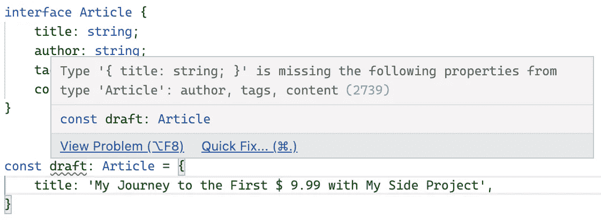

我们不能这样做，因为我们的接口需要给出所有的属性。为了解决这个问题，我们可以使用`Partial`实用程序类型轻松地创建一个新类型:

为我们的`draft`变量使用新的`DraftArticle`修复了类型脚本错误:

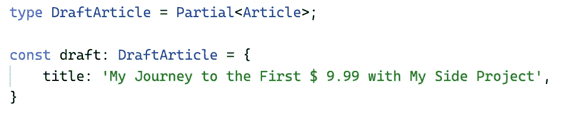

## 需要

如果你理解了`Partial`类型，那么`Required<Type>`助手是直接的，因为它是相反的。

`Required<Type>`接受一个[泛型](https://medium.com/@mariusbongarts/advanced-typescript-generics-1b30d6b5dd49)并使所有属性成为**必需的**。

让我们调整上面的例子来理解`Required`实用程序类型。这次我们的`Article`界面看起来是这样的:

`title`属性是必需的，而所有其他属性都声明为可选的。这个接口很适合创建一篇草稿文章，但是我们希望确保为发布的文章设置了所有属性。

拥有可选属性可能会导致问题，因为 TypeScript 无法识别缺少的属性:

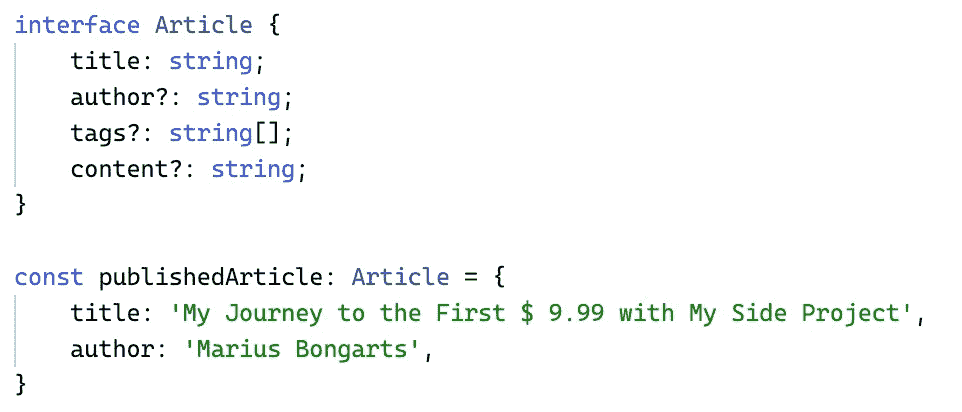

为了确保 TypeScript 会在这里抛出错误，我们可以使用`Required`实用程序类型创建一个新类型:

使用`PublishedArticle`类型，我们可以看到我们发布的文章缺少了一些属性:

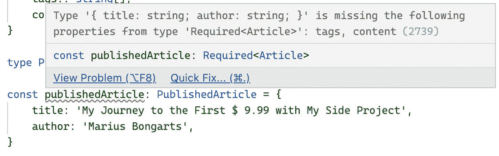

## 挑选

`Pick<Type, Keys>`类型通过从`Type`中挑选属性集`Keys`(字符串文字或字符串文字的[联合](https://medium.com/@mariusbongarts/advanced-typescript-with-code-challenges-union-types-2474c6e62097))来构造类型。

我经常使用这种类型，因为它对于创建属性依赖于其他类型的类型非常有帮助。让我们再次以我们的`Article`接口为例:

现在，我们想展示一篇文章的预览。这个预览只需要文章的`title`和`author`。此外，我们不希望[重复代码](https://medium.com/@mariusbongarts/dry-your-wet-typescript-code-e3c777b3daf9)并创建一个具有相同属性的新接口。这就是为什么我们利用`Pick`实用程序类型来创建新的`PreviewArticle`类型:

注意，我们使用了一个[联合类型](https://medium.com/@mariusbongarts/advanced-typescript-with-code-challenges-union-types-2474c6e62097)来定义我们想要从原始接口中选择哪些属性。我们可以在 IDE 预览中看到，我们成功地创建了新类型，仅包含所需的属性:

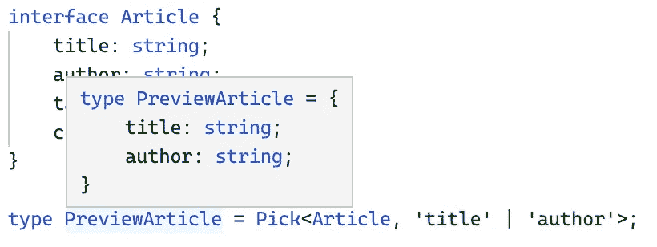

## 省略

当理解`Pick<Type, Keys>`类型时，`Omit<Type, Keys>`实用程序类型是直接的，因为它是相反的。我们没有将`Keys`添加到我们的类型中，而是将`Keys`从原始类型中移除。

所以，我们的例子看起来和上面的非常相似，只是反过来了。同样，这里是我们的`Article`接口:

我们想要创建一个`PreviewArticle`接口，我们也可以像这样使用`Omit`类型:

这一次，我们将所有属性作为应该从原始类型中移除的联合类型进行传递。同样，我们可以在 IDE 预览中看到，我们成功地创建了新类型，仅包含所需的属性:

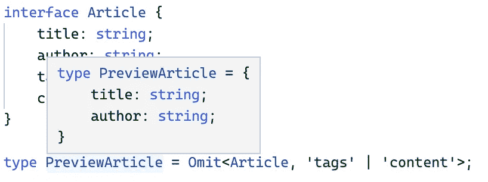

## 记录

`Record<Keys, Type>`类型对于定义具有特定键和值类型的类型很有用。

例如，我们可以使用一个列出所有作者及其文章数量的地图，如下所示:

但是当您对键使用[联合类型](https://medium.com/@mariusbongarts/advanced-typescript-with-code-challenges-union-types-2474c6e62097)时，记录的基本功能就变得非常清楚了。这意味着我们可以为作者定义一个联合类型的名称，如下所示:

通过为我们的记录的键定义一个联合类型，我们确保所有且只有在我们的联合类型中指定的键存在于我们的记录中。也许，你已经注意到，在上面的例子中，有两个问题:

*   “Jon”在我们的联合类型中不存在
*   我们的记录中没有‘简’这个人

这也是 TypeScript 告诉我们的:

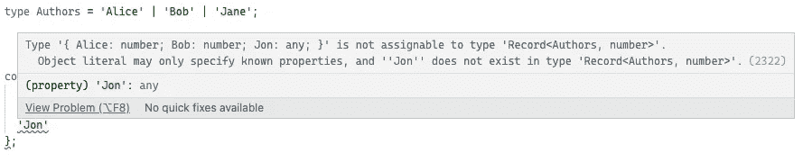

而且，当去掉‘乔恩’的时候:

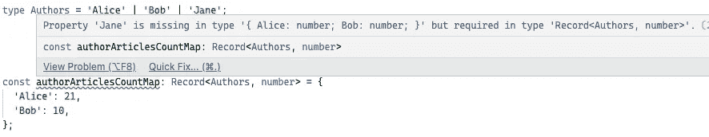

## 排除

另一个常用且有用的实用程序类型是`Exclude`。此类型从联合中移除类型。

举个例子，让我们从之前的`Authors`联盟式说起:

假设我们想从 union 类型中排除 *'Jane'* ，我们可以使用`Exclude<UnionType, ExcludedMembers>`类型来实现:

我们的 IDE 显示我们成功地从联合类型中移除了*‘Jane’*:

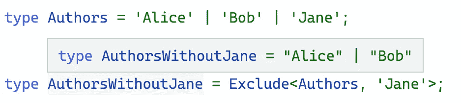

## ReturnType

`ReturnType<Type>`实用程序类型提取函数类型的返回类型。这个助手在使用外部库时非常有用。

假设，我们正在使用一个外部库的函数，我们需要使用它的返回类型。但是，该函数的接口或类型不是由库导出的。所以，处理它的唯一方法是获取函数的`ReturnType`。

让我们继续上面的例子，假设我们有一个提供创建文章功能的库。该函数仅将一个`title`作为字符串，并返回一个`Article`对象:

`Article`接口不是从库中导出的，不能直接导入。所以，我们需要自己创造它来使用它。我们可以这样使用`ReturnType`实用程序类型:

这就是证据:

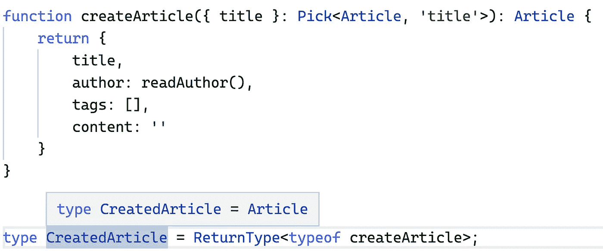

## 因素

顾名思义，`Parameters<Type>`助手从函数参数中使用的类型构造一个元组类型。

比方说，我们从上面有相同的功能:

现在，我们想提取它的参数类型。我们可以这样做:

这将返回一个包含`createArticle`函数所有参数的数组:

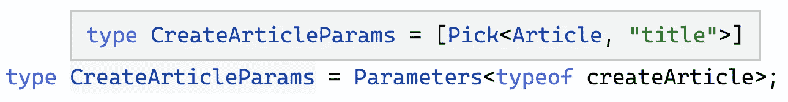

为了访问第一个参数，我们可以使用一个索引:

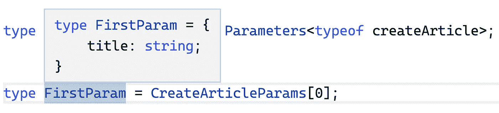

## 其他人

还有许多其他的实用程序类型，在 [TypeScript 的文档](https://www.typescriptlang.org/docs/handbook/utility-types.html#parameterstype)中列出。其中一些很容易理解:

*   `**Uppercase**<StringType>`
*   `**Lowercase**<StringType>`
*   `**Capitalize**<StringType>`
*   `**Uncapitalize**<StringType>`

在本文中，我想给出 TypeScript 中最重要的实用程序类型的概述。我可以推荐你也看看其他的。尽管如此，了解并掌握这里提到的这些内容会为您成为一名优秀的 TypeScript 开发人员提供足够的工具包。

# 代码挑战💻

你可以在这个[打字稿操场(起始码)](https://www.typescriptlang.org/play?ts=4.4.4#code/PQKhCgAJsh1BTSALAhgN0QG3igTgO3gBNIUAjAewFcAXSGpRAWwoGc6BjCpl-U-Eo0wAHAGZVMkWgEtM0mgE96C4fFaRpfACoq1HXNOE0AdAAKoMABLxciaepSQuReGRStEDFJwr4aKTXVWbkQdVVZ9QzobXApcdS9OFD4yRFFpAA9iKVZNAHMpGll5JUVwgC5wC0gAUQyOGw57eEqYSGrIAEZjSAAxTNJMSTC9AyNIGLjWKsgQYCrwTRobURQGyABBXCKObEgAbw6immxyyHYDfDyAbg6UWiQ4gH4zi-zbtv881leaS7yANoAXQ+MC4fngfjOAAN8HEmChMAB9AAk+zeVwAvkjwcs-NDIAAfSDQ1iqJqI1Hov75bG4yE0aG3TFVYDASAAWRQAGtEIjJMJYqpttI1JAKEZpL5EeAyogACK4FCiGhbHZ7AC8mxFu3gt3AbMgAFUPJAAArSDjc+gUSB5eB0BieXTi0ROXx4miyl1qy3YADCHoZkC1GJurPZdV2VBc53J0kR7ohfkgoliTGUqik+Cl+G9WYAcvDEYHk3Qtb7daXPfrDVzeYNJN4aWRaGLbABHKjSWxEfOIf22bzESua7XqvVVcT4DhFXxOIfLUfwAAU+2O2AANKQHnFt19WNv6X5MWdFcrVTrsABKM6DnDLIjLg4dWw0KgEF9tT7yU70X+IE8TyQAA5CBm4dG09wMHEZzQY8uCQEBoHgZBMAHmcB5IcBwIQd+YJBlCSaethoFwrgCLIjihE0KhbQsiyrJgFAICQFojDurGqSYBQADukBEBQYpwnQhDZDQtqpE4qBXOJtrpBk9AcfYrBUGoxgsZsRAAFZUOwSmIM4fKUBgNqpgM-JsboERjNEuCxPEkDcXxrRzOA4L6ek8Q0Foag0DC5GUVSYZ0jRBLEqS8aUmiIXUWWBJamBpDqFQ+DcnCvF8O445+vA1YMrcHl0HgE5nPsO4wbgvz-JAmIhguD7wMua6YtehW+PpgUljRAXFsiMU0licWeglKHJdm6V8Vl6hFhR3VltcQA)里解习题。如果你被卡住了，你可以在这个[打字游戏场(解决方案代码)](https://www.typescriptlang.org/play?ts=4.4.4#code/PQKhCgAJsh1BTSALAhgN0QG3igTgO3gBNIUAjAewFcAXSGpRAWwoGc6BjCpl-U-Eo0wAHAGZVMkWgEtM0mgE96C4fFaRpfACoq1HXNOE0AdAAKoMABLxciaepSQuReGRStEDFJwr4aKTXVWbkQdVVZ9QzobXApcdS9OFD4yRFFpAA9iKVZNAHMpGll5JUVwgC5wC0gAUQyOGw57eEqYSGrIAEZjSAAxTNJMSTC9AyNIGLjWKsgQYCrwTRobURQGyABBXCKObEgAbw6immxyyHYDfDyAbg6UWiQ4gH4zi-zbtv881leaS7yANoAXQ+MC4fngfjOAAN8HEmChMAB9AAk+zeVwAvkjwcs-NDIAAfSDQ1iqJqI1Hov75bG4yE0aG3TFVYDASAAWRQAGtEIjJMJYqpttI1JAKEZpL5EeAyogACK4FCiGhbHZ7AC8kAACngioiADxq6S7eAAPlu4DZkAAqh4dSbufQKJA8vA6AxPLpxaInL48TRZd7jaaAML+hmQLXax1GkWmgA0kAA5PS-MmzQDUxH0yDWey6rsqC5zuTpIi-RC-JBRLEmMpVFJ8FL8EHGwA5eGI8NVuhawuYYvwOPq+A9gNJ0llylojF5Ok5xkW-Ocnl8oakGg0si0MW2ACOVGktiIbcQods3mIIc1kAASvBD8fiCOTdhl+BxPgOEVfE5L8sN7wAAFPsxzYEm9wMHESZfKwSZpjQmJnIqyqqvG2AAJRnBeODLEQQEHB0tg0FQBBEW0nzyKc9DUYgTxPCmyYJh0bRQY8uBnOxcSQAxTEsZRMBwWccG8YxwICYJlYBmciFiSmcK4AiyI4ouzEdCyLKsmAUAgJAWiMH6JapJgFAAO6QEQFBinCdCENkNAuqkTioFcDkuukGT0IZ9isFQajGLpmxEAAVlQ7DeYgzh8pQGDOjWAz8vpugRGM0S4LE8SQCZ5mtHM4DghF6TxDQWhqDQMKKcpVJzguvYEsSU7wBSyKzjSWKqfVUZMaQ6hUPg3JwmZfDuJsGFjoutyFXQepvi0BykA8cS-P8kCYt1+h4fAQGgZimFTb4EVVd2i6VV2rXUv8dUBgSWrJsmvVNoN5kjeonZKSdvbXEAA)找到解决方法。当然，你也可以将&的打字稿代码复制粘贴到你选择的 IDE 中。

## 介绍

我们已经了解了 TypeScript 中最常见和最有用的实用程序类型。

下面是一个代码库，其中包含一些可以使用实用工具类型修复的 TypeScript 错误:

## 密码

下面是该练习的 [**起始码**](https://www.typescriptlang.org/play?ts=4.4.4#code/PQKhCgAJsh1BTSALAhgN0QG3igTgO3gBNIUAjAewFcAXSGpRAWwoGc6BjCpl-U-Eo0wAHAGZVMkWgEtM0mgE96C4fFaRpfACoq1HXNOE0AdAAKoMABLxciaepSQuReGRStEDFJwr4aKTXVWbkQdVVZ9QzobXApcdS9OFD4yRFFpAA9iKVZNAHMpGll5JUVwgC5wC0gAUQyOGw57eEqYSGrIAEZjSAAxTNJMSTC9AyNIGLjWKsgQYCrwTRobURQGyABBXCKObEgAbw6immxyyHYDfDyAbg6UWiQ4gH4zi-zbtv881leaS7yANoAXQ+MC4fngfjOAAN8HEmChMAB9AAk+zeVwAvkjwcs-NDIAAfSDQ1iqJqI1Hov75bG4yE0aG3TFVYDASAAWRQAGtEIjJMJYqpttI1JAKEZpL5EeAyogACK4FCiGhbHZ7AC8mxFu3gt3AbMgAFUPJAAArSDjc+gUSB5eB0BieXTi0ROXx4miyl1qy3YADCHoZkC1GJurPZdV2VBc53J0kR7ohfkgoliTGUqik+Cl+G9WYAcvDEYHk3Qtb7daXPfrDVzeYNJN4aWRaGLbABHKjSWxEfOIf22bzESua7XqvVVcT4DhFXxOIfLUfwAAU+2O2AANKQHnFt19WNv6X5MWdFcrVTrsABKM6DnDLIjLg4dWw0KgEF9tT7yU70X+IE8TyQAA5CBm4dG09wMHEZzQY8uCQEBoHgZBMAHmcB5IcBwIQd+YJBlCSaethoFwrgCLIjihE0KhbQsiyrJgFAICQFojDurGqSYBQADukBEBQYpwnQhDZDQtqpE4qBXOJtrpBk9AcfYrBUGoxgsZsRAAFZUOwSmIM4fKUBgNqpgM-JsboERjNEuCxPEkDcXxrRzOA4L6ek8Q0Foag0DC5GUVSYZ0jRBLEqS8aUmiIXUWWBJamBpDqFQ+DcnCvF8O445+vA1YMrcHl0HgE5nPsO4wbgvz-JAmIhguD7wMua6YtehW+PpgUljRAXFsiMU0licWeglKHJdm6V8Vl6hFhR3VltcQA) :

## 解决办法

下面是 [**解**](https://www.typescriptlang.org/play?ts=4.4.4#code/PQKhCgAJsh1BTSALAhgN0QG3igTgO3gBNIUAjAewFcAXSGpRAWwoGc6BjCpl-U-Eo0wAHAGZVMkWgEtM0mgE96C4fFaRpfACoq1HXNOE0AdAAKoMABLxciaepSQuReGRStEDFJwr4aKTXVWbkQdVVZ9QzobXApcdS9OFD4yRFFpAA9iKVZNAHMpGll5JUVwgC5wC0gAUQyOGw57eEqYSGrIAEZjSAAxTNJMSTC9AyNIGLjWKsgQYCrwTRobURQGyABBXCKObEgAbw6immxyyHYDfDyAbg6UWiQ4gH4zi-zbtv881leaS7yANoAXQ+MC4fngfjOAAN8HEmChMAB9AAk+zeVwAvkjwcs-NDIAAfSDQ1iqJqI1Hov75bG4yE0aG3TFVYDASAAWRQAGtEIjJMJYqpttI1JAKEZpL5EeAyogACK4FCiGhbHZ7AC8kAACngioiADxq6S7eAAPlu4DZkAAqh4dSbufQKJA8vA6AxPLpxaInL48TRZd7jaaAML+hmQLXax1GkWmgA0kAA5PS-MmzQDUxH0yDWey6rsqC5zuTpIi-RC-JBRLEmMpVFJ8FL8EHGwA5eGI8NVuhawuYYvwOPq+A9gNJ0llylojF5Ok5xkW-Ocnl8oakGg0si0MW2ACOVGktiIbcQods3mIIc1kAASvBD8fiCOTdhl+BxPgOEVfE5L8sN7wAAFPsxzYEm9wMHESZfKwSZpjQmJnIqyqqvG2AAJRnBeODLEQQEHB0tg0FQBBEW0nzyKc9DUYgTxPCmyYJh0bRQY8uBnOxcSQAxTEsZRMBwWccG8YxwICYJlYBmciFiSmcK4AiyI4ouzEdCyLKsmAUAgJAWiMH6JapJgFAAO6QEQFBinCdCENkNAuqkTioFcDkuukGT0IZ9isFQajGLpmxEAAVlQ7DeYgzh8pQGDOjWAz8vpugRGM0S4LE8SQCZ5mtHM4DghF6TxDQWhqDQMKKcpVJzguvYEsSU7wBSyKzjSWKqfVUZMaQ6hUPg3JwmZfDuJsGFjoutyFXQepvi0BykA8cS-P8kCYt1+h4fAQGgZimFTb4EVVd2i6VV2rXUv8dUBgSWrJsmvVNoN5kjeonZKSdvbXEAA) 为练习题:

# 最后的想法

我希望你喜欢阅读这篇文章。我总是乐于回答问题，并乐于接受批评。随时欢迎联系我！通过**[**LinkedIn**](https://www.linkedin.com/in/marius-bongarts-6b3638171/)**，**关注我**[**Twitter**](https://twitter.com/MariusBongarts)或 [**订阅**](https://medium.com/subscribe/@mariusbongarts) 通过电子邮件获取我的故事。****

****[**这里是无限制访问**](https://medium.com/@mariusbongarts/membership) 媒体上每一个内容的链接。如果你注册使用这个链接，我会赚一小笔钱，不需要你额外付费。****

**** [## 通过我的推荐链接加入 Medium-Marius bong arts

### 作为一个媒体会员，你的会员费的一部分会给你阅读的作家，你可以完全接触到每一个故事…

medium.com](https://medium.com/@mariusbongarts/membership)**** 

## ****关于作者****

****我是埃森哲软件工程分析师宋。我们一直在寻找最好的开发人员，所以如果你有兴趣加入我们，请随时联系我们！****

****最驱动我的是我想创造一些对他人有帮助和改变生活的东西的冲动🙌比如你是否厌倦了浏览自己的历史来寻找前几天看到的信息？我的 [**网站重点介绍 Chrome 扩展**](https://chrome.google.com/webstore/detail/web-highlights-%20-bookmark/hldjnlbobkdkghfidgoecgmklcemanhm) 覆盖了你，并将通过以结构化和高效的方式组织你的研究来提高你的生产力。就像你在书和文章上做的那样，突出显示任何网页或 PDF 上的文本。你的精彩片段会直接同步到 web-highlights.com 的网络应用上，你可以在任何地方找到它们。****

**** [## Web 亮点— PDF 和 Web 荧光笔

### 在每个网站或 PDF 上创建亮点、书签、标签和文件夹。以结构化的方式组织您的想法和研究…

chrome.google.com](https://chrome.google.com/webstore/detail/web-highlights-pdf-web-hi/hldjnlbobkdkghfidgoecgmklcemanhm)**** 

## ****进一步阅读****

**** [## 分析 Typescript:幕后的实用程序类型

### 内置实用程序类型是如何实现的

medium.com](https://medium.com/@mariusbongarts/analyzing-typescript-utility-types-under-the-hood-9855b8a33d28)  [## 我的第一个 9.99 美元之旅与我的副业

### Chrome 扩展带来的被动收入

medium.com](https://medium.com/@mariusbongarts11/my-journey-to-the-first-9-99-with-my-side-project-3edc13dd1f2d)  [## Web 组件会取代前端框架吗？

### 它们是为解决不同的问题而构建的。

medium.com](https://medium.com/@mariusbongarts/will-web-components-replace-frontend-frameworks-535891d779ba)  [## Web 组件死了吗？

### 最近，我发表了一篇关于类似主题的不同问题的文章:Web 组件会取代前端吗…

levelup.gitconnected.com](https://levelup.gitconnected.com/are-web-components-dead-12e404e0f4b0) 

*更多内容请看*[***plain English . io***](https://plainenglish.io/)*。报名参加我们的* [***免费周报***](http://newsletter.plainenglish.io/) *。关注我们关于*[***Twitter***](https://twitter.com/inPlainEngHQ)*和*[***LinkedIn***](https://www.linkedin.com/company/inplainenglish/)*。查看我们的* [***社区不和谐***](https://discord.gg/GtDtUAvyhW) *加入我们的* [***人才集体***](https://inplainenglish.pallet.com/talent/welcome) *。*****