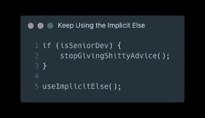
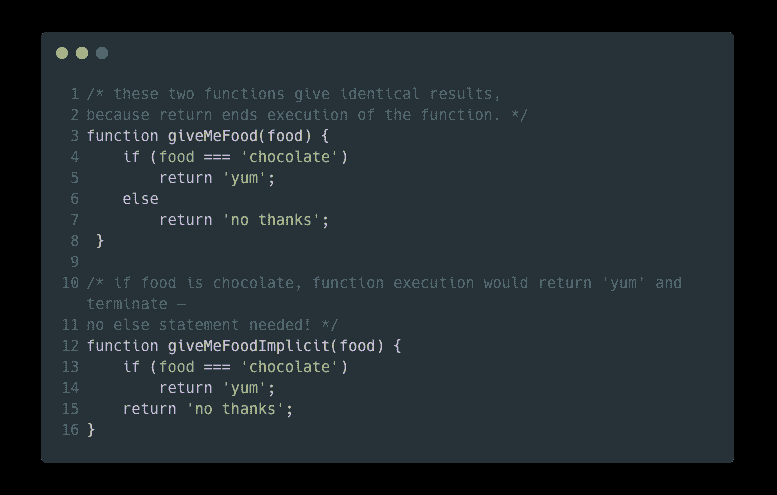
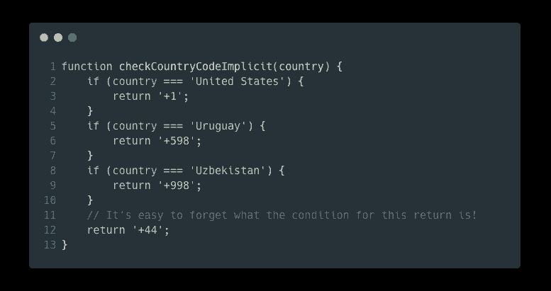
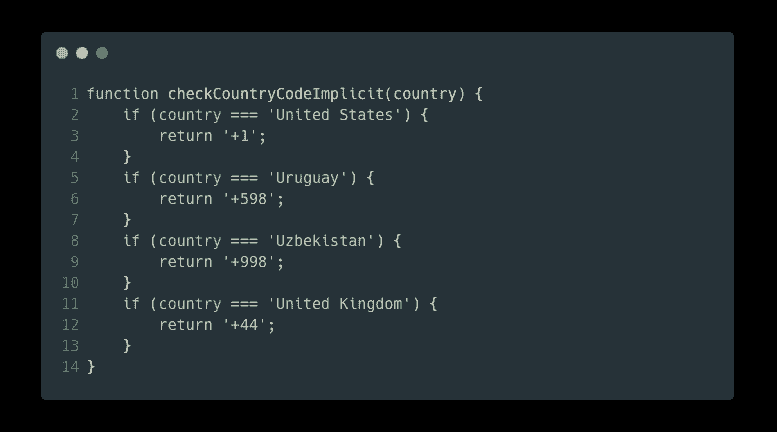
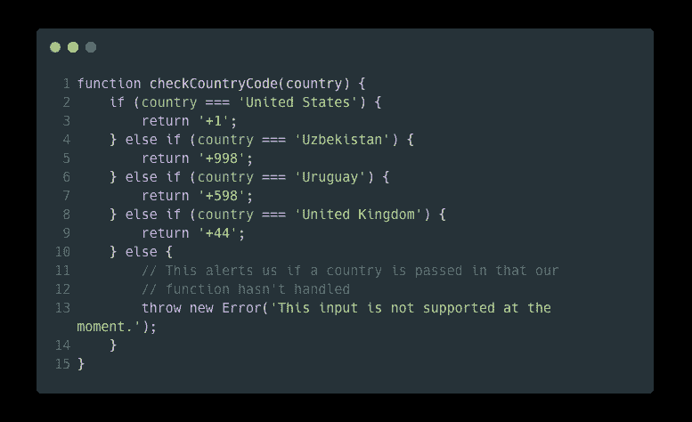
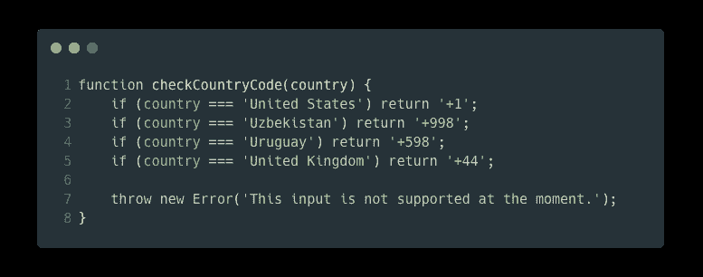
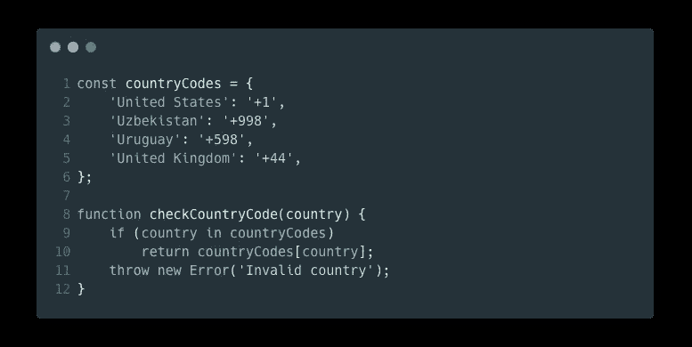

# 来自经验丰富的开发人员的建议:继续使用隐含的 Else

> 原文：<https://javascript.plainenglish.io/advice-from-a-seasoned-dev-keep-using-the-implicit-else-3e1b7c4695ec?source=collection_archive---------1----------------------->

## 不要接受媒体上任何人的编程建议。即使是经验丰富的专业人士有时也会给出糟糕的建议。这只是一个例子。

大约一个月前，我在 Medium 上读到一篇名为 [*的文章，来自一位资深开发者的建议:停止使用隐含的“else”*](/advice-from-a-senior-dev-stop-using-the-implicit-else-2a2ecf0a3583)[Sarah Q](https://medium.com/@esskew213)*。作者在她的文章中大错特错，所以湿湿的华夫饼干在这里拯救了这一天。*

请知道，我不是在抨击作者(因为她可能是一个初级开发人员)，但我会抨击高级开发人员给她的建议和文章本身。

我将分解文章的所有错误，从副标题开始。建议大家阅读 [**原文**](/advice-from-a-senior-dev-stop-using-the-implicit-else-2a2ecf0a3583) 了解上下文。

# 副标题

> “我认为有一种趋势——至少在初级开发人员中——认为代码越短越好。但事实并非总是如此。”
> 
> ~莎拉 q。

代码越短越好。如果您可以将相同的代码重构为更少的代码行，那么它通常会提供以下优势:

*   较小的源尺寸
*   增加可读性
*   提高可维护性
*   降低认知复杂性

但是作者在一个方面是正确的:*事实并非总是如此*。但是这篇文章并没有涵盖这些情况中的任何一种——相反，它涵盖了代码越短越好的情况。

# 作者对隐含的他者的解释

这篇文章最精彩的部分是作者对隐含的 else 是什么的解释:

> 对 if 语句使用隐式 else 利用了这样一个事实，即[返回语句结束函数执行](https://developer.mozilla.org/en-US/docs/Web/JavaScript/Reference/Statements/return)。在某些情况下，这让我们消除了 else 语句，从而缩短了代码。

作者到目前为止还不错。现在让我们看看她给我们提供的例子:

Code provided in Sarah Q’s article (but cleaned up a bit)

这一整节都很好；这里没问题。当作者提供更多的例子时，问题就出现了。

# 资深开发者是认真的吗？

“高级开发人员”声称包含**显式** `**else**`有两个主要原因:

> 1.Elses 有助于保持你的条件句清晰明了，这样它们就可以扩展并且容易被其他人理解(包括你未来的自己)。
> 
> 2.您可以使用最终的 else 作为一个总括，或者在传入一个您的函数无法处理的参数时处理错误。

第一点:`else`没有增加可读性或可维护性。使用`else`关键字对你的代码来说是不必要的。相反，它增加了应用程序的认知复杂性，从而使其他人更难理解。你可以在这篇关于代码环境的伟大文章中了解认知复杂性。

第二点:当在一个`if`语句中返回时，你可以跳过使用 else 并在函数的底部抛出你的错误。

# 可怕的例子

为了加强前面的观点，作者提供了一个可怕的代码示例。

Code from Sarah Q’s Article

她声称使用隐含的 else 不是好的做法。但是在返回英国的国家代码之前不检查`country`变量并不是一个好的做法。

编写这段代码的更好的方法是这样的:

How validation of country names should be done.

为什么这样更好？价值国不是真正的国家怎么办？如果用户输入`"Texas"`会怎样？那么该函数返回英国的国家代码，而不是德克萨斯的国家代码——这是一个主要的错误。

作者提供了一个使用`else`语句处理该函数不能处理的情况的例子:

Code for Sarah Q’s article: Ugly code (using else and else-if when not required)

你还记得之前的观点吗？通过省略隐含的 else，您可能会忘记`+44`国家代码属于哪个国家——但是在这个例子中，她使用`if (country === “United Kingdom”)`使它变得简单明了。那么，她为什么要提出这样的观点呢？

在本例中，`else`提供了什么优势？没有。你可以忽略它，在函数的底部抛出错误。这种方式仍然清楚地表明，如果函数还没有返回任何内容，则发生了意外情况，并且函数应该抛出一个错误:

Cleaned up code using **implicit** else the correct way

这不是干净多了吗？更容易阅读？简洁多了？更好的代码？

# 最后一个问题

为了确定是否应该使用隐式 else，作者提出了以下问题:

> 省略左、右和中间的其他部分真的能让我的代码更容易理解吗？如果有一堆 if…返回，然后在底部突然出现一个 throw 语句，其他人阅读起来会不会很直观？

回答这个问题:省去`else`会更直观(尤其是在这个场景中)。

当你在条件语句中有一堆返回时，你想做什么就一目了然了。用一堆`else-ifs`和`else`块把你的代码弄得乱七八糟，会让你更难理解。如果一个`throw`语句在函数的底部，任何有理性的开发人员都知道每个条件都用尽了，从而抛出一个错误。

# 湿漉漉的华夫饼

这位作者使用的代码示例非常糟糕。还有更好的解决方案，比如使用 switch 语句。使代码真正可伸缩、可读和可维护的最好方法是使用对象映射:

Creating a dictionary object mapping country names to country codes

*   **第 1–6 行**:定义一个对象，将国家名称映射到国家代码
*   第 9 行:检查`country`参数是否是`countryCodes`对象中的有效键
*   **第 10 行**:通过`countryCodes`对象返回国家代码
*   **第 11 行**:如果第 9 行的条件为`false`则抛出错误

作者说她是初级开发人员。我的问题不在于她，而在于给她建议的高级开发人员。她不知道如何反驳他的论点，所以她相信她同事的话。

用适当的知识武装自己是至关重要的，让你拒绝这些过时的想法。

我希望你喜欢这篇文章。编码快乐！👍

*更多内容看* [***说白了就是***](https://plainenglish.io/) *。报名参加我们的* [***免费每周简讯***](http://newsletter.plainenglish.io/) *。关注我们*[***Twitter***](https://twitter.com/inPlainEngHQ)*和*[***LinkedIn***](https://www.linkedin.com/company/inplainenglish/)*。查看我们的* [***社区不和谐***](https://discord.gg/GtDtUAvyhW) *加入我们的* [***人才集体***](https://inplainenglish.pallet.com/talent/welcome) *。*