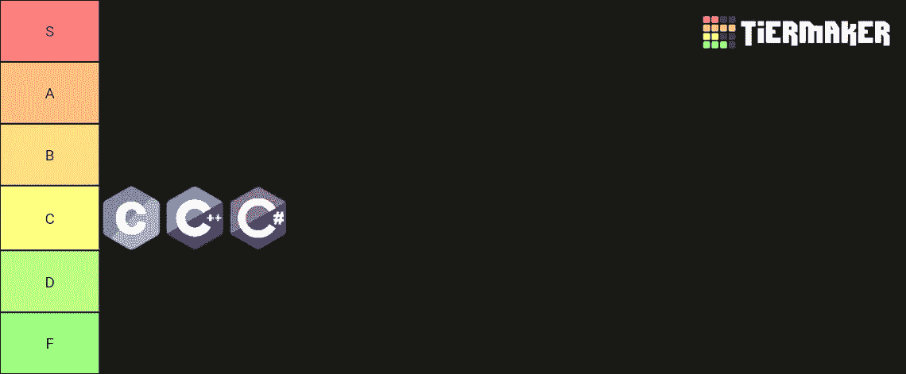

# 敏捷——每 14 天增加一次垃圾

> 原文：<https://javascript.plainenglish.io/agile-incremental-crap-every-14-days-54a1bbb673?source=collection_archive---------9----------------------->

## 和其他金块。

Taken by Polina Zimmerman on [Pexels](https://www.pexels.com/sk-sk/photo/vztah-priatel-problem-rozculeny-3958843/)

编程行业正在快速发展，这是事实。我们对此无能为力。

即使你想掌控一切，你也不能。

没人有时间去看发生了什么。因为我们正忙着修复一周前写的 bug。修理(家)办公椅。或者与团队领导争论为什么我们没有把 JIRA 的票放到正确的栏里。

在这个混乱的时代，一个人必须鹤立鸡群。发布过去一周科技行业最重要的新闻。

# 科技领域发生了什么

当然，我说的“科技行业最重要的”是指科技子行业。

## 亚马逊推出人工智能配对编程工具

亚马逊刚刚宣布了其新的人工智能编程工具。所以如果你觉得使用 Github Copilot 并没有让你成为一名优秀的开发者。

也许是时候给[密语者](https://techcrunch.com/2022/06/23/amazon-launches-codewhisperer-its-ai-pair-programming-tool/)一个尝试了！

## 编程语言层列表

为了表达他/她对编程语言的热爱，人们已经决定基于偏好对编程语言进行排序。

结果呢？自己判断…

[Original Source](https://i.redd.it/9nqervc1kx791.png)

## 刚刚收到的 StackOverflow 调查

[结果在](https://survey.stackoverflow.co/2022/)中。开发商提供的数据已经处理完毕。就收入而言，JavaScript 开发人员似乎很少。

但是，嘿，至少我们比 PHP 开发人员做得更好。

## 错误的债券

Git 历史可能是相当无情的。特别是对于年轻的代理人，也就是从未使用过版本管理系统的 Udemy 毕业生。

要注意！也许你和他们中的一个是一伙的。如果你是他们中的一员，学习 Git。

[Original Source](https://i.redd.it/ns403td0et791.jpg)

## Vim 9 已经发布

是啊，管它呢。如果我想一直盯着黑屏，我宁愿闭上眼睛睡觉。

但是如果你仍然感兴趣，这里有[的完整文章](https://www.vim.org/vim90.php)。

## 是时候重新审视敏捷开发了

对比敏捷和瀑布的新信息图已经公布。你可能见过很多。我知道我确实做到了。

然而现实总感觉有点不一样。但是现在，我们终于有了最接近事实的图形。

[Original Source](https://i.redd.it/dxsz74e9d5891.png)

## 期待已久的面试捷径

作为一名开发人员，在面试中表现出你的兴奋和好奇是很重要的。即使你一点也不在乎。

但是提出问题是很难的。幸运的是，我们不再需要这样做了。因为名为 [*viraptor*](https://github.com/viraptor) 的 might Github 用户制作了一个[问题列表](https://github.com/viraptor/reverse-interview)来询问面试官关于该公司的问题。

## 火力基地依然强大

Firebase 似乎仍然是很多开发者的热门选择。几个月前我把它扔了。

但是，我仍然可以理解下面的过程。

[Original Source](https://preview.redd.it/jq5bougulf891.gif?format=mp4&s=2d2befdc183de99a617e91e4e810da44e22ba47d)

## 反应还是踢屁股

喜欢也好，讨厌也好。根据栈溢出调查，React 仍然被认为是[最流行的前端框架](https://survey.stackoverflow.co/2022/#most-popular-technologies-webframe)。

显然，jQuery 是第三个。哦，我的…

## 重构似乎仍然是一件事

统计数据终于来了。你看着之前写的同一段代码的可能性非常接近 100%。

所以拜托，为了你的健康。开始写文档！

# 下周见

这就是这周的大部分内容。7 天后见。

哦，我差点忘了！如果你觉得一些重要的信息没有出现在列表中。请在评论中告诉我们。

*如果你想从我这里听到更多或者阅读更多，可以考虑使用* [***这个链接***](https://bernardbad.medium.com/membership) ***成为一个中等会员。***