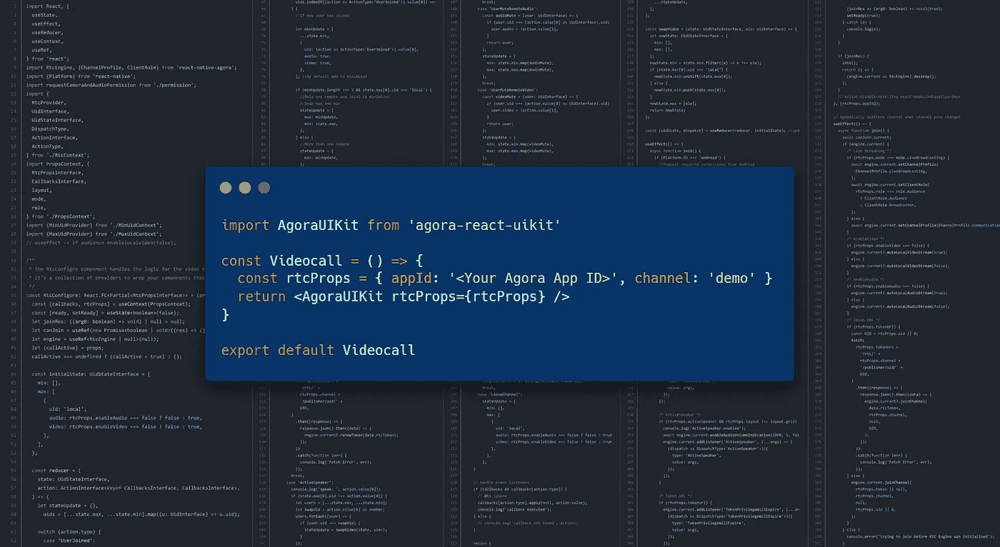
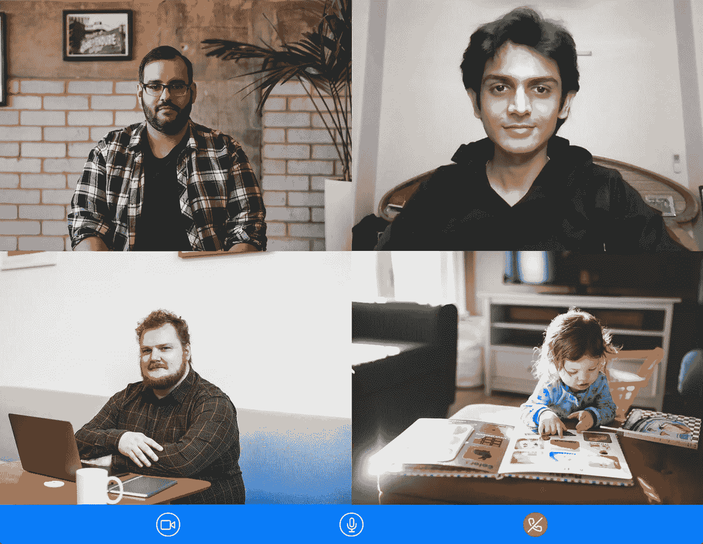

# Agora Web UIKit:在几分钟内为您的网站添加视频通话或直播

> 原文：<https://javascript.plainenglish.io/agora-web-uikit-add-video-calling-or-live-streaming-to-your-website-in-minutes-2b635bb2601a?source=collection_archive---------18----------------------->

## 用 5 行代码构建您的自定义视频聊天应用程序或启动您的实时流媒体服务。

Agora 每月平均提供超过 500 亿分钟的人际联系，我们发布了开源、社区驱动的 Web UIKit，让构建您自己的定制视频聊天应用程序或推出您自己的直播流媒体服务变得前所未有的简单。我们希望看到你的下一个项目在几分钟内上市，而不是几天！

The UIKit encapsulates all the videocall logic to give you access to a high-level component

Agora Web UIKit 建立在使用 [React](https://reactjs.org/) 的 [Agora Web SDK](https://docs.agora.io/en/Video/landing-page?platform=Web) 之上。它让您可以访问高级 React 组件或非 React 项目的 web 组件，您可以将这些组件添加到您的网站，并随时提供视频通话或直播体验。

# 它是如何工作的

你所需要的只是一个 Agora 开发者账户，在这里注册[是免费的！进入 Agora 控制台后，创建一个新项目并复制 Agora 应用程序 ID，我们将在应用程序中使用该 ID。](https://sso.agora.io/en/signup?utm_source=medium&utm_medium=blog&utm_campaign=agora-web-uikit-add-video-calling-or-live-streaming-to-your-website-in-minutes)

## 使用 Web 组件

Web 组件非常棒，允许 Agora Web UIKit 在任何 Web 应用程序中使用。如果你的网站是用普通的 JavaScript 或者 Angular、Vue.js 或者 Svelte 这样的框架构建的，你可以使用这种方法。如果你的网站使用 React，你可以进入下一部分。

只需导入 web 组件[脚本](https://github.com/AgoraIO-Community/Web-React-UIKit/releases/download/v0.0.1/agora-uikit.js)。然后，您可以通过将 Agora 应用 ID 和频道名称作为属性传入来使用 web 组件。您可以自定义 UIKit 来启用活动发言者检测、更改布局、作为观众加入等等。使用这些属性。你可以在[详细博客](https://ekaansh.medium.com/adding-video-chat-or-live-streaming-to-your-website-in-5-lines-of-code-using-the-agora-web-uikit-ab1d2b0e5c61)了解更多。

这就是你需要添加视频会议到您的网站！这里有一个基本的[现场演示](https://agora-react-uikit.vercel.app/)，你可以随意摆弄。

## React 方法

Agora Web UIKit 旨在从基础上进行定制和扩展。你可以自定义用户界面，选择一些功能，比如一个活跃的演讲者，双流模式，以及通过传入道具作为观众加入。它是用 Typescript 编写的，并且是用模块化的功能组件构建的，所以你可以选择单独的部分，构建你喜欢的任何东西。

使用`npm i agora-react-uikit`将 [Agora Web UIKit](https://www.npmjs.com/package/agora-react-uikit) 安装到您的项目中

然后，您可以通过传入您的 Agora 应用程序 ID 和频道名称作为道具来呈现`<AgoraUIKit>`组件:

这就是全部了。你可以通过改变道具来定制特性，你可以在[文档](https://agoraio-community.github.io/Web-React-UIKit/)中了解不同的道具。你可以点击查看完整示例[。](https://github.com/AgoraIO-Community/Web-React-UIKit/tree/main/example)

如果你想更深入地研究，你可以阅读这篇深入讨论这个例子的博客。该项目是开源的；你可以查看一下 [GitHub Repo](https://github.com/AgoraIO-Community/Web-React-UIKit) 和 [API 参考](https://agoraio-community.github.io/Web-React-UIKit/)。我们期待社区贡献和您的反馈。

我们还有适用于 [Android](https://github.com/AgoraIO-Community/Android-UIKit) 、 [iOS](https://github.com/AgoraIO-Community/iOS-UIKit) 、 [React Native](https://github.com/AgoraIO-Community/ReactNative-UIKit) 和 [Flutter](https://github.com/AgoraIO-Community/Flutter-UIKit) 的 UIKits。你也可以去看看。

如果您在使用 Agora Web UIKit 时有任何问题，我邀请您加入 [Agora 开发者 Slack 社区](https://agora.io/en/join-slack)。你可以在`#web-help-me channel`中提出你的问题。欢迎提出功能请求或在 [GitHub Repo](https://github.com/AgoraIO-Community/Web-React-UIKit/issues) 上报告错误。或者你可以在推特上联系我。

*更多内容请看*[***plain English . io***](http://plainenglish.io/)*。报名参加我们的* [***免费周报***](http://newsletter.plainenglish.io/) *。在我们的* [***社区***](https://discord.gg/GtDtUAvyhW) *获得独家获得写作机会和建议。*