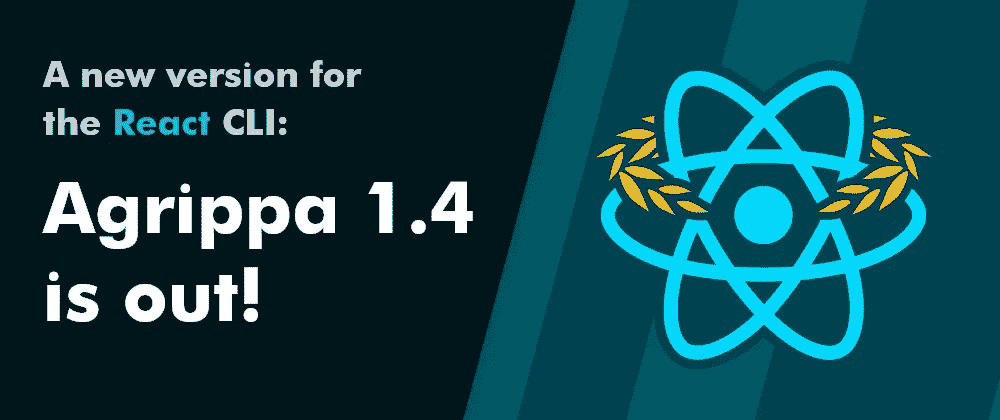

# 阿格里帕 1.4 已经过时

> 原文：<https://javascript.plainenglish.io/agrippa-1-4-the-react-cli-is-out-29073bc9c916?source=collection_archive---------7----------------------->

## Agrippa 的第四个次要版本 React 组件 CLI 终于出来了！

自去年 12 月发布 1.3.0 版本以来，阿格里帕的社区又一次成长了许多。自上一版本以来，Agrippa 已经增长了 230 多颗星，绝对来说，这是我们迄今为止最大的增长！

发布一个新版本总是一个很好的机会*向每个使用 Agrippa* 的人表达我深深的谢意，尤其是那些在我们的 GitHub 知识库上给出反馈、建议功能或提出其他问题的人。你是最棒的！

如果你没有使用阿格里帕，请加入我们！阅读[入门](https://dev.to/nitzanhen/getting-started-with-agrippa-the-react-cli-24i8)指南或[在 GitHub](https://github.com/NitzanHen/agrippa) 上访问我们。

# v1.4.0

我们在 1.4.0 版中发布了一些激动人心的新特性:

# 新终端用户界面

阿格里帕的终端 UI 已经改版！它现在应该更丰富，更干净，尤其是更具✨美学的✨.

The new terminal UI (example)

除了以更清晰、更一致的方式使用颜色，Agrippa 的输出现在更加结构化，并记录了有关项目环境的附加信息。除了它本身很棒之外，它还为 Agrippa 的未来做好了准备——我们正朝着更好的可定制性和模块化的方向前进，正确地记录过程是朝着这些方向迈出的重要一步。

# 样式组件

阿格里帕现在支持用`styled-components`进行造型！这其实是为阿格里帕开的[第二期](https://github.com/NitzanHen/agrippa/issues/2)，到现在已经开了相当一段时间了。很高兴看到它最终得以实现。启用此设置后，Agrippa 将为组件生成一个专用的 JavaScript(或 Typescript)文件，例如在 TS 环境中为一个名为`NiceButton`的组件生成`NiceButton.styles.ts`。

要检查它，使用值`styled-components`作为`styling`标志。

# tsp props 声明

TS 用户现在可以在`interface`和`type`之间选择组件属性声明。

更多信息，请参见`[tsPropsDeclaration](https://github.com/NitzanHen/agrippa/wiki/The-complete-list-of-generation-options)`上的文档。

# 新的命令后变量

两个新的变量，`<ComponentName>`和`<component-name>`，现在可以和 post 命令一起使用。

第一个是生成的组件名，用 pascal 大小写(如`NiceButton`)，第二个是 kebab 大小写(如`nice-button`)。

# 依赖性清除

阿格里帕到目前为止一直在使用，但实际上并不需要的两个包被移除了，阿格里帕现在应该轻一点了。

差不多就是这样！我们已经开始为阿格里帕开发下一个功能。在不久的将来，我们的主要焦点是实现测试文件生成，进一步扩展 Agrippa 的灵活性以适应定制用例，等等。

也就是说，我们一直在寻找新功能和改进的想法，所以如果你有，请与我们分享！

要开始使用 Agrippa，请阅读[入门](https://dev.to/nitzanhen/getting-started-with-agrippa-the-react-cli-24i8)指南或[访问 GitHub](https://github.com/NitzanHen/agrippa) 上的我们。

*我们一如既往地欢迎您的想法和反馈*。

如果你发现了这个版本的错误，或者想建议一个新的特性，请[提交问题](https://github.com/NitzanHen/agrippa/issues)。

干杯！

*更多内容看* [***说白了就是***](http://plainenglish.io/) *。报名参加我们的* [***免费每周简讯***](http://newsletter.plainenglish.io/) *。在我们的* [***社区不和谐***](https://discord.gg/GtDtUAvyhW) *获得独家获取写作机会和建议。*