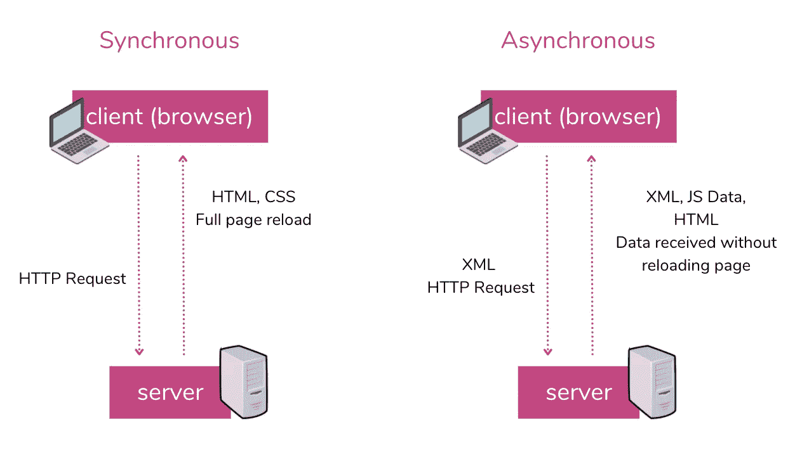

# AJAX 复习工具

> 原文：<https://javascript.plainenglish.io/ajax-refresher-87a001f1703?source=collection_archive---------26----------------------->

## AJAX 及其相关概念的快速复习


Photo by [Ryland Dean](https://unsplash.com/@ryland_dean?utm_source=medium&utm_medium=referral) on [Unsplash](https://unsplash.com?utm_source=medium&utm_medium=referral)

# 同步与异步操作

## 同步/串行

等到一件事完成了，再做下一件事。

## 异步的

一次做几件事，准备好了就去做。

# 回调函数

回调函数经常用于异步操作。该操作(可能需要一些时间)在完成后执行回调函数。

在下面的例子中，setTimeout 将一个回调作为参数来指示计时器计时时发生的情况。

```
setTimeout(hey, 2000)
function hey() {
   alert("hey");
}
```

# AJAX 基础知识

*   代表异步 JavaScript 和 XML
*   从 web 服务器异步获取数据，无需刷新或重新加载页面
*   在数据准备就绪时处理每条数据
*   在后台发送数据，无需等待响应

## 方案视图



# XMLHTTPRequest

*   XMLHTTPRequest 对象用于与服务器交互。
*   它可以用来从 URL 中检索数据，而不必进行整个页面刷新。然后，网页可以只更新页面的一部分，而不会干扰用户正在做的事情。
*   它在 AJAX 编程中被大量使用。

## XMLHTTPRequest 的关键组件

*   **readystate** →值在 0 到 4 之间的属性，表示请求的状态。
*   **onreadystatechange**→ready state 值发生变化时触发的事件。
*   **open()**&**send()**→设置然后发送请求的方法。
*   数据本身通常是 JSON 或 XML 格式。

[](https://medium.com/@.midi/json-refresher-8227d3e720e9) [## JSON 复习工具

### JSON 概念的快速复习

medium.com](https://medium.com/@.midi/json-refresher-8227d3e720e9) 

## 预定义值

*   0 —未发送→未调用 open()
*   1 —已打开→尚未调用 send()
*   2 —接收到标题→调用 send()和 open()
*   3 —加载→正在接收数据
*   4 —完成→操作完成

## HTTP 状态公共代码

*   200 →成功
*   201 →资源已创建
*   204 →请求成功，但未收到数据
*   404 →找不到页面

## Open()参数

*   发布或获取
*   服务器上处理文件的地址(相对路径)
*   Boolean 是否异步发送(通常为真)

## Send()参数

*   发送请求，可以是 JSON 字符串或其他格式

## 创建 XMLHTTPRequest

```
var req = new XMLHttpRequest();req.open("POST","data.php",true);
req.send("id:101"); // Uses a JSON string
```

## 例子

```
function requestData() {
   var reqObj = new XMLHTTPRequest();
   if (!reqObj) 
      {alert("Unable to create HTTP Request object"); return;}
   data = "id:101"; 
   reqObj.onreadystatechange = getMyData();
   reqObj.open("POST", "getData.php", true);
   reqObj.send(data);
}function getMyData() {
   if (this.readyState==4 && this.status==200){
      var data = this.responseText;
      var info = JSON.parse(data);
      for(i in info) {
         document.write(i + ":" + info[i]);
      }
   }
}
```

# 跨来源请求共享(CORS)

*   当浏览器获取网页资源(如字体、图像和脚本)时应用的安全策略。
*   跨来源意味着请求来自另一个域——甚至 HTTP 与 HTTPS 也被认为是不同的。
*   服务器将指定什么可以获得访问权限以及如何获得访问权限。
*   安全策略可以最大限度地降低与攻击浏览器的代码相关的风险，例如下载恶意代码、劫持浏览器或添加不受欢迎的插件。

# 使用 API

*   API 或应用程序编程接口可以引用 web 服务器上的专用功能。
*   API 允许组织在不损害数据的情况下提供对数据的访问。
*   通常，可以用 AJAX 访问 API。
*   您可能需要一个 API 键来访问数据。

```
// Example of getting city data for a zip code
var req = new XMLHttpRequest();
req.open("GET,"http://api.zippopotam.us/us/02145",true);
req.onreadystatechange = function() {
   if(req.readyState ==4) {
      console.log(req.responseText); 
   }
};
req.send();
```

# 邮递员

Postman 是一个 web 应用程序，它帮助测试 API 调用，不需要任何编码。

postman 集合是一个 JSON 对象，它详细描述了 API 调用的正确参数。

# 使用 REST 访问 API

*   REST 代表代表性状态转移
*   它是由罗伊·菲尔丁在 2000 年创建的
*   实现异步访问的另一种选择
*   当一个 RESTful API 被调用时，它会将所请求资源的状态表示传递给客户机——通常是以 JSON 的形式

[](https://medium.com/@.midi/rest-api-interview-questions-2f2ef9329a13) [## Java 访谈系列:REST API

### 关于 RESTful web 服务的基本问题和概念

medium.com](https://medium.com/@.midi/rest-api-interview-questions-2f2ef9329a13) 

# 使用承诺的异步调用

*   **承诺**是异步操作结果的占位符
*   承诺通常会与 API 一起使用
*   承诺可以成功或不成功地解决

```
new Promise (resolve, reject) => {
   // api call here
   // uses the resolve and reject function on success / failure of the call
} 
```

## **举例**

```
function myDisplayer(some) {
  document.getElementById("demo").innerHTML = some;
}let myPromise = new Promise(function(myResolve, myReject) {
  let x = 0;if (x == 0) {
    myResolve("OK");
  } else {
    myReject("Error");
  }
});myPromise.then(
  function(value) {myDisplayer(value);},
  function(error) {myDisplayer(error);}
);
```

# 获取()

fetch()函数合并了 XMLHttpRequest 的许多常见元素。

```
res = fetch("http://secretcheese.com/demo/location.json")
.then(res => res.text()); 
.then(data => console.log(data)); 
.catch(error => console.log(error));// Using fetch() with an API
res = fetch("http://secretcheese.com/demo/location.json")
.then(res => res.text()); 
.then(data => {
   data.JSON.parse(data);
   data = data.current.temp;
   console.log("the current temperature is " + data + "degrees")
}); 
.catch(error => console.log(error));
```

# 异步/等待

有时，操作顺序在异步调用中至关重要。换句话说，即使流程是异步的，在执行其他操作之前完成一些操作仍然很重要。

这些通常与承诺/API 调用结合使用。

## **举例**

*   问题:你正在访问一个数据库。您尝试异步打开数据库。然后，您尝试关闭数据库，但它尚未打开。这将导致错误。
*   **解决方案:**在关闭数据库之前，等待数据库操作完成。
*   **机制:**等待

## 等待

*   await 修饰符位于操作的前面
*   在操作完成之前，系统不会继续
*   await 只能在具有 async 修饰符的函数中使用

```
async function doSomething() {
   await thisCouldTakeAWhile();
   doMore(); // this will not happen until the await piece is done
}
```

[](https://medium.com/@.midi/javascript-js-refresher-for-react-87bfaf23f482) [## React 的 JavaScript (JS)更新程序

### 学习和理解 React 所需的 JS 概念的快速复习

medium.com](https://medium.com/@.midi/javascript-js-refresher-for-react-87bfaf23f482) 

*更多内容请看*[***plain English . io***](https://plainenglish.io/)*。报名参加我们的* [***免费周报***](http://newsletter.plainenglish.io/) *。关注我们关于*[***Twitter***](https://twitter.com/inPlainEngHQ)*和**[***LinkedIn***](https://www.linkedin.com/company/inplainenglish/)*。加入我们的* [***社区***](https://discord.gg/GtDtUAvyhW) *。**