# JavaScript 数组深度

> 原文：<https://javascript.plainenglish.io/all-about-arrays-in-javascript-4d8267fe7ef8?source=collection_archive---------8----------------------->

## 数组核心概念的分解，并让初学者也能理解。

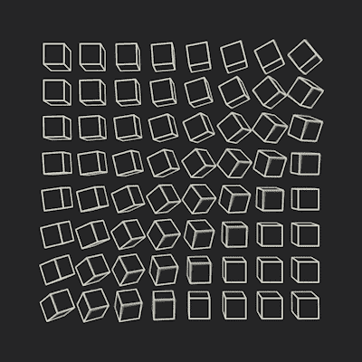

# 介绍

数组是我们不能忽视的东西，我们一定听说过这个术语。我敢肯定，您一定在考虑数据列表或相同元素的集合，它们集体存储在可通过索引访问的易感染内存中，在某种程度上，您是对的，但关于数组，您还必须了解更多的东西，在本文中，我将分解关于数组的每一个概念，并为您轻松搞定。我只想要你宝贵的时间来读这篇文章。

# 什么是数组？

一个数组基本上是一个集合或一个相似项的列表，这些相似项使用一个变量名存储在一个易感染的内存位置，其中的每一项都可以通过一个索引号来访问。比如根据学生的编号来存储班级中所有学生的名字。或者存储烹饪一道菜所需的项目数量。简而言之，我们可以把数组看作是由数字索引的条目列表。

在 JavaScript 中，数组不是基本类型，而是对象类型，即数组不是不可变的。数组可以是一维的，也可以是多维的。一维基本上就是我们所说的列表，多维数组基本上就是我们所说的矩阵，它的每个元素都可以通过它们的索引号来访问，就像一个 excel 表，其中的框可以通过行号和列号来访问。

# 定义数组并访问其元素

在 JavaScript 中，我们可以使用关键字`let`或`var`定义一个数组，并将元素放在第三个方括号`[ ]`中。

```
//defining a single dimensional array in JavaScript 
let array = [1, 2, 3, 4, 5];
console.log(array)//define a 2d array
var arr = [
  [1, 2, 3],
  [4, 5, 6],
  [7, 8, 9],
];
console.log(arr);
```

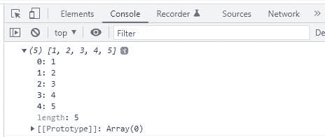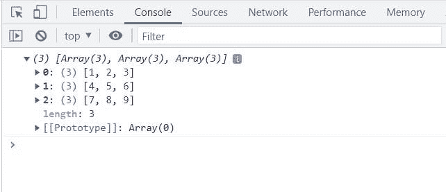

正如我前面提到的，数组中的每个元素都有一个索引号，通过它我们可以访问它。在 JavaScript 中，我们可以使用语法`arrayname [indexnumber ]`访问数组的任何元素。一个重要的注意事项，数组索引总是从零开始，所以如果你想访问一个一维数组的第二个元素，你必须使用`1`来代替索引号。

```
//define 1d array
let array = [1, 2, 3, 4, 5];
console.log(array);
//syntax arrayname[index]
console.log("4th element is" + array[3]);
//define a 2d array
var arr = [
  [1, 2, 3],
  [4, 5, 6],
  [7, 8, 9],
];
console.log(arr);
//syntax arrayname[row][col]
console.log("2nd element in the second column " + arr[1][1]);
```

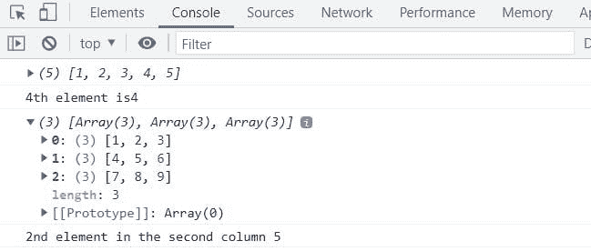

# 简化的数组方法

方法基本上是执行特定任务的预定义块代码或函数。在 JavaScript 中，我们有一组可以在数组中使用的预定义方法。

# `length`

这不是一个方法，而是一个决定数组长度的属性。

```
let array = [4, 2, 3, 1, 5];
console.log(array);
console.log(array.length);
```

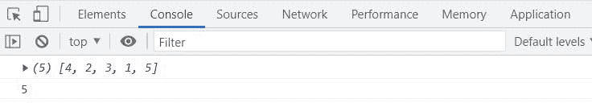

这给了我们数组包含的元素的长度或数量。

# `toString()`

此方法将数组元素转换为字符串。

```
let array = [4, 2, 3, 1, 5];
console.log(array);
console.log(array.toString());
```

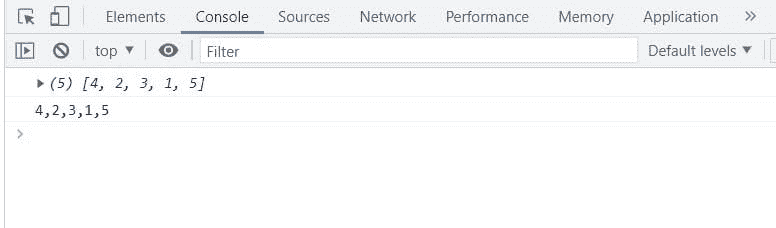

# `join()`

这个方法也像`toString()`一样工作，但是你可以添加一个操作符来使你的字符串看起来有点不同。

```
let array = [4, 2, 3, 1, 5];
console.log(array);
console.log(array.join(" "));
```

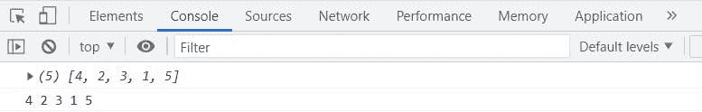

我在这里传递空间`(" ")`,所以我们的元素被空间分开。

# `push(element)`

如果你想动态地添加一个元素到一个数组中，你可以使用这个方法。

```
let array = [4, 2, 3, 1, 5];
console.log(array);
console.log(array.push(6));
console.log(array);
```

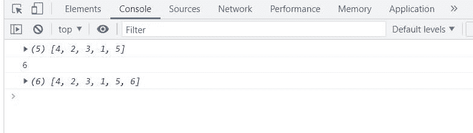

# `pop()`

此方法用于移除数组中的最后一个元素。

```
let array = [4, 2, 3, 1, 5];
console.log(array);
console.log(array.pop());
console.log(array);
```

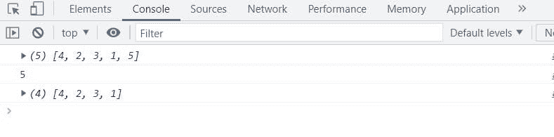

看到`5`从我们的阵中蹦了出来。

# `shift()`

此方法用于移除数组的第一个元素。

```
let array = [4, 2, 3, 1, 5];
console.log(array);
console.log(array.shift());
console.log(array);
```

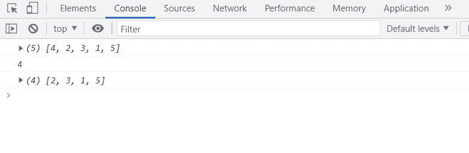

看到`4`被移出我们的数组。

# `unshift()`

此方法用于在开头添加一个元素。

```
let array = [4, 2, 3, 1, 5];
console.log(array);
console.log(array.unshift(7));
console.log(array);
```

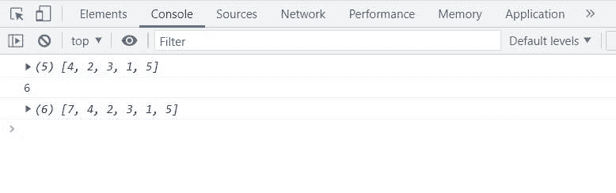

你可以注意到这里的一件事是`unshift()`在我们数组的开头加了 7，另一方面它返回了新数组的长度。

# `concat()`

该方法连接两个数组并返回一个新数组。

```
let array = [4, 2, 3, 1, 5];
let newarr = [3, 2, 1, 4, 5];
console.log(array);
console.log(newarr);
console.log(array.concat(newarr));
console.log(array);
```

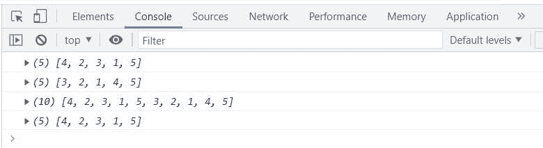

看这返回一个新的长度为`10`的数组。

# `splice()`

此方法在数组的特定位置添加新项，也可以移除元素。

```
let array = ['a', 'b', 'c'];
console.log(array);
console.log(array.splice(2, 1, 'a', 'b'));
console.log(array);
```

看代码拼接方法包含 pw 参数:`splice(startnumber,itemstobedeleted, items to be added)`

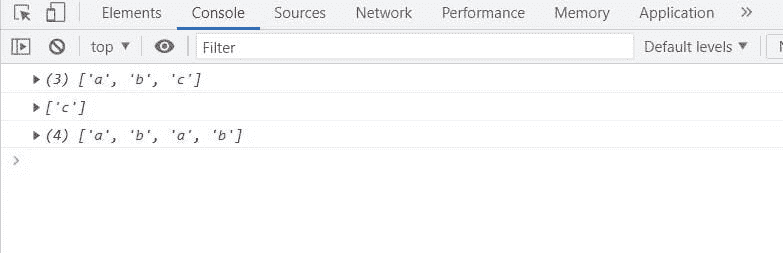

在我们的示例中，从`2`索引中删除 1 个元素，即`c`，并在那里添加`a,b`。

# `slice()`

此方法从数组中移除一部分，并返回一个新的部分，而不影响原来的部分。

```
let array = ['a', 'b', 'c','e','f','g'];
console.log(array);
console.log(array.slice(2, 4));
console.log(array);
```

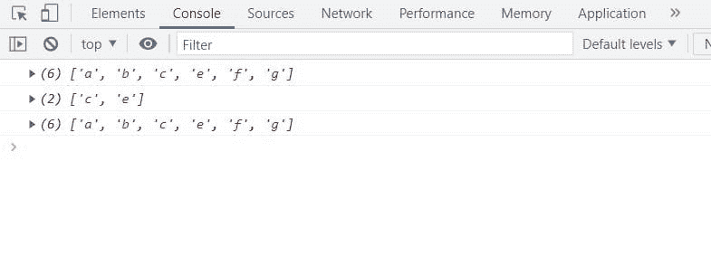

# 数组中的迭代

迭代意味着重复，现在假设你想以有序的方式访问一个数组的一些元素，或者只是想迭代一个数组，有几种方法可以做到这一点，但我会给你看最常用的。

# `forEach()`

它用于从头到尾迭代整个数组。

```
let array = [4, 2, 3, 1, 5];array.forEach(function (element) {
  console.log(element);
});
```

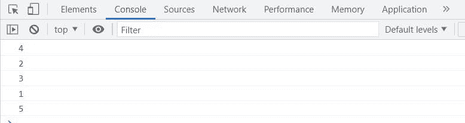

# `map()`

它基本上创建了一个新的数组，并在其中执行特定的任务。

```
let array = [4, 2, 3, 1, 5];let result = array.map((item) => {
  return item * 2;
});
console.log(result);
console.log(array);
```

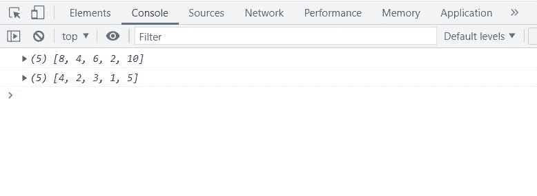

看到一个新数组被创建，而旧数组没有改变。

# `filter()`

这也创建了一个新数组，但只返回通过测试或条件的值。

```
let array = [4, 2, 3, 1, 5];let result = array.filter((item) => {
  return item > 3;
});
console.log(result);
console.log(array);
```

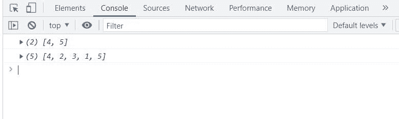

这也创建了一个值大于`3`的新数组。

# 对数组排序

在 JavaScript 中，您可以使用`sort()`方法对数字数组按字母顺序排序，只需在数组中传递一个比较函数，因为排序函数会将每个数组元素视为一个字符串。

```
let array = [4, 2, 3, 1, 5];
let strArray = ["d", "e", "a", "c", "b"];
console.log(array);
console.log(strArray);
console.log("arrays after sorting");
console.log(array.sort((a, b) => a - b));
console.log(strArray.sort());
```

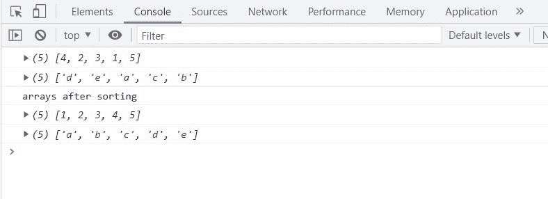

# 结论

所以，伙计们，这都是关于 JavaScript 中的数组和方法，如果你有任何疑问，请随意评论，如果你喜欢，请与你的朋友和同事分享这篇文章。敬请期待下期:)

# 连接

[*领英*](https://www.linkedin.com/in/kumar009/)

[*碎碎念*](https://twitter.com/kumarkalyan_)

*更多内容看* [***说白了。报名参加我们的***](http://plainenglish.io/)***[***免费周报***](http://newsletter.plainenglish.io/) *。在我们的* [***社区不和谐***](https://discord.gg/GtDtUAvyhW) *获得独家获取写作机会和建议。****