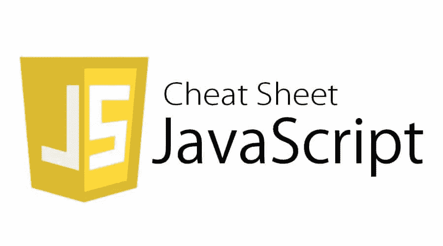
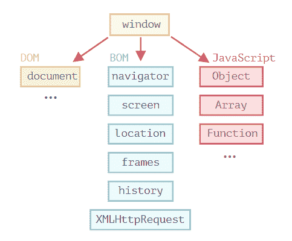

# JavaScript 面试备忘单

> 原文：<https://javascript.plainenglish.io/all-about-javascript-interview-54f1c6c782b8?source=collection_archive---------8----------------------->

## 在即将到来的 JavaScript 面试中，您应该知道这些



今天、明天或下周，如果你有一个 javascript 面试，不要担心，在这里我将分享所有重要的主题、备忘单和文档，为即将到来的面试做好准备。

我会尽量用概念这个最重要的因素使每个话题都简洁，以丰富你的知识。

我们将在本文中涉及的主题。

1.  “这个”
2.  关闭
3.  异步 JavaScript(承诺、异步等待、生成器)
4.  吊装和 TDZ
5.  函数调用和回调
6.  高阶函数

可选和高级主题

1.  数字正射影像图
2.  JS 引擎(主堆栈、微队列、宏队列)
3.  模式
4.  原型

在前进之前，你必须对“这个”有一个适当的理解。

# 1.“这个”是什么？

“this”是 javascript 中的保留关键字。我们不允许使用“this”作为标识符。“this”关键字根据用例改变其行为。

严格模式设置“this”关键字上下文未定义。但是我们有一个替代方法，通过使用 call、apply 和 bind 函数来改变它的上下文。

## 调用、应用和绑定的“这种”行为

调用、应用和绑定函数通常用于改变该关键字的上下文，或者这种行为有助于构建更通用的函数。

```
const name = "Hyy"function foo() {
    'use strict'
    console.log(this.name)
}const context = {
    name: "Ritik"
}foo.call(context)  // Ritik
foo.apply(context) // Ritik
foo()              // Cannot read properties of undefined (reading 'name')
```

call 和 apply 的区别在于，call 期望参数作为单独的参数，而 apply 期望参数作为数组。

bind 改变“this”的上下文，返回一个新函数。它不会立即执行像调用和应用这样的功能。

## 具有功能的“这”行为

使用 Arrow 函数样式的函数定义，其中该关键字指最近的上下文或空的/未定义的。

使用 Function 关键字定义函数，其中该关键字指的是全局上下文或父级。

# 2.关闭

闭包是 JavaScript 中的一个特性，返回的函数可以访问作用域链中的外部函数变量和属性。

```
function foo(){
    var name = "baar"
    return function () {
        console.log(name); 
    }
}
foo()() // function currying
```

# 3.异步 JavaScript

函数与其他一些进程并行运行称为异步。异步 Javascript 利用异步计算。

## 1.承诺

Promises 是一种在 JavaScript 中实现异步计算的方法 promises 也像人类的 promises 用更普通的话来说 promises 意味着它向你保证它将来会返回某个东西要么通过要么失败用更专业的话来说我们可以说要么成功要么被拒绝。

```
var foo = new Promise((resolve, reject) => {
    if(true) {
        resolve
    } else {
        reject
    }
})
```

## 2.异步等待

Async-await 是在 JavaScript 中启用异步计算的另一种方式。Async-await 的工作方式类似于 promises，它们是通过使用 promises 来实现的。我们使用 async-await 只是因为它优雅而简单的语法，它不会产生回调地狱(嵌套承诺)。

## 3.发电机

*   在 JavaScript 中，常规函数是基于运行完成模型执行的。它不能中途暂停，然后从暂停的地方继续。
*   生成器可以中途暂停，然后从暂停的地方继续运行。
*   生成器对象是可迭代的，我们使用 *next* 函数和 *yield* 关键字来存档生成器属性。

# 4.吊装和 TDZ

*   JavaScript 生命的默认行为——将声明的范围提升到顶层，这种性质被称为*提升* (var，function)。

```
console.log(foo);  // undefined (Hoisted)
console.log(bar()) // bar       (Hoisted)
var foo = "foo";
console.log(foo);  // foofunction bar() {
    return "bar";
}
```

*   在声明之前访问和它的不可到达是一种*临时死区*情况(let，const)。

```
console.log(foo) // ReferenceError: Cannot access 'foo' before initialization "TDZ"
console.log(bar) // ReferenceError: Cannot access 'foo' before initialization "TDZ"let foo = "foo";
const bar = "bar";console.log(foo) // foo
console.log(bar) // bar
```

# 5.函数调用和回调

Currying 是将具有多个参数的函数转换成一系列嵌套函数调用的过程。它返回一个新函数，该函数需要内联的下一个参数。

一级函数特性支持回调。回调函数是作为参数传递给另一个函数的函数，它将在外层函数内部被调用以完成某个动作。

```
*function simpleFunction(param1, param2, param3, …..) => function curriedFunction(param1)(param2)(param3)(….)*function calculateVolume(length) {
    return function (breadth) {
        return function (height) {
            return length * breadth * height;
        }
    }
}
console.log(calculateVolume(4)(5)(6)); // 120
```

# 6.高阶函数

高阶函数接受一个函数或一系列函数作为参数，并返回一个函数。返回的函数可能包含一些附加属性或常数，用于进一步计算。

```
//Assign a function to a variable originalFunc
const originalFunc = (num) => { return num + 2 };

//Re-assign the function to a new variable newFunc
const newFunc = originalFunc;

//Access the function's name property
newFunc.name; //'originalFunc'

//Return the function's body as a string
newFunc.toString(); //'(num) => { return num + 2 }'

//Add our own isMathFunction property to the function
newFunc.isMathFunction = true;

//Pass the function as an argument
const functionNameLength = (func) => { return func.name.length }; 
functionNameLength(originalFunc); //12

//Return the function
const returnFunc = () => { return newFunc };
returnFunc(); //[Function: originalFunc]
```

# 可选和高级主题

# 1.数字正射影像图



*   DOM 是 HTML 结构的表示。DOM 使得以编程方式操作网页成为可能。文档对象代表浏览器选项卡上加载的网页。文档对象是全局窗口对象的一部分。由`window.document`或文档访问。在 DOM 中，每个 HTML 标签都是一个对象。嵌套标签是封闭标签的“子标签”。标签内的文本也是一个对象。

***元素***

*   **选择器:**`getElementById``getElementByTagName``querySelector`*`querySelectorAll`；*
*   ***导航:** `children`(元素):`childNodes`(节点)`firstElementChild``lastElementChild``parentElement``previousElementSibling``nextElementSibling`；*
*   ***属性:**`classList``clientHeight``clientWidth``childElementCount`*`setAttribute(attrName, value)``removeAttribute(attrName)``removeAttribute(attrName)`；**

*****操纵*****

**`createElement(‘div’)`、`append`、`prepend`、`el.cloneNode(true)`、`remove()`、`insertBefore(newNode, beforeNode)`、`insertAfter(newNode, afterNode);`**

**[***文档片段***](https://developer.mozilla.org/en-US/docs/Web/API/DocumentFragment) *—* 创建文档的虚拟副本，可以存储多个元素。通过在 DOM 中插入一个*文档片段*，它变成空的，并且只引起一次[重排](https://itnext.io/frontend-interview-cheatsheet-that-helped-me-to-get-offer-on-amazon-and-linkedin-cba9584e33c7#5178)；**

**[***事件委托和冒泡***](https://programmingwithmosh.com/javascript/javascript-event-bubbling-and-event-delegation/)**

*   **当我们发出一个*事件时，* ex。`click`，事件通过`parentElement.`冒泡到`<html>`元素**
*   ***委托*用于提高性能。假设我们有一个结构，我们想要将一个`addEventListener`分配给`.child`，在这种情况下，我们必须将一个事件附加到 3 个元素。相反，我们可以只将事件附加到`.parent`并解析逻辑。**

# **JS 引擎**

**在这里您将获得关于 [JsEngine](https://medium.com/nerd-for-tech/crucial-facts-about-javascript-engine-7b264c17f36d) 的所有详细信息。**

# **模式**

1.  **用方法列表扩展一个对象的功能。**
2.  ****工厂 *—一个*** 类，可以创建一个或多个不同的对象(如果你想在单元测试中生成不同的模拟数据，这很有用)。**
3.  ****Singleton-C**class，其中您可以直接调用方法，而无需创建对象。**
4.  ****门面 *—*** 抽象更复杂的逻辑，包装在类中。例如，位于组件和 API 层之间的服务。**
5.  *****MVC，MVVM —*** [**模型视图控制器**](https://en.wikipedia.org/wiki/Model%E2%80%93view%E2%80%93controller) 和 [**模型视图模型**](https://en.wikipedia.org/wiki/Model%E2%80%93view%E2%80%93viewmodel) **。****

# **原型**

**默认情况下，原型是在 JavaScript 中与每个函数和对象相关联的对象，其中函数的 prototype 属性是可访问和可修改的，而对象的 prototype 属性(aka 属性)是不可见的。**

**原型对象是一种特殊类型的可枚举对象，附加的属性可以附加到该对象上，这些属性将在其构造函数的所有实例中共享。**

**它把我们带到了最后！非常感谢您通读这篇文章——如果这篇文章在某种意义上有所帮助，我将感谢一位追随者帮助我实现我的目标:)**

**请随意访问我的网站，如果您有任何与 JS/DevOps 相关的疑问，请随意与我联系。**

**[https://ritikhopra . netlify . app](https://ritikchopra.netlify.app/)**

**祝你好运！
Ritik Chopra😘**

***更内容于*[](https://plainenglish.io/)**。为我们报名* [***免费周报***](http://newsletter.plainenglish.io/) *。在* [***推特***](https://twitter.com/inPlainEngHQ) *和* [***领英***](https://www.linkedin.com/company/inplainenglish/) *上跟随我们。加入我们的* [***社群不和***](https://discord.gg/GtDtUAvyhW) *。****