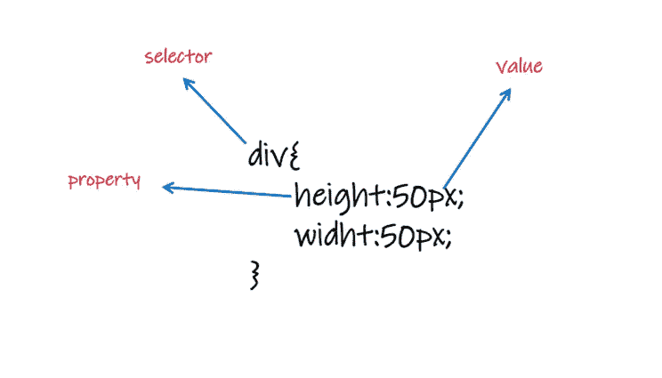

# 所有你需要知道的关于 CSS 的基础知识。

> 原文：<https://javascript.plainenglish.io/all-css-knowledge-you-need-to-know-to-land-your-firs-job-as-web-developer-part1-dec847247777?source=collection_archive---------8----------------------->

## 学习 CSS 来获得你的第一份 web 开发工作。

CSS 表示层叠样式表，是一种样式表语言，用来描述用 HTML 编写的文档的表现形式。CSS 允许开发者将内容从表现中分离出来，以及网站在颜色、间距、字体、布局等方面的外观和感觉。

让我给你看看没有 CSS 的网站是什么样子。

**CSS 语法**:正如我们之前提到的，CSS 处理网站的外观和感觉，所以我们需要访问 HTML 元素，并给它们定义指定元素外观的值，CSS 引擎计算哪个声明适用于页面的每个元素，以适当布局。

**CSS 选择器**:当你想要设计 HTML 元素的样式时，你需要访问它们，不同的访问 HTML 元素的方式可以分为:

1.  **CSS 元素选择器:**根据名称选择 HTML 元素。

**CSS element selector**

2. **CSS 类选择器:**类选择器选择具有特定类属性的 HTML 元素。

**3。ID 选择器**:CSS ID 选择器根据元素的 ID 值匹配元素。

**CSS ID selector**

**4。CSS 通用选择器:**当你想选择所有的 HTML 元素时，一个通用选择器就能为你工作。

**CSS universal selector**

所有的选择器都存在于 CSS 中。

 [## CSS 选择器参考

### W3Schools 提供所有主要网络语言的免费在线教程、参考资料和练习。覆盖…

www.w3schools.com](https://www.w3schools.com/cssref/css_selectors.asp) 

到目前为止，我们了解了什么是 CSS，什么是常用的选择器，但是我们如何将 CSS 插入到我们的网页中。对于添加 CSS，我们有三种方法来插入 CSS

**1。外部 CSS**

**2。内部 CSS**

**3 内联 CSS**

**外部 CSS:** 外部样式表一般在你想对多个页面进行修改的时候使用，必须用**保存。css 扩展。**

**external CSS**

**内部 CSS:** 带有内部样式表的 HTML 文件在它们的 **head** 部分包含一组规则。CSS 规则被包裹在 **<样式>** 标签中。

内联 CSS: 内联样式直接应用于 HTML 代码中的元素。它们使用**样式**属性，后跟常规 CSS 属性。

级联中哪个选择器胜出取决于:

1.  **特异性:**它表示您的选择器有多具体，请点击以下链接查看特异性计算器:

 [## 特异性计算器

### 特异性计算器不是 CSS 验证器。如果您输入无效的选择器，它将返回不正确的结果。对于…

特异性. keegan.st](https://specificity.keegan.st/) 

**2。重要性:**该！CSS 中的重要规则用于增加属性/值的重要性。

**3。源代码顺序:**如果 HTML 页面引用了两个 CSS 页面，那么它将按照顺序从源代码中选择样式。

**CSS 属性:**CSS 属性定义了如何样式化目标 HTML 元素，这里我列出了一些最常用的基本 CSS 属性。

CSS 盒子模型:**CSS 盒子模型是一个包装每个 HTML 元素的盒子，它由边距、填充和里面的内容组成。**

****

****CSS Box-model****

*   ****内容** —显示文本和图像的框的内容**
*   ****填充** —清除内容周围的区域。填充是透明的**
*   ****边框** —环绕填充和内容的边框**
*   ****边距** —清除边界外的区域。边距是透明的**

> **我是一名自由职业的全栈 web 开发人员和技术作家，请随时联系我🤓**

**在 LinkedIn 上关注我:**

** [## 阿里·穆斯塔法-网络开发者-自由职业者| LinkedIn

### 查看阿里穆斯塔法在全球最大的职业社区 LinkedIn 上的个人资料。阿里有 4 个工作列在他们的…

www.linkedin.com](https://www.linkedin.com/in/ali-mustafa-195a321a0/) 

在 GitHub 上关注我:

 [## Ali11Mustafa -概述

### 热情，自我驱动，注重细节，有强烈的野心和动力按时开发软件解决方案

github.com](https://github.com/Ali11Mustafa) 

*更多内容看* [***说白了。报名参加我们的***](https://plainenglish.io/) **[***免费每周简讯***](http://newsletter.plainenglish.io/) *。关注我们* [***推特***](https://twitter.com/inPlainEngHQ) *和*[***LinkedIn***](https://www.linkedin.com/company/inplainenglish/)*。查看我们的* [***社区不和谐***](https://discord.gg/GtDtUAvyhW) *加入我们的* [***人才集体***](https://inplainenglish.pallet.com/talent/welcome) *。*****