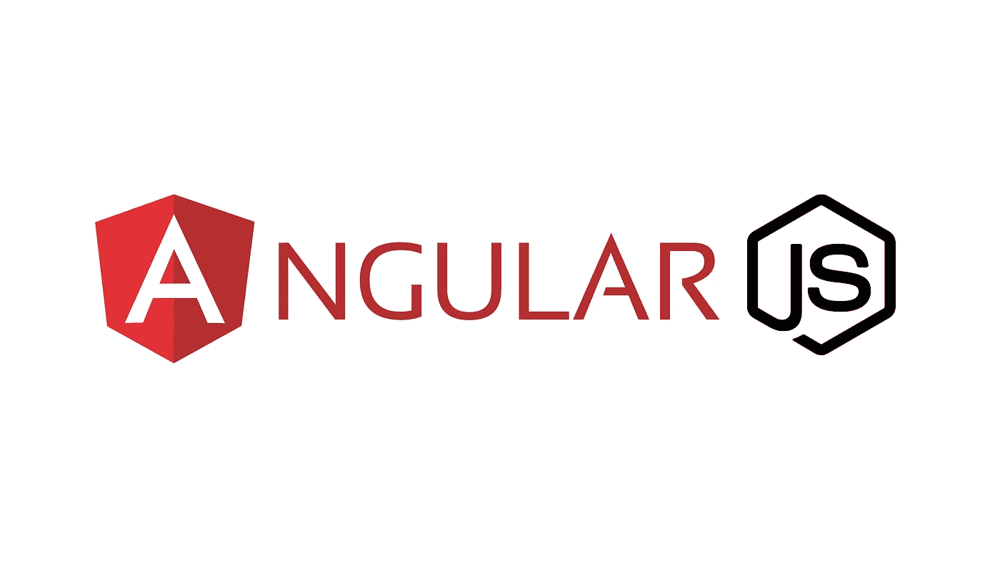

# 关于 AngularJS 你需要知道的一切:利弊

> 原文：<https://javascript.plainenglish.io/all-you-need-to-know-about-angularjs-the-pros-and-cons-e98950766227?source=collection_archive---------11----------------------->

**什么是 Angular JS？** Angular JS 是 Angular 框架的第一个版本。它是一个由 Google 管理的开源框架。这个框架在用单个页面运行移动应用程序中起着重要的作用，并且包含一个巨大的贡献者社区。

# **棱角分明的框架的优点**

1.  **双向数据绑定**

被称为双向数据绑定，整个过程确保所做的更改可以更快地显示在模型中。在这种模式下，以后对视图或演示所做的任何更改都会立即传达给模型。用 Angular JS 直接进行数据绑定；这背后的主要原因是——开发人员可以更快地构建模板。

**2。服务器性能**

Angular JS 开发的另一个好处是减轻了 CPU 服务器的负担，因为它支持它的进程。这里的服务器很突出，因为它执行得非常出色，有助于控制或减少流量。您可能想知道它是如何减少流量的——这是因为它的服务器的静态文件对 API 关键调用的响应速度很快。当流量减少且只关注静态文件时，服务器性能会自动提高。

**3。Swift 应用原型**

快速原型的存在只是因为有 Angular JS 这样的框架。人们可以通过编写更少的代码来减少工作量；人们可以开发功能强大的移动应用程序原型。在开发过程中会发生变化，但是当您获得支持整个操作的持续反馈时，这些变化就不那么令人讨厌了。原型帮助开发人员初始化功能，获得反馈，并在一定的时间范围内做出重大的改变。

# **角形框架的缺点**

1.  **JavaScript 支持强制**

使用 AngularJS 需要有 JavaScript 访问权限。然而，对于拥有最新计算机或笔记本电脑的用户来说，情况并非如此。如果有很多人使用这个网络，你的 AngularJS 可能不如其他流行的框架有价值。请记住，这不是基于 HTML 的 web 的情况。

**2。没有使用 MVC 的经验**

许多设计师更喜欢使用传统的开发方法。有了 AngularJS，你就不能用传统的方法工作了。如果你没有这个习惯，那么练习弯角会很费时间。在这种情况下，明智的决定是雇佣一家专业的 AngularJS 开发公司来交付你的项目。

**3。困难特性**

AngularJS 的许多特性，比如依赖注入，对于传统开发者来说可能是个问题。我们经常使用传统开发人员这个术语，因为只有有经验的开发人员从事主要项目；许多组织中的初级开发人员无法处理需要专业知识的项目。所以，对于 AngularJS，你要么花时间彻底理解它，然后开始你的工作。或者你可以雇佣一个有经验的 AngularJS 开发者。

**总结**

我们希望到目前为止，您对 AngularJS 的好处有了更好的了解，这些信息可以帮助您做出坚定的决定。如果你还有疑问，联系我；我们经验丰富的 AngularJS 开发商可以解决您的疑问。如果你想知道我们还提供什么服务，你可以访问我们的官方网站。

*更多内容看* [***说白了。***](https://plainenglish.io/)

*报名参加我们的* [***免费每周简讯***](http://newsletter.plainenglish.io/) *。关注我们关于* [***推特***](https://twitter.com/inPlainEngHQ) ，[***LinkedIn***](https://www.linkedin.com/company/inplainenglish/)*，*[***YouTube***](https://www.youtube.com/channel/UCtipWUghju290NWcn8jhyAw)*，以及* [***不和***](https://discord.gg/GtDtUAvyhW) ***。***

***对缩放您的软件启动感兴趣*** *？检查出* [***电路***](https://circuit.ooo?utm=publication-post-cta) *。*