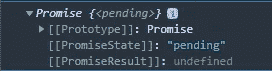
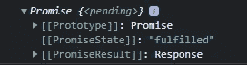
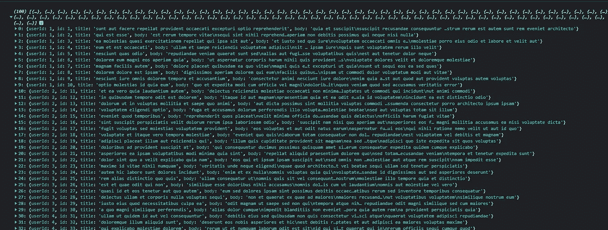
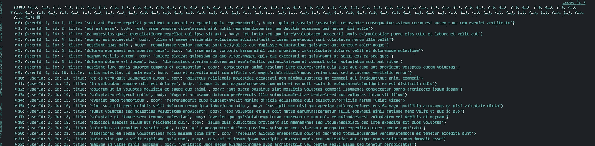

# 关于 JavaScript 承诺，你需要知道的是

> 原文：<https://javascript.plainenglish.io/all-you-need-to-know-about-javascript-promises-e073d1d1bb7b?source=collection_archive---------10----------------------->

## JavaScript 中的承诺是什么，它们的属性，以及解决它们的方法？

Photo by [Alfons Morales](https://unsplash.com/@alfonsmc10?utm_source=medium&utm_medium=referral) on [Unsplash](https://unsplash.com?utm_source=medium&utm_medium=referral)

JavaScript 承诺是我们比看起来更经常遇到的事情之一。

您在 web 应用程序中进行了多少次 API 调用？所有那些你遇到承诺的时候。在您的 API 调用和从该 API 调用收到的数据之间的时间里，JavaScript 等待该 API 返回数据。那个 API 调用向我们保证，要么它将返回数据，要么它将返回一个错误消息。

以这个 API 调用为例，想象 JavaScript 承诺为一个具有 3 种状态的对象:

1.  Pending:这是当您对后端服务器发出一个 fetch 调用，JavaScript 正在等待服务器的响应时的状态。
2.  已实现:这是 API 返回所需数据的状态。
3.  拒绝:在这种状态下，您的 API 返回了您没有预料到的数据，或者您遇到了后端错误。

所以让我们试着模拟和上面解释的一样。

首先，我们来看看承诺是什么样的:

The output of the above code

在这里，我们可以清楚地看到这个承诺有 3 个属性:

1.  第一个是原型。
2.  第二个属性是 PromiseState，它表明该承诺仍在等待完成。
3.  第三个是未定义的承诺结果，只有当我们的承诺被履行或拒绝时才会被设定。

在上面的 promise 声明中，我们可以看到我们在 promise 中传递了一个回调函数作为参数。我们想到的第一个问题是这个函数有什么用？因此，传递的函数对于解析或拒绝承诺是有用的。用一个例子会清楚得多。

例如

这里我们可以看到，我们在第 1 行定义了一个承诺，并且在声明中传递了一个带有两个参数的箭头函数。resolve 和 reject 这两个参数是回调函数，使用参数来执行。让我们详细地看看它们。

## 解决:

这个回调函数有一种特殊的能力，可以改变要履行的承诺的状态，并设置它作为结果接受的值。

## 拒绝:

这个回调函数有一种特殊的能力，可以将承诺的状态更改为 rejected，并设置它作为结果接受的值。但是当您想要访问剔除结果时，您必须使用 catch 块。

> 重要提示:我们只能拒绝或解决一次承诺。将执行第一条要解决或拒绝的语句，其他语句将被丢弃。

有两种方法可以访问承诺数据:

1.  然后/接住
2.  异步等待

让我们举一个调用 API 的函数的例子。(API 调用返回一个承诺。)

回应:

Response of the above function

正如我们所看到的，上面的函数返回了一个承诺，它的状态是履行。现在问题来了，我们如何访问 API 返回的数据。有两种方法可以解决这个问题。让我们逐一看看这两种方法。

方法一:(然后/接住)

Response of the above program

方法 2:(异步/等待)

Response of the above code

以上两种方法可以应用于任何从 API 调用返回承诺的函数。

在这篇博客中，我们学习了承诺，它们的特性，以及解决它们的方法。我希望说明是清楚的，如果在理解这篇文章的内容方面有任何困难，评论区总是开放供进一步讨论。

如果你明白我在这里说的任何话，请鼓掌回应并跟我来，因为它帮助我保持动力，并从我的时间表中抽出时间来写这些文章。这不会花你任何钱，但会帮我很多忙

*高拉夫·夏尔马是一个狂热的读者和热情的旅行者。他试图通过传播他的知识和他的生活经历来过一个更有意义和目标的生活！跟随他踏上平衡数字生活和现实生活的新旅程。他住在印度的北阿坎德邦。他在 Instagram 上的*[*@高尔夫。_.塞拉*](https://www.instagram.com/golf._.sierra/) *。*

*更多内容看* [***说白了。报名参加我们的***](https://plainenglish.io/) **[***免费周报***](http://newsletter.plainenglish.io/) *。关注我们关于* [***推特***](https://twitter.com/inPlainEngHQ) ，[***LinkedIn***](https://www.linkedin.com/company/inplainenglish/)*，*[***YouTube***](https://www.youtube.com/channel/UCtipWUghju290NWcn8jhyAw)*，以及* [***不和***](https://discord.gg/GtDtUAvyhW) *。***