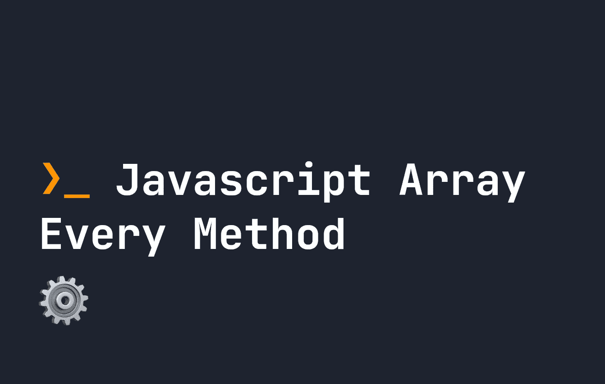

# 关于 JavaScript 中的 every()数组方法，您只需要知道

> 原文：<https://javascript.plainenglish.io/all-you-need-to-know-about-the-every-array-method-in-javascript-b416b9b02347?source=collection_archive---------6----------------------->

## JavaScript 中的 every()方法允许我们对数组的每个成员进行逻辑测试。让我们看看它是如何工作的。



有时对于数组，我们希望测试每个元素的特定条件。虽然使用一个`if`语句可以很容易地测试各个条件，但是使用多个数组元素会变得有点棘手。因此，JavaScript 在数组上提供了一个名为`every`的方法，该方法将测试特定测试的每个元素。如果全部通过测试，那么整个`every`方法将通过`true`。如果一个或多个测试失败，那么整个`every`方法将返回`false`。

# 为测试检查数组的每个元素

假设我们有一个数组，我们想测试是否每个数字都大于 15。这是使用`every`的绝佳地点。让我们来看看。

```
let arr = [ 25, 35, 45, 55, 65 ];
let check = arr.every((el, index, array) => {
    return el > 15
});
console.log(check); // true
```

`every`采用类似于`(el, index, array) => ...`形式的函数。

*   `el`是被`every`迭代的当前元素。
*   `index`是数组正在迭代的当前元素的索引。
*   `array`是被迭代的完整数组。这里应该是`[ 25, 35, 45, 55, 65 ]`。

因为如果在一行中没有`return`语句，箭头函数将返回 true，所以上面的代码也可以简化为:

```
let arr = [ 25, 35, 45, 55, 65 ];
let check = arr.every((el, index, array) => el > 15);
console.log(check); // true
```

同样，`every`方法可以采用另一种形式，接受回调函数的名称，以及`this`的自定义值。这意味着您可以创建一个函数，然后基于函数本身中的自定义`this`来准备它的内容。例如，下面我将`{value: 15}`传递到`this`，允许我们在调用`every`时更改这个值:

```
let callbackFn = function(el) {
    if(this.value !== undefined) {
        return el > this.value
    }
    return false;
}
let arr = [ 25, 35, 45, 55, 65 ];
let check = arr.every(callbackFn, { value: 15 }); // Returns true
```

# 用 every 方法修改数组

与其他数组方法非常相似，Javascript 允许在调用数组的方法中修改数组。例如，我们可以修改数组的每个元素，然后对其进行检查。由于`every`本质上是一种循环，每个元素都是按顺序循环的:

```
let arr = [ 25, 35, 45, 55, 65 ];
let check = arr.every((el, index, array) => {
    arr[index] -= 100;
    return el > 5
});
// This is true, since we subtracted 100 from each element before the check
console.log(check); // true
```

我们甚至可以在`every`循环中删除数组中的元素:

```
let arr = [ 25, 35, 45, 55, 65 ];
let check = arr.every((el, index, array) => {
    arr.pop();
    return el > 15;
});
console.log(arr); // returns [ 25, 35 ]
```

Javascript 甚至允许您在`every`中向数组添加元素。由于`every`对数组中的每个元素只触发一次，因此简单地将元素推送到原始数组不会导致无限循环:

```
let arr = [ 25, 35, 45, 55, 65 ];
let check = arr.every((el, index, array) => {
    arr.push(100);
    return el > 15;
});
// This is true, since we subtracted 100 from each element before the check
console.log(arr); // returns [25, 35, 45, 55, 65, 100, 100, 100, 100, 100]
console.log(check); // returns true
```

# 结论

`every`方法是一种在整个阵列上进行逻辑测试的内置方法。在大型阵列上应该小心，因为这可能会导致性能问题。但是，在大多数情况下，它是一个非常有用的工具，可以添加到您的阵列库中。还有许多其他用例`every`非常有用。例如，您还可以将`every`用于其他用例，比如[检查一个数组是否是另一个数组](https://fjolt.com/article/javascript-check-if-array-is-subset)的子集。

*更多内容看* [***说白了。报名参加我们的***](https://plainenglish.io/) **[***免费周报***](http://newsletter.plainenglish.io/) *。关注我们关于* [***推特***](https://twitter.com/inPlainEngHQ) ，[***LinkedIn***](https://www.linkedin.com/company/inplainenglish/)*，*[***YouTube***](https://www.youtube.com/channel/UCtipWUghju290NWcn8jhyAw)*，* [***不和***](https://discord.gg/GtDtUAvyhW) *。对增长黑客感兴趣？检查* [***电路***](https://circuit.ooo/) *。***