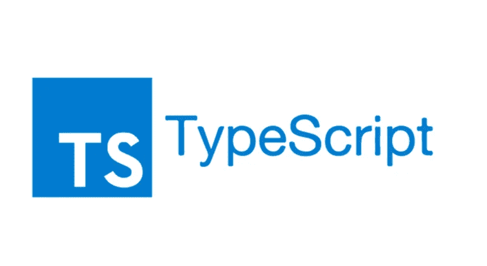

# 关于用于 Web 开发的 TypeScript，您所需要知道的

> 原文：<https://javascript.plainenglish.io/all-you-need-to-know-about-typescript-for-web-development-444b76e57418?source=collection_archive---------6----------------------->

## TypeScript 是一个强大的 web 开发工具，可以让您的生活变得更加轻松。

[**Created By Author in Canva**](http://canva.com)

它有丰富的功能，而且很容易学习。在这本全面的指南中，您将了解到关于 web 开发的 TypeScript 的所有知识。

# 什么是 TypeScript？

TypeScript 是一种用于开发 web 应用程序的语言。它提供了描述应用程序功能的声明性语法，使得编写在不同类型的设备和浏览器上工作的代码变得容易。

> TypeScript 还附带了许多内置特性，使开发变得更快更容易。

## **你需要开始用 TypeScript 开发**

要开始使用 TypeScript，首先需要安装适当的工具。这些工具包括 Node.js、NPM 和 ts-node。

> **Node.js 是开发 web 应用的必备工具，需要将函数类型转换为不同类型的对象；npm 帮助您将 NPM 存储中的依赖项安装到您的项目目录中，而 ts-node 提供了一个可执行文件，可用于在不需要计算机或互联网连接的环境中运行 TypeScript 命令。**

您也可以使用 TypeScript CLI 开始开发。TypeScript CLI 是一组工具，使您能够以自己喜欢的编程语言运行类型安全代码。

您可以使用它来安装和配置 TypeScript，以及编写和测试代码。

## 以下步骤将帮助您开始使用 TypeScript 进行开发:

> **首先，你需要安装 Node.js 和 NPM。**
> 
> **接下来，您需要使用 ts-node 可执行文件创建一个新项目。**
> 
> **接下来，你需要输入以下命令开始开发:ts config—global { word }—define-project my project—ignore-errors = true my module**
> 
> **—global 标志允许 TypeScript 从项目的根目录加载全局模块。**

— define-project 标志设置您正在处理的项目的名称，而— ignore-errors=true 选项确保在开发过程中不会报告错误。

# TypeScript 的不同组成部分是什么

TypeScript 是一种使您能够编写可在 web 浏览器上运行的代码的语言。

它使用 JavaScript 作为基础，但是它提供了一组广泛的类型安全函数和类，使得编写 web 应用程序更加容易。

## **功能类型**

函数是 TypeScript 的核心。它们用于定义和调用对象上的方法，是 TypeScript 最重要的特性之一。

> 函数可以用任何编程语言编写，但是 TypeScript 更喜欢 JavaScript，因为它更容易阅读和使用。

# 如何使用 TypeScript 进行开发

TypeScript 是一种轻量级的高级脚本语言，它使得开发 web 应用程序比以往任何时候都更容易。您可以使用它来编写程序，或者编辑和构建其他 web 应用程序使用的程序。

> TypeScript 还使调试和检查您的程序变得容易，这使它成为 web 开发的最佳选择。

## **打字稿编辑程序**

要使用 TypeScript 编辑程序，首先需要安装 TypeScript 编译器和编辑器。然后，您可以使用 TypeScript 命令行工具来创建和编辑程序。

## **打字稿构建程序**

一旦安装了 TypeScript 编译器和编辑器，就可以使用 type-script 命令行工具来构建程序。

类型脚本工具提供了许多常见的编程任务，如创建文件和文件夹、运行测试以及构建应用程序。

# 结论

用 TypeScript 开发程序很有趣。你可以使用内置类型来编写程序和编辑程序。

同样，您可以使用 TypeScript 函数构建程序。

最后，对于想要创建高质量程序的开发人员来说，TypeScript 是一个非常好的工具。

 [## 通过我的推荐链接加入 Medium

### 阅读 Mircea Iosif(以及媒体上成千上万的其他作家)的每一个故事。您的会员费直接支持…

medium.com](https://medium.com/@mirceaiosif/membership) 

*更多内容看* [***说白了就是***](https://plainenglish.io/) *。报名参加我们的* [***免费周报***](http://newsletter.plainenglish.io/) *。关注我们关于* [***推特***](https://twitter.com/inPlainEngHQ) ， [***领英***](https://www.linkedin.com/company/inplainenglish/) *，*[***YouTube***](https://www.youtube.com/channel/UCtipWUghju290NWcn8jhyAw)*，以及* [***不和***](https://discord.gg/GtDtUAvyhW) *。对增长黑客感兴趣？检查* [***电路***](https://circuit.ooo/) *。*