# 关于设计标志，你应该知道的是

> 原文：<https://javascript.plainenglish.io/all-you-should-know-about-design-tokens-612ed3a83b64?source=collection_archive---------12----------------------->

## 从现在到不久的将来，设计符号的概述

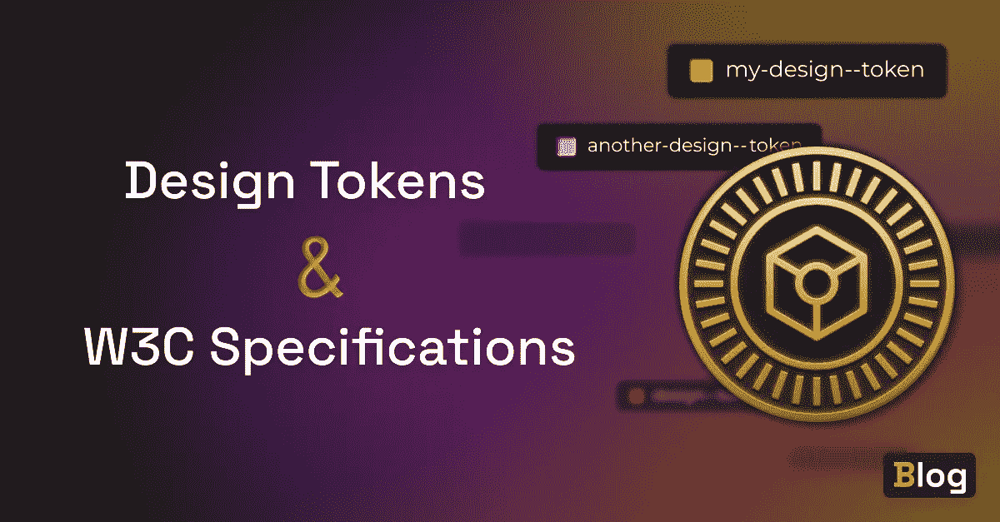

在本文中，我们将讨论设计令牌及其用法。我们将详述不同的工具如何与它们一起工作。最后，我们将讨论 [W3C 设计标志规范草案](https://design-tokens.github.io/community-group/format/)，以及这将如何改变设计标志的前景。

# 一切开始的地方

这些年来，数字产品的设计和开发方式发生了巨大的变化。不久以前，设计师会花几天时间来制作网站或界面的完美视觉表现。然后，开发人员将花费相同的时间(如果不是更多的话)根据他们在设计师提供的图像文件中看到的内容将其分解成代码。

很快，数字产品行业意识到这不是一种有效的工作方式，设计工具开始更好地代表开发思维方式中的设计。

这些新的工具和工作方式为组件库和设计系统腾出了空间。我们现在正处于这一演变的下一步:设计令牌。

# 什么是设计符号？

在设计系统中，屏幕上的单个项目——比如文本输入——变成了组件:在一个地方构建并在产品的不同部分引用的可重用元素。

同样，最基本的品牌定义，如颜色、排版、间距等。正在变成设计的标志。

这些设计决策是“硬编码”的值，但通过设计令牌，它们被转换成一个字符串，在一个地方注册——就像一个 JSON 文件——并在界面的任何地方重用，从而为不断发展的产品提供额外的一致性。

设计令牌方法的优点是能够一般地存储设计决策。这些信息可以被转换成任何技术或平台。

# 设计令牌的使用

我们利用设计符号来描述视觉风格。最常见的例子是颜色、版式、半径、间距、大小和阴影。

然而，每个类别的细分开始增加。例如，字体设计只用于定义几个设计决策，如字体系列和默认字体大小。

如今，将排版的每个方面定义为一个符号是有意义的:行高、字体粗细、字母间距、文本大小写和文本装饰。
此外，我们可以定义“设计决策”的抽象层也在扩展。

一个基本的例子就是扩展我们的主色，比如`color-primary`。
我们还可以描述一个更特定于组件的令牌，比如`button-background-color`。

# W3C 设计令牌规范草案

最近，一个新的 W3C 社区团体出现了，专门围绕设计令牌进行标准化:[设计令牌社区团体](https://www.w3.org/groups/cg/design-tokens)，[这是他们的主页](https://www.w3.org/community/design-tokens/)。

Design Tokens 社区组的目标是提供标准，产品和设计工具可以依赖这些标准来大规模共享设计系统的风格部分。

在这里，我们将重点放在设计工具部分。

如果你想获得更多关于设计令牌规格的细节，请[查看规格](https://design-tokens.github.io/community-group/format/)。鉴于它被迭代的速度，这个博客将很快过时。

设计令牌的标准格式之所以重要，是因为有许多工具与设计令牌相关:

*   创建设计标志
*   维护和存储设计令牌
*   例如，在像 Figma 这样的设计工具中使用代币
*   将令牌导出到不同的平台，以便编码的组件可以使用它们。想想 CSS 变量，iOS/Android 令牌等等。

为了让这些工具很好地协同工作，设计令牌的标准化格式是必要的。

现在的情况是**随着时间的推移，变压器/转换器需要编写和维护许多稍微不同的格式**。

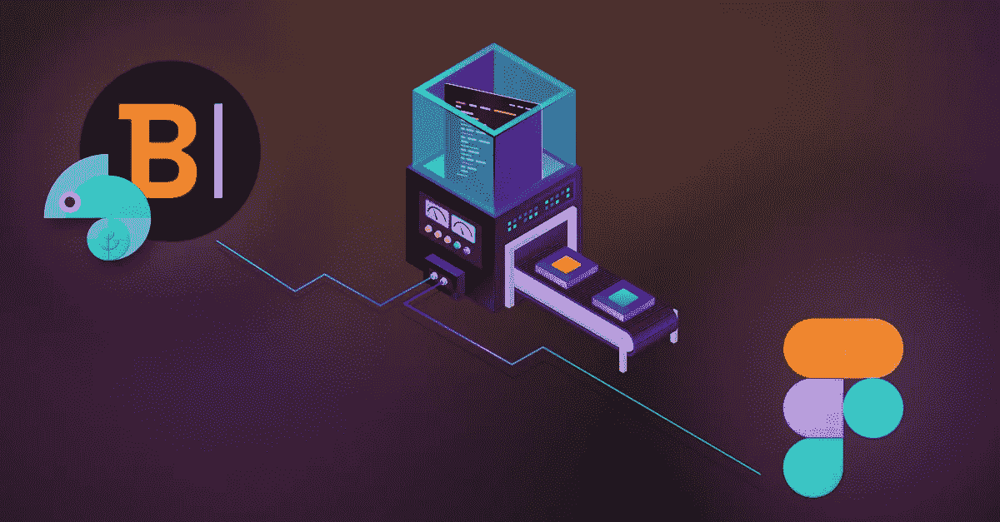

这种转换器的一个例子是从[样式字典](https://amzn.github.io/style-dictionary/#/)到 [Figma 令牌插件](https://www.figma.com/community/plugin/843461159747178978/Figma-Tokens)，为此我们编写了一个转换器，本文将对其进行概述。
这个 Figma 令牌插件的维护者甚至编写了一个转换器[，本质上是做相反的操作](https://www.npmjs.com/package/token-transformer)。

总的来说，草案中指定的设计符号如下所示:

或者一个更现实的例子(没有元数据，因为我们没有):

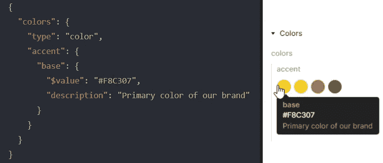

在这里，您可以看到标记可以嵌套在组中，并且一个类型可以应用于一个组和一个单独的标记。

该规范仍在进行中，还有许多事情需要详细说明，或者最佳实践仍然需要出现。

因此，工具要达到这个规范还有一段路要走，但是他们已经取得了进展。

例如样式字典和 Figma 令牌插件。

下面是一些没有具体说明或者仍然缺乏最佳实践的例子。

我们推荐阅读设计系统中的[命名标记。这是一个关于如何命名和编写令牌的很好的资源。它的许多结论非常类似于我们如何在多次反复的挣扎之后创作令牌。](https://medium.com/eightshapes-llc/naming-tokens-in-design-systems-9e86c7444676)

# 撰写令牌

让我们想象一下，我们有一个标记化的输入组件。

`input.tokens.json`:

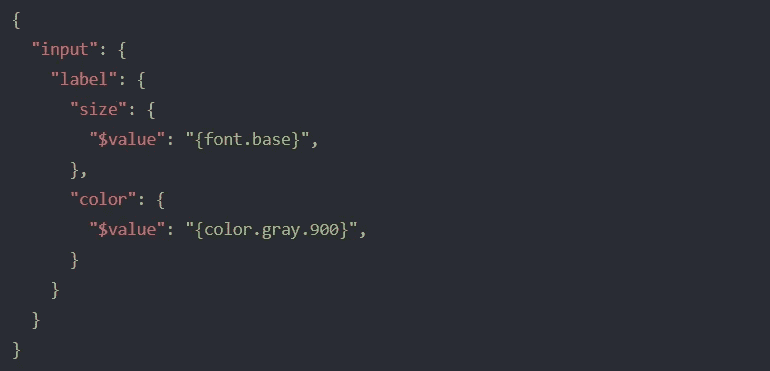

上部属性键是组件的名称，其子项是组件的不同部分:

*   标签
*   输入元素本身
*   帮助文本
*   反馈信息

然而，事情很快变得更加复杂，因为您可能有不同的输入变量。对于输入，这可能没有太大的意义。但是，对于像按钮这样的组件，可以使用 CTA、primary、outline、secondary 等变体。，都挺常见的。你如何着手在设计符号中对它们进行分组？

更复杂的是，还有悬停、禁用、聚焦等状态。

按以下顺序分组可能有意义:变体->状态->零件->等等。，但这不是一个微不足道的选择；将多维变量矩阵表示到 JSON 对象中可能很棘手。

# 象征性明确性

继续我们的令牌化输入组件的例子，让我们想象一个名为 input-amount 的扩展，它有一个固定的宽度`200px`。

`input-amount.tokens.json`:

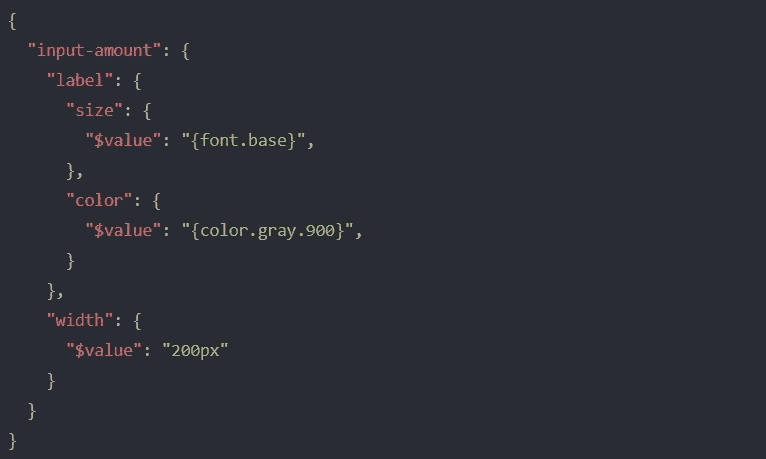

这里要问的问题是:“如果标签组与常规输入令牌中的标签组相同，我们为什么要复制它？”。

当您的令牌被另一个现有的令牌组覆盖时，您对它们有多明确？

本质上有一个范围，一方面，你有最小的，另一方面，你有明确的。

Minimal (left) to Explicit (right)

如果选择显式，就会得到上面的标记片段。

如果你用最简单的方法，你会得到这个:

`input-amount.tokens.json`:

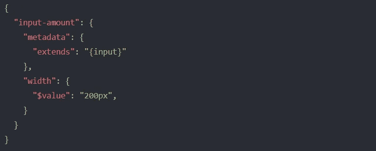

这里的元数据只是一种想法:也许它有助于工具理解一个令牌组正在扩展另一个令牌组。

使用最小化方法的好处是减少了对重复令牌的维护，减少了重复的次数。

缺点是，就 CSS 中的令牌消费而言，它可能需要额外的知识:

`input-amount.css`:

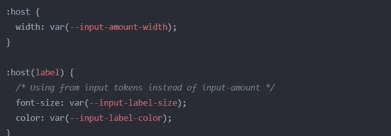

对于实现编码组件的开发人员来说，要求他们在某些领域使用来自基本组件的标记，而在其他领域使用来自扩展组件的标记可能是违反直觉的。

另一个缺点是，如果设计者突然决定`input-amount`现在在标签颜色方面不同于常规数量，它需要在 CSS 中进行更改以激活该设计更改。

`input-amount.css`:

在上面的例子中，我们使用了显式令牌，这意味着我们在 JSON 中得到许多重复的部分，但至少它使 CSS 对于未来的变化更加稳定。

设计师在未来可以改变的参数是有限的，但数量很大，这需要 CSS 的改变。我们是否要参数化每一个可能的 CSS 属性，以向前兼容设计中的每一个潜在变化？

对我们来说，答案是否定的，因为这将产生巨大的 CSS 膨胀，对于组件的每个变化都呈指数增长:

在这个例子中，它只是两个变体，我们甚至没有涵盖几乎所有相关的 CSS 属性，所以你可能会看到这是如何迅速升级的。

因此，我们个人倾向于使用最少的令牌化方法，只在需要的地方覆盖令牌。有了一些元数据，它应该有助于工具理解继承。这是另一个有用的例子:

`button.tokens.json`:

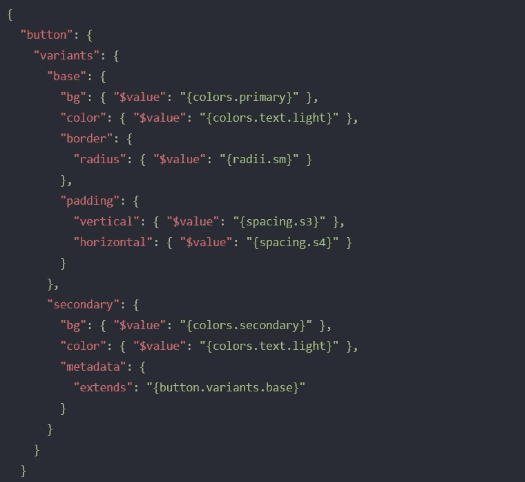

**注意:这个元数据扩展属性只是一个想法。在写这篇文章的时候，它还不是规范的一部分。**

# 主题

在设计符号中处理主题有一个很大的问题。我们将讨论一些我们见过的选项。

首先，主题化到底是什么？对此的第一反应可能是暗/亮主题。然而，答案可以采取更广泛的范围:

*   对于视力受损的用户，高对比度模式怎么样？
*   你品牌的日晒版本怎么样？改变默认主题的亮度怎么样？
*   使用不同调色板的完全自定义的主题怎么样？
*   增加页面空间或字体大小的主题怎么样？

一个主题的伞下有很多东西，远不止暗/亮主题。这完全取决于应用程序的作者希望在多大程度上迎合用户的定制需求。

## 每个主题都有单独的令牌文件

一种分离主题的方法是使用完全相同的令牌结构，但是将它们分成不同的文件夹。

`light/buttons.tokens.json`:

`dark/buttons.tokens.json`:

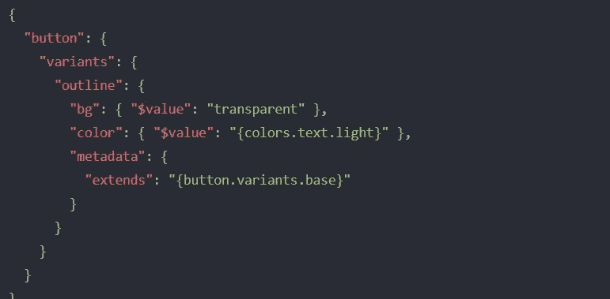

然后当运行 style-dictionary 之类的东西时，可以运行两个实例，每个主题一个。

这是一个清晰的分离，但缺点是更多重复的令牌代码，这意味着如果你重新构造你的令牌，你必须在你的所有主题中应用相同的变化。

## 将主题组合成一个组

代替上面的方法，让我们通过使用组来区分，尝试将不同的主题组合成一个单一的令牌结构。

`buttons.tokens.json`:

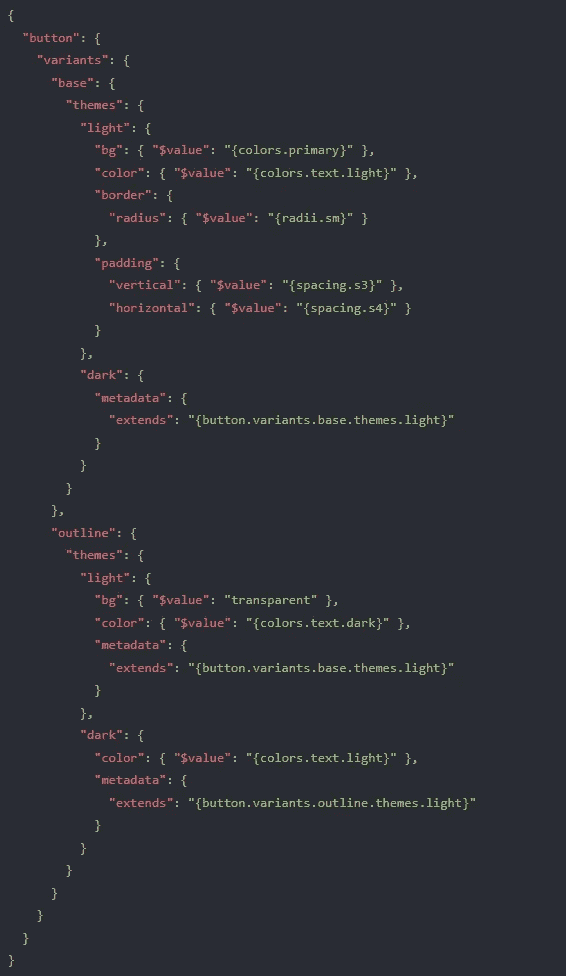

层次结构可能有点复杂，但本质上有一个按钮的基本变体，它对于亮暗主题看起来是一样的。因此，黑暗主题延伸了光明主题。

轮廓按钮有一个透明的背景。所以文字颜色取决于主题。因此，除了覆盖背景和文本颜色之外，轮廓光主题扩展了基础光主题。
深色主题扩展了轮廓按钮的浅色主题，但将文本颜色改为浅色，以与深色主题形成对比。

这种方法的一个很大的优点是，您将组合成一个单一的令牌结构，而不是完全在主题之间分离，这使得重构/重构更容易，因为您基本上有更少的重复代码。

不利的一面是层次和分组可能变得非常复杂。如果像 autocomplete 这样的工具可以解释元数据并帮助用户使用令牌，那么描述层次结构的元数据会有所帮助。

## 将主题组合到单个令牌中

与其使用组来区分和处理复杂的引用/层次结构，不如让我们将主题合并到一个令牌中。

`buttons.tokens.json`:

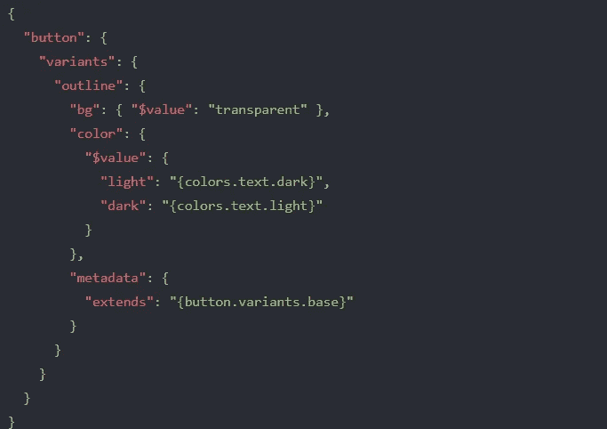

在上面的例子中，我们将令牌的$value 作为一个对象，它为每个主题定义了不同的值。

这样做的一大好处是，它将重复代码减少到了绝对最低限度。
复杂的嵌套/层级/分组不是问题。只有在主题不同的情况下，才能创建$value 对象。否则，所有主题的值都一样。

组合成一个单一的标记是有意义的，因为**即使在完全不同的主题之间，当标记一个组件的一切时，你仍然会有更多的重叠而不是差异**。

我们看不到这种方法的缺点。这是我们个人的偏好。
这类似于丹尼尔·班克斯概述的方法，他是[风格词典](https://amzn.github.io/style-dictionary/#/)的维护者之一，他在[的博客文章](https://dbanks.design/blog/dark-mode-with-style-dictionary/#Single-token-method)中谈到了这一点。

# 将来的

可能会发生两件事:

*   设计令牌规范将会扩展、改进并朝着达成共识的方向发展，包括我们讨论的主题
*   随着规范的成熟，工具将开始与规范保持一致和融合

随着这种情况的发生，开发人员和设计工具用户的体验将随着工具和平台开始实现无缝集成而得到改善。最后，这就是标准化如此重要的原因。

对我们来说，这意味着开发人员和设计人员可以更好地集成在一个单一的工作流程中，解决当前设计偏离代码的问题。

2021 年 9 月 23 日发布了规范的第一份公开编辑草案，现在正在对草案进行公开讨论，所以请确保[加入 GitHub](https://github.com/design-tokens/community-group/issues?q=is%3Aissue+is%3Aopen+sort%3Aupdated-desc+label%3A%22Format+Issue%22) 上的对话！

*原载于 2022 年 2 月 28 日*[*https://back light . dev*](https://backlight.dev/blog/design-tokens)*作者:*[@ jorenbroekema](https://twitter.com/jorenbroekema)*[@ th4is _ ds](https://twitter.com/th4is_ds)*。**

*更多内容请看* [***说白了就是***](https://plainenglish.io/) *。报名参加我们的* [***免费每周简讯***](http://newsletter.plainenglish.io/) *。关注我们*[***Twitter***](https://twitter.com/inPlainEngHQ)*和*[***LinkedIn***](https://www.linkedin.com/company/inplainenglish/)*。加入我们的* [***社区不和谐***](https://discord.gg/GtDtUAvyhW) *。*