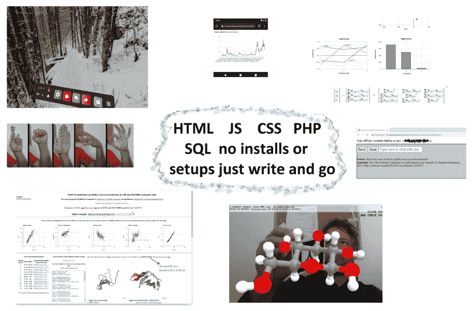
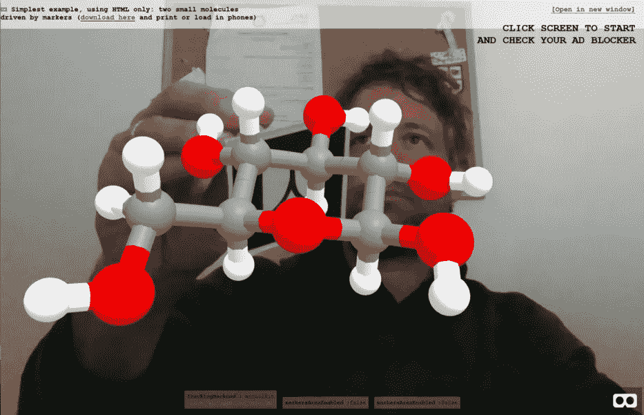
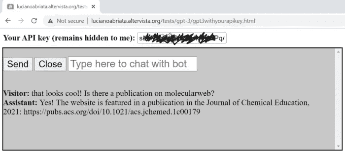
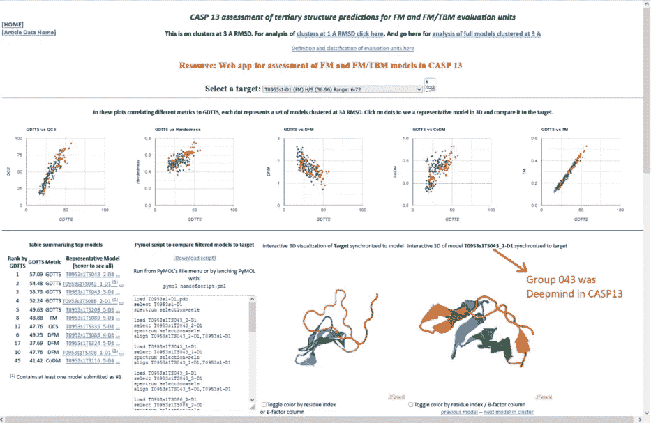
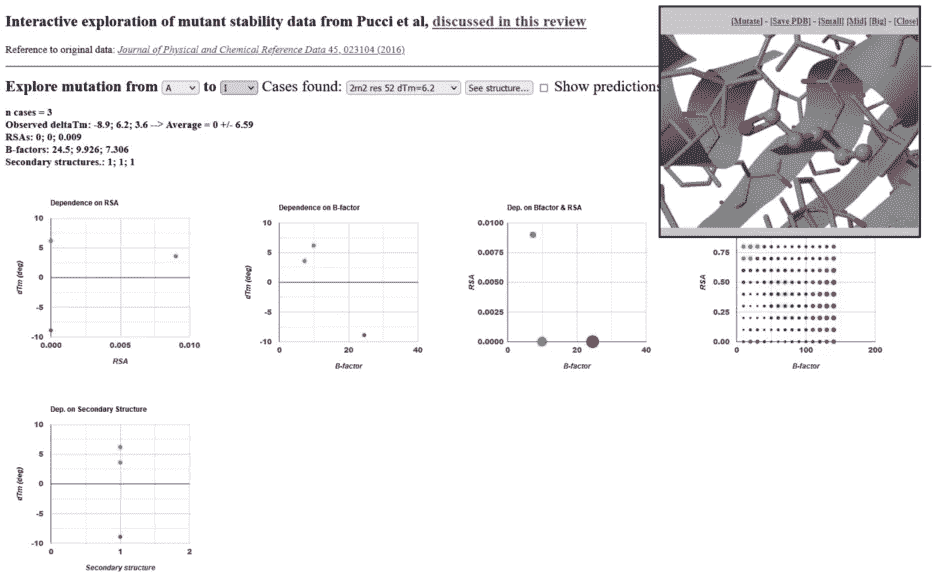

# Altervista:对我来说是最好的免费虚拟主机

> 原文：<https://javascript.plainenglish.io/altervista-the-best-free-web-hosting-out-there-for-me-e2183bf55c58?source=collection_archive---------3----------------------->

## 用一个超级简单的编码环境免费启用 JavaScript 甚至 PHP。



Summary of everything I’ve done with ALTERVISTA. Figure composed by author from own pictures.

当事情好的时候，事情需要被称赞和宣传，它们的创造者需要得到承认和支持。在使用 Altervista 的免费虚拟主机服务大约 12 年后，我想把它作为可能的选择。看看你可以免费利用的所有特性，而不必安装任何 web 开发 SDK 或程序，包括你的页面可能运行 JavaScript 代码，甚至你的服务器端运行 PHP！

我已经使用这个免费的虚拟主机服务超过 10 年了，我发现它非常出色。我发现的每一个关于网络开发的新事物，比如一个新的很酷的 JavaScript 库或者一段 PHP 代码，我发现我可以把它整合到我在这个托管服务上开发的网站中。我的网页看起来干净，没有广告。相反，在一些选定的页面上，我确实赚钱了。我可以包含许多客户端(前端)和服务器端(后端)脚本，使我的页面更具交互性，允许我的网站存储数据等。我可以通过 FTP 无缝地移动文件和备份我的网站。我可以使用 https，这反过来允许使用多媒体资源。以及我在本文中解释的更多内容。

# 那个超棒的免费托管服务是什么？它包括什么，你能用它做什么？

岌岌可危的虚拟主机服务是 Altervista，一个意大利诞生的网络平台，在这里你可以从源代码创建网页，或者作为一个 Wordpress 支持的博客，在 altervista.org 域名下免费，或者为你的自定义域名付费。这项虚拟主机服务是由都灵理工学院的一名学生在 2000 年创立的；它很快变得非常成功，现在拥有数百万用户，并且是一家大型科技公司的一部分。

请继续阅读，了解更多关于免费版的所有特性和功能，这是我非常喜欢的。在这篇文章中，我还列举了一些我在用 Altervista 创建的免费网站上做过的很酷的事情，甚至是增强和虚拟现实程序、超级先进的聊天机器人、加密货币和区块链程序等等。等等。

在介绍免费程序托管服务的丰富功能之前，让我给你一个 Altervista 提供的总体介绍:

*   类似博客或完全程序化的网站开发。
*   Altervista 域下免费站点的优秀特性；你也有自定义域名的付费选项。
*   充足的存储空间。
*   可以并行运行几个免费/付费账户。
*   展示广告并从中赚钱的可能性，或者只是不赚钱，让你的网站非常干净。

**这里我重点介绍一下免费的完全程序化的服务。**简而言之，在我们更详细地了解一些示例和功能之前，需要强调以下要点:

*   它允许在客户端(前端)使用 JavaScript，这对于整合交互性、调用外部 API 等非常重要。您将在下面看到的示例包括:使用增强现实的库和调用加密货币数据的 API。
*   它允许 PHP 进行服务器端(后端)脚本编写——使您的网页能够在您的站点中写入内容，调用某些外部 API，等等。下面的例子包括一些很酷的东西，比如调用 OpenAI 的优秀文本处理工具 GPT-3。
*   它包括一个就地编写 HTML、JS、PHP 和 CSS 代码的工具，也包括一个无需任何编码即可设计 HTML 的工具。
*   它提供了一个合理的存储空间——目前每个账户 3 GB。以至于我有时会用这些空间来临时移动文件。
*   它允许几个免费/付费帐户注册在同一个电子邮件地址-我目前有 6 个免费+ 1 个付费帐户运行。例如:我的两个主要个人网站:[https://www.lucianoabriata.com](https://www.lucianoabriata.com/)和[http://labriataphd.altervista.org/](http://labriataphd.altervista.org/)
*   没有强制性广告，所以你的网站看起来很干净。
*   然而，如果你愿意，你可以展示广告并从中获利。
*   它支持 https 协议——这对于一些应用程序来说是必不可少的，比如我的增强现实页面，它需要访问网络摄像头。此外，目前大多数用户都期望使用 https。
*   你可以通过 FTP 移动文件——这对于上传许多文件和备份你的网站特别有用。
*   非常好的支持，包括一个到目前为止我的大部分问题都已经得到回答的论坛:-)

# 我在免费的 Altervista 网站上做的一些很酷的东西——以及描述它们的文章的链接

让我给你看一些我用这个免费的虚拟主机提供商做的很酷的事情…

# 商品增强现实

是的，我也在我的 Altervista 网站上编写了一些基于网络的增强现实(AR)应用程序！这里有一个例子:



如果你想尝试一下，你需要[打印一些 AR 标记](https://lucianoabriata.altervista.org/jsinscience/arjs/markers.docx)，然后将你的网络浏览器指向[https://lucianoabriata . alter vista . org/jsin science/arjs/armodeling/smallmolglcfurapyra . html](https://lucianoabriata.altervista.org/jsinscience/arjs/armodeling/smallmolglcfurapyra.html)

请注意 **Altervista 的免费 https 选项对于这些 AR 应用程序的工作至关重要**，因为你无法通过 http 获得网络摄像头馈送。如您所见，我的所有示例都在 https URL 下:

[**https://lucianoabriata . alter vista . org/jsin science/arjs/armodeling/**](https://lucianoabriata.altervista.org/jsinscience/arjs/armodeling/)

即使你想在你的电脑上测试这些 AR 应用，你也必须安装一个支持 https 的本地主机。对于像我这样几乎没有时间做这些副业的人来说太麻烦了！在 Altervista 上，我只需编写 HTML 和 JavaScript，然后马上测试应用程序。

顺便说一句，如果 webAR 的事情引起了你的注意，这里有几篇文章，你会发现化学和生物学的基于网络的 AR 要好得多:

[](https://lucianosphere.medium.com/molecularweb-a-brief-practical-introduction-5738771b224d) [## 分子网:实用简介

### 系列的一部分。这里:活动是如何组织的+如何运行它们的一般指导

lucianosphere.medium.com](https://lucianosphere.medium.com/molecularweb-a-brief-practical-introduction-5738771b224d) [](https://medium.com/age-of-awareness/molecular-graphics-and-simulations-in-augmented-reality-on-your-web-browser-9e79c7b75a04) [## 网络浏览器上增强现实中的分子图形和模拟

### 瑞士化学杂志 Chimia 刚刚发表了我们的同行评议文章，描述了我们的最新补充…

medium.com](https://medium.com/age-of-awareness/molecular-graphics-and-simulations-in-augmented-reality-on-your-web-browser-9e79c7b75a04) [](https://medium.com/age-of-awareness/metaverse-not-sure-but-webxr-hell-yes-12af5b302e08) [## 元宇宙？不确定，但是 WebXR？太好了。

### 未来互联网的核心技术之一，我们已经将其应用于娱乐之外的领域。

medium.com](https://medium.com/age-of-awareness/metaverse-not-sure-but-webxr-hell-yes-12af5b302e08) [](https://medium.com/age-of-awareness/easily-build-virtual-molecular-models-of-chemical-and-biological-entities-for-display-in-web-based-9676d3a21ea8) [## 轻松构建化学和生物实体的虚拟分子模型，并显示在基于网络的…

### 元宇宙不应该只是为了娱乐，也应该是为了更容易的教育和工作。我们刚刚发表了一篇论文…

medium.com](https://medium.com/age-of-awareness/easily-build-virtual-molecular-models-of-chemical-and-biological-entities-for-display-in-web-based-9676d3a21ea8) [](https://pub.towardsai.net/interactive-augmented-reality-web-apps-to-enable-immersive-experiences-for-science-education-dce51889473f) [## 交互式增强现实网络应用为科学教育带来身临其境的体验…

### 多媒体材料以独特的方式帮助教师更好地传递知识，帮助学生掌握概念。虚拟…

pub.towardsai.net](https://pub.towardsai.net/interactive-augmented-reality-web-apps-to-enable-immersive-experiences-for-science-education-dce51889473f) 

# 加密货币应用

通过调用外部 API，用 javaScript 处理获得的数据，我编写了一些工具来检索和分析历史加密货币数据。正如这些文章中所解释的，这些工具可以在我的 Altervista 网站上找到:

[](https://medium.com/technology-hits/a-web-tool-to-view-and-analyze-cryptocurrency-data-in-full-detail-free-access-in-this-article-73e4c1dea911) [## 一个查看和分析加密货币数据全部细节的 web 应用程序——在本文中免费访问！

### 历史价格、线性或对数标度的数据、各种标准化、随时间平滑以及您的准确时间…

medium.com](https://medium.com/technology-hits/a-web-tool-to-view-and-analyze-cryptocurrency-data-in-full-detail-free-access-in-this-article-73e4c1dea911) [](https://towardsdatascience.com/obtain-unlimited-historical-crypto-data-through-simple-api-calls-without-keys-8a6f5ed55b43) [## 通过简单的 Web 代码获得无限的历史加密数据-没有 API 密钥

### 从基于网络的代码中调用 CoinGecko 的免费 API 来获取价格、交易量和市值，您可以调整…

towardsdatascience.com](https://towardsdatascience.com/obtain-unlimited-historical-crypto-data-through-simple-api-calls-without-keys-8a6f5ed55b43) 

# 使用 Web3.js 的以太坊区块链阅读器

虽然您可以通过一个事务写入以太坊区块链，例如 MetaMask…

[](https://medium.com/technology-hits/how-to-easily-post-data-in-the-ethereum-blockchain-network-forever-with-no-programming-ef957dff4539) [## 如何轻松地在以太坊区块链网络中永久发布数据——无需编程

### 与去中心化的区块链互动的软件已经变得足够简单，你现在只需几个步骤就可以做事情…

medium.com](https://medium.com/technology-hits/how-to-easily-post-data-in-the-ethereum-blockchain-network-forever-with-no-programming-ef957dff4539) 

…为了浏览、搜索和阅读以太坊区块链的内容，你最好使用一些脚本。你可以用 JavaScript 创建和运行脚本，就像我在 Altervista 托管的一些页面一样。点击此处阅读更多内容:

[](https://pub.towardsai.net/read-public-messages-from-the-ethereum-network-with-simple-web-programming-70d8650e54e2) [## 用简单的 Web 编程从以太网上读取公共消息

### 我最近向您展示了如何在以太坊网络中发布永久不被破坏的消息。在这里我向你展示…

pub.towardsai.net](https://pub.towardsai.net/read-public-messages-from-the-ethereum-network-with-simple-web-programming-70d8650e54e2) 

# 一个定制的基于 GPT 3 的聊天机器人，使用 PHP 和 JavaScript

我最近玩了很多世界上最强大的语言处理系统之一，OpenAI 的 GPT-3 模型。最初，当我习惯了这个系统后，我在基于网络的操场上用 GPT-3 进行了几次实验；例如，这是我最新的项目:

[](https://towardsdatascience.com/a-question-answering-bot-powered-by-wikipedia-coupled-to-gpt-3-56889b5976d7) [## 一个由维基百科驱动的问答机器人与 GPT 3 号结合在一起

### 仍然着迷于 GPT-3 提供的可能性和它的力量，这里耦合到维基百科

towardsdatascience.com](https://towardsdatascience.com/a-question-answering-bot-powered-by-wikipedia-coupled-to-gpt-3-56889b5976d7) 

更多信息，您可以查看以下摘要:

 [## 截至 2022 年 10 月我所有关于 GPT 3 的文章

### 我最喜欢的语言模型以及如何在纯 JavaScript 和…

lucianosphere.medium.com](https://lucianosphere.medium.com/all-my-articles-on-gpt-3-as-of-october-2022-10e95dcae199) 

特别是，将 GPT-3 插入网站需要服务器可以运行 PHP。是的，因为有 PHP 包装器，你可以从你的网页的 JavaScript 调用它。我在这里解释如何做到这一点:

[](https://towardsdatascience.com/custom-informed-gpt-3-models-for-your-website-with-very-simple-code-47134b25620b) [## 用非常简单的代码为你的网站构建定制的基于 GPT 3 的聊天机器人

### 了解 GPT-3，PHP 和 JavaScript，因为你建立了一个在线 GPT-3 为基础的聊天机器人专门在一个给定的主题，你…

towardsdatascience.com](https://towardsdatascience.com/custom-informed-gpt-3-models-for-your-website-with-very-simple-code-47134b25620b) 

这是我的 Altervista 网页上的证据:



# 在你的网页中显示交互式分子结构

许多 JavaScript 库允许你在网页中嵌入分子图形。它们的行为不像静态的分子图画，但是你真的可以和它们互动。

一些流行的基于 JS 的分子图形库包括 JSmol，NGL，Litemol，3Dmol。有了 Altervista 对 JavaScript 的无缝支持，您可以在页面中包含其中的任何一个。此外，为了获得完整的功能，其中一些库需要 PHP 访问——在 Altervista 中也有。

我特别使用 JSmol 库，正如你可以在我的生物分子模型图库中看到的(【http://lucianoabriata.altervista.org/modelshome.html】)或者在我为第 12 和第 13 届 CASP 竞赛的蛋白质建模评估编写的官方网络应用程序中看到的那样，在那里 [AlphaFold](https://lucianosphere.medium.com/here-are-all-my-peer-reviewed-and-blog-articles-on-protein-modeling-casp-and-alphafold-2-d78f0a9feb61?source=your_stories_page----------------------------------------) 惊艳亮相。

例如，在这张图中，我展示了来自 CASP13 的 AlphaFold 1 的一个模型，由于 JSmol 插入到我在 Altervista 编写的网页中，所以可以在交互式 3D 中看到:



这是我的一篇蛋白质生物技术论文中的另一个例子:



您可以在我的 Altervista 网站上访问并使用它:

[**http://lucianoabriata . alter vista . org/papers data/proteinstability 2021/s 1626 navigation . html**](http://lucianoabriata.altervista.org/papersdata/proteinstability2021/s1626navigation.html)

要了解更多信息，您可以查看以下文章:

 [## 论文摘要:为什么预测稳定性的变化如此困难？

### 路易斯和阿布利亚塔。分子生物技术 2021[此处开放访问]

lucianosphere.medium.com](https://lucianosphere.medium.com/why-is-it-so-difficult-to-predict-the-changes-in-stability-that-result-when-a-protein-is-mutated-2df96b2037c5) [](https://medium.com/advances-in-biological-science/how-computer-modeling-simulations-and-artificial-intelligence-impact-protein-engineering-in-4d8473bd59ff) [## 计算机建模、模拟和人工智能如何影响蛋白质工程？

### 不同的复杂性，成功率和应用的计算方法的概述，与关键…

medium.com](https://medium.com/advances-in-biological-science/how-computer-modeling-simulations-and-artificial-intelligence-impact-protein-engineering-in-4d8473bd59ff) 

# 在线展示身临其境的虚拟现实般的 3D 照片

用 Panolens.js 库可以轻松嵌入 3D 照片；由于 Altervista 提供 https，您可以在访客的智能手机上使用陀螺仪，让他们沉浸在您的 3D 照片中。在这里看一些例子，3D 视图都在我的 Altervista 网站上:

[](https://medium.com/snap-shots/playing-with-immersive-360-spherical-photos-e85d1a9dbe75) [## 玩沉浸式 360(“球形”)照片

### 我最近知道了一个库，我可以用它插入我的智能手机拍摄的 360 度视图，供你…

medium.com](https://medium.com/snap-shots/playing-with-immersive-360-spherical-photos-e85d1a9dbe75) [](https://medium.com/snap-shots/360-degrees-in-deep-argentinian-nature-41e31a82f520) [## 阿根廷大自然深处的 360 度

### 从我最近在阿根廷的徒步旅行中挑选的身临其境的球形照片，让你有身临其境的感觉！

medium.com](https://medium.com/snap-shots/360-degrees-in-deep-argentinian-nature-41e31a82f520) 

# 基于 PHP 的登录系统

我之前向你展示的这个加密货币应用的特点是一个简单的登录系统，用户名和密码用 PHP 编码，就在我的 Altervista 托管的网站上。不需要外部解决方案！

[](https://medium.com/coinmonks/visualize-and-analyze-cryptocurrencies-in-full-detail-29441079a395) [## 完整详细地可视化和分析加密货币

### 查看历史价格和市值，完全控制时间范围，以线性或对数标度绘制数据，原始数据…

medium.com](https://medium.com/coinmonks/visualize-and-analyze-cryptocurrencies-in-full-detail-29441079a395) 

我将很快写一篇简短的教程，介绍如何在 Altervista 中用 PHP 做到这一点。

# 基于 PHP 的简单解决方案，用于页面上的数据存储和检索

同样，你可以通过在你的网站上使用相当简单的 PHP 来实现这一点，而不需要使用第三方解决方案。我没有描述它的文章，但是我有一个正在运行的系统，所以我将很快描述它。

# 大量数据可视化和数据分析应用

我在上面向你展示了一些加密货币分析网络应用，以及一些处理分子结构的网络工具，这些都基于我的 Altervista 网站。

我在 Altervista 网站上有更明确的数字处理和数值模拟网络应用。我举了一些有趣的例子:

[](https://towardsdatascience.com/a-free-online-tool-for-principal-components-analysis-with-full-graphical-output-c9b3725b4f98) [## 一个免费的在线主成分分析工具，提供完整的图形输出

### 完全在您的浏览器上运行，您不需要下载或安装任何东西，您的数据将保留在您的…

towardsdatascience.com](https://towardsdatascience.com/a-free-online-tool-for-principal-components-analysis-with-full-graphical-output-c9b3725b4f98) [](https://towardsdatascience.com/websites-for-statistics-and-data-analysis-on-every-device-ebf92bec3e53) [## 在每台设备上进行统计和数据分析的网站

### 我对网络浏览器中数据分析在线工具的选择。

towardsdatascience.com](https://towardsdatascience.com/websites-for-statistics-and-data-analysis-on-every-device-ebf92bec3e53) [](https://pub.towardsai.net/multiple-linear-regression-to-fit-fractional-contributions-to-data-316bdc7dc565) [## 多元线性回归拟合数据的分数贡献

### 我在这里用蛋白质生物技术中的一个感兴趣的问题来举例说明多元线性回归的核心:分析…

pub.towardsai.net](https://pub.towardsai.net/multiple-linear-regression-to-fit-fractional-contributions-to-data-316bdc7dc565) 

# 结束语

如果你读到这里，你可能会想“*很明显，这个人是被雇来写这篇广告的。**但我发誓我没有！***

你可以自己测试一下 AlterVista，然后得出自己的结论。

随着国家的不同，AlterVista 的服务在全球范围内提供。去打开你的账户，在[https://en.altervista.org/](https://en.altervista.org/)查看(或者像我一样在最初的[https://it.altervista.org/](https://it.altervista.org/)站点)。

**请在评论中告诉我:其他免费主机提供商提供了哪些 Altervista 没有的功能？还有哪些你没见过的免费提供商提供的功能，是你想拥有的？**

```
[***www.lucianoabriata.com***](https://www.lucianoabriata.com/) *I write and photoshoot about everything that lies in my broad sphere of interests: nature, science, technology, programming, etc.* [***Become a Medium member***](https://lucianosphere.medium.com/membership) *to access all its stories (affiliate links of the platform for which I get small revenues without cost to you) and* [***subscribe to get my new stories***](https://lucianosphere.medium.com/subscribe) ***by email****. To* ***consult about small jobs*** *check my* [***services page here***](https://lucianoabriata.altervista.org/services/index.html)*. You can* [***contact me here***](https://lucianoabriata.altervista.org/office/contact.html)***.***
```

*更多内容看* [***说白了就是 io***](https://plainenglish.io/) *。报名参加我们的* [***免费周报***](http://newsletter.plainenglish.io/) *。关注我们关于* [***推特***](https://twitter.com/inPlainEngHQ) ， [***领英***](https://www.linkedin.com/company/inplainenglish/) *，*[***YouTube***](https://www.youtube.com/channel/UCtipWUghju290NWcn8jhyAw)*[***不和***](https://discord.gg/GtDtUAvyhW) *。对增长黑客感兴趣？检查* [***电路***](https://circuit.ooo/) *。**