# 惊人的，实现电池充电动画只是使用 CSS

> 原文：<https://javascript.plainenglish.io/amazing-achieve-battery-charging-animation-just-using-css-4916326839bf?source=collection_archive---------5----------------------->

## 分步讲解实现手机充电动画

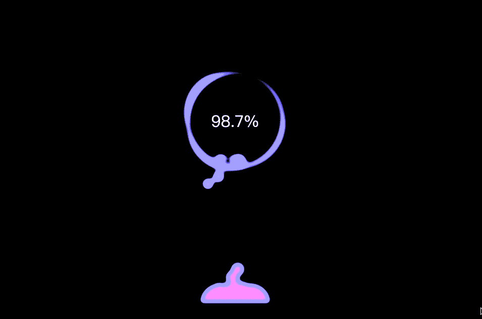

# 前言

手机是我们生活中最常用的东西。如果没有电，当然需要充电！

你的手机充电动画是什么样子的？我的是这样的，好漂亮！

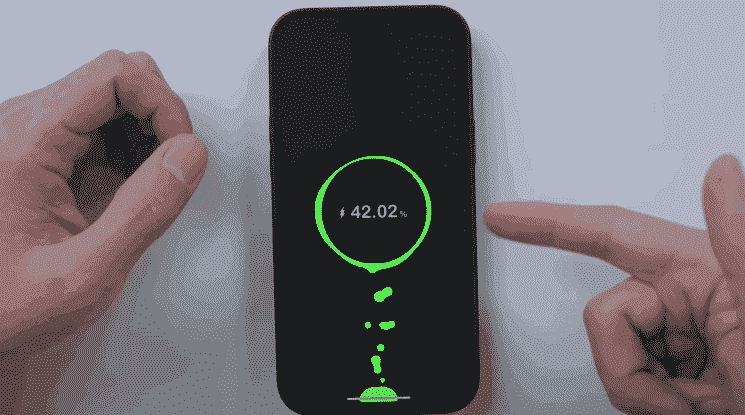

**你认为我们可以用 CSS 实现这个手机充电动画吗？**当然，这很容易，也很神奇。你愿意和“fatfish”一起探索吗？

**提示**

1.  我已经将动画的每一步与 CodePen 地址进行了匹配，这样你就可以很容易地看到实际效果。
2.  如果用电脑打开，请点击下方的“0.5x”。如果手机打开，请点击“0.25x”

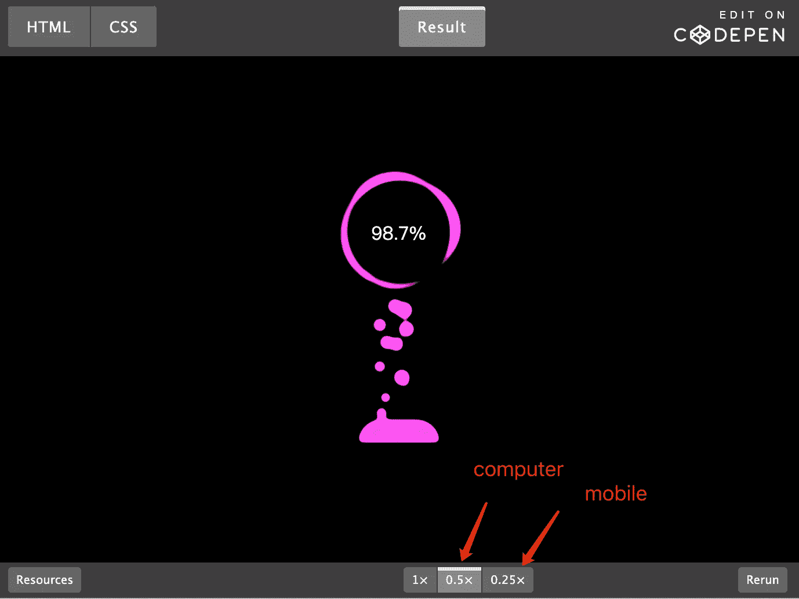

# 1.分析动画

首先，我们来整体分析一下动画。它包含哪些重要元素？

1.  黑色背景
2.  底部的绿色小按钮
3.  小气泡总是会冒出来
4.  旋转圆
5.  数字进步

差不多就是这样，我有点等不及了，马上就开始写。

# 2.绿色小按钮和黑色背景

我们可以先画一个黑色的背景和一个圆角的绿色小按钮，还有一个小泡泡飘起来。

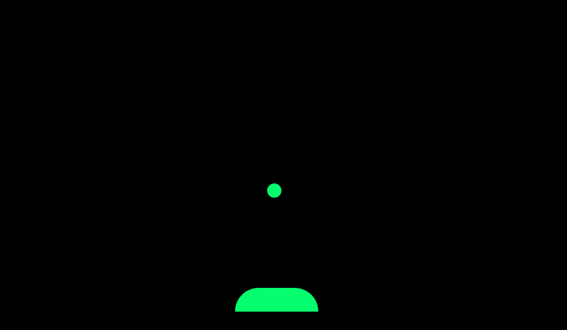

[**CodePen**](https://codepen.io/qianlong/pen/YzYboMw)

**Please click 0.5x or 0.25x to see the actual effect**

# 3.让球和按钮粘在一起

可以看到，当球飘起来的时候，并没有和按钮产生黏黏的感觉。那感觉不是很舒服，是吗？

也许我们可以使用这两个 CSS 属性来实现目标。

1.  `filter: contrast()`
2.  `filter:blur()`

让我们添加这几行代码。

```
.g-contrast {
  filter: contrast(10) hue-rotate(0);
}.g-bubbles{
  filter: blur(5px);
}
```

**太神奇了，朋友们！**

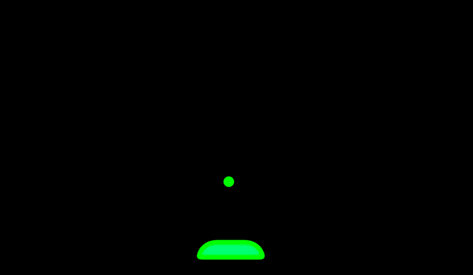

[**Codepen**](https://codepen.io/qianlong/pen/ExoBpRd)

**Please click 0.5x or 0.25x to see the actual effect**

# 4.制造更多的小气泡

接下来我们要做的是制造更多的小气泡。我们可以通过添加更多的“李标签”并为其设置不同的延时动画来实现这一效果。

```
<div class="g-container">
  <div class="g-contrast">
    <ul class="g-bubbles">
      <li></li>
      *<!-- Added some new li tags -->*
      <li></li>
      *<!-- ... -->*
    </ul>
  </div>
</div>li:nth-of-type(2) {
  left: 76px;
  top: 50%;
  transform: translate(-50%, -50%);
  width: 28px;
  height: 28px;
  animation: moveToTop 7s ease-in-out -2.015s infinite;
}
li:nth-of-type(3) {
  left: 30px;
  top: 50%;
  transform: translate(-50%, -50%);
  width: 22px;
  height: 22px;
  animation: moveToTop 7s ease-in-out -2.362s infinite;
}
*/* ... */*
```

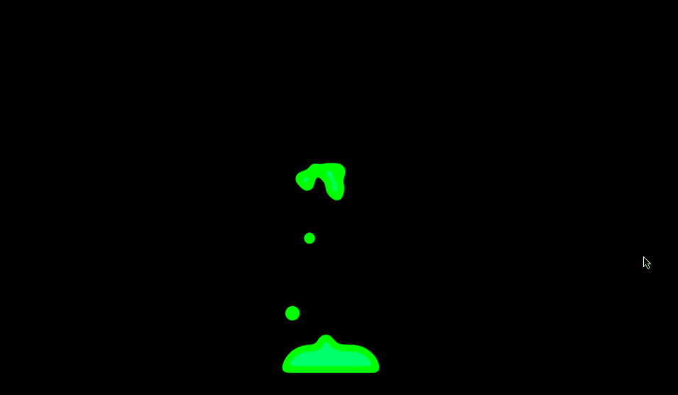

[密码笔](https://codepen.io/qianlong/pen/eYywLOP)

**Please click 0.5x or 0.25x to see the actual effect**

# 5.旋转圆

下一步就是我们要实施转圈了。

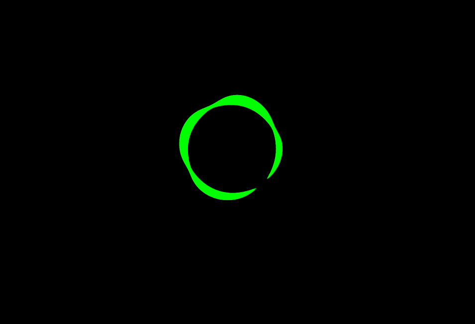

**第一步**

第一步，我们需要画一个正方形，用黑色背景在中间画一个圆，如下图:

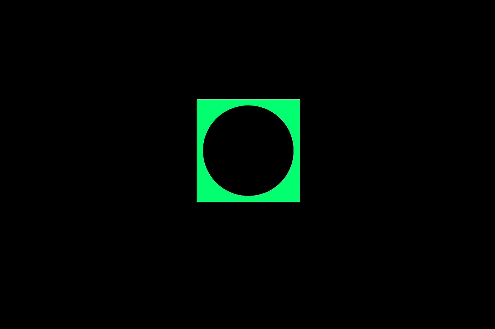

[CodePen](https://codepen.io/qianlong/pen/KKZjxmx)

**Please click 0.5x or 0.25x to see the actual effect**

**第二步**

使用 **border-radius** 改变边框的圆角，然后使用“滤镜”使其模糊。最后有一种融合的感觉，像下面这样:

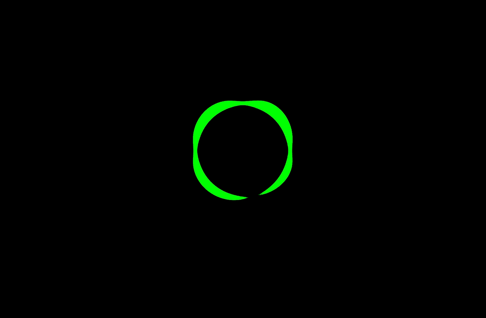

[密码笔](https://codepen.io/qianlong/pen/GRybXyv)

**Please click 0.5x or 0.25x to see the actual effect**

**第三步**

最后一步是旋转小圆。


[密码笔](https://codepen.io/qianlong/pen/JjMQaBG)

**Please click 0.5x or 0.25x to see the actual effect**

现在我们可以将旋转的圆圈和飘动的泡泡结合起来，看看它是如何工作的。太好了。我们很快就会完成它。

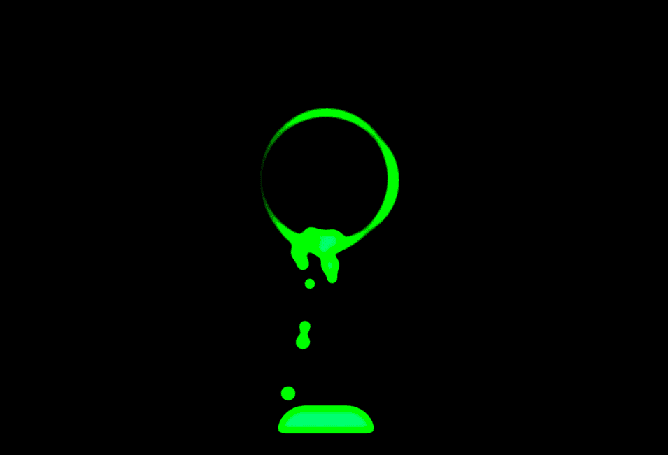

[密码笔](https://codepen.io/qianlong/pen/qBpzMga)

**Please click 0.5x or 0.25x to see the actual effect**

# 6.数字进步

最后一步是添加充电进度。

**这些是需要添加的代码块。**

```
<div class="g-number">98.7%</div>.g-number {
  position: absolute;
  width: 300px;
  top: 20%;
  text-align: center;
  font-size: 32px;
  z-index: 10;
  color: #fff;
}
```

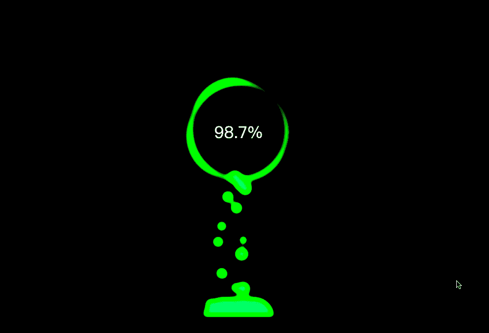

[代码打开](https://codepen.io/qianlong/pen/eYywPYm)

**Please click 0.5x or 0.25x to see the actual effect**

# 7.添加多种颜色变化

现在我们整个动画只有一种颜色。看起来很单调。我们可以给它添加不同的颜色。太酷了。

```
.g-contrast {
  filter: contrast(10) hue-rotate(0);
  width: 100%;
  height: 100%;
  background-color: #000;
  overflow: hidden;
  */*  New line of code  */*
  animation: hueRotate 10s infinite linear;
}
*/*  New line of code  */*
@keyframes hueRotate {
  100% {
    filter: contrast(15) hue-rotate(360deg);
  }
}
```


[密码笔](https://codepen.io/qianlong/pen/abEgRNB)

**Please click 0.5x or 0.25x to see the actual effect**

# 最后

**感谢阅读。**期待期待您的关注，阅读更多高质量的文章。

*本文翻译已获原作者授权(* chokcoco *)*

*原地址为*[*https://juejin.cn/post/7016520448204603423*](https://juejin.cn/post/6844904029336649741)

[](/what-does-123-tostring-length-123-print-out-in-javascript-2c804a414325) [## 123['toString']。length + 123)用 JavaScript 打印出来？

### 95%的前端开发者回答错误的问题。

javascript.plainenglish.io](/what-does-123-tostring-length-123-print-out-in-javascript-2c804a414325) [](/11-chrome-devtools-tricks-to-help-make-you-a-senior-front-end-developer-67b4ae3e6562) [## 帮助你成为高级前端开发人员的 11 个技巧

### 如果你选择 Chrome 作为开发工具，你必须知道的 11 个技巧

javascript.plainenglish.io](/11-chrome-devtools-tricks-to-help-make-you-a-senior-front-end-developer-67b4ae3e6562) [](/6-cool-modern-javascript-features-most-developers-dont-know-about-432f7652dd4c) [## 大多数开发人员不知道的 6 个很酷的现代 JavaScript 特性

### 编写简明 JavaScript 代码的技巧

javascript.plainenglish.io](/6-cool-modern-javascript-features-most-developers-dont-know-about-432f7652dd4c) [](/9-ways-to-make-a-1-a-2-a-3-true-in-javascript-c2e1903b24b) [## 在 JavaScript 中实现(a==1 && a==2 && a==3) === true 的 9 种方法

### 是的，这可能是真的，而且有 9 种方式——太神奇了！

javascript.plainenglish.io](/9-ways-to-make-a-1-a-2-a-3-true-in-javascript-c2e1903b24b) [](/interviewer-you-have-been-working-for-3-years-and-you-cant-answer-this-algorithm-question-5f79cba18e06) [## 面试官:你工作 3 年了，这种算法题你都不会答？

### 一个女生的面试经历

javascript.plainenglish.io](/interviewer-you-have-been-working-for-3-years-and-you-cant-answer-this-algorithm-question-5f79cba18e06) [](/8-javascript-tricks-to-make-you-a-better-programmer-948b5a3c35b4) [## 让你成为更好的程序员的 8 个 JavaScript 技巧

### 使用这些代码提示，让您的 JavaScript 更具可读性和可扩展性。

javascript.plainenglish.io](/8-javascript-tricks-to-make-you-a-better-programmer-948b5a3c35b4) [](/my-boss-you-know-es6-but-why-dont-you-use-it-5e0316f14c67) [## 我老板:你知道 ES6，为什么不用？😠

### 老板的 10 条抱怨让我受益匪浅。

javascript.plainenglish.io](/my-boss-you-know-es6-but-why-dont-you-use-it-5e0316f14c67) [](/15-killer-websites-for-web-developers-35a4c007942a) [## 面向网络开发人员的 15 个黑仔网站

### 99.9%的开发者都不知道。

javascript.plainenglish.io](/15-killer-websites-for-web-developers-35a4c007942a) 

*更多内容请看*[***plain English . io***](https://plainenglish.io/)*。报名参加我们的* [***免费周报***](http://newsletter.plainenglish.io/) *。关注我们关于*[***Twitter***](https://twitter.com/inPlainEngHQ)*和*[***LinkedIn***](https://www.linkedin.com/company/inplainenglish/)*。加入我们的* [***社区不和谐***](https://discord.gg/GtDtUAvyhW) *。*