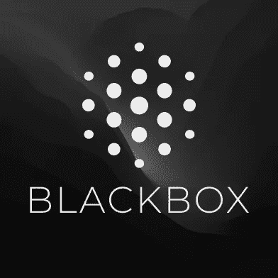

# 一个你可能不知道的惊人的 Visual Studio 代码扩展

> 原文：<https://javascript.plainenglish.io/an-amazing-visual-studio-code-extension-you-might-not-know-about-6427d677a896?source=collection_archive---------2----------------------->

## 介绍 Blackbox:人工智能为你输入的问题提供代码解决方案。

编程的世界进展非常快，现在似乎人工智能可以制造其他人工智能。现在 AI 帮助我们在几秒钟内轻松编写复杂的代码。在这篇文章中，我们将了解一个根据你提出的问题给你代码解决方案的人工智能。

# 黑盒扩展

[Blackbox](https://www.useblackbox.io/landingPage) Logo

Blackbox 是一个人工智能，它会给你对应于你给它的问题的代码。你甚至可以写复杂的问题，现在它有一个 Visual Studio 代码的扩展。

你只需要在文本编辑器中用 Visual Studio 代码在两个正斜杠(//)后写下你的问题，当你输入问号(？)问题后面会给出代码片段，你可以按“Tab”键使用。

# 骗局

世界上的任何事情都有它的优点和缺点。你已经看到了 Blackbox 的优点，但对于它的缺点，过于复杂的代码可能不是重点，有时它可能不理解问题，因此，它可能会给出一个不符合要求的代码，但它会给出至少是正确答案的一半的代码。

我希望这篇文章会对你有所帮助，黑盒会在你的旅程中帮助你。随时给我建议。

再见。

*更多内容请看*[***plain English . io***](https://plainenglish.io/)*。报名参加我们的* [***免费周报***](http://newsletter.plainenglish.io/) *。关注我们关于*[***Twitter***](https://twitter.com/inPlainEngHQ)[***LinkedIn***](https://www.linkedin.com/company/inplainenglish/)*[***YouTube***](https://www.youtube.com/channel/UCtipWUghju290NWcn8jhyAw)*[***不和***](https://discord.gg/GtDtUAvyhW) *。对增长黑客感兴趣？检查* [***电路***](https://circuit.ooo/) *。***