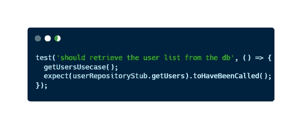

# 使用 JavaScript 示例进行单元测试的简单通用方法

> 原文：<https://javascript.plainenglish.io/an-easy-and-general-approach-to-unit-tests-using-javascript-examples-1a29ba58c948?source=collection_archive---------4----------------------->

## 在不到 5 分钟的时间内理解单元测试，成为更好的开发人员


当我在大学学习的时候，我从来没有见过任何关于考试的东西。当我进行第一次技术面试时，招聘人员问我是否开发了任何测试或任何方法来检查我的代码是否正常工作。我告诉他们**我已经用简单的查询手动测试过了**。**他们从来不叫我**。

在这之后，我决定学习一些关于测试的东西，但是我发现它真的很**无聊**。老实说，我甚至不理解一些与测试相关的概念，如模拟、单元测试或构建器。所以我从来没学过。

随着时间的流逝，现在我爱上了测试，更喜欢单元测试。今天，我在一家服务和产品公司做后端开发人员。在这家公司，我不是在做小项目，而是在做大的仓库和架构。有了这份工作，我知道了测试的重要性，他们对我来说并不无聊。

出于这个原因，我将与你分享我的一点知识。因为如果我关心如何测试和它的重要性，我确信现在我会是一个更好的开发者。如果我早知道这些，我会通过第一次面试。

你准备好成为一名只知道如何和为什么对你的代码进行单元测试的更好的开发者了吗？

# 什么是单元测试？

单元测试是创建一些小测试来检查我们的应用程序的行为是否是我们所期望的的过程。这些测试是单独的，并且**独立于每个操作的**。

> 每次测试只检查一件事。

总而言之，就是编写一小段代码来检查我们的函数是否表现出应有的行为的过程。这通常在开发过程的质量保证阶段完成。为了创建它们，我们必须考虑函数的一些方面:返回什么，如果抛出或提供任何错误，需要多少参数作为参数…

像任何工具一样，它不是完美的东西，单元测试也有优点和缺点。我将根据我自己的经验与你分享 3 点:

## 单元测试的优势

3 使用单元测试的真正好处是…

*   **许多行可以复制到其他项目**。毕竟，我们正在编写代码。想象一下，你可以开发一个 API，向用户展示它的功能。八月份，您开发了另一个 API 来显示另一个数据库中的城市。您将能够复制测试的代码并节省时间。
*   **您可以在早期发现问题**。如果你在开始一个项目的时候开发一个功能，并且为它开发单元测试，你可以开发更多的功能，并且总是确保你的第一个功能的行为不会被修改。因为你知道，如果函数行为改变，你的测试会检测到它。
*   **你可以轻松调试**。由于单元测试是一种封闭范围的测试方式，您只需测试测试指定功能的一部分，因此调试变得非常容易。如果你想用 Jest 调试，我推荐在可视代码上安装[Jest Runner 扩展](https://marketplace.visualstudio.com/items?itemName=firsttris.vscode-jest-runner)。

另一方面，我也发现了许多缺点。


[Image](https://www.pexels.com/es-es/foto/mujer-sentada-frente-a-la-computadora-portatil-1181677/) from [Pexels](https://www.pexels.com/es-es/foto/mujer-sentada-frente-a-la-computadora-portatil-1181677/)

## 单元测试的缺点

我发现使用单元测试的 3 个缺点是…

*   他们并不完美。每个单元测试将涵盖我们功能的一个方面。然而，他们不能保证我们的代码不会有任何错误。
*   它们是时间的投资。开发单元测试是我们时间的投资，通常，这将比我们手工测试花费更多的时间。因为如果我们有点懒，我们可以只用一个查询来检查函数的行为。然而，如果我们想检查返回和抛出，至少有两个测试。
*   **学习曲线可能有点复杂**。如果你是编码领域的新手，测试过程可能会很困难。你已经从我自己的经历中看到了这一点。此外，你必须学习自动化软件工具，如 [Jest](https://jestjs.io/es-ES/) 。

我们已经看到单元测试并不是一个完美的工具。那么，为什么单元测试对我们的代码很重要？

# 为什么单元测试对我们的代码很重要？

用单元测试来测试我们的代码对于正确的软件开发是至关重要的。

为什么？因为**我们开发功能是为了完成一个目的**，而我们是人。作为人类，我们会犯错误，所以有可能我们实现了一个有错误或者有意外行为的函数。

是的。我知道你现在在想什么！如果我可以使用 [postman](https://www.postman.com/) 测试我的 API，为什么我需要编码测试？答案真的很简单。因为做起来就是地狱，而且以我自己的经历来说。

> 使用单元测试，我们可以节省时间。

此外，手动测试只有在我们有一个小项目的情况下才有可能，但是如果我们开始向我们的项目添加功能，也许我们必须做 50 或 100 个请求，这将是一个可怕的体验。然而，如果我们编写一些单元测试，我们总是可以只使用如下命令来尝试所有情况:

```
npm test
```

你还有些怀疑吗？检查这个简单的例子:

## 使用 JavaScript 进行单元测试的简单例子

例如，如果我们有这样一段代码:


An example of code to test

我们至少要开发两个单元测试。

*   一个**到**的第一个**测试检查如果没有用户存在，函数是否返回一个空数组**。


First test implemented with [Jest](https://jestjs.io/es-ES/)

*   对**的第二个**测试**检查该函数是否正确检索了数据库中的所有用户(如果他们存在的话)。**



Second test implemented with [Jest](https://jestjs.io/es-ES/)

你喜欢这些例子，想了解更多关于 JavaScript 的知识吗？检查这些文章！

[](/finally-understanding-the-arrow-functions-in-javascript-a47eb1f4dbae) [## 最终理解 JavaScript 中的箭头函数

### 了解如何声明箭头函数，成为更好的 web 开发人员。

javascript.plainenglish.io](/finally-understanding-the-arrow-functions-in-javascript-a47eb1f4dbae) [](/5-useful-javascript-one-liners-for-totally-beginners-56e678d9a314) [## 5 个对初学者有用的 JavaScript 一行程序

### 在短短几分钟内，您将能够减少您必须编写的代码行数，并提高您的…

javascript.plainenglish.io](/5-useful-javascript-one-liners-for-totally-beginners-56e678d9a314) 

通过这两个简短的测试，我们可以检查我们的函数是否有我们期望的行为。如果我们开发了具有更复杂行为的功能，我们将不得不开发更多的测试。

例如，如果我们的函数需要参数，我们可以开发一个测试来检查函数是否以正确的顺序用正确的参数调用。

在这个例子中，我使用 [**Jest**](https://jestjs.io/es-ES/) 开发了如此简单的测试。然而，如何实现这些测试将取决于您将使用的语言。

# 最后的想法

在任何中/大型应用程序的**开发**过程中，单元测试是一个**非常重要的步骤**。如果我们做得正确，我们可以检测出代码中的早期故障或错误。此外，如果我们将它们与手工测试相比较，它们可以使我们更有效率，因为我们可以只用一个按钮或一个命令来测试所有的情况。

在本文中，我已经涵盖了我认为是单元测试最重要的方面。我希望你能理解它们的重要性，试一试。的确，它们一开始可能有点挑战性，但是当你练习一会儿，你就可以体验它们的所有好处。

你以前知道单元测试吗？当你编码时，你做哪些测试实践？