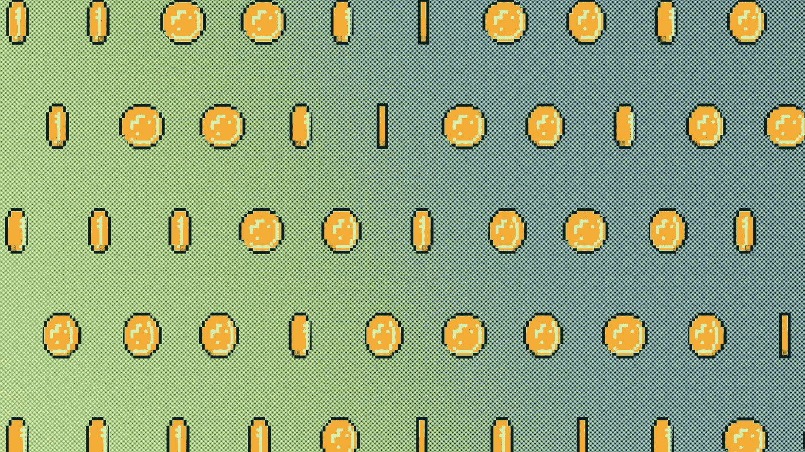
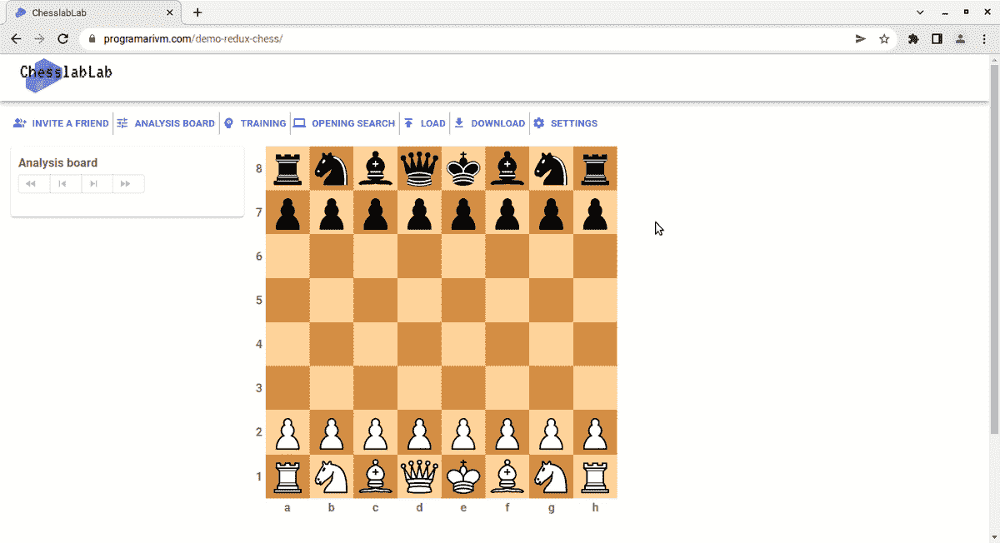

# 概括的例子

> 原文：<https://javascript.plainenglish.io/an-example-of-generalization-894983884c9?source=collection_archive---------21----------------------->

## 在最初应用分而治之的方法后



关注点分离(SoC)和泛化是软件工程中两个强大的设计概念，它们将帮助你创建良好的应用程序。它们可能看起来是两件不同的事情，但实际上是一个硬币的两面。最简单的形式，关注点分离就是把一个问题分成小块。

有时，在开发某个特性时应用了分而治之的方法之后，您可能会意识到这并不是您真正需要的，尤其是在开发这种特性的早期阶段。换句话说，一旦你有机会实际处理足够数量的子部分，结果是相反的:你需要进行归纳。

[](https://en.wikipedia.org/wiki/Inductive_reasoning) [## 归纳推理-维基百科

### 归纳推理是一种推理方法，在这种方法中，一组观察结果被综合起来，得出一个总的结论

en.wikipedia.org](https://en.wikipedia.org/wiki/Inductive_reasoning) 

其他时候是完全相反的事情。你有没有从一个通才的角度开始解决一个问题，后来才意识到它需要被分解成更小的部分？

# 它发生在我身上

因此，我正在处理 [Redux Chess](https://github.com/chesslablab/redux-chess) 的 AJAX 加载指示器，更具体地说，是那些显示在**打开搜索**对话框中的指示器，如下面的 GIF 所示。



Figure 1\. Searching openings by ECO code, by name and by movetext.

我最初采用分而治之的策略来解决这个问题，并最终创建了下面的文件结构。

```
🗁 src
  🗁 components
    🗁 AjaxLoader
      🗎 ChessOpeningSearchEcoAjaxLoader.js
      🗎 ChessOpeningSearchMovetextAjaxLoader.js
      🗎 ChessOpeningSearchNameAjaxLoader.js
      ...
```

假设 [Redux](https://redux.js.org/introduction/getting-started) 模式在 Redux Chess 上被广泛使用，有三个不同的 AJAX 加载组件来通过 ECO 代码、名称和 PGN movetext 搜索空缺，这意味着事情的分解被复制到`reducers`文件夹中。

```
🗁 src
  🗁 reducers
    🗎 chessOpeningSearchEcoAjaxLoaderReducer.js
    🗎 chessOpeningSearchMovetextAjaxLoaderReducer.js
    🗎 chessOpeningSearchNameAjaxLoaderReducer.js
    ...
```

以及在`constants`文件夹中。

```
🗁 src
  🗁 constants
    🗁 ajaxLoader
      🗎 chessOpeningSearchEcoAjaxLoaderActionTypes.js
      🗎 chessOpeningSearchMovetextAjaxLoaderActionTypes.js
      🗎 chessOpeningSearchNameAjaxLoaderActionTypes.js
      ...
```

嗯，可能太多余了。

如前所述，在这种情况下，泛化更好，因为生成的代码更容易阅读。因此，[这个问题](https://github.com/chesslablab/redux-chess/issues/279)是在 Redux Chess 存储库上公开的，目的是将所有 AJAX 加载器合并为一个。

[](https://medium.com/@prabathmail/generalization-in-the-context-of-software-development-bcb6191f06f9) [## 软件工程环境中的泛化

### 概括是一种抽象形式，通过这种形式，特定实例的共同属性被公式化为一般的…

medium.com](https://medium.com/@prabathmail/generalization-in-the-context-of-software-development-bcb6191f06f9) 

上面的文件结构已经被重构为下面的结构。

组件:

```
🗁 src
  🗁 components
    🗁 AjaxLoader
      🗎 ChessOpeningSearchAjaxLoader.js
      ...
```

减速器:

```
🗁 src
  🗁 reducers
    🗎 chessOpeningSearchAjaxLoaderReducer.js
    ...
```

常数:

```
🗁 src
  🗁 constants
    🗁 ajaxLoader
      🗎 chessOpeningSearchAjaxLoaderActionTypes.js
      ...
```

下面附上重构后的代码。

`src/components/AjaxLoader/ChessOpeningSearchAjaxLoader.js`

```
import React, { useState } from 'react';
import { useSelector } from 'react-redux';
import { makeStyles } from '[@mui/styles](http://twitter.com/mui/styles)';
import loading from '../../assets/img/loading.gif';const useStyles = makeStyles({
  loading: {
    textAlign: 'center',
  },
});const ChessOpeningSearchAjaxLoader = ({props}) => {
  const classes = useStyles();
  const state = useSelector(state => state);if (state.chessOpeningSearchAjaxLoader.show) {
    return (
      <div className={classes.loading}>
        
      </div>
    );
  }return null;
}export default ChessOpeningSearchAjaxLoader;
```

`src/reducers/chessOpeningSearchAjaxLoaderReducer.js`

```
import chessOpeningAnalysisAjaxLoaderActionTypes from '../constants/ajaxLoader/chessOpeningAnalysisAjaxLoaderActionTypes';const initialState = {
  show: false
};const reducer = (state = initialState, action) => {
  switch (action.type) {
    case chessOpeningAnalysisAjaxLoaderActionTypes.SHOW:
      return {
        show: true
      };
    case chessOpeningAnalysisAjaxLoaderActionTypes.HIDE:
      return initialState;
    default:
      return state;
  }
};export default reducer;
```

`src/constants/ajaxLoader/chessOpeningSearchAjaxLoaderActionTypes.js`

```
const chessOpeningSearchAjaxLoaderActionTypes = {
  HIDE: 'HIDE_CHESS_OPENING_SEARCH_AJAX_LOADER',
  SHOW: 'SHOW_CHESS_OPENING_SEARCH_AJAX_LOADER'
};export default chessOpeningSearchAjaxLoaderActionTypes;
```

# 结论

有时候，分离关注点看起来像是解决问题的方法，而在其他时候，一般化看起来像是更自然的解决方案。尽管如此，开发中的一个新特性有点像一个有生命的生物，所以要做好灵活的准备。归根结底，重要的是一个简单的解决方案。

[](https://medium.com/codex/php-examples-of-polymorphism-ab70d58cf41a) [## 多态性的 PHP 示例

### 允许编写更少的代码

medium.com](https://medium.com/codex/php-examples-of-polymorphism-ab70d58cf41a) [](https://medium.com/geekculture/symfony-examples-of-api-endpoints-to-download-files-9ba534d1ac74) [## 下载文件的 API 端点的例子

### 我对它的简单印象深刻

medium.com](https://medium.com/geekculture/symfony-examples-of-api-endpoints-to-download-files-9ba534d1ac74) [](https://medium.com/geekculture/how-to-make-docker-containers-talk-to-each-other-38029a461ad2) [## 如何让 Docker 容器相互对话

### 通过使用桥接网络

medium.com](https://medium.com/geekculture/how-to-make-docker-containers-talk-to-each-other-38029a461ad2) 

*更多内容看* [***说白了。报名参加我们的***](http://plainenglish.io/) **[***免费周报***](http://newsletter.plainenglish.io/) *。在我们的* [***社区获得独家访问写作机会和建议***](https://discord.gg/GtDtUAvyhW) *。***