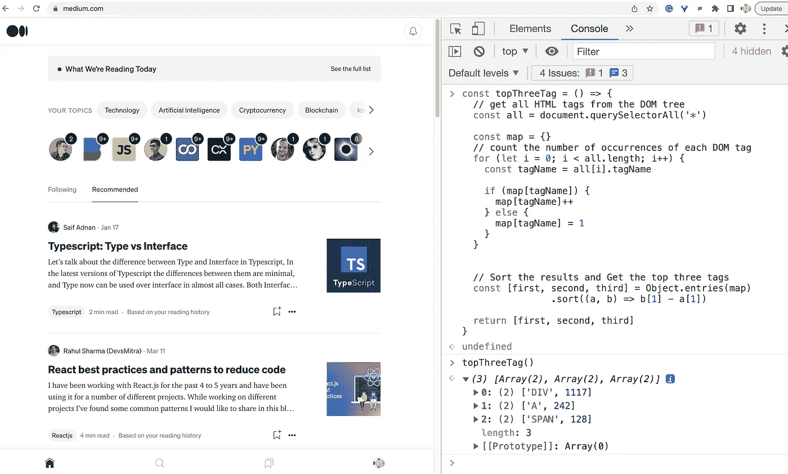
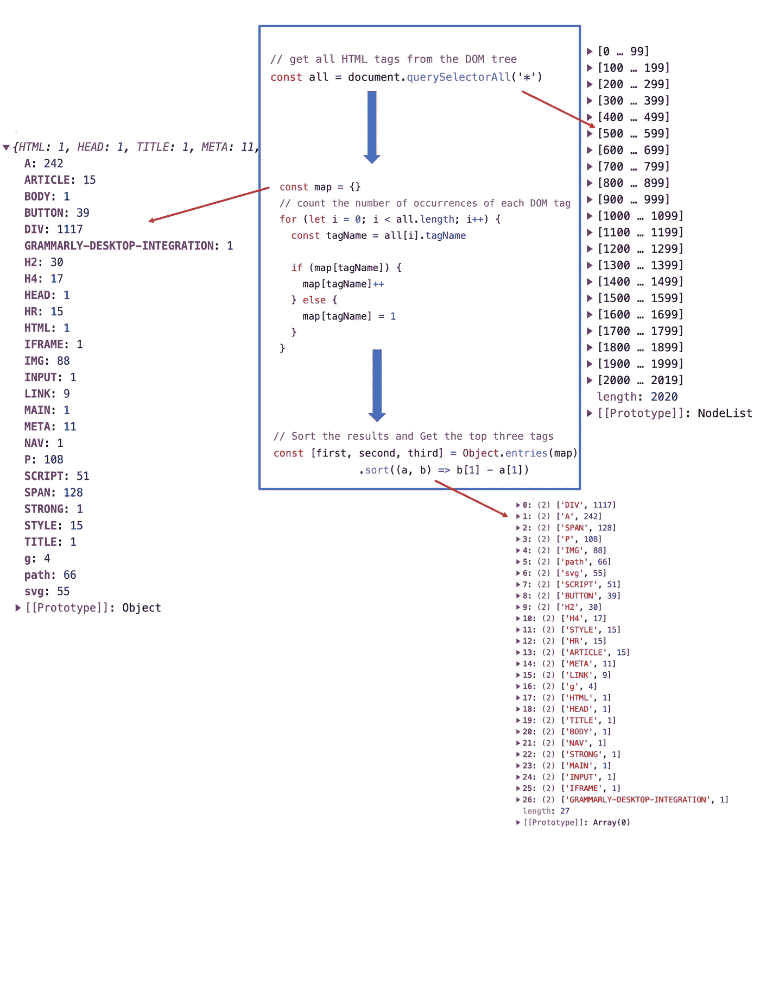

# 一个有趣的面试问题:统计网页上的前 3 个 HTML 标签

> 原文：<https://javascript.plainenglish.io/an-interesting-interview-question-count-the-top-3-html-tags-on-a-webpage-a5a6ed3e8167?source=collection_archive---------9----------------------->

## 如何计算网页上前 3 个 HTML 标签的指南。

前几天看到这个有趣的面试问题:写一个函数，可以用来统计一个页面上出现频率最高的三个 HTML 标签。

你会写函数吗？

问题本身并不难，我们只需要理清解题思路:

*   首先，从 DOM 树中获取所有 HTML 标签。
*   然后统计每个 DOM 标签出现的次数。
*   对结果进行排序。
*   获取前三个标签。

这里有一个解决方案:

示例:

中型主页上的前三个标签:

*   差异
*   A
*   跨度

用图表解释代码执行过程:

