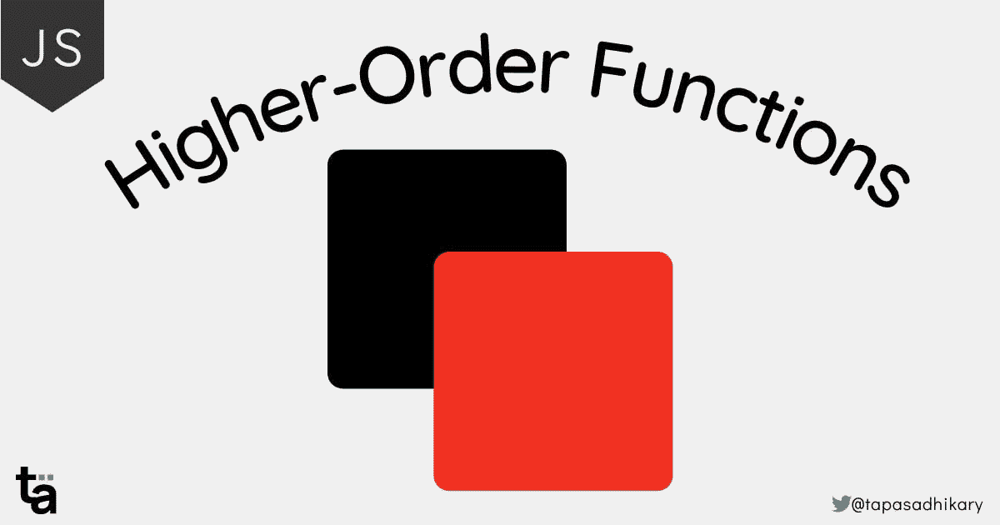

# 面向初学者的 JavaScript 高阶函数简介

> 原文：<https://javascript.plainenglish.io/an-introduction-to-higher-order-functions-in-javascript-for-beginners-100dc6e148a?source=collection_archive---------5----------------------->

## 高阶函数是 JavaScript 中广泛使用的函数式编程概念。让我们了解它们是什么及其好处。



# JavaScript 函数

函数是许多编程语言不可或缺的一部分，JavaScript 也不例外。在 JavaScript 中，`functions`是一等公民。您创建它们，将它们作为值分配，将它们作为参数传递给其他函数，还将它们作为函数的值返回。

这些灵活性有助于代码的可重用性、干净的代码和可组合性。今天我们将学习如何在 JavaScript 中充分利用函数。

如果您也想从视频内容中学习，本文也可作为视频教程在此处提供:🙂

*不要忘记* [*订阅*](https://www.youtube.com/tapasadhikary?sub_confirmation=1) *获取未来内容。*

# 什么是高阶函数？

`Higher-Order Function`是一个常规函数，它将一个或多个函数作为参数，并且/或者从中返回一个函数作为值。

下面是一个以函数为参数的函数示例。

```
// Define a function that takes a function as an argument.
function getCapture(camera) {
  // Invoke the passed function
  camera();
}// Invoke the function by passing a function as an argument
getCapture(function(){
  console.log('Canon');
});
```

现在让我们取另一个函数，它返回一个函数。

```
// Define a function that returns a function
function returnFunc() {
  return function() {
    console.log('Hi');
  }
}// Take the returned function in a variable.
const fn = returnFunc();
// Now invoke the returned function.
fn(); // logs 'Hi' in the console// Alternatively - A bit odd syntax but good to know
returnFunc()(); // logs 'Hi' in the console
```

以上两个例子都是高阶函数的例子。函数`getCapture()`、`returnFunc()`为高阶函数。他们要么接受函数作为参数，要么返回函数。

请注意,`Higher-Order function`不是必须同时接受一个参数和返回一个函数。执行任一操作都会使该函数成为高阶函数。

# 为什么使用高阶函数？如何创建高阶函数？

所以，我们知道了高阶函数是什么。现在，让我们理解为什么我们需要一个以及如何创建它？用几个简单的例子怎么样？

## 问题:代码污染和气味

让我们来看一组数字:

```
const data = [12, 3, 50];
```

现在，让我们编写代码，将每个数组元素增加一个数字，并返回修改后的数组。你可以考虑把它写成一个函数。

```
function incrArr(arr, n) {
  let result = [];// Iterate through each elements and
  // add the number
  for (const elem of arr) {
    result.push(elem + n);
  }return result;
}
```

所以，如果我们这样做:

```
incrArr(data, 2);
```

输出如下:

```
[14, 5, 52]
```

到目前为止很好。现在，如果我要求你写代码将`data`数组的每个元素减少一个数字，并返回修改后的数组？您可以考虑用几种简单的方法来解决它。首先，您可以编写如下函数:

```
function decrArr(arr, n) {
  let result = [];for (const elem of arr) {
    result.push(elem - n);
  }return result;
}
```

但这是大量的代码重复。我们已经在`decrArr()`函数中写入了`incrArr()`函数的几乎每一行。所以，让我们考虑一下这里的可重用性。

现在，您可能希望优化代码，让一个函数有条件地执行这两种操作。

```
function doOperations(arr, n, op) {
  let result = [];for (const elem of arr) {
    if (op === 'incr') {
      result.push(elem + n);  
    } else if (op === 'decr') {
      result.push(elem - n);
    }
  }return result;
}
```

所以，现在我们依靠第三个参数来决定操作是增加还是减少数组的编号。也有一个问题。如果我现在让你把数组的每个元素都乘以一个数会怎么样？你可以考虑在`doOperations()`函数中再增加一个`else-if`。但这并不酷。

对于每个新的操作，您需要改变核心功能的逻辑。它使你的功能受到污染，并会增加`code smells`的几率。让我们用`Higher-Order`函数来解决这个问题。

## 解决方案:高阶函数

首先要做的是为递增和递减操作创建纯函数[。这些函数应该一次只做一项工作。](https://blog.greenroots.info/what-are-pure-functions-and-side-effects-in-javascript)

```
// Increment the number by another number
function incr(num, pad) {
  return num + pad;
}// Decrement the number by another number
function decr(num, pad) {
  return num - pad;
}
```

接下来，我们将编写接受函数作为参数的`Higher-Order function`。在这种情况下，传递的函数将是上面定义的纯函数之一。

```
function smartOperation(data, operation, pad) {
  // Check is the passed value(pad) is not a number.
  // If so, handle it by assigning to the zero value.
  pad = isNaN(pad) ? 0 : pad;let result = [];
  for (const elem of data) {
    result.push(operation(elem, pad));
  }
  return result;
}
```

请仔细观察上述功能。第一个参数是要处理的数组。第二个参数是操作本身。这里我们直接传递函数。最后一个参数是要递增或递减的数字。

现在，让我们调用函数将数组元素增加 3。

```
const data = [12, 3, 50];
const result = smartOperation(data, incr, 3);
console.log(result);
```

输出如下:

```
[15, 6, 53]
```

现在试试减量操作怎么样？

```
const data = [12, 3, 50];
const result = smartOperation(data, decr, 2);
console.log(result);
```

输出:

```
[10, 1, 48]
```

您是否注意到，这次我们没有对函数进行任何更改来适应新的操作？这就是使用高阶函数的美妙之处。你的代码是无味无污染的。那么，我们现在如何适应乘法运算呢？简单，让我看看。

首先，创建一个函数来执行乘法。

```
function mul(num, pad) {
  return num * pad;
}
```

接下来，通过传递乘法运算函数`mul()`调用高阶函数。

```
const data = [12, 3, 50];
const result = smartOperation(data, mul, 3);
console.log(result);
```

输出:

```
[36, 9, 150]
```

太不可思议了。`Higher-Order functions`万岁。

# JavaScript 中内置的高阶函数

在 JavaScript 中，有大量高阶函数的用法。你可能在不知道它们是高阶函数的情况下使用它们。

例如，采用流行的数组方法，如、`map()`、`filter()`、`reduce()`、`find()`等等。所有这些函数都将另一个函数作为参数应用于数组的元素。

下面是一个`filter()`方法的例子，它根据我们作为函数参数的一部分传递给它的条件过滤数组元素。

```
const data = [1, 23, 45, 67, 8, 90, 43];const result = data.filter(function(num){
    return (num % 2 === 0);
});console.log(result); // [8, 90]
```

# 高阶函数与回调函数

高阶函数和回调函数之间总是有些混淆。高阶函数(HoF)和回调函数(CB)是不同的。

*   高阶函数(HoF):以另一个函数作为自变量和/或以值的形式返回一个函数的函数。
*   回调函数(CB):传递给另一个函数的函数。

# 结论

总之，`Higher-Order function`是 JavaScript 语言中的一个基本概念。我们需要找到机会在我们的编码实践中尽可能多地利用它。高阶函数与 pure 函数的结合将有助于保持代码的整洁和无副作用。

我将留给你这篇关于 JavaScript 中的`Pure Function`和`Side Effects`的文章。我希望你也喜欢阅读它。

[](https://blog.greenroots.info/what-are-pure-functions-and-side-effects-in-javascript) [## JavaScript 中有哪些纯函数和副作用？

### 函数允许我们逻辑地放置代码来执行任务。函数是 JavaScript 中的一等公民…

blog.greenroots.info](https://blog.greenroots.info/what-are-pure-functions-and-side-effects-in-javascript) 

您可以在这个 stackblitz 项目中找到本文中使用的所有源代码。

我希望你觉得这篇文章很有见地。感谢阅读。请点赞/分享，这样其他人也能收到。

*我们来连线。我也在这些平台上分享我在 JavaScript、网络开发、职业和内容方面的学习，*

*   [*在 Twitter 上关注我*](https://twitter.com/tapasadhikary)
*   [*订阅我的 YouTube 频道*](https://www.youtube.com/tapasadhikary?sub_confirmation=1)
*   [*GitHub 上的侧项目*](https://github.com/atapas)

*最初发布于*[*https://blog . greenroots . info*](https://blog.greenroots.info/higher-order-functions-in-javascript)*。*

*更多内容请看*[***plain English . io***](http://plainenglish.io/)*。报名参加我们的* [***免费每周简讯***](http://newsletter.plainenglish.io/) *。在我们的* [***社区【不和谐】***](https://discord.gg/GtDtUAvyhW) *获得独家获得写作机会和建议。*