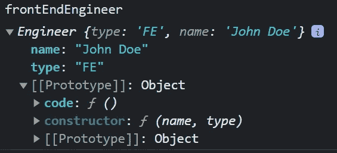
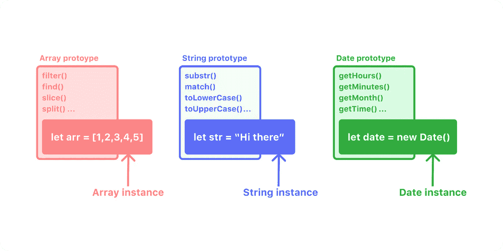
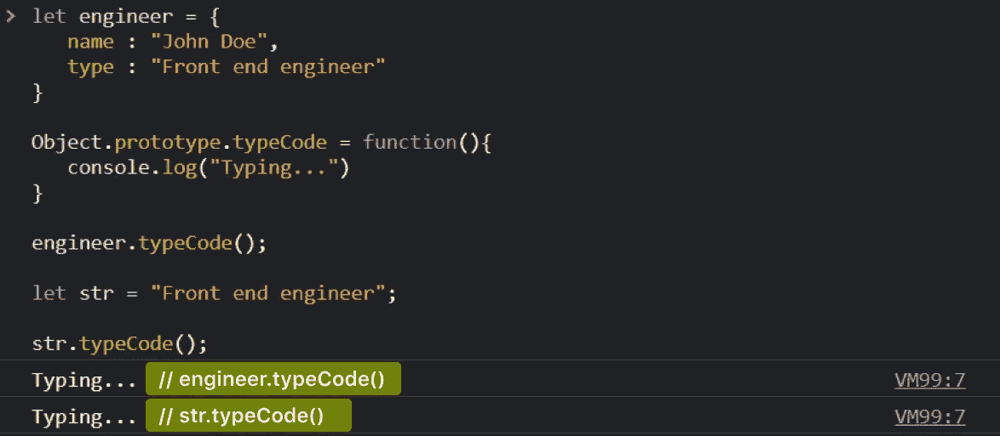
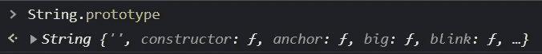
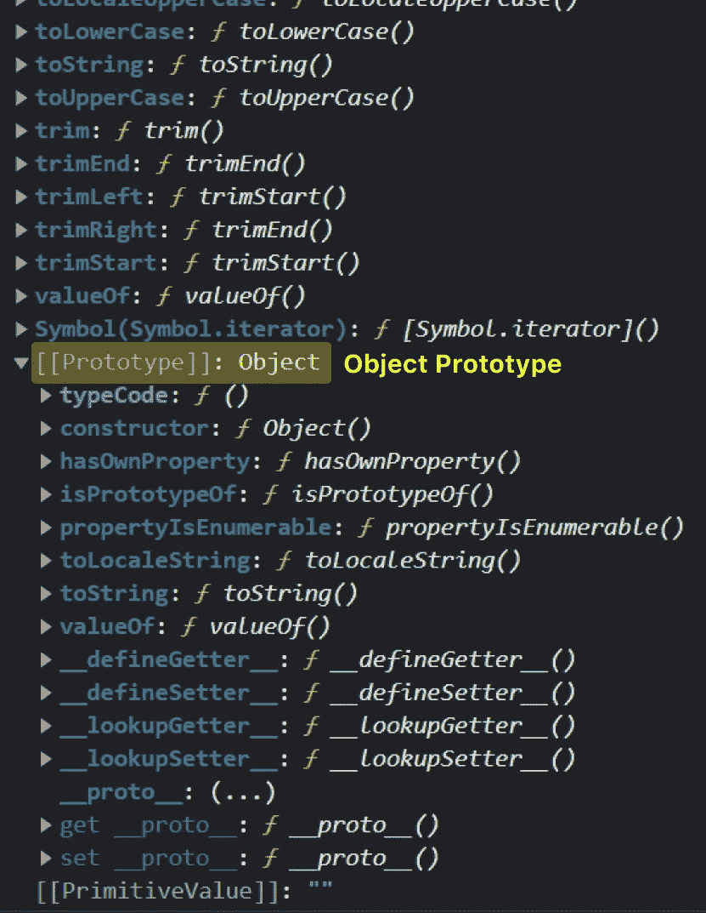
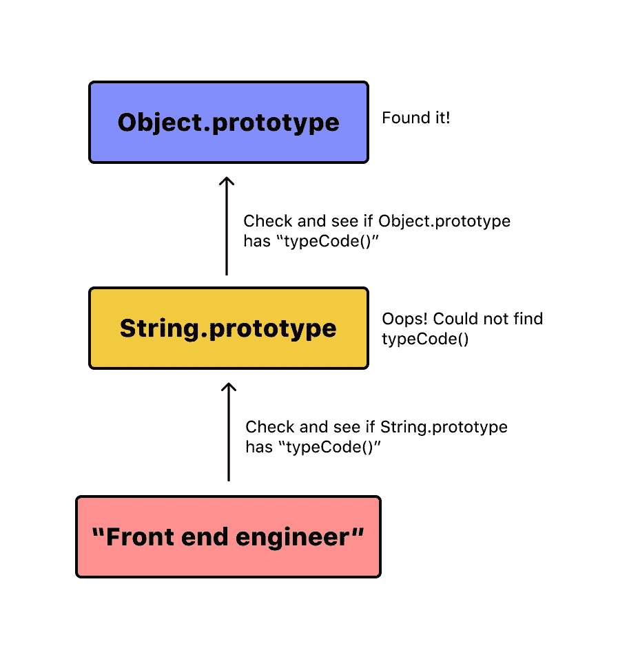
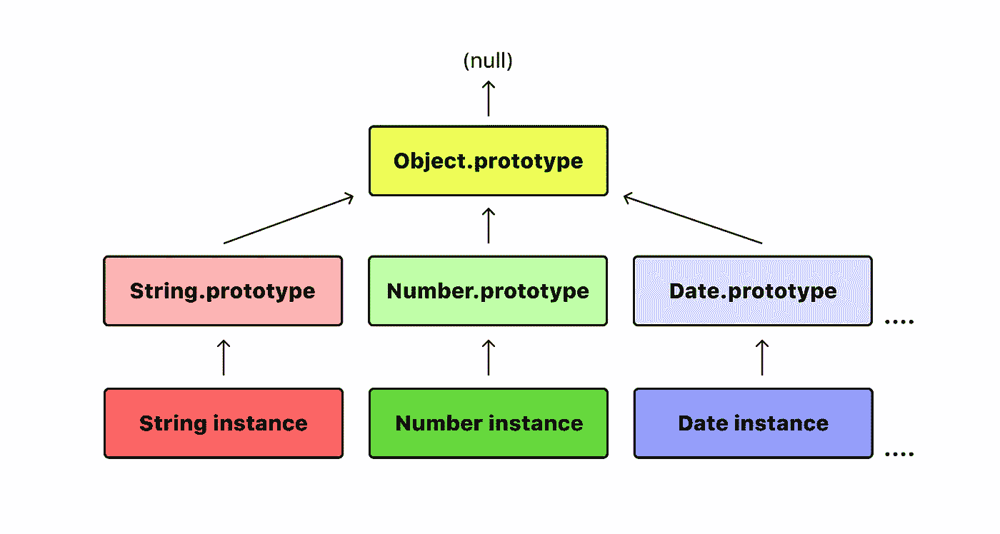

# 面向初学者的 JavaScript 原型介绍

> 原文：<https://javascript.plainenglish.io/an-introduction-to-javascript-prototype-for-beginners-e3e02b6fb168?source=collection_archive---------10----------------------->

## 理解什么是原型。


对于使用过基于类的语言(如 C++或 Java)的开发人员来说，JavaScript 可能会让人感到困惑。尽管我们在 JavaScript 中有一个 class 关键字，但它仍然不是真正基于类的，因为这个关键字只是语法糖。它试图模仿其他语言的类功能，但最终仍然是基于原型的。但是到底什么是原型呢？

你可以在这里观看这篇文章的视频版本。

## 什么是原型？

在基于类的语言中，我们有一个包含所有属性和方法的类。创建该类的对象时，这个新创建的对象可以访问该类中定义的属性和方法。

原型与类非常相似。它们充当我们在应用程序中创建的对象实例的**蓝图。这些对象实例除了自己的属性和方法之外，还可以访问原型的所有属性和方法。**

每当您在 JavaScript 中创建一个函数时，都会有一个**原型属性**附加到该函数上(我说属性是因为，在 JavaScript 中，函数也是一个对象)。每当您使用“ **new** ”关键字调用该函数时，创建的对象实例将继承该函数原型的所有属性。

```
const Engineer = function(name, type){
   this.type = type;
   this.name = name;
}Engineer.prototype.code = function(){
   return "Typing..."
}**//frontEndEngineer can access the code method
//present on Engineer.prototype**
const frontEndEngineer = new Engineer("John Doe", "FE");
```

Engineer.prototype 是我们刚刚谈到的原型对象。对象实例是从这个原型派生的。在您的开发工具中，如果您尝试 console.log 您的对象实例，您会像往常一样找到您的对象属性，但是还会有 **[[Prototype]]** 属性。



如果你仔细看，这就是这个函数的原型 ie Engineer.prototype。所以这里的要点是:

**Function.prototype =对象实例的原型**


您可以通过检查`Engineer.prototype == Object.getPrototypeOf(frontEndEngineer)`来验证这一点。这将返回**真值**。

(要访问实例的原型，可以在该实例上使用 **__proto__** ，或者使用**object . getprototypeof(instance)**。建议使用后者，因为 __proto__ 已被弃用。它现在可能仍然有效，但浏览器标准可能随时改变，完全忽略关键字，所以请记住这一点。)

## 这解决了什么问题？

现在，当您可以在函数(构造函数)本身内部添加属性时，为什么还要向原型添加属性呢？向构造函数添加方法和属性是一种非常有效的方法。但是当您的应用程序创建许多对象实例时，每次都会为每个实例创建一组新的属性。这可能会占用大量内存。

相反，如果我们将这些属性添加到函数的原型中，它们将由解决上述问题的所有实例共享。这是否意味着我们永远不应该在构造函数中添加属性？不完全是。

一种常见的方法是两种情况的混合。构造函数形成了私有变量的**闭包，所以所有想要访问这些私有变量的属性都应该添加到构造函数中。其余的属性应该添加到原型中。**

## 本地对象及其原型

像数组、字符串、日期这样的内置 JavaScript 对象也有各自的原型。例如，如果你看一下 Array 的原型，你会发现你每天都会用到的各种各样的方法和属性。任何时候创建任何原生 JS 对象的实例，都可以访问它的所有原型方法和属性。



Different prototypes and their instances

```
let arr = [1,2,3,4,5];
console.log(Object.getPrototypeOf(arr))  //Array prototypelet str = "Hello world!";
console.log(Object.getPrototypeOf(str)) //String prototypelet date = new Date();
console.log(Object.getPrototypeOf(date)) //Date prototype
```

## 原型链

现在我们知道了原型是如何工作的，让我们来看看原型链。

```
let engineer = {
   name : "John Doe",
   type : "Front end engineer"
}Object.prototype.typeCode = function(){
   console.log("Typing...")
}engineer.typeCode();let str = "Front end engineer";str.typeCode();
```

这段代码在开始时可能看起来很奇怪，但是请记住。我们首先创建一个具有一些属性的对象(工程师)。既然这是一个对象，它就可以访问对象原型的方法和属性。因此，我们向 Object.prototype 添加了一个自定义方法(虽然这很方便地添加了一个方法，并使所有其他对象都可以访问它，但最好不要向原生 JavaScript 对象添加/更改方法)。现在，如果您在 engineer 对象实例上运行此方法，您将获得预期的输出。

但这正是开始变得有趣的地方。下面我们还有一个字符串对象。如果您尝试在 string 上调用相同的自定义方法，即使它从未被添加到 String 原型中，它也能很好地工作。刚刚发生了什么？



The method works on both, object and string

这个工作的原因是因为**原型链接**。如果您再次查看 String.prototype，在最底部，您会看到另一个原型。你在最后看到的这个原型是对象原型。为什么我们在字符串原型中有一个对象原型？**因为 String.prototype 属性本身就是一个对象，JavaScript 中的每个对象都是从 Object prototype 派生出来的。因此，您创建的任何数据元素最终都可以从对象原型继承。**



String.prototype is an object, so it will also have the Object.prototype



Object.prototype inside String prototype

因此，JS 引擎将总是试图**首先**寻找本地存在于对象内部的属性。在我们的例子中，string 对象试图寻找 typeCode 属性。由于字符串没有属性，它试图在**它的原型**中寻找类型代码，即 String.prototype。它仍然无法找到 String.prototype 中的属性，所以它移动到 Object.prototype。最后，由于我们已经在 Object.prototype 中设置了属性，我们确实找到了它，并且它像预期的那样运行。



所有其他原型也会发生这种情况，因为它们本质上都是对象。所以他们最终指向了对象原型。最后，如果 JS 引擎无法找到对象原型内部的属性，它会返回“**未定义的**”，因为在对象原型之外没有任何东西可以遍历。



Prototype chain

## 关键要点

*   原型是一个**对象实例**的**蓝图**。
*   每当您创建一个函数时，一个**原型属性**会自动附加到它上面。(例如， **Object.prototype**
*   从函数创建的对象实例将有一个[[Prototype]]属性，该属性本质上等于函数的原型。
    **Object.prototype =对象实例的[[Prototype]]**
*   对象实例**共享原型属性**，这反过来节省了内存，而在构造函数中定义的属性是为每个实例重新创建的。
*   您可以在原型中定义自定义属性和方法，该原型的所有实例都可以访问这些属性和方法。理想情况下，你**不应该**操纵**原生 JavaScript 对象**的原型对象，因为这可能导致意想不到的行为。
*   由于 prototype 属性也是一个对象，每个 prototype 属性最终都是从 Object.prototype . So string . prototype 或 Array.prototype 派生而来，因此也有 object . prototype。
*   每当您试图访问一个对象的属性时，JS engine 都会在对象实例中查找它。如果没有找到，它会在对象的原型中查找。它会一直这样做，直到到达 Object.prototype，之后就没有其他原型需要遍历了。这个原型网络就是**原型链**。
*   Object.prototype 没有原型。

## 结论

如果您是 JavaScript 新手，您可能会对所有这些是如何工作的感到困惑。你可能需要反复阅读才能理解这个话题。像往常一样，MDN 有非常可靠的原型文档，所以请检查一下。

[**我也推荐大家看一下这个帖子的视频版，更好的理解。**](https://youtu.be/MErshtjCbH0)

如果你有任何其他疑问或建议，你可以在评论中提出，或者通过我的社交网站与我联系。干杯！

[YouTube](https://www.youtube.com/channel/UCaktnqx_IENyT5T2lJ3F09w)
[LinkedIn](https://www.linkedin.com/in/akilesh-rao-610357137/)
[Twitter](https://twitter.com/themangalorian)
[GitHub](https://github.com/AkileshRao)

*更多内容看* [***说白了就是***](https://plainenglish.io/) *。报名参加我们的**[***免费每周简讯***](http://newsletter.plainenglish.io/) *。关注我们* [***推特***](https://twitter.com/inPlainEngHQ) *和*[***LinkedIn***](https://www.linkedin.com/company/inplainenglish/)*。加入我们的* [***社区不和谐***](https://discord.gg/GtDtUAvyhW) *。**