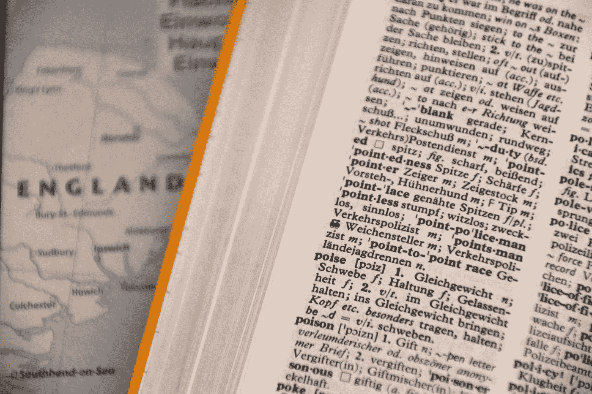

# 面向初学者的 JavaScript 地图介绍

> 原文：<https://javascript.plainenglish.io/an-introduction-to-map-in-javascript-for-beginners-347a97da936a?source=collection_archive---------11----------------------->

## JavaScript 中的地图是什么，如何使用？



Photo by [Waldemar Brandt](https://unsplash.com/@waldemarbrandt67w?utm_source=medium&utm_medium=referral) on [Unsplash](https://unsplash.com?utm_source=medium&utm_medium=referral)

简单来说，地图可以被认为是一种特殊类型的对象，它提供了比其他对象更多的好处，例如

*   它们可以有任何类型的数据类型作为它们的键，不像对象只限于字符串和符号。
*   在获取映射中的值时，插入顺序保持不变。
*   它们是可迭代的，即可以使用 for…of 来访问它们。

要初始化地图，请执行以下操作:

```
var map = new Map();
```

现在，如果我们看到地图的类型，它将是对象唯一的，但是地图和普通对象之间的主要区别是普通对象具有对象的原型属性，而地图具有地图类型的原型属性。

```
const obj = { name: 'Avinash' };
console.log(obj);Output --> **name**: "Avinash" 
          [[Prototype]]: Objectconst map = new Map();
map.set(name,'Avinash');
console.log(map);Output --> Map(1) {'' => 'Avinash'}[[Entries]]0: {"" => "Avinash"}size: 1[[Prototype]]: Map
```

因此，正如你在上面的例子中看到的，object 直接继承自 Object prototype，而在 map 的例子中，它继承自 Map Prototype。

现在，一旦我们清楚了 Map 的基本结构，让我们看看如何使用它，并在上面看到一些常用的属性/方法。

1.  地图的创建

```
let map = new Map();     // A new Map is created.
```

2.要在映射中添加值，使用 ***set*** 方法，其中第一个参数是关键参数，它可以是任何对象、函数、数组或任何类型的数据类型。

```
const newObj = {name : 'ABC'}map.set(true,"true");
map.set(function () {}, "Function defined");
map.set(newObj, "Object Defined");
map.set(1,"Number 1");console.log(map);Output 
*Map(4) {true => 'true', ƒ => 'Function defined', {…} => 'Object Defined', 1 => 'Number 1'*
```

3.要获得记录的数量或地图的大小，我们可以简单地使用 ***大小*** 属性。

```
console.log(map.size);    // 4
```

4.要删除特定的键，使用 ***delete*** 方法，将键作为要删除的参数传入。

```
console.log(map.delete(1));   // true
```

如果从地图中删除了属性，Delete 方法返回布尔值 true，如果在 delete 中提供了任何不存在的属性，则返回 false。

5.要重置地图，使用 ***清除*** 的方法。

```
map.clear();
console.log(map);   // Map(0) {size: 0}
```

6.要检查一个键是否存在于映射中，使用 ***has*** 方法。

```
console.log(map.has(nameObj));  // true 
```

这里要注意一点，上面的比较是基于引用的，所以如果直接传入一个对象，会返回 false。
更好的解决方案是将对象分配给一个变量，并将其用作一个键，同时使用 has 进行检查。

7.要获得一个地图对象的所有键，我们使用 ***键*** 方法。

```
console.log(map.keys()) // Output 
[Map Iterator] { true, [Function], { name: 'ABC' }, 1 }
```

8.同样地，为了获取地图对象中的值，我们使用了 ***值*** 方法。

```
console.log(map.values()) // Output[Map Iterator] {
  'true',
  'Function defined',
  'Object Defined',
  'Number 1'
}
```

9.要获得 map 对象中的键值对，使用 ***entries*** 方法。

```
console.log(map.entries()); // Output[Map Entries] {
  [ true, 'true' ],
  [ [Function], 'Function defined' ],
  [ { name: 'ABC' }, 'Object Defined' ],
  [ 1, 'Number 1' ]
}
```

10.迭代地图。与对象不同，地图是可迭代的，即它们可以与 for…of 一起使用。

```
for (let value of map) {console.log(value);}// Output [ true, 'true' ]
[ [Function], 'Function defined' ]
[ { name: 'ABC' }, 'Object Defined' ]
[ 1, 'Number 1' ]
```

11.使用 foreEach()也可以迭代映射。

```
map.forEach((value, key) => console.log(`Key - ${key} has value - ${value}`));Key - true has value - true
Key - function () {} has value - Function defined
Key - [object Object] has value - Object Defined
Key - 1 has value - Number 1
```

所以，简单地说，这是关于使用地图的基本知识，以及什么时候可以在物体上使用它们。

如需快速参考，请参考下面的备忘单:


Cheatsheet for Map

我希望你能在这里学到一些新东西。

你可以从[这里](https://medium.com/@avinash.dev21987)阅读我的其他文章，此外你还可以订阅我的时事通讯，获取我发表的最新话题。

*更多内容请看*[***plain English . io***](https://plainenglish.io/)*。报名参加我们的* [***免费周报***](http://newsletter.plainenglish.io/) *。关注我们关于*[***Twitter***](https://twitter.com/inPlainEngHQ)*和**[***LinkedIn***](https://www.linkedin.com/company/inplainenglish/)*。加入我们的* [***社区***](https://discord.gg/GtDtUAvyhW) *。**