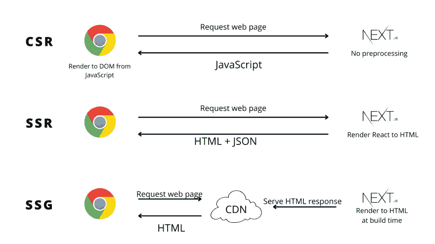

# 面向初学者的 Next.js 介绍

> 原文：<https://javascript.plainenglish.io/an-introduction-to-next-js-for-beginners-b15d02103369?source=collection_archive---------14----------------------->

## 您需要的唯一 Next.js 指南

在撰写本文时，Next.js 已经是一个广为人知的 React 应用程序框架。老实说，它受欢迎和被广泛采用有很多原因，但我今天不打算进入那个兔子洞(我已经*做过很多次了*😎).相反，我会带你通过一系列问题(别担心，*我会和你一起回答这些问题*)来更好地解释它。

***免责声明*** *:我说的*初学者*是指****next . js****中的初学者。这篇文章是为那些已经使用 React 有一段时间，并且想认真使用 React 进行应用程序开发的开发人员准备的。所以，如果你不知道 React 的基本原理，那么读起*[*React Docs*](https://reactjs.org/docs/getting-started.html)*反而会是个不错的主意。*

如果你已经决定继续，让我们让聚会开始。

# Next.js 是什么？

**Next.js** 是一个 React *框架*，为开发者提供额外的优化和开箱即用的配置。

*但是，这是什么意思？*

为了更好地回答这个问题，我们应该先回答另一个问题。

# 为什么是 Next.js？

这个问题的答案从“什么是 React？”，(*老兄，现在你不过是在兜圈子*，朋友，忍忍吧。

React 是一个用于以声明方式构建 web 应用程序的库。

React 为我们做了很多事情。它也有很大的社区和支持，但它缺乏“意见”它是一个*库*，所以它的定义是最小的，并给开发人员留下了许多繁重的工作，如路由、资产管理和代码分割等优化。虽然这提供了灵活性，但也导致了错误的选择和糟糕的应用程序组织。

这就是 **Next.js** 的用武之地。它提供了一套正确的工具，并指导您如何充分利用它们。

它为提供内置支持

*   基于目录的路由
*   为 SEO(搜索引擎优化)
    - SSR(请求时的服务器端渲染)
    - SSG(构建时的静态站点生成)
*   API 路线
*   中间件
*   图像优化
*   代码分割

仅举几个例子。

它在做所有这些事情的同时

*   开发人员最佳体验
*   维护开销降至最低

# Next.js 怎么样？

等等，等等……在你开始说我的糟糕英语(*因为你没看复仇者联盟 3：无限战争*)之前，我想请你看一下[这个视频](https://www.youtube.com/watch?v=VIoYMIDB_iU)来理解这个笑话(这对我很重要😅).

回到这个问题， **Next.js** 通过在 React 已经提供的基础上构建，掩盖开发者想要的东西。例如，React 非常擅长用声明性代码开发应用程序，但是它缺乏路由功能(*，因为它没有自己的*)。 **Next.js** 为基于路径的路由提供了完美的解决方案。

**Next.js** 通过解决包括 React 在内的客户端应用的 SEO 问题而变得相当流行。

理想情况下，React 应用程序是在客户机/浏览器上呈现的，这有几个缺点，比如

*   由于较大的包大小和客户端上的 JavaScript 执行，初始加载较慢
*   由于客户端渲染，搜索引擎优化不好
*   来自客户端的不必要的网络调用导致网络瀑布

**Next.js** 通过在向用户发送响应之前预渲染 React 应用程序来解决这个问题。

*预渲染是将 React 组件编译成它们在服务器端的 HTML 布局。*

预渲染使用户体验更好，因为:

*   它提供了一个更小的 JavaScript 包，减少了在客户端下载和处理它的时间
*   由于计算能力更强，服务器上的渲染速度更快
*   在服务器上获取数据使我们避免了客户端的网络调用。最重要的是，如果数据源是 **Next.js** API 路由，速度会快得多。

**Next.js** 提供了两种进行预渲染的方法: *SSR* ，它在请求时生成 HTML(适用于使用动态数据的页面)，以及 *SSG* ，它在构建时生成 HTML(更适用于静态页面)。

下图解释了 *CSR* (客户端渲染)与 *SSR* (服务器端渲染)与 *SSG* (静态站点生成)之间的区别:

*SSR* 和 *SSG* 都使我们能够利用 React 的简单性，而不影响用户体验。 **Next.js** 是一个很棒的框架，它会根据您构建页面的方式为您选择最佳的呈现策略——这使得 **Next.js** 成为一个健壮的框架，可以使用 React 交付生产就绪的应用程序。

你已经可以看出我对 **Next.js** ( *很难隐藏*)的喜爱。我将通过继续这个 **Next.js** 初学者课程的文章和 [YouTube](https://www.youtube.com/AnshumanBhardwaj) 视频来释放这份爱。
我们将详细讨论 **Next.js** 的基础知识，并使用 **Next.js、**构建一个生产就绪的应用程序，包括开发和部署。所以，一定要关注我，获取最新的更新。

希望这篇文章对你有帮助！如果你有任何反馈或问题，你可以在下面的评论中提出来。更多此类文章，请在 Twitter 上关注我。

*下次见！*

*原载于 2022 年 4 月 18 日*[*https://theanshuman . dev*](https://theanshuman.dev/articles/nextjs-explained-for-beginners-c2g)*。*

*更多内容请看*[***plain English . io***](https://plainenglish.io/)*。报名参加我们的* [***免费每周简讯***](http://newsletter.plainenglish.io/) *。关注我们关于*[***Twitter***](https://twitter.com/inPlainEngHQ)*和*[***LinkedIn***](https://www.linkedin.com/company/inplainenglish/)*。加入我们的* [***社区不和谐***](https://discord.gg/GtDtUAvyhW) *。*