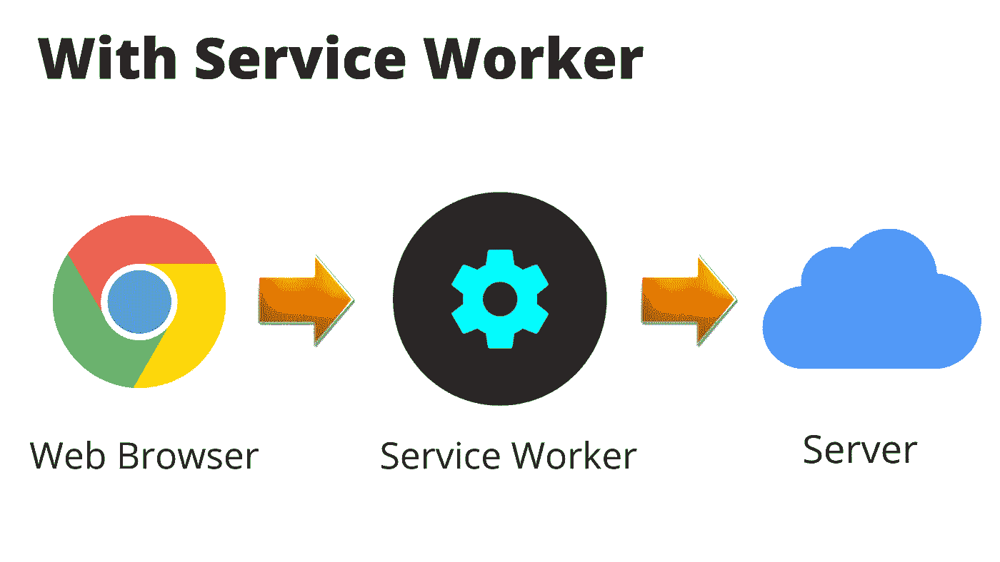
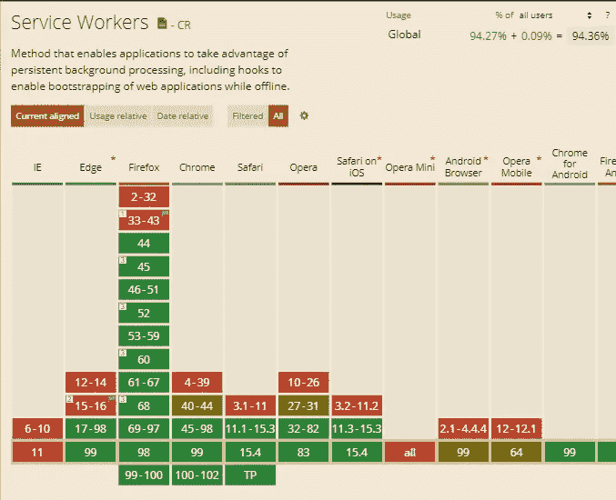

# 服务人员概述

> 原文：<https://javascript.plainenglish.io/an-introduction-to-service-workers-in-javascript-c519657cce71?source=collection_archive---------8----------------------->

## JavaScript 中的服务工作者介绍。

Dino game

我们都喜欢恐龙游戏。说到底谁没有！每当我们断网的时候，我们都喜欢玩这个游戏。

但是，与此同时，我们的客户不会喜欢玩这个游戏。相反，作为开发人员，我们希望我们的客户始终与 web 应用程序保持联系。

如果我们不能提供 web 应用程序和客户之间的互动，公司可能会永远失去潜在的客户。因此，作为开发人员，我们需要整合最新的技术解决方案，始终为客户提供更好的用户体验。这是服务人员可以帮助我们解决这个问题的地方。

现在，问题来了，什么是服务工作者？用在什么地方？所有的浏览器都支持服务人员吗？

所以，我们来回答这些问题。

服务工作者是 JavaScript 文件或由独立于网页的浏览器在后台运行的单个文件。

它还处理由浏览器或网页触发的事件。

它不需要打开网页，因为它在后台运行。此外，不需要任何标记。

With Service Worker

Service Worker 最重要的部分是处理 fetch 事件、拦截和响应网络请求的能力。

这有效地将服务人员置于网络和浏览器之间，允许他们即使在没有互联网连接的情况下也能加载内容。

## **服务人员用例:**

开发人员使用服务人员的主要原因如下:

1.对 web 应用程序的脱机支持

2.缓存资产& API 调用——将文件副本保存在缓存或临时存储区域中，以便可以更快地检索它们的技术称为缓存。

3.用于与用户重新互动的推送通知(推送和通知 API) —推送通知是可点击的弹出消息，显示在消费者的移动屏幕上，无论他们使用的是 iPhone 还是 Android 智能手机。
它们是企业与客户沟通的一种方式，允许他们发送信息、报价和其他信息。

4.后台同步—这是一个新的 Web API，允许推迟操作，直到用户拥有稳定的互联网连接

## 浏览器支持:

Browser Support for Service Workers

如上图所示，所有主流浏览器都支持它。

## **最终想法:**

这是对什么是服务人员，服务人员用在什么地方的简单理解。此外，还提供了不同 web 浏览器支持的详细信息。

*更多内容请看*[***plain English . io***](https://plainenglish.io/)*。报名参加我们的* [***免费周报***](http://newsletter.plainenglish.io/) *。关注我们关于*[***Twitter***](https://twitter.com/inPlainEngHQ)*和*[***LinkedIn***](https://www.linkedin.com/company/inplainenglish/)*。加入我们的* [***社区不和谐***](https://discord.gg/GtDtUAvyhW) *。*