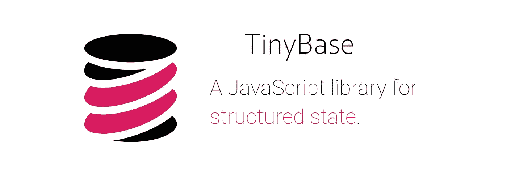

# 用于结构化状态的开源 JavaScript 库

> 原文：<https://javascript.plainenglish.io/an-open-source-javascript-library-for-structured-state-ea1e5865566a?source=collection_archive---------17----------------------->

## 它的大小和简单性可能使它在未来成为一个被广泛使用的库。

在 MIT 许可下发布的 TinyBase 的第一个版本是用 JavaScript 管理应用程序状态的一种漂亮而聪明的方式。

TinyBase 在开源软件的生态系统中仍然是新鲜事物，仍然没有在关键的 web 项目中使用。但是**它的规模和简单性，再加上写得非常好的文档，可能会使它在未来成为一个被广泛使用的库。**

[TinyBase](https://tinybase.org/) 它也是极其罕见的使用 0 依赖关系的 [npm 库](https://www.npmjs.com/package/tinybase/v/1.0.4)之一(包的大小只有 13.354 字节！).



[www.tinybase.org](http://www.tinybase.org)

一般来说， [TinyBase](https://tinybase.org/) 适合在客户端应用程序中使用，比如浏览器或富网站，在这些应用程序中，大小和性能是非常重要的，并且您需要一些用于管理表格数据结构的样板文件。

## 可以用节点安装 [TinyBase](https://tinybase.org) :

```
[npm install tinybase](https://www.npmjs.com/package/tinybase/v/1.0.4)
```

或者简单地将它作为来自网页上的 CDN 的 UMD 脚本。

```
<script src="[https://unpkg.com/tinybase/lib/umd/tinybase.js](https://unpkg.com/tinybase/lib/umd/tinybase.js)"></script>
```

## 它将其处理的状态分为表格、行和单元格。

“ [createStore](https://tinybase.org/api/store/functions/creation/createstore/) ”函数是库的主要入口点。您可以从存储开始创建表，并定义一个自定义模式，如下例所示。

## **真正的神奇始于** [**听者**](https://tinybase.org/api/store/interfaces/store/store/methods/listener/) **，可以任意粒度注册。**

有了这种发布/订阅模型，当一个特定的项目(每一种项目，真的！)由于用户交互或其他因素而发生的变化。您可以选择订阅特定的元素 ID，或者订阅每个元素。

## 另一个很棒的功能是[检查点](https://tinybase.org/api/checkpoints/interfaces/checkpoints/checkpoints/)。

可以保存商店在特定时刻的状态，然后向前或向后浏览。无数的 web 应用程序可以依靠这种机制来实现“撤销/重做”操作。

## 也可以为快速查找创建[索引](https://tinybase.org/guides/metrics-and-indexes/using-indexes/)。

索引使您能够快速查找和显示筛选的数据，不是从性能方面，而是从可读性方面。

## 您可以将数据保存到浏览器的会话存储中

这对于在浏览器会话或重新加载之间保存数据的常见用例非常有用。

## 总之:

TinyBase 它是开源的，简单，体积小，速度非常快。

让我们试一试。

*更多内容看* [***说白了。报名参加我们的***](http://plainenglish.io/) **[***免费周报***](http://newsletter.plainenglish.io/) *。在我们的* [***社区获得独家访问写作机会和建议***](https://discord.gg/GtDtUAvyhW) *。***