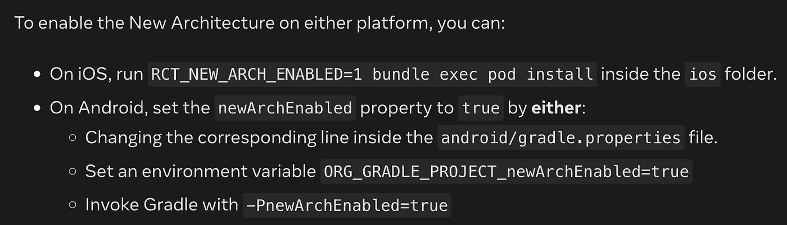
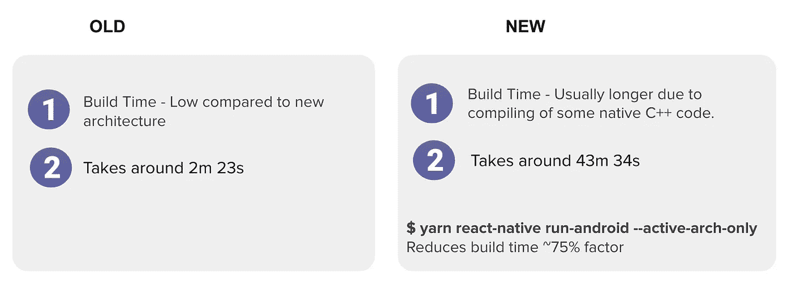
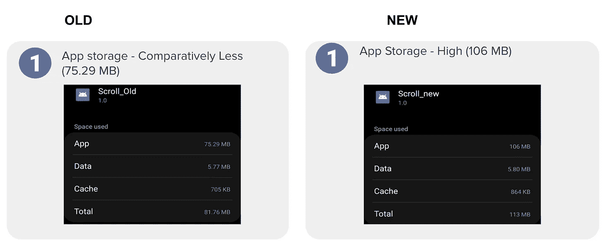
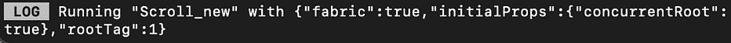
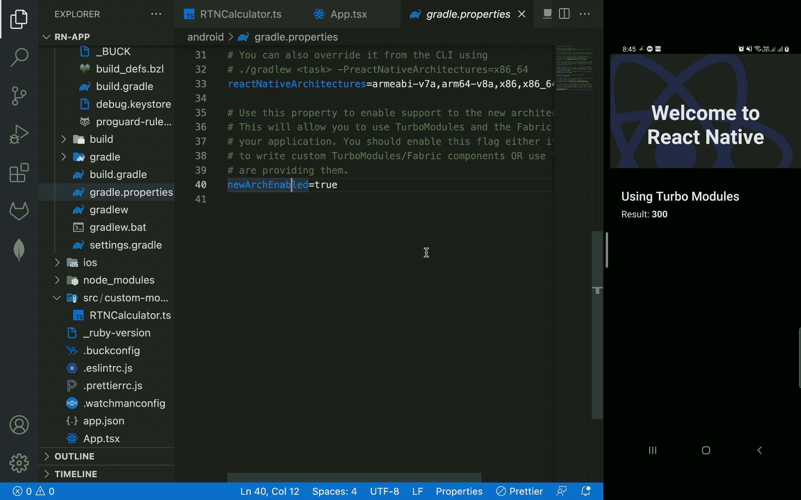

# 新反应原生架构的分析与结果

> 原文：<https://javascript.plainenglish.io/analysis-of-react-native-new-architecture-with-results-1c157ab9c9c8?source=collection_archive---------2----------------------->

欢迎来到另一个博客！这个博客将是一个特别的博客，因为在这个博客中，我将讨论我在 React Native & Flutter——Hybrid meetup 之前发表的技术演讲的摘要。meetup 由为 React 本地爱好者组织免费社区聚会的 GeekyAnts 提供支持。作为 meetup 的发言人之一，我演讲的题目是— ***新 React 本地架构的成果。***

这次演讲更像是一次技术分析，我讨论了新的 React Native 架构在性能和结果方面的改进。这是通过新旧架构 **(react 原生版本— 0.69.5)** 在应用存储、构建时间和应用加载时间方面的比较实现的。此外，我还讨论了新架构的主要亮点，如 Turbo 模块的延迟加载(以及创建它们有多容易)以及下一代视图管理器 Fabric。

> 想看整个聚会的视频，请点击这里的链接:[https://youtu.be/T1LyKRbpYxE](https://youtu.be/T1LyKRbpYxE)

[https://youtu.be/T1LyKRbpYxE](https://youtu.be/T1LyKRbpYxE)

在开始之前，我想建议你看看我以前的博客(如果你还没看过的话)，这样你就能更清楚地了解我，因为这篇博客是我以前博客的延伸版。在这里找到链接: [**React Native 新架构—旧 Vs 新**](/react-native-new-architecture-old-vs-new-d0130f42bc79?source=your_stories_page-------------------------------------) **。**

首先，我们需要做以下设置-

通过这样的设置，它可以在 iOS 和 android 上自动启用 turbo 模块和结构，这样我们就可以开始将这些功能作为新架构的一部分来使用。此外，确保您使用最新的 react 原生版本构建应用程序，否则您可能需要更新 gradle 版本，并手动更新 ios 和 android 上的 turbo 模块和结构。

# **分析**

**注意**:分析是对 react 原生旧版本 0.67.0(采用旧架构)和 react 原生新版本 0.69.5(采用新架构)进行比较，结果仅考虑 android 版本。

*   **App 构建时间:**

对于使用一些卡组件构建非常基本的应用程序，与旧架构相比，新架构的构建时间通常更长。

你可以运行**$ yarn react-native run-Android-active-arch-only**来减少大约 75%的构建时间。

*   **存储分析:**

对于相同的应用程序，使用新架构构建的应用程序的存储也比旧架构高。

*   **织物渲染器和卷轴分析:**

我们知道基于桥的架构的缺点，在新的架构中，这被 JSI 层所取代。为了分析使用 Flatlist 的滚动效果，我采用了一个包含 1000 个列表项的数据集，执行连续滚动，并且使用新旧架构构建了相同的应用程序。

***结果*** :从 UI 方面来看没有如此显著的差异，但我想提一下，与使用旧架构构建的相同应用相比，使用新架构，我们获得了更平滑的滚动效果。

*   **App 加载时间分析:**

应用程序加载时间参数是最重要的参数之一，因为对于任何应用程序，加载/应用程序启动时间应该非常短。这为客户提供了良好的用户体验。此外，如果您的应用程序启动时间很长，那么您可能会失去您的客户。

与使用旧架构构建的应用程序(加载时间为 1.2 秒)相比，使用新架构构建的应用程序加载时间相对较短(加载时间为 0.86 秒)，并且我们获得了一些性能优势。

可能的原因是-

1.  默认情况下， **Hermes** 将被设置为下一个 react 原生版本的默认 JS 引擎。
2.  turbo 模块的延迟加载可防止不必要的本地模块加载，如访问位置、摄像头、蓝牙等。这减少了应用程序的加载时间。

*   **涡轮模块的延迟加载:**

有了 Turbo 模块的概念，我们就不需要预先加载原生模块了。它在 JavaScript 中以同步方式运行，并延迟加载到内存中，使应用程序启动更快。新的架构需要用 JavaScript 的类型化方言指定的接口。您可以使用 TypeScript 来创建这个规范，或者如果您想使用 Javascript，您可能需要使用 Flow。该规范只是定义了 Turbo 模块应该执行的接口。这个规范的实现应该用本机代码编写。现在，codegen 将使用这些规范来生成强类型语言的代码。

**创建我们自己的 turbo 模块-**

**结论:**

借助 react 原生新架构，我们在应用加载时间、turbo 模块的延迟加载和 Fabric view manager 方面获得了一些性能优势。

虽然在存储和应用程序构建时间等参数方面有一些小缺点。但是因为我们都知道 2022 年将是新的 react 原生架构之年，所以到今年年底，我们可以期待一些更稳定的版本，其中这些问题可能会得到解决，我们可以围绕这些空间获得一些更清晰的信息。新架构目前处于实验阶段 T3。

到目前为止，我可以有把握地说，新的体系结构非常棒，您应该开始构建您的跨平台应用程序，并尝试自己尝试这些参数。您肯定会发现惊人的结果和性能优势，这必将扩大您的应用程序。

想在 React Native 上看到更多这样令人惊叹的博客，请看看这些—

1.  [所有关于 React Native 的初学者:优点、缺点和未来](/a-beginners-friendly-article-on-react-native-simply-explained-f3098b1873ec?source=your_stories_page-------------------------------------)
2.  [最佳编码实践— React 本地版 2022](/best-coding-practices-react-native-edition-2022-da833c8161de?source=your_stories_page-------------------------------------)

感谢阅读。

*更多内容看* [***说白了。报名参加我们的***](https://plainenglish.io/) **[***免费周报***](http://newsletter.plainenglish.io/) *。关注我们上* [***推特***](https://twitter.com/inPlainEngHQ) ，[***LinkedIn***](https://www.linkedin.com/company/inplainenglish/)***，***[***YouTube***](https://www.youtube.com/channel/UCtipWUghju290NWcn8jhyAw)***，以及****[***不和***](https://discord.gg/GtDtUAvyhW)*** *对成长黑客感兴趣？检查出* [***电路***](https://circuit.ooo/) ***。***