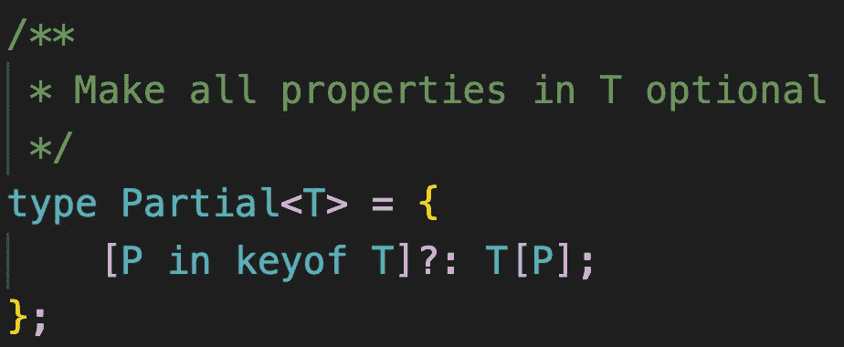
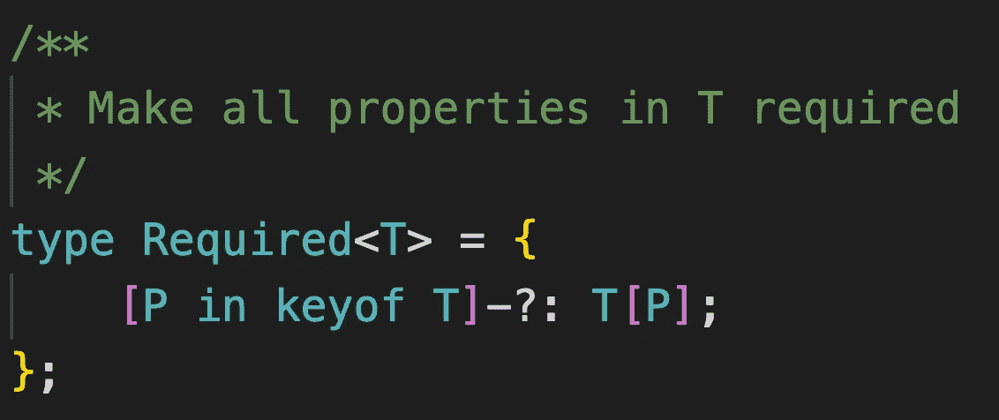
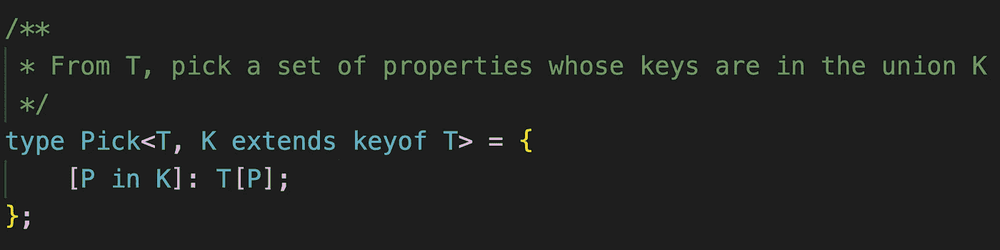
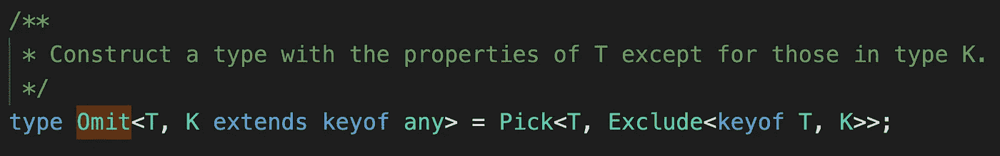
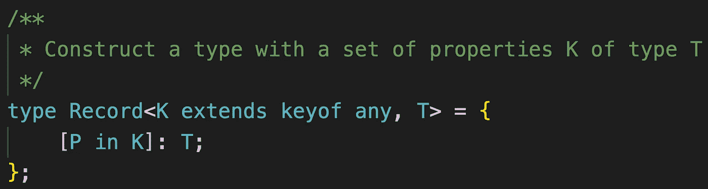
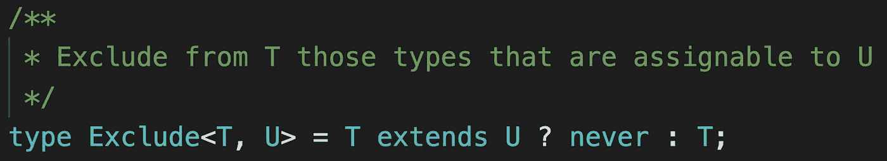
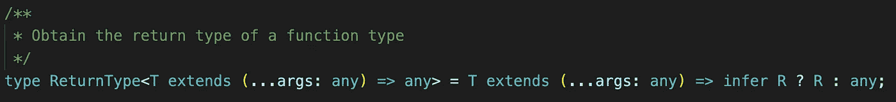
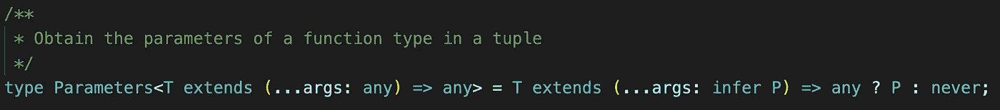

# 分析 TypeScript:幕后的实用程序类型

> 原文：<https://javascript.plainenglish.io/analyzing-typescript-utility-types-under-the-hood-9855b8a33d28?source=collection_archive---------4----------------------->

## 让我们研究一下内置实用程序类型是如何实现的

Photo by [Emiliano Vittoriosi](https://unsplash.com/@emilianovittoriosi?utm_source=medium&utm_medium=referral) on [Unsplash](https://unsplash.com?utm_source=medium&utm_medium=referral)

TypeScript [实用程序类型](https://medium.com/@mariusbongarts/advanced-typescript-with-code-challenges-utility-types-e8c30efd9021)旨在让开发者的生活更轻松。它们随着每个 TypeScript 版本的发展而发展，并且添加了新的版本。

查看内置实用工具类型的实现是掌握高级 TypeScript 功能的一个很好的练习。虽然我已经详细讨论了大多数高级 TypeScript 特性，但是我可以通过撰写本文来学习和重申我的知识。

> 即使是打字稿的创作者也只用水做饭。

如果您想在阅读本文之前复习一下知识，这里有一个关于许多高级 TypeScript 特性的文章的概述:

Overview Typescript Features

 [## 网络亮点- PDF 和网络荧光笔

### Web Highlights 是一个在 Web 上突出显示文本的工具，可以更有效地组织您的研究。提升你的…

web-highlights.com](https://web-highlights.com/) 

***免责声明:*** *本文假设您已经掌握了 TypeScript 实用工具类型的知识。如果你还没有，可以在本文* ***中进一步了解他们* [***。***](https://medium.com/@mariusbongarts/advanced-typescript-with-code-challenges-utility-types-e8c30efd9021)**

# 部分的

`Partial<Type>`接受一个[泛型类型](https://medium.com/@mariusbongarts/advanced-typescript-generics-1b30d6b5dd49)，并使所有属性**成为可选属性**。

下面是 TypeScript 的实现:

**Partial** utility type

在 Partial 的实现中，我们看到 TypeScript 使用了[映射类型](/advanced-typescript-with-code-challenges-mapped-types-6825c7fc984a)。剧透:这不会是最后一个使用映射类型的[实用程序类型](https://medium.com/@mariusbongarts/advanced-typescript-with-code-challenges-utility-types-e8c30efd9021)。因此，理解这一特性至关重要。

 [## 具有代码挑战的高级类型脚本:映射类型

### 学习高级的 TypeScript 特性，并将它们应用到实际的代码练习中。

javascript.plainenglish.io](/advanced-typescript-with-code-challenges-mapped-types-6825c7fc984a) 

我们可以看到，`Partial<T>`接受了一个类型`T`，并遍历它的键，使用`?`使所有属性都是可选的。最后，使用类型索引来获取迭代属性的类型。

# 需要

如果你理解了`Partial`类型，那么`Required<Type>`助手很简单，因为它做了相反的事情——使得所有属性都是**必需的。**

下面是实现过程:

**Required** utility type

同样，映射类型用于遍历泛型类型`T`的键。与`Partial`类型相比，我们希望所有属性都是必需的。这就是为什么 TypeScript 通过使用减号`-`去掉了`?`修饰符。

如果您还没有看到这个语法，那么理解您可以通过添加前缀`-`或`+`来删除或添加修饰语可能会有所帮助。如果不添加前缀，则假定为`+`。

因此，这两个接口是相同的:

还有那两个:

# 挑选

`Pick<Type, Keys>`类型通过从`Type`中挑选一组属性`Keys`(字符串文字或字符串文字的[联合](https://medium.com/@mariusbongarts/advanced-typescript-with-code-challenges-union-types-2474c6e62097))来构造类型。

这种类型是如何设置的:

**Pick** utility type

这变得有点复杂，但是如果我们理解 TypeScript [泛型](https://medium.com/@mariusbongarts/advanced-typescript-generics-1b30d6b5dd49)和[映射类型](/advanced-typescript-with-code-challenges-mapped-types-6825c7fc984a)，这就非常简单了。

泛型`Pick`类型接受两个泛型`T`和`K`。虽然`T`可以是任何东西，但是第二个泛型`K`联合类型需要是`T`的一个键。

一旦客户机提供了有效的泛型类型，它就简单地遍历所提供的联合类型`K`的键，并通过使用索引来访问它的属性类型。

# 省略

理解`Omit<Type, Keys>`类型很容易，因为它与`Pick`类型相反。我们没有将`Keys`添加到我们的类型中，而是从原来的类型中选择了`Keys`。

让我们看一下实现:

**Omit** utility type

不可否认，它变得有点复杂。就像`Pick`类型一样，`Omit`类型接受两个泛型`T`和`K`。这里的区别是第二个泛型`K`需要是`any`的一个键。`any`的按键有:`string`、`number`或`symbol`。

然后，它利用`Pick`类型并使用`Exclude`助手类型来删除那些可分配给给定`K`联合类型的类型。

**为什么** `**K**` **是从** `**any**` **延伸而来而不是** `**T**` **？**

如果你还在关注，你可能会遇到同样的问题。至少我很迷茫，觉得自己错过了什么。从`T`扩展会给我们更好的自动完成和类型安全。

因此，我做了谷歌研究，发现有一个公开的 [Github 问题](https://github.com/microsoft/TypeScript/issues/30825)有相同的想法。尽管如此，仍然有很多讨论，因为当从`T`继承时，可能会有可能导致问题的边缘情况。

你对此有什么看法？就个人而言，我希望有一个更严格版本的`Omit`类型。

# **记录**

`Record<Keys, Type>`类型对于定义具有特定键和值类型的类型很有用。

实现如下所示:

**Record** utility type

第一个泛型参数`K`定义了对象的键，这些键继承自`keyof any` **(字符串，数字，符号)**。第二个泛型定义了我们的属性键的类型。

现在，它再次简单地遍历提供的类型`K`的键，并且类型`T`被赋值。

# 排除

类型从联合中移除类型。这种类型是前面提到的第一种利用[条件类型](/advanced-typescript-with-code-challenges-conditional-types-8dd4e63818a5)的实用程序类型。

 [## 具有代码挑战的高级类型脚本:条件类型

### 学习高级的 TypeScript 特性，并将它们应用到实际的代码练习中

javascript.plainenglish.io](/advanced-typescript-with-code-challenges-conditional-types-8dd4e63818a5) 

[条件类型](/advanced-typescript-with-code-challenges-conditional-types-8dd4e63818a5)是理解实用程序类型实现的另一个关键类型脚本特性。下面是`Exclude`类型的实现:

**Exclude** utility type

该类型采用两个泛型:

*   `T`代表任何工会类型
*   `K`哪一个表示应该排除的联合类型

在条件类型中，检查联合类型`T`是否继承自联合类型`U`。如果是这种情况，我们返回`never`，这将导致从`T`中删除给定的类型。否则，返回`T`

# ReturnType

`ReturnType<Type>`实用程序类型提取函数类型的返回类型。

提前一件事:它变得更加复杂。要理解`ReturnType`，我们需要理解一件主要的事情——推断关键词**。**

** [## 具有代码挑战的高级类型脚本:推断关键字

### 学习高级的 TypeScript 特性，并将它们应用到实际的代码练习中。

javascript.plainenglish.io](/advanced-typescript-with-code-challenges-infer-keyword-5ef686d77a3c) 

下面是`ReturnType`的实现:

**ReturnType** utility type

该类型接受从任何函数继承的类型`T`。之后，它检查`T`是否从任何函数类型继承，**推断**它的返回类型，并将类型`R`赋给它。如果提供的类型`T`继承自任何函数，则返回**推断的**返回类型`R`。否则返回`any`。** 

# **因素**

**`Parameters<Type>`助手从函数参数中使用的类型构造一个元组类型。**

**与`ReturnType<Type>`实用程序类型相比，`Parameters<Type>`类型不提取任何函数的返回类型，只提取**参数**。**

**因此，实现看起来非常相似:**

****

****Parameters** utility type**

**同样，该类型接受一个从任何函数继承的类型`T`。之后，它检查`T`是否继承自任何函数类型。现在不是推断返回类型，参数`P`是**推断**。如果提供的类型`T`继承自任何函数，则返回**推断的**参数`P`。否则返回`never`。**

# **最后的想法**

**不一定需要理解内置实用程序的实现，因为开发它们是为了帮助我们更容易地编写代码。尽管如此，分析它们有助于我们更好地理解更高级的 TypeScript 特性。详细了解 TypeScript 将有助于您编写更好的未来代码。**

**我希望你喜欢阅读这篇文章。我总是乐于回答问题，并乐于接受批评。随时欢迎联系我！通过**[**LinkedIn**](https://www.linkedin.com/in/marius-bongarts-6b3638171/)**，**关注我**[**Twitter**](https://twitter.com/MariusBongarts)或 [**订阅**](https://medium.com/subscribe/@mariusbongarts) 通过电子邮件获取我的故事。******

****[**这里是无限制访问介质上每一个内容的链接**](https://medium.com/@mariusbongarts/membership) 。如果你注册使用这个链接，我会赚一小笔钱，不需要你额外付费。****

**** [## 通过我的推荐链接加入 Medium-Marius bong arts

### 作为一个媒体会员，你的会员费的一部分会给你阅读的作家，你可以完全接触到每一个故事…

medium.com](https://medium.com/@mariusbongarts/membership)**** 

## ****关于作者****

****我是埃森哲软件工程分析师宋。我们一直在寻找最好的开发人员，所以如果你有兴趣加入我们，请随时联系我们！****

****最驱动我的是我想创造一些对他人有帮助和改变生活的东西的冲动🙌比如你是否厌倦了浏览自己的历史来寻找前几天看到的信息？我的 [**网站重点介绍 Chrome 扩展**](https://chrome.google.com/webstore/detail/web-highlights-%20-bookmark/hldjnlbobkdkghfidgoecgmklcemanhm) 覆盖了你，并将通过以结构化和高效的方式组织你的研究来提高你的生产力。就像你在书和文章上做的那样，突出显示任何网页或 PDF 上的文本。你的精彩片段会直接同步到 web-highlights.com[的网络应用上，你可以在任何地方找到它们。](https://web-highlights.com/)****

**** [## Web 亮点— PDF 和 Web 荧光笔

### 在每个网站或 PDF 上创建亮点、书签、标签和文件夹。以结构化的方式组织您的想法和研究…

chrome.google.com](https://chrome.google.com/webstore/detail/web-highlights-pdf-web-hi/hldjnlbobkdkghfidgoecgmklcemanhm)**** 

## ****进一步阅读****

**** [## 我的第一个 9.99 美元之旅与我的副业

### Chrome 扩展带来的被动收入

medium.com](https://medium.com/@mariusbongarts11/my-journey-to-the-first-9-99-with-my-side-project-3edc13dd1f2d)  [## Web 组件会取代前端框架吗？

### 它们是为解决不同的问题而构建的。

medium.com](https://medium.com/@mariusbongarts/will-web-components-replace-frontend-frameworks-535891d779ba)  [## Web 组件死了吗？

### 最近，我发表了一篇关于类似主题的不同问题的文章:Web 组件会取代前端吗…

levelup.gitconnected.com](https://levelup.gitconnected.com/are-web-components-dead-12e404e0f4b0) 

*更多内容看* [***说白了就是 io***](https://plainenglish.io/) *。报名参加我们的* [***免费周报***](http://newsletter.plainenglish.io/) *。关注我们关于*[***Twitter***](https://twitter.com/inPlainEngHQ)*和*[***LinkedIn***](https://www.linkedin.com/company/inplainenglish/)*。查看我们的* [***社区不和谐***](https://discord.gg/GtDtUAvyhW) *加入我们的* [***人才集体***](https://inplainenglish.pallet.com/talent/welcome) *。*****