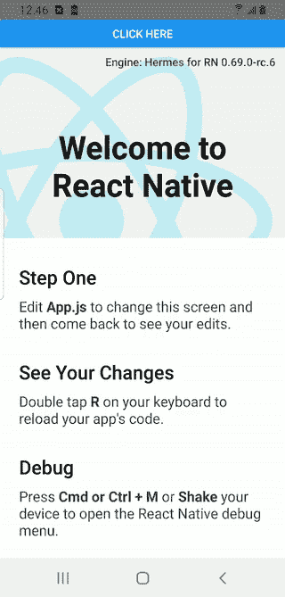
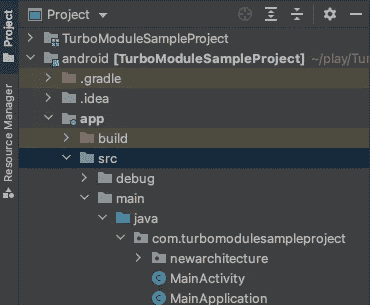

# 面向早期采用者的 React Native 涡轮模块 Android 指南

> 原文：<https://javascript.plainenglish.io/android-guide-to-turbomodules-in-react-native-for-early-adopters-b07f3e23fd1c?source=collection_archive---------2----------------------->

## 在 React Native 中提前了解 TurboModules 和 Codegen。


[Photo by RealToughCandy.com](https://www.pexels.com/photo/love-people-woman-heart-11035471/)

以前使用 React Native 时，我们会使用 JavaScript 桥在应用程序的“本机”层和“JavaScript”层之间进行通信。尽管这座桥达到了它的目的，但它有几个主要问题。

首先，桥是异步的，这意味着它批量调用本地层，并在设定的时间间隔调用它们。如果这还不够，在本机端，您必须序列化和反序列化进出桥的数据。这两个操作一起使事情变得非常缓慢。

第二，桥不是类型安全的。您几乎可以在桥上传递您想要的任何东西，这取决于本机层来处理这些数据。最后，在应用程序启动时，所有本机模块都需要加载到内存中。这对用户来说意味着缓慢的启动时间。

React Native 的创建者引入了 Codegen 和 TurboModules 来解决这些问题。TurboModules 解决了异步和加载问题，因为它们在 JavaScript 中以同步方式运行，并延迟加载到内存中，从而使应用程序启动更快。

Codegen 解决了类型安全的问题，因为它允许我们生成接口来确保我们的本机代码与我们从 JavaScript 层传入的数据保持同步。

本指南将向您展示如何在 Android 中使用 Codegen 和 TurboModules 以及 React Native。本系列的第二篇文章将讲述在 iOS 中做同样的事情。请注意，这是 React Native 0.68.2 到 0.69.0 的早期采用者指南。新的 React 本机架构仍在不断变化，可能会随着时间的推移而改变。如果您遇到困难，可以在这里随意看看我的示例项目[。如果你对我关于这个主题的视频教程感兴趣，请点击这里查看我的](https://github.com/friyiajr/TurboModuleSample)[视频。](https://www.youtube.com/watch?v=T1-mqNw6LLY&t=932s)

**编辑:**React-Native 0 . 69 . 0 的用户会在 Android Studio 中看到虚假错误，声明无法找到导入。我在这里抱怨过这个问题，Meta 似乎也意识到了。如果您按照这些说明，并在需要时从我的示例项目中导入，该应用程序仍然可以很好地编译。Android Studio 的错误来自于 IDE 中的一个错误，而不是这段代码。在 Visual Studio 代码中完成本教程可能是有意义的，这样可以避免 Android Studio 错误噪音。

## 我们在建造什么？

在本文中，我们将构建一个简单的应用程序，它调用输出消息的 TurboModule。我知道这很简单，但是在阅读完这篇博客后，你可以用 Codegen 创建任意复杂的函数。它看起来会像这样:



## React 本机设置

首先，使用以下命令生成一个 TypeScript 项目:

```
npx react-native init TurboModuleSampleProject --template react-native-template-typescript
```

使用 TypeScript 很重要，因为 Codegen 要求我们使用类型。普通的 JS 项目在这里是不行的。

接下来，让我们在项目的根目录下创建一个名为`js`的文件夹。在`js`中，我们将创建一个名为`NativeSampleModule.ts`的文件。请务必在文件名和模块名前加上单词 Native。如果你不这样做，Codegen 将无法找到你的代码，也不会生成任何东西。这里它不会给你任何错误，并且会无声地失败。最后，将这段代码复制并粘贴到您文件中。

```
import type {TurboModule} from 'react-native';
import {TurboModuleRegistry} from 'react-native';export interface Spec extends TurboModule {
  getHelloWorld(first: string, second: string): string;
}export default TurboModuleRegistry.getEnforcing<Spec>('NativeSampleModule');
```

## Android 梯度设置

在 Android 中，我们从应用程序层`build.gradle`开始，将这一行添加到文件的顶部

```
apply plugin: "com.facebook.react"
```

之后，我们需要告诉 Android 我们的 Codegen 文件在哪里。我们将这段代码添加到第 88 行

```
react {
  jsRootDir = rootProject.file("../js/")
}
```

接下来，找到属性`enableHermes`，设置为`true`。React-Native 的新架构不会运行，除非你使用 Hermes。之后，取消对该行的注释:

```
preBuild.dependsOn("generateCodegenArtifactsFromSchema")
```

最后，转到`gradle.properties`并设置`newArchEnabled=true`

运行`yarn android`来生成我们需要的文件

## 编写我们的 Java 代码

现在我们已经配置好了我们的构建，并且生成了 JavaScript 函数的绑定，让我们打开 Android Studio 中的`android`文件夹，编写一些本地代码。

从定位`com.turbomodulessampleproject`包装开始



在这个包下创建一个名为`NativeSampleModuleImpl.java`的新文件。在这个文件中，我们将扩展由 Codegen 创建的接口。它看起来会像这样。

```
package com.turbomodulesampleproject;

import androidx.annotation.NonNull;

import com.facebook.fbreact.specs.NativeSampleModuleSpec;
import com.facebook.react.bridge.ReactApplicationContext;

public class NativeSampleModuleImpl extends NativeSampleModuleSpec {

    public static String *NAME* = "NativeSampleModule";

    public NativeSampleModuleImpl(ReactApplicationContext reactContext) {
        super(reactContext);
    }

    @Override
    public String getHelloWorld(String first, String second) {
        return "HelloWorld: " + first + " " + second;
    }

    @NonNull
    @Override
    public String getName() {
        return *NAME*;
    }
}
```

接下来，我们想要将我们的包添加到应用程序主机。为此，从上面的涡轮模块包中找到`newarchitecture`目录，并查找`MainApplicationReactNativeHost.java`文件。如下覆盖`getPackages`方法。使用 alt + enter 导入您需要的任何类

```
@Override
protected List<ReactPackage> getPackages() {
  List<ReactPackage> packages = new PackageList(this).getPackages();

  packages.add(new TurboReactPackage() {
    @Nullable
    @Override
    public NativeModule getModule(String name, ReactApplicationContext reactContext) {
      if (name.equals(NativeSampleModuleImpl.*NAME*)) {
        return new NativeSampleModuleImpl(reactContext);
      } else {
        return null;
      }
    }

    @Override
    public ReactModuleInfoProvider getReactModuleInfoProvider() {
      return () -> {
        final Map<String, ReactModuleInfo> moduleInfos = new HashMap<>();
        moduleInfos.put(
                NativeSampleModuleImpl.*NAME*,
                new ReactModuleInfo(
                        NativeSampleModuleImpl.*NAME*,
                        NativeSampleModuleImpl.*NAME*,
                        false, // canOverrideExistingModule
                        false, // needsEagerInit
                        true, // hasConstants
                        false, // isCxxModule
                        true // isTurboModule
                )
        );
        return moduleInfos;
      };
    }
  });

  return packages;
}
```

## 编写 C++代码

这里我们需要采取的最后一步是配置 C++方面的东西。首先在该路径找到`Android.mk`文件。

```
TurboModuleSample/android/app/src/main/jni/Android.mk
```

然后取消对 Codegen 路径的注释，如下所示:

```
include $(GENERATED_SRC_DIR)/codegen/jni/Android.mk
```

然后

```
LOCAL_C_INCLUDES += $(GENERATED_SRC_DIR)/codegen/jni
LOCAL_SRC_FILES += $(wildcard $(GENERATED_SRC_DIR)/codegen/jni/***.cpp)
LOCAL_EXPORT_C_INCLUDES += $(GENERATED_SRC_DIR)/codegen/jni
```

在底部添加您的库。它应该被命名为`react_codegen_AppSpec`它看起来像这样:

```
LOCAL_SHARED_LIBRARIES := *\
*  react_codegen_AppSpec *\*
  libfabricjni *\
*  libfbjni *\
*  libfolly_futures *\
*  libfolly_json *\
*  libglog *\
*  libjsi *\
*  libreact_codegen_rncore *\
*  libreact_debug *\
*  libreact_nativemodule_core *\
*  libreact_render_componentregistry *\
*  libreact_render_core *\
*  libreact_render_debug *\
*  libreact_render_graphics *\
*  librrc_view *\
*  libruntimeexecutor *\
*  libturbomodulejsijni *\
*  libyoga *\*
```

然后在`android/app/src/main/jni/MainApplicationModuleProvider.cpp`文件中添加`#include <AppSpec.h>` ，取消注释并替换以下行:

```
#include <AppSpec.h>....auto module = AppSpec_ModuleProvider(moduleName, params);
if (module != nullptr) {
    return module;
}
```

在这一点上，让我们运行`yarn android`来确保应用程序编译。

## 胜利回归本土

让我们最后测试一下所有的东西。在你的`App.tsx`文件的任何地方添加下面的代码。

```
import NativeSampleModule from './js/NativeSampleModule';...
const showMessage = () => {
  const message = NativeSampleModule.getHelloWorld('Daniel', 'Friyia');
  alert(message);
};...
<Button title="Click here" onPress={showMessage} />
```

当您单击该按钮时，您应该会看到一个带有我们在本地层创建的消息的警告弹出。

## 结论

希望您喜欢 React Native for Android 中对 TurboModules 的介绍。很快他们就会拆除这座旧桥，所以对我们来说，及时了解涡轮模块的最新进展是很重要的。请查看第二部分，我将向您展示如何让 TurboModules 和 Codegen 在 iOS 上工作。

*更多内容看* [***说白了。报名参加我们的***](https://plainenglish.io/) **[***免费周报***](http://newsletter.plainenglish.io/) *。关注我们关于*[***Twitter***](https://twitter.com/inPlainEngHQ)*和*[***LinkedIn***](https://www.linkedin.com/company/inplainenglish/)*。查看我们的* [***社区不和谐***](https://discord.gg/GtDtUAvyhW) *加入我们的* [***人才集体***](https://inplainenglish.pallet.com/talent/welcome) *。***