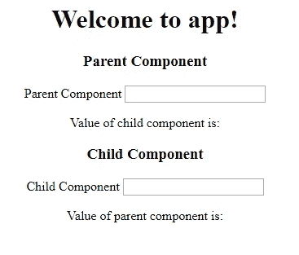

# 角度 12 @输入和@输出

> 原文：<https://javascript.plainenglish.io/angular-12-input-and-output-7999081857dc?source=collection_archive---------2----------------------->

Angular 框架是建立在小组件上的，所以将数据从父组件传递到子组件是很棘手的。在这种情况下，**@输入**和**@输出**装饰器就派上了用场。您可以定义您创建的组件的属性，并使它们在整个应用程序中可用。

角度组件有一种更好的方式通过事件通知父组件某些东西已经改变。**例如，输入**指定可以在父组件上设置哪些属性，而"**输出"**标识组件可以触发的事件，以便将信息从其子组件发送到父组件。

# 角度输入输出示例

您可以为您创建的组件定义属性，并使它们在整个 angular 应用程序中可用。在本 Angular 12 输入输出教程中，我们将把父组件的数据显示到子组件中，并将子组件的数据显示到父组件中。

为此，我们需要创建两个组件。因此，在终端上键入以下命令，创建两个组件。记住，我们正在使用 [Angular CLI](https://appdividend.com/2020/02/18/how-to-update-angular-cli-to-version-9-angular-9-cli-upgrade/) 来生成新组件。

# 角度@输入

Angular input decorator 只是告诉 Angular，嘿，当你找到一个与这个名字绑定的属性时，把它映射到我的另一个名字的组件属性。或者，如果我没有给你一个别名，使用我的组件属性名。

现在，尽管 Angular 支持这个名称别名，但推荐的做法是在默认情况下避免使用这种方法。并尝试使用类属性名。

装饰器将 class 字段标记为输入属性，并提供配置元数据。

输入属性被绑定到模板中的 DOM 属性。因此，在更改检测期间，Angular 会自动使用 DOM 属性值更新数据属性。

# 角度@输出

将类字段标记为输出属性并提供配置元数据的装饰器。在变化检测期间，绑定到输出属性的 DOM 属性会自动更新。

当实例化映射到绑定属性名称的组件时，可以提供在模板中使用的可选名称。默认情况下，所需属性的原始名称用于输出绑定。

现在，让我们用一个例子来理解这一点。但是，首先，让我们创建一个新的 Angular 项目。

# 步骤 1:通过 AngularCLI 安装 Angular Project。

首先，我们需要通过键入以下命令在我们的系统中全局安装 Angular CLI。

```
npm install -g @angular/cli
```

现在，运行下面的命令来创建一个项目。

```
ng **new** **inout**
```

# 步骤 2:创建父组件和子组件。

转到终端，键入以下命令。

```
ng g **c** parent
ng g **c** child
```

因此，它将创建一个单独的文件夹。键入以下命令启动 Angular development 服务器。

```
ng serve *--open*
```

它将在**端口打开浏览器:4200** 。

现在，浏览器中只呈现了 **app.component.ts** 组件。如果我们想要渲染我们的父组件，我们需要将它作为 HTML 标签包含在 app.component.html 的一个**文件中。**

```
<div style="text-align:center">
  <h1>
    Welcome to {{ title }}!
  </h1>
  <app-parent></app-parent>
</div>
```

现在，如果您在浏览器中看到，您可以看到父组件渲染。**父作品！！**”

# 步骤 3:为父组件定义 HTML。

在**parent.component.html**文件中编写以下代码。

```
<h3>Parent **Component**</h3>

<**label**>Bitcoin price</**label**>
<input **type**="text" />

<p>Value **of** child **component** **is**: </p>
```

首先，我们将数据从父组件传递到子组件。这是一个场景，当用户在文本框中输入比特币价格时，我们可以在子组件中看到它的价值。

同样的场景也适用于子组件。当子组件开始输入价格时，它将显示在父组件中。

# 步骤 4:为子组件定义 HTML。

在**child.component.html**文件中编写以下代码。

```
<h3>Child **Component**</h3>

<**label**>Child **Component**</**label**>
<input **type**="text" />

<p>Value **of** parent **component** **is**: </p>
```

我们知道，这是一个子组件，所以我们需要将 **< app-child >** 标签包含到父组件中。所以我们的父组件 HTML 看起来像这样。

```
<h3>Parent Component</h3>

<label>Parent Component</label>
<input type="text" />

<p>Value of child component is: </p>
<app-child></app-child>
```

因此，我们的应用程序看起来像这样。



# 步骤 5:使用输入显示父组件值

创建对父组件输入文本的引用。编辑**父文件 component.html** 中的以下行。

```
<**input** type="text" **#pcomponent** (keyup)="0"/>

<app-child [PData]="pcomponent.value"></app-child>
```

首先，我定义了输入标记的引用，然后设置了事件监听器。然后，当用户在 textbox 中键入内容时，它会将值作为属性传递给子组件。

子组件准备好通过 **@Input Decorator** 接收属性。这是角度输入的第一个用例。

文件 **child.component.ts** 文件是这样的。

```
*// child.component.ts*

**import** { Component, OnInit, Input } **from** '@angular/core';

**@Component**({
  selector: 'app-child',
  templateUrl: './child.component.html',
  styleUrls: ['./child.component.css']
})
**export** **class** ChildComponent **implements** OnInit {

  **@Input**() PData: number;
  **constructor**() { }

  ngOnInit() {
  }

}
```

你可以看到这个组件的属性是 PData，这和我们写在**parent.component.html**文件中的属性是一样的。

最后，我们的**child.component.html**文件看起来像这样。我们需要添加插值来显示子组件中的父数据。

```
<h3>Child Component</h3>

<label>Child Component</label>
<input type="text" />

<p>Value of parent component is: {{ PData }}</p>
```

现在，如果您键入父文本框，那么它的值将打印在子组件中。因此，所有这些都是通过输入属性从父节点到子节点完成的。

# 步骤 6:将值从子组件传递到父组件。

将数据从子组件传递到父组件有点复杂。在这种情况下，子组件没有对父组件的任何引用。

因此，在这种情况下，我们需要从子组件发出一个事件，父组件将监听它并通过事件接收数据并显示它。

首先，在子组件中创建对输入的引用，并为其附加一个事件侦听器。

```
<h3>Child Component</h3>

<label>Child Component</label>
<input type="text" #ccomponent (keyup)="onChange(ccomponent.value)"/>

<p>Value of parent component is: {{ PData }}</p>
```

在 **child.component.ts** 文件中编写 onChange 函数。

```
*// child.component.ts*

**import** { Component, OnInit, Input, Output, EventEmitter } **from** '@angular/core';

**@Component**({
  selector: 'app-child',
  templateUrl: './child.component.html',
  styleUrls: ['./child.component.css']
})
**export** **class** ChildComponent **implements** OnInit {

  **@Input**() PData: number;
  **@Output**() childEvent = **new** EventEmitter();
  **constructor**() { }
  onChange(value) {
    **this**.childEvent.emit(value);
  }

  ngOnInit() {
  }

}
```

当用户在子组件的文本框中键入任何内容时，它将开始从子组件发出值。所以我们只需要监听事件发射器，并在父组件中显示传递的值。

使用 parent.component.html 文件中的**事件绑定，并监听事件发射器。**

```
<**app**-child [PData]="pcomponent.value" (childEvent)="CData=$event"></**app**-child>
```

我们需要将 CData 定义到 **parent.component.ts** 文件中。

```
*// parent.component.ts*

**public** CData: number;
```

最后，通过插值，我们可以在**parent.component.html**文件中显示它的值。

```
// parent.component.html

<h3>Parent Component</h3>

<label>Parent Component</label>
<input type="text" #pcomponent (keyup)="0"/>

<p>Value of child component is: {{ CData }}</p>
<app-child [PData]="pcomponent.value" (childEvent)="CData=$event"></app-child>
```

如果你在本教程中发现任何困惑，我正在编写以下四个文件。

```
*// parent.component.ts*

**import** { Component, OnInit } **from** '@angular/core';

**@Component**({
  selector: 'app-parent',
  templateUrl: './parent.component.html',
  styleUrls: ['./parent.component.css']
})
**export** **class** ParentComponent **implements** OnInit {

  **public** CData: number;
  **constructor**() { }

  ngOnInit() {
  }

}*// child.component.ts*

**import** { Component, OnInit, Input, Output, EventEmitter } **from** '@angular/core';

**@Component**({
  selector: 'app-child',
  templateUrl: './child.component.html',
  styleUrls: ['./child.component.css']
})
**export** **class** ChildComponent **implements** OnInit {

  **@Input**() PData: number;
  **@Output**() childEvent = **new** EventEmitter();
  **constructor**() { }
  onChange(value) {
    **this**.childEvent.emit(value);
  }

  ngOnInit() {
  }

}// child.component.html

<h3>Child Component</h3>

<label>Child Component</label>
<input type="text" #ccomponent (keyup) = "onChange(ccomponent.value)"/>

<p>Value of parent component is: {{ PData }}</p>
```

最后，我们的**角度输入输出示例**结束了。

*更多内容看* [***说白了。报名参加我们的***](https://plainenglish.io/) **[***免费周报***](http://newsletter.plainenglish.io/) *。关注我们关于* [***推特***](https://twitter.com/inPlainEngHQ) ，[***LinkedIn***](https://www.linkedin.com/company/inplainenglish/)*，*[***YouTube***](https://www.youtube.com/channel/UCtipWUghju290NWcn8jhyAw)*，以及* [***不和***](https://discord.gg/GtDtUAvyhW) ***。*****

***有兴趣缩放你的软件启动*** *？检查出* [***电路***](https://circuit.ooo/?utm=publication-post-cta) *。*