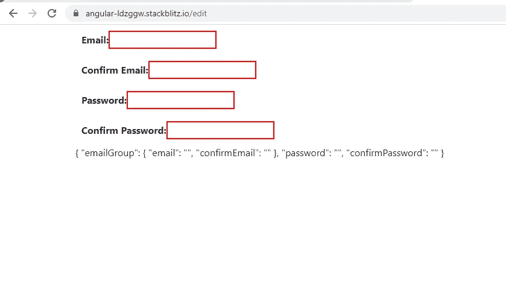
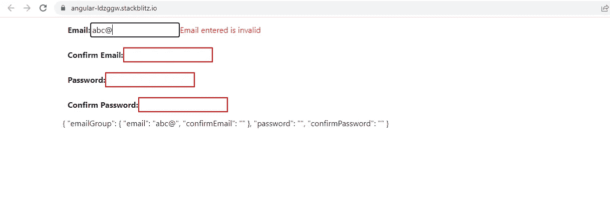
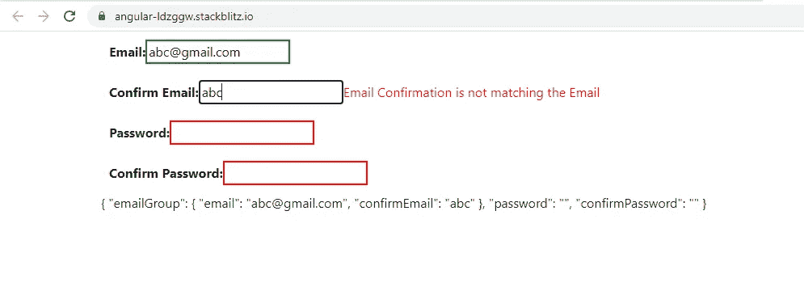
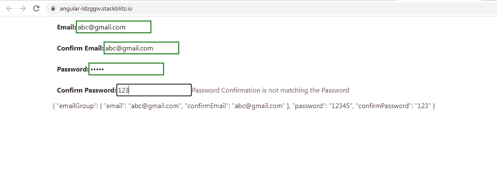
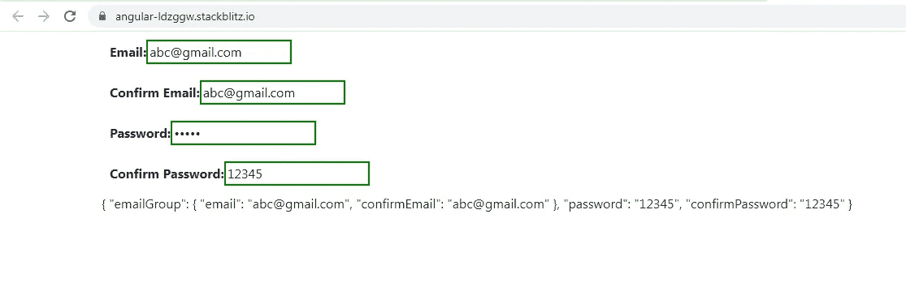

# 角度:有两种方法可以在反应式表单中执行交叉场验证

> 原文：<https://javascript.plainenglish.io/angular-2-ways-you-can-perform-crossfield-validationin-reactive-forms-6a9b688b8cff?source=collection_archive---------5----------------------->

交叉验证基本上意味着字段的验证可能不仅仅依赖于它自己的值，还可能依赖于一个或多个其他字段的值。

这个故事只是演示了两种方法。我用了一个非常简单的表格，下面只有 4 个字段:**电子邮件，确认电子邮件，密码**和**确认密码**。最后，我们还将 reactive 表单的值打印为 JSON。



让我们首先来看看在单个字段上应用了什么验证。

= >所有字段都是必填的。

= >电子邮件字段必须包含有效的电子邮件地址。

= >确认电子邮件字段必须包含与电子邮件字段相同的值。存在对电子邮件字段的依赖。

= >密码字段除了是强制性的以外，没有具体的验证。

= >确认密码字段必须包含与密码字段相同的值。存在对密码字段的依赖性。

我将使用**第一种方法**，通过电子邮件确认电子邮件字段进行交叉验证。第二种方法将应用于密码确认密码字段。在这两种方法中，我们都使用**定制同步验证器**来执行验证。

**一、第一种方法:**

在这种方法中，我们将**将依赖字段分组到一个新的表单组**中，而**将自定义验证器应用到表单组**中，而不是应用到单个字段中。想法是，**我们应该能够访问验证器**中的整个表单组，因此也能够访问表单组中的所有表单控件。

下面是表单结构。 **crossValidationForm** 是根表单组，包含嵌套表单组 **emailGroup** 和 2 个表单控件 **password** 和 **confirmPassword** 。

**fb** 是对**form builder C**Class 的引用，注入到组件类的构造器中。

```
this.crossValidationForm = this.fb.group({
emailGroup: this.fb.group(
{
email: [‘’, [Validators.required, Validators.email]],
confirmEmail: [‘’, Validators.required],
},
{ validators: emailCheck() }
),
password: [‘’, [Validators.required]],
confirmPassword: [‘’, [Validators.required, passwordCheck()]],
});
```

我们已经将 **email** 和 **confirmEmail** 表单控件分组到嵌套的 **emailGroup** 表单组下。

我们在 emailGroup 表单组中添加了一个 **emailCheck** 自定义验证器。

```
function emailCheck(): ValidatorFn {
return (c: AbstractControl): ValidationErrors | null => {

let email = c.get(‘email’);
let confirmEmail = c.get(‘confirmEmail’);

if (email.pristine || confirmEmail.pristine) {
return null;
}

return email.value !== confirmEmail.value ? { emailNotSame: true } : null;
};
}
```

参数 **c** 是**邮件组**表单组。

我们可以通过验证器内的 **emailGroup** 表单组访问 **email** 和 **confirmEmail** 表单控件。我们比较了两个 FormControls 的值，如果值不匹配，则返回一个**错误对象**，如果值匹配，则返回空值**。**

如果要验证的**字段可以在嵌套的表单组**中分组，那么这种方法是合适的。可能会发生这样的情况:某些不相关的字段放置在表单的不同位置，但却相互依赖。这种方法在这种情况下不合适，因为从结构上来说，可能/不可能对它们进行分组。

**二。第二种方法:**

请注意，我们已经在 **confirmPassword** 字段中添加了 **passwordCheck** 自定义验证器。

**密码**和**确认密码**字段的唯一共同点是根表单组**交叉验证表单。我们利用了这一点。**

```
function passwordCheck(): ValidatorFn {
return (c: AbstractControl): ValidationErrors | null => {
if (c.parent) {

let password = c.parent.get(‘password’);
let confirmPassword = c.parent.get(‘confirmPassword’);

return password.value !== confirmPassword.value? { passwordMismatch: true }: null;
}
return null;
};
}
```

参数 **c** 是**confirm password**form control。我们如何访问验证器内部的**密码** FormControl？

我们获取**confirm password**form control 的**父属性**来访问它们的父 FormGroup。

**使用父窗体组，我们可以访问它的所有子窗体控件/窗体组。**

通过这种方式，我们访问了**密码**和**确认密码**表单控件，比较了它们的值，如果不匹配，则返回**错误对象**，如果值匹配，则返回**空值**。

我没有深入研究验证消息是如何显示的。那是完全不同的话题。我们刚刚看到了如何实现跨字段验证的定制验证器。



email is invalid



confirmEmail validation



confirmPassword Validation



all fields valid

您可以在下面找到完整的工作示例:

[](https://stackblitz.com/edit/angular-ldzggw?file=src/app/app.component.ts) [## 角形(叉形)堆叠

### 一个基于 rxjs，tslib，core-js，zone.js，@angular/core，@angular/forms，@angular/common 的 angular-cli 项目…

stackblitz.com](https://stackblitz.com/edit/angular-ldzggw?file=src/app/app.component.ts) 

*更多内容请看*[***plain English . io***](https://plainenglish.io/)*。报名参加我们的* [***免费周报***](http://newsletter.plainenglish.io/) *。关注我们关于*[***Twitter***](https://twitter.com/inPlainEngHQ)[***LinkedIn***](https://www.linkedin.com/company/inplainenglish/)*[***YouTube***](https://www.youtube.com/channel/UCtipWUghju290NWcn8jhyAw)*[***不和***](https://discord.gg/GtDtUAvyhW) *。对增长黑客感兴趣？检查* [***电路***](https://circuit.ooo/) *。***