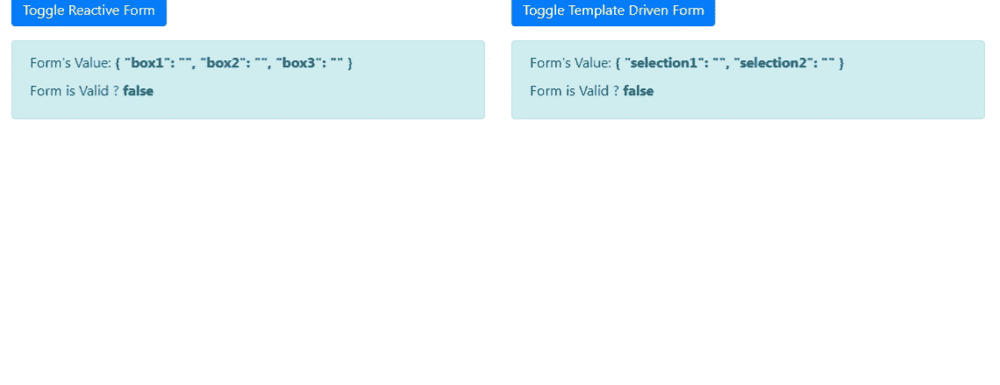
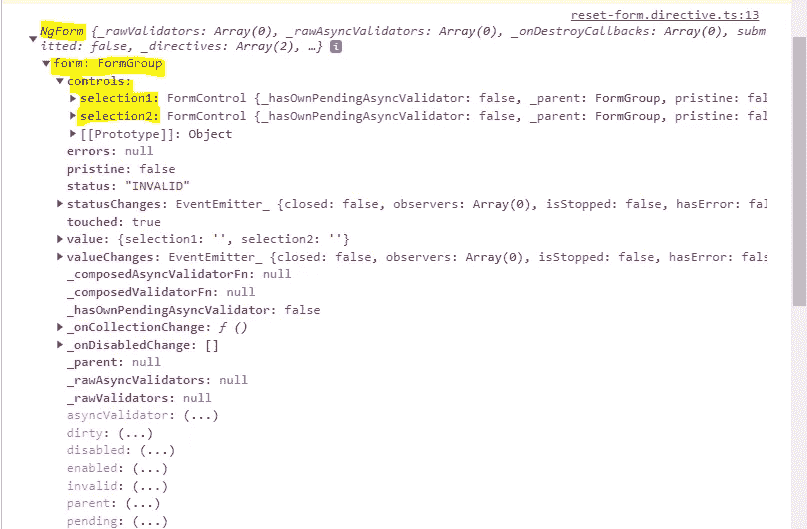
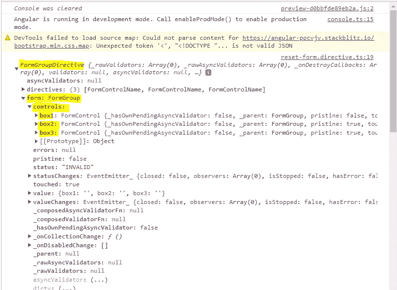

# Angular:在指令中访问模板驱动的或反应式的表单，以操作表单的控件

> 原文：<https://javascript.plainenglish.io/angular-access-the-template-driven-or-reactive-form-inside-a-directive-to-manipulate-the-forms-2ec4122455be?source=collection_archive---------3----------------------->

当您希望在指令中添加一些跨窗体的常见行为并重用这些行为时，访问指令中的窗体来操作其控件是非常有用的。

为了说明如何做到这一点，我举了一个简单的例子。假设您有一个切换按钮，在单击时显示/隐藏一个表单。

1.  最初，窗体是隐藏的。
2.  点击切换按钮，表单显示出来。填写表格。
3.  再次点击切换按钮。我们期望窗体的控件被重置，窗体再次被隐藏。

下面是一个模板驱动和反应式表单的小演示。



这就是**反应形式**的样子。在反应式表单中，我们显示了 3 个文本框。

这里要注意的要点是:

= >用于切换布尔类属性**值的“切换反应形式”按钮是可见的**。

= >我们定义了带有选择器 **resetForm 的 **ResetFormDirective** 的**

我们已经将 **isVisible 属性**作为@Input()传递给指令。

= >当 **isVisible** 为 false 时，我们已经使用**【hidden】**属性隐藏了表单控件(而不是

转到**模板驱动表单**，这里我们显示 2 个下拉列表。

**列表 1** 和**列表 2** 是两个数组属性，用于填充两个下拉列表中的数据。

这里要注意的要点(非常类似于反应式)是:

= >用于切换布尔类属性**值的“切换模板表单”按钮是可见的**。

= >我们定义了带有选择器 **resetForm 的 **ResetFormDirective** 的**

我们已经将 **isVisible 属性**作为@Input()传递给指令。

= >当 **isVisible** 为 false 时，我们已经使用**【hidden】**属性隐藏了表单控件(而不是

最后移动到**复位方向**。

因为我们在反应式和模板驱动的表单中都重复使用这个指令，为了访问这两种类型的表单，我们添加了 2 个 **@ContentChild()** 属性。

```
@ContentChild(FormGroupDirective) form: FormGroupDirective;
@ContentChild(NgForm) tempForm: NgForm;
```

**@ content child(formgroup directive)Form**用于访问反应式表单，**@ content child(ng Form)tempForm**用于访问模板驱动式表单。

下面是 **tempForm** property 的样子。



下面是**表单**属性的样子。



**resetFormControls()** 以上面两张截图中的 **FormGroup** 为参数，将 FormGroup 下所有 **FormControl** 的值重置为空字符串。

整个逻辑都在 **ngOnChanges** 生命周期钩子中。

```
ngOnChanges(changes: SimpleChanges) {
    if (!changes.isVisible.currentValue) {
      if (this.tempForm && this.tempForm.form) {
        console.log(this.tempForm);
        if (Object.keys(this.tempForm.form.controls).length) {
          this.resetFormControls(this.tempForm.form);
        }
      }
      if (this.form && this.form.form) {
        console.log(this.form);
        this.resetFormControls(this.form.form);
      }
    }
  }
```

表单最初是隐藏的，即 **isVisible** 属性的初始值为假。当用户单击切换按钮时， **isVisible** 属性被设置为 true，表单可见。用户填写表单。

当用户再次点击切换按钮时，我们期望@Input() **isVisible** 的值为 **false** 。因此，将满足 **ngOnChanges()** 中的以下条件。

```
if (!changes.isVisible.currentValue) {

}
```

一旦我们进入了 IF 语句，我们就编写了两个逻辑——一个用于反应式表单，另一个用于模板驱动表单。

下面几行代码是模板驱动的表单。我们正在将**@ content child(ng form)tempForm**属性内的 **FormGroup** 作为参数传递给 **resetFormControls()** ，只有当我们确定**属性没有被定义**并且**tempForm**内的控件属性不是空数组时。

```
 if (this.tempForm && this.tempForm.form) {
        console.log(this.tempForm);
        if (Object.keys(this.tempForm.form.controls).length) {
          this.resetFormControls(this.tempForm.form);
        }
      }
```

下面几行代码是针对反应式表单的。我们将把**@ content child(FormGroup directive)form**属性中的 **FormGroup** 作为参数传递给 **resetFormControls()。**

```
if (this.form && this.form.form) {
console.log(this.form);
this.resetFormControls(this.form.form);
}
```

在下面的 **resetFormControls()** 中，我们首先使用**object . keys(form . controls)**检索了 FormGroup 的所有 FormControl 的名称列表。

接下来，我们将遍历这个 FormControl 名称列表，并将 FormControl 的值设置为一个空字符串。

```
resetFormControls(form) {
Object.keys(form.controls).forEach((control: string) => {
form.get(control).setValue(‘’);
});
}
```

或者，如果表单的初始值可用，您可以直接调用 FormGroup 上的 **reset()** ，将表单的初始值作为参数传递。否则你可以遍历所有的 FormControl 并重置值，就像我们在这个例子中所做的那样。

您可以在下面找到完整的工作示例。

[](https://stackblitz.com/edit/angular-ppcvjv?file=src/app/reset-form.directive.ts) [## 角形(叉形)堆叠

### 一个基于 rxjs，tslib，jquery，core-js，zone.js，bootstrap，popper.js，@angular/core 的 angular-cli 项目…

stackblitz.com](https://stackblitz.com/edit/angular-ppcvjv?file=src/app/reset-form.directive.ts) 

## 更多内容请访问 [PlainEnglish.io](https://plainenglish.io/) 。

*报名参加我们的* [***免费周报***](http://newsletter.plainenglish.io/) *。关注我们关于*[***Twitter***](https://twitter.com/inPlainEngHQ)，[***LinkedIn***](https://www.linkedin.com/company/inplainenglish/)***，***[*YouTube****，以及***](https://www.youtube.com/channel/UCtipWUghju290NWcn8jhyAw)*[***不和***](https://discord.gg/GtDtUAvyhW) *

## *希望扩大你的科技创业公司的知名度和采用率吗？检查[电路](https://circuit.ooo/?utm=publication-post-cta)。*