# 在 Angular 中访问父组件、子组件和孙组件中以前和当前的 URL

> 原文：<https://javascript.plainenglish.io/angular-accessing-the-previous-and-current-url-in-the-parent-child-and-grandchild-components-99b899505042?source=collection_archive---------0----------------------->

## 关于如何在 Angular 中访问父组件、子组件和孙组件中的以前和当前 URL 的全面指南。


Photo by [Chris Ried](https://unsplash.com/@cdr6934?utm_source=medium&utm_medium=referral) on [Unsplash](https://unsplash.com?utm_source=medium&utm_medium=referral)

在这种情况下，能够访问应用程序以前的 URL 非常有用。想象一下，你登录到你的谷歌帐户，并在谷歌驱动器的一些文件上工作。然后，您意识到您需要存储在您拥有的另一个帐户的驱动器存储器中的一些信息。显然，你登录到另一个帐户，然后你会被自动重定向到同一个 Google drive 页面。

我不知道谷歌是如何做到这一点的，但这是我能想到的访问之前的 URL 的最佳用例:)

我用来演示的例子并不复杂。就像下面的截图一样简单:

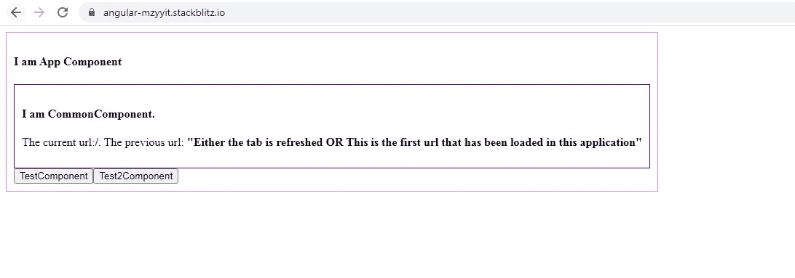

我使用了 4 个组件来展示应用程序中不同级别的组件如何访问以前和当前的 URL。

1.  **AppComponent** 是托管 **CommonComponent、TestComponent 和 Test2Component 的引导组件。**

CommonComponent 的一个例子是在整个应用程序中可见的应用程序标题。

TestComponent 和 Test2Component 是通过按钮导航的，正如您在上面的截图中所看到的。

**AppComponent 模板**如下图所示:

```
<div class=”appContainer”><h4>I am App Component</h4>**<app-common></app-common>****<router-outlet></router-outlet>**<button **routerLink=”/test"**>**TestComponent**</button><button **routerLink=”/test2"**>**Test2Component**</button></div>
```

**AppComponent** 类执行检索当前和先前 URL 的全部逻辑。当前和以前的 URL 存储在一个对象中，而**设置在 TestService** 的主题中。

其他子组件简单地**订阅这个 subject 来接收应用程序的当前和以前的 URL。**

很简单的逻辑。

= >我们首先将由 **router.events** 发出的值过滤为类型为 **RoutesRecognized** 的值。

= >当我们第一次在浏览器中加载应用程序或刷新浏览器选项卡时，应用程序不知道以前的 URL。因此，我们使用了 **rx.js startWith()** 操作符将初始值设置为一个**空对象**。

= >接下来，我们应用 **rx.js pairwise()** 操作符来捕获数组中 **RoutesRecognized** 类型发出的先前和当前值。数组的第一个元素包含前一个值，第二个元素包含当前值。

如果没有先前的发射，则 **pairwise()** 操作符不发射任何值。这是添加 **startWith()** 操作符来设置初始值的另一个原因，这样可以解决“没有先前发射”的问题。

= >我们添加了 tap 操作符来捕获 pairwise()操作符的输入和输出。

= >在 subscribe 块中，我们创建了一个具有两个属性 **previous 和 current** 的对象。previous 属性将包含前一个 URL，current 属性将包含当前 URL。

我们首先检查数组的第一个元素是否有属性**urlaftredirects。**如果不是，则暗示第一个元素是空对象。因此，我们将**属性 previous** 设置为字符串**“要么选项卡被刷新，要么这是该应用程序中加载的第一个 url”。**

如果**urlaftredirects**属性存在，那么我们将**先前属性**设置为**urlaftredirects**属性值**。**

数组的第二个元素在任何时候都有一个值。我们直接将**当前属性**设置为 **urlAfterRedirects** 属性值**。**

2. **GrandChildAComponent** 是 test 2 组件的子组件，通过一个按钮导航。我们很快就会看到这一点。

这是最终的路由结构:

```
const routes: Routes = [
{
path: ‘test’,
component: TestComponent,
},
{
path: ‘test2’,
component: Test2Component,
children:[
{
path:’grandChildA’,
component:GrandChildAComponent
}
]
},
];
```

3.最后，在**测试服务**中，

所有的子组件都有相同的订阅逻辑。因此，我将在一节课中展示这个逻辑。

**通用组件类**

现在让我们检查所有的场景。

= >假设我刚刚加载了应用程序。

**当前 URL 将为“/”**，并且**之前的 URL 将无法访问**。

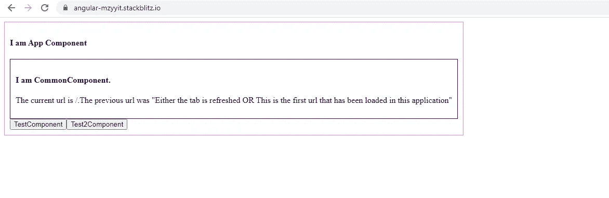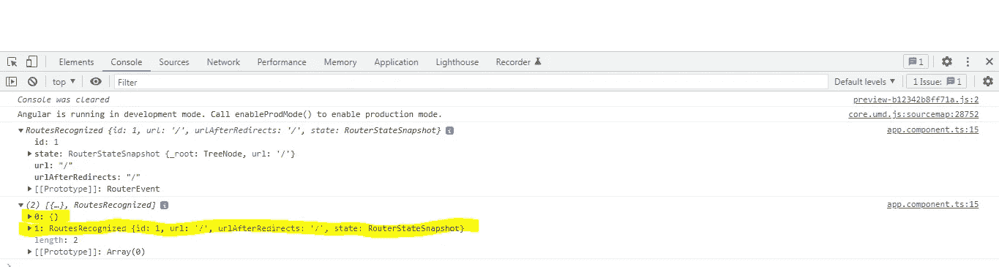

第二个屏幕截图显示了 tap()操作符的日志。第一个日志是 router.events 发出的**当前值，第二个日志是 pairwise()操作符发出的数组。如您所见，数组的第一个元素是{}，第二个元素是 router.events 发出的当前值**

= >点击 TestComponent 按钮时，**当前 URL 将为“/test”**，而**之前的 URL 为“/”。**

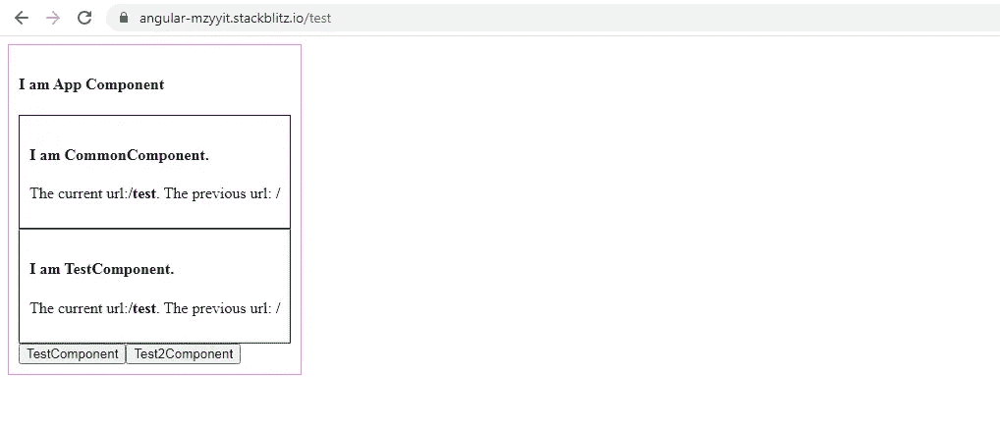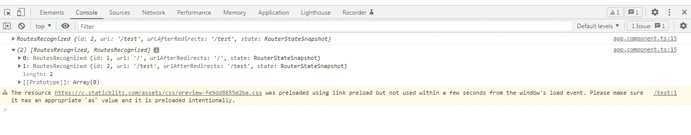

= >点击 test2 组件按钮时，**当前 URL 将是“/test 2”**，而**以前的 URL 将是“/test”**。

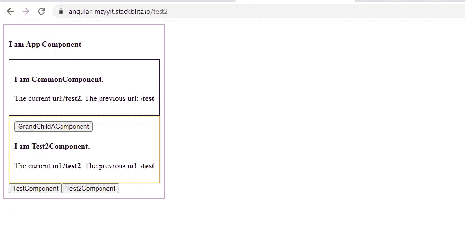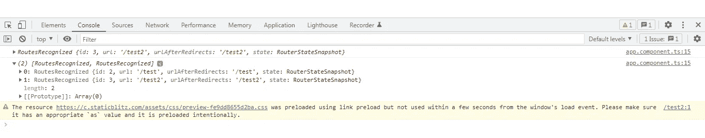

= >点击 GrandChildAComponent 按钮时，**当前 URL 将为“/test2/grandChildA”，之前的 URL 将为“/test2”**。

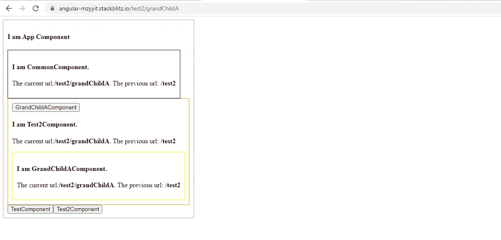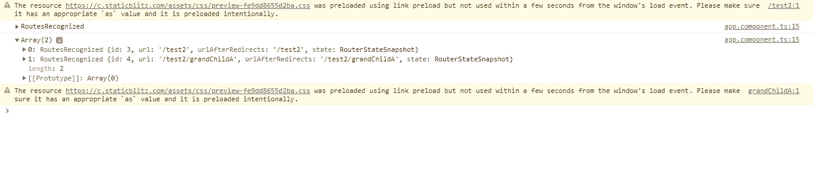

= >如果我现在刷新浏览器选项卡，**当前 URL 将会是“/test2/grand childa”**并且不能访问**以前的 URL**。

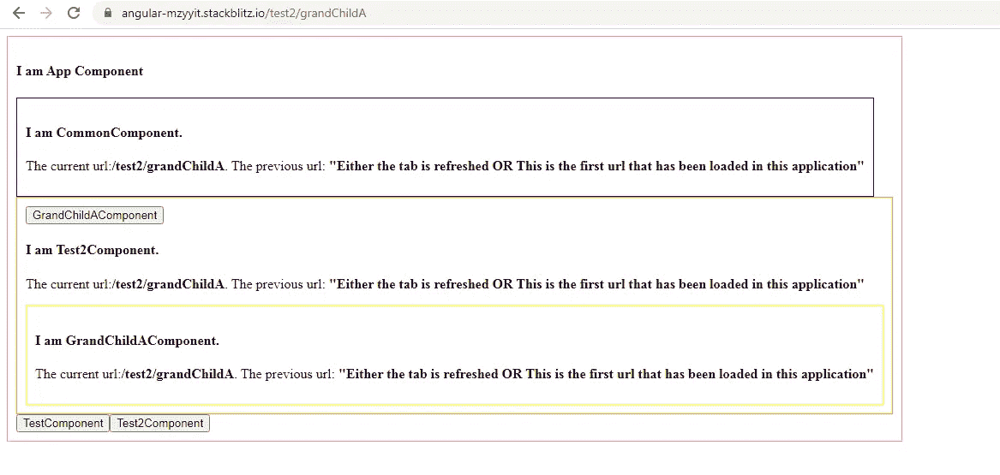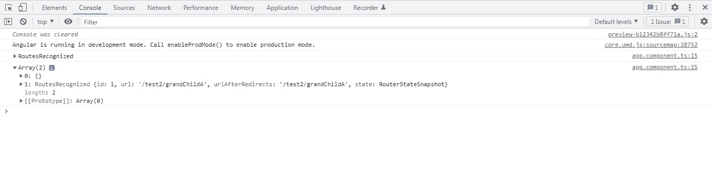

您可以查看下面的完整工作示例:

[](https://stackblitz.com/edit/angular-mzyyit?file=src/app/app.component.ts) [## 角形(叉形)堆叠

### 一个基于 rxjs，tslib，core-js，zone.js，@angular/core，@angular/forms，@angular/common 的 angular-cli 项目…

stackblitz.com](https://stackblitz.com/edit/angular-mzyyit?file=src/app/app.component.ts) 

*更多内容请看*[***plain English . io***](https://plainenglish.io/)*。报名参加我们的* [***免费周报***](http://newsletter.plainenglish.io/) *。关注我们关于*[***Twitter***](https://twitter.com/inPlainEngHQ)*和*[***LinkedIn***](https://www.linkedin.com/company/inplainenglish/)*。查看我们的* [***社区不和谐***](https://discord.gg/GtDtUAvyhW) *加入我们的* [***人才集体***](https://inplainenglish.pallet.com/talent/welcome) *。*