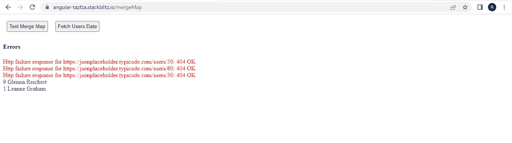

# 当多个内部观察失败时，避免在 mergeMap RXJS 运算符中丢失所有数据

> 原文：<https://javascript.plainenglish.io/angular-avoid-losing-all-data-in-mergemap-rxjs-operator-when-few-of-the-multiple-inner-observables-448251b6e8e1?source=collection_archive---------4----------------------->

## Angular RXJS 操作符: **mergeMap** 和 **forkJoin** 在你想并行执行任务的时候非常有用。

RXJS 操作符: **mergeMap** 和 **forkJoin** 在你想并行执行任务时非常有用，也就是说，这里最重要的是得到输出，任务的执行顺序在这里并不重要。

考虑这个场景:

1.  我使用 **mergeMap** 操作符并行获取 5 个用户的数据:A、B、C、D 和 E。获取每个用户数据的 API 调用将对应于一个内部可观察订阅。
2.  假设，3 个用户 **B，C，D** 不存在。因此，对应于这 3 个用户的 API 调用将失败，并出现 HTTP 404。这意味着 3 个可观测量将会出错，并且对应于其他 2 个用户 **A 和 E** 的 API 调用可能有成功的机会，如果它们仍在进行中，也将被取消。
3.  我不想因为 3 个用户 **B，C，D** 的 API 调用失败，就丢失剩下的 2 个用户: **A，D** 的数据。
4.  我还想显示与 3 个用户 **B、C 和 D** 相关的错误。

下面是我想实现的东西的截图。这是一个小角度的应用。我试图获取 5 个用户的数据，其中 3 个不存在。但是我没有丢失另外两个用户的数据。



我们显示了与 3 个用户相对应的错误消息，还显示了用户的 ID 和名称，我们可以获取他们的数据。

组件模板:这正是我们在截图中看到的。

按钮**获取用户数据**将调用 **task1()，**，我们试图获取 5 个用户的数据。

我们已经订阅了 2 个 observable**error observable $**和 **task1$** 来分别显示错误和用户数据。

**组件类别:**

```
public list = [50, 1, 60, 9, 30];
```

列表数组包含一个用户 id 数组，我们要获取其数据。不存在的用户具有 id**50、60 和 30** 。

移动到**任务 1():**

1.  我们已经使用来自操作符的**将数组**列表**转换为冷可观察值。**
2.  **mergeMap** 操作符将把 cold 可观察对象发出的 userId 映射到**数据服务**中的 **getUser()** 返回的内部可观察对象中。

**getUser()** 调用 API 获取 userId 对应的数据。

```
**getUser(id: number): Observable<any> {**
return this.http
.get(`https://jsonplaceholder.typicode.com/users/${id}`)
.pipe(**catchError((err) => throwError(err))**);
}
```

3.如果 API 调用成功，在**映射操作符**中，我们将用户数据推入一个本地变量 **userData。**这是我们在模板中订阅 **task1$ observable** 时可用的数据。

```
map((result) => {
**userData.push(result);
return userData;**
}),
```

4.如果 API 调用失败，在 **catchError 操作符**中，我们首先将 Error 对象推入一个局部变量 **errorList** ，然后将 **errorList** 传递给 **error$ subject。**我们订阅了模板中的这个主题来显示错误。

```
catchError((err) => {
**errorList.push(err);
this.error$.next(errorList);
return EMPTY;**
})
```

完整的工作示例如下:

[](https://stackblitz.com/edit/angular-tazfza?file=src/app/merge-map/merge-map.component.ts) [## 角形(叉形)堆叠

### 一个基于 rxjs，tslib，core-js，zone.js，@angular/core，@angular/forms，@angular/common 的 angular-cli 项目…

stackblitz.com](https://stackblitz.com/edit/angular-tazfza?file=src/app/merge-map/merge-map.component.ts) 

如果您认为在 **task1()** 中使用局部变量 **userData** 和 **errorList** 是不必要的，并且可以有更好的方法将用户数据或错误数据连接到一个数组中，那么请看下面的例子。这里我们使用了 **RXJS 扫描操作符**来实现将用户/错误对象连接成一个数组。

[](https://stackblitz.com/edit/angular-fbhhfa?file=src/app/merge-map/merge-map.component.ts) [## 角形(叉形)堆叠

### 一个基于 rxjs，tslib，core-js，zone.js，@angular/core，@angular/forms，@angular/common 的 angular-cli 项目…

stackblitz.com](https://stackblitz.com/edit/angular-fbhhfa?file=src/app/merge-map/merge-map.component.ts) 

*更多内容看* [***说白了就是***](https://plainenglish.io/) *。报名参加我们的* [***免费每周简讯***](http://newsletter.plainenglish.io/) *。关注我们关于* [***推特***](https://twitter.com/inPlainEngHQ) ，[***LinkedIn***](https://www.linkedin.com/company/inplainenglish/)*，*[***YouTube***](https://www.youtube.com/channel/UCtipWUghju290NWcn8jhyAw)*[***不和***](https://discord.gg/GtDtUAvyhW) *。对增长黑客感兴趣？检查出* [***电路***](https://circuit.ooo/) *。**