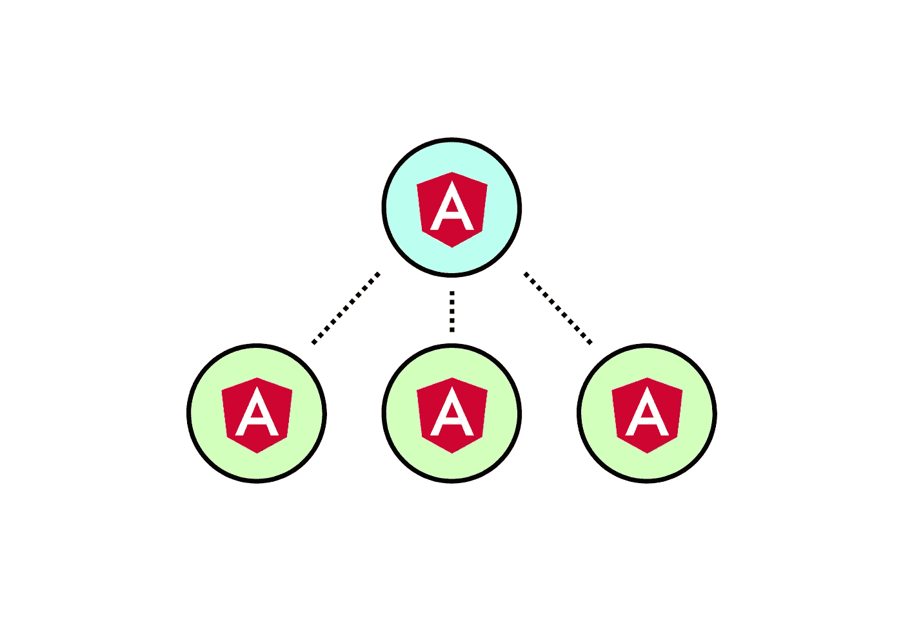

# 角度元件继承的基础

> 原文：<https://javascript.plainenglish.io/angular-component-inheritance-d5057ade463e?source=collection_archive---------1----------------------->

## 继承在任何编程语言中都是一个重要的工具。以下是您需要了解的角度分量继承的基础知识。



在任何编程语言中，继承都是维护面向对象设计以及减少冗余代码的极好方式。刚开始学习 Angular 框架时可能不太明显，但是组件可以从其他组件继承，从而重用方法和属性。让我们通过一个例子来说明如何使用角度继承来构建一个更优雅的应用程序。

在深入我们的例子之前，让我们讨论一下组件继承**可以**和**不能**做什么。

从父组件**继承的组件可以:**

*   使用父组件的方法和属性
*   使用父组件的`@Input`和`@Output`属性
*   调用父生命周期挂钩
*   从父级继承生命周期挂钩

从父组件**继承的组件不能:**

*   引用父级中的私有方法和属性
*   重用公开可用的父属性名
*   继承父代的装饰者

那么如何使用组件继承呢？

## 组件继承用例示例

假设我们有一个应用程序需要三种不同类型的模态。当然，我们可以创建三个不同的组件，并在不同的时间实现逻辑。但是模态都共享一些可以重用的公共功能。例如，我们的三个模态都需要一个`open()`和一个`close()`方法。让我们假设每个模态都有一个布尔属性叫做`isOpen`。如果没有组件继承，我们的三个模态中的每一个都需要单独实现这些东西。通过继承，我们可以在基本组件中实现一次这种通用功能，并在子组件中重用它。让我们看看怎么做。

创建一个名为`BaseModalComponent`的新组件，我们可以实现如下所示的方法。

这里需要注意一些与其他组件不同的地方:我们没有在`@Component`装饰器中指定一个`selector`，我们将模板保留为空字符串。因为实际使用和呈现的是子组件，所以父组件既不需要选择器也不需要模板。有多种方法可以创建引用父模板的子组件，但是对于这个例子，我们将保持它的简单性。你可能想知道为什么我把`styleUrls`留在了装饰器里。我更喜欢保持父样式表不变，并在这个样式表中存储所有模态共有的样式。

让我们设置一个子组件。对于这个例子，我简单地将孩子命名为`ConfirmationModalComponent`:

这里我们的组件`extends`我们的`BaseModalComponent`必须在它`implements`任何接口之前声明。因为我们正在扩展父组件，所以子组件中的构造函数必须包含一个`super()`调用。这通过调用其构造函数来初始化父级。因为`BaseModalComponent`构造函数需要一个`ElementRef`，所以我们的子组件必须在`super()`中传递它。注意不要将子节点的`ElementRef`命名为与父节点相同的名称，否则会出现错误。

如前所述，我们可以在子节点中调用父节点的方法，只要它是可公开访问的。在我们的子组件中，`confirm()`方法调用父组件的`closeModal()`方法。这允许我们为我们所有的孩子拥有相同的封闭逻辑，而不需要复制代码。

子组件也可以覆盖父方法。通过在`ConfirmationModalComponent`中实现一个`closeModal()`方法，我们可以重新定义这个方法做什么。这样做之后，在子节点的另一个方法中调用`closeModal()`将调用子节点的方法而不是父节点的方法。

使用生命周期挂钩时要小心。我之前提到过，子组件**可以**调用父组件的生命周期钩子，并且它**可以**继承它。然而，如果子组件实现了`ngOnInit`方法，父`ngOnInit`方法将不会被调用，就像任何其他被覆盖的方法一样。换句话说，`BaseModalComponent`中的`ngOnInit()`在`ConfirmationModalComponent`初始化时不会被调用。要在子组件中使用父组件的`ngOnInit()`，可以像在构造函数中那样调用`super.ngOnInit()`。

我提到过`@Input`和`@Output`修饰变量可以被子组件使用。让我们把`BaseModalComponent`改成这样:

现在我们有了模态关闭时的输出和文本的输入。通过这种添加，`ConfirmationModalComponent`可以在模板中引用`text`，例如:

```
<h1>{{text}}</h1>
```

类似地，我们可以更改子组件来引用输出:

这是减少重复功能和保持一致性的另一种简便方法。

我希望这篇文章为您提供了组件继承的基础概述，并希望您利用它来编写更简洁的代码。有许多更好的事情可以使用继承。为了进一步阅读:

 [## 有角的

### Angular 是一个构建移动和桌面 web 应用程序的平台。加入数百万开发者的社区…

angular.io](https://angular.io/guide/component-overview) [](https://www.javatpoint.com/typescript-inheritance) [## 类型脚本继承-Java point

### typescript 继承与 typescript 教程，typescript 介绍，版本，TypeScript 和 javascript…

www.javatpoint.com](https://www.javatpoint.com/typescript-inheritance) 

*更多内容请看*[***plain English . io***](https://plainenglish.io/)*。报名参加我们的* [***免费周报***](http://newsletter.plainenglish.io/) *。关注我们关于*[***Twitter***](https://twitter.com/inPlainEngHQ)*和*[***LinkedIn***](https://www.linkedin.com/company/inplainenglish/)*。查看我们的* [***社区不和谐***](https://discord.gg/GtDtUAvyhW) *加入我们的* [***人才集体***](https://inplainenglish.pallet.com/talent/welcome) *。*