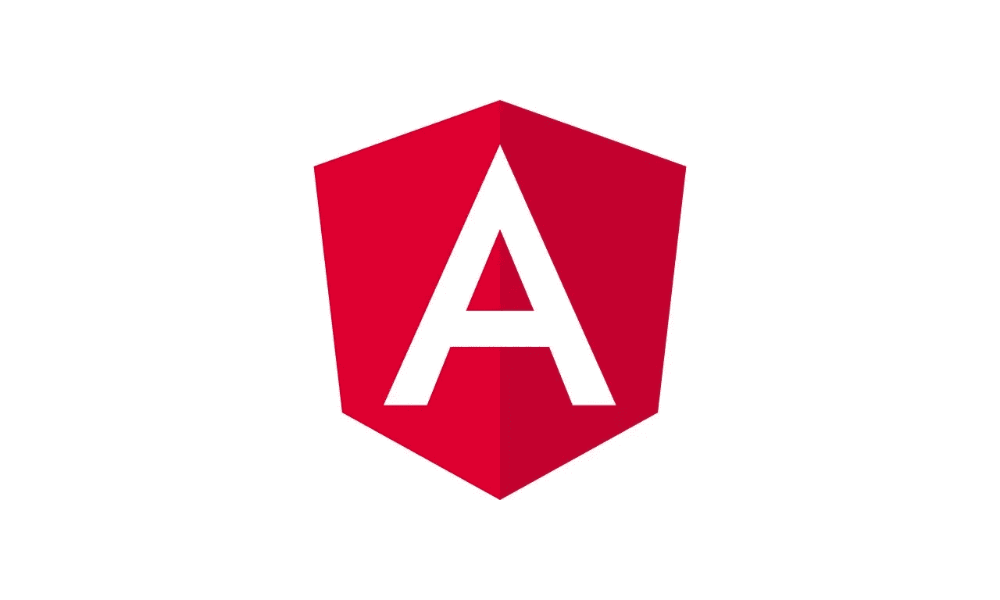
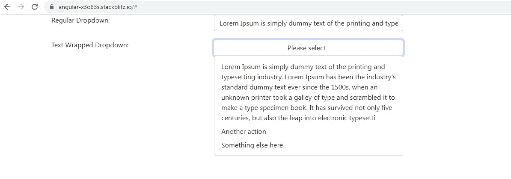
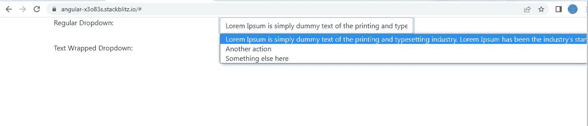

# Angular:将引导下拉菜单转换为常规选择下拉菜单的副本

> 原文：<https://javascript.plainenglish.io/angular-converting-a-bootstrap-dropdown-into-a-replica-of-the-regular-select-dropdown-for-wrapping-e80e73fbbc1?source=collection_archive---------2----------------------->

## 用于换行长文本选项

我试图在下面的故事中实现类似的东西，但我现在想分享的是如何使用 Bootstrap 下拉菜单创建带有文本换行选项的 Select 标记的精确副本。

 [## Angular:如何创建带有文本换行选项的自定义可重用下拉列表

### 试图在<select>标签中将长文本选项包装成多行总是徒劳的。普通的…</select>

javascript.plainenglish.io](/angular-creating-your-own-custom-reusable-dropdown-with-text-wrapping-options-18559f40c53e) 

下面是一个截图，比较了一个常规的选择标签和一个文本包装的下拉菜单。正如您所注意到的，除了常规 Select 下拉菜单中没有的文本换行选项之外，两者完全相似。

让我们来看看 **AppComponent 模板。**这个模板包含你在上面截图中看到的 2 个下拉菜单。

在这两种情况下，我们都在遍历一个数组**选项**来显示选项列表。在 bootstrap 下拉列表中，我们还添加了一个隐藏的 **<输入>** 标签，它将包含下拉列表中选择的值。添加< input >标签的原因是为了防止你的下拉列表是带有其他表单控件的表单的一部分。

在选择 Bootstrap 下拉菜单中的任何选项时，我们调用一个方法 **selectOption()** ，将选项值作为参数传递。在该方法中，我们用该选项值**设置模型**选择**。**这个模型被绑定到隐藏的<输入>标签。

**AppComponent 类。下面的类是不言自明的。**

现在让我们转到组件的 CSS 文件，在那里我们做了一些修改，使引导下拉列表成为选择下拉列表的副本。

您可以进一步微调 CSS 以满足您的需求。

您可以查看下面的完整工作示例。

 [## 角形(叉形)堆叠

### 一个基于 rxjs，tslib，core-js，zone.js，@angular/core，@angular/forms，@angular/common 的 angular-cli 项目…

stackblitz.com](https://stackblitz.com/edit/angular-x3o83s?file=src/app/app.component.css) 

*更多内容请看*[***plain English . io***](https://plainenglish.io/)*。报名参加我们的* [***免费周报***](http://newsletter.plainenglish.io/) *。关注我们关于*[***Twitter***](https://twitter.com/inPlainEngHQ)*和*[***LinkedIn***](https://www.linkedin.com/company/inplainenglish/)*。加入我们的* [***社区不和谐***](https://discord.gg/GtDtUAvyhW) *。*