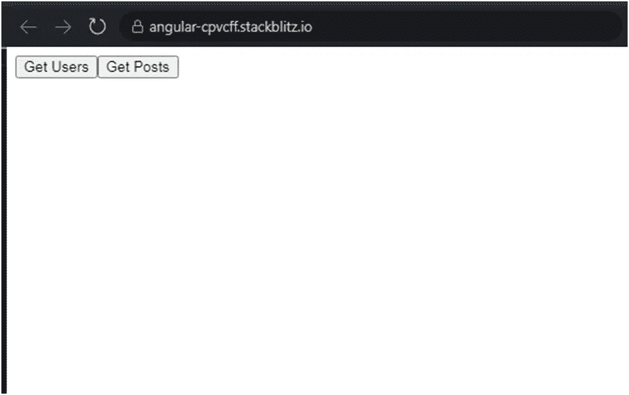
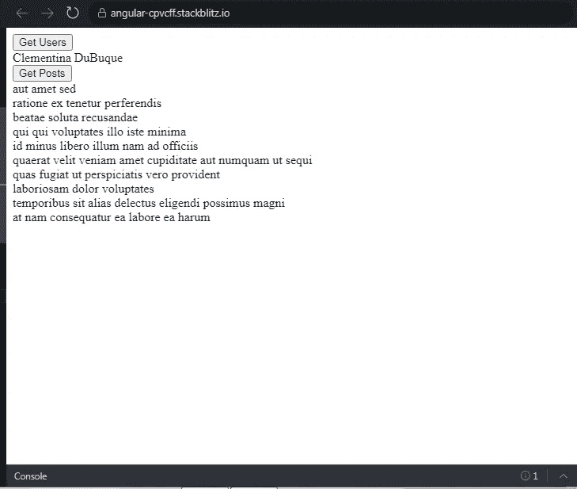
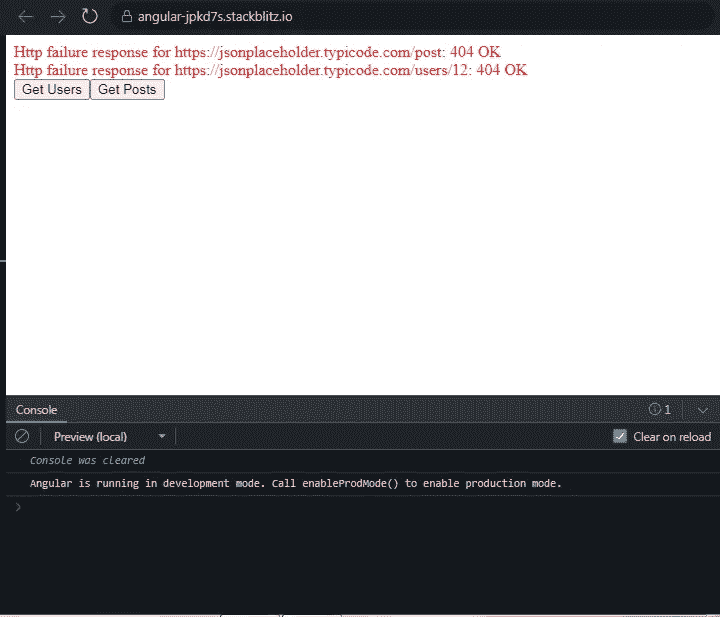

# Angular:创建一个自定义 RXJS 操作符，用于重用多个其他重复的 RXJS 操作符

> 原文：<https://javascript.plainenglish.io/angular-creating-a-custom-rxjs-operator-for-reusing-multiple-other-repetitive-rxjs-operators-d5c459fe0c0f?source=collection_archive---------3----------------------->

## 如何创建一个定制的 RXJS 操作符来代替在多个方法中使用的重复操作符。

作为 Angular/Typescript 开发人员，您可能经常遇到这种情况，在这种情况下，相同的几行代码在多个方法中重复。

如果那几行代码是 RXJS 操作符，并且您希望避免每次都在多个方法中编写它们，该怎么办？

在这个故事中，我的重点是如何创建一个定制的 RXJS 操作符，它可以代替在多个方法中使用的重复操作符。我创建了一个简单的 angular 项目，只有一个 **AppComponent** 和一个 **TestService** 来演示这一点。



我们将获取虚拟用户数据，并使用上面截图中的按钮发布数据。在请求开始后，我们有 3 个动作是 2 个任务共有的。

1.如果请求成功= >隐藏微调器并显示数据。

2.如果请求失败= >隐藏微调器并显示错误消息。

3.最后，每当组件被销毁时，清理所有的订阅。

目标是将这 3 个常见的操作合并到一个定制的 RXJS 操作符中，该操作符可以在这两个任务中重用。

从**测试服务**开始。我定义了两个方法 **getUsers()** 和 **getPosts()** 来获取 userId 为 10 的用户的用户和发布数据。

**AppComponent** **模板**

1.我们已经使用 **Primeng NPM 模块**在项目中添加了一个装载旋转器。甚至一个简单的旋转图像就足够了。该微调器的可见性由 **canSpin** 属性控制。

2.我们订阅了 **errorListObsv$** ,使用**异步管道**来显示 2 个任务中遇到的所有错误。

3.我们使用**异步管道**订阅可观察到的**用户$** 和**帖子$** ，以分别显示用户和帖子数据。

**AppComponent 类**

1.  点击**获取用户**按钮将调用组件类中的**获取用户()**。如下图所示， **canSpin** 属性被设置为 true。这意味着将显示加载微调器。

```
**getUsers()** {
**this.canSpin** = true;
**this.users$** = **this.service.getUsers()**.pipe(**this.handle().bind(this)**);}
```

**测试服务**中的【getUsers()】被调用。该方法返回一个可观察对象，我们通过管道将由**句柄()返回的自定义 RXJS 操作符传递给该可观察对象。**我们使用异步管道在模板中订阅这个可观察的**用户$** 。

2.点击 **Get Posts** 按钮将调用组件类中的 **getPosts()** 。如下所示， **canSpin** 属性被设置为 true。这意味着将显示加载微调器。

```
**getPosts()** {
**this.canSpin** = true;
**this.posts$** = **this.service.getPosts()**.pipe(**this.handle().bind(this)**);}
```

**测试服务**中的 **getPosts()** 被调用。该方法返回一个可观察对象，我们通过管道将由**句柄()返回的自定义 RXJS 操作符传递给该可观察对象。**我们正在使用异步管道订阅模板中的这个可观察的**帖子$** 。

3.最后，我们到达 **handle()** ，在这里我们创建自定义操作符。

为了创建操作符，我们首先返回一个**函数**，它将源可观察值作为参数。源可观察对象就是**测试服务**中的 **getUsers()/getPosts()** 返回的可观察对象。

在这个函数中，我们在给它输送了一些操作符后，返回了这个相同的可观察对象。

映射操作符将把响应连接成一个空数组。这样做是为了不管响应是对象还是数组，我们最终都有一个数组。

**= > catchError 操作符**将处理任何由可观察源抛出的错误。在这个操作符中， **errorList$** 主题将发出错误对象。我们订阅了模板中的 **errorListObsv$** 来显示错误。

**= >完成操作符**将会执行，不管观察值是成功还是出错。因此，在该操作符内部， **canSpin** 将被设置为 true，以隐藏加载微调器。

=> **takeUntil 操作符，**将在 **destroy$** 主题发出一个值时清除对源可观察的所有订阅。请注意，当 **ngOnDestroy** 生命周期挂钩执行如下时， **destroy$** 主题发出一个值。

```
**ngOnDestroy()** {
this.destroy$.next(true);
this.destroy$.complete();
}
```

因此，我们没有在 **getUsers()** 和 **getPosts()** 的 **AppComponent** 类中重复这 4 个操作符，而是将它添加到一个自定义操作符中，只要需要执行一组类似的操作，就可以重用这个操作符。

这是我点击 2 个按钮时数据的显示方式。



为了检查错误场景，您可以如下修改 **TestService** 以在单击按钮时抛出错误。

```
**getUsers()** {
return this.http.get(‘https://jsonplaceholder.typicode.com/users/**12**');
}**getPosts()** {
return this.http.get(
‘https://jsonplaceholder.typicode.com/post'
);
}
```

**getUsers()** 将尝试获取不存在的 **userId 12** 的数据，而 **getPosts()** 正在尝试访问不存在的 API。



您可以在下面找到完整的工作示例。

[](https://stackblitz.com/edit/angular-cpvcff?file=src/app/app.component.ts) [## 角形(叉形)堆叠

### 一个基于 rxjs，tslib，core-js，zone.js，@angular/core，@angular/forms，@angular/common 的 angular-cli 项目…

stackblitz.com](https://stackblitz.com/edit/angular-cpvcff?file=src/app/app.component.ts) 

*更多内容看* [***说白了就是 io***](https://plainenglish.io/) *。报名参加我们的* [***免费周报***](http://newsletter.plainenglish.io/) *。关注我们关于* [***推特***](https://twitter.com/inPlainEngHQ) ， [***领英***](https://www.linkedin.com/company/inplainenglish/) *，*[***YouTube***](https://www.youtube.com/channel/UCtipWUghju290NWcn8jhyAw)*[***不和***](https://discord.gg/GtDtUAvyhW) *。对增长黑客感兴趣？检查* [***电路***](https://circuit.ooo/) *。**