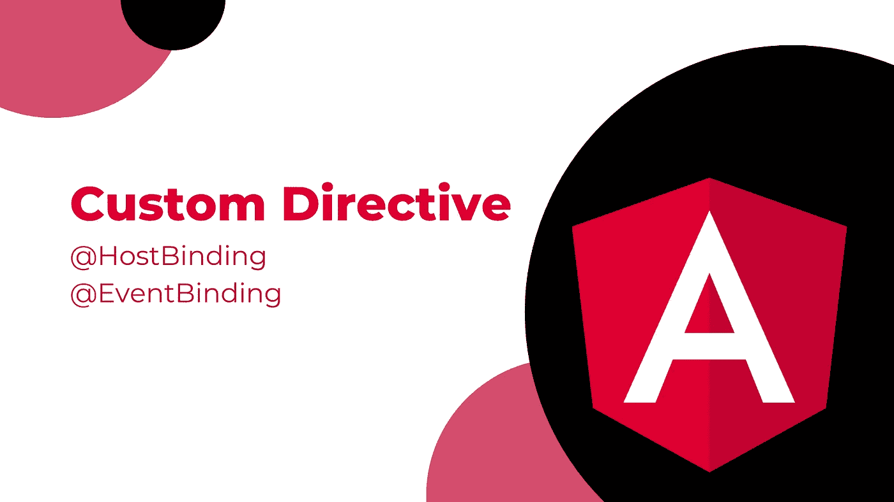

# 角度自定义指令示例—主机绑定和主机侦听器

> 原文：<https://javascript.plainenglish.io/angular-custom-directive-example-hostbinding-hostlistener-1b18bb08a5d1?source=collection_archive---------5----------------------->

## [棱角分明](https://medium.com/@lorenzozar/list/angular-5496c492a185)

## 指令赋予 HTML 元素超能力。使用 HostBinding & HostListener 创建自定义指令

指令是向 Angular 应用程序中的元素添加额外行为的类。( [Angular.io](https://angular.io/guide/built-in-directives) )



Angular Custom Directive

Angular 提供了几个内置的指令，您肯定使用了@Component 来创建角度组件。

简而言之，Angular 有 3 种类型的指令:

1.  **组件**
2.  **属性指令** —改变元素、组件或其他指令的样式或行为。你可能知道 NgClass，NgStyle，NgModel。
3.  **结构化指令** —通过添加和删除 DOM 元素来操作 DOM 布局。你可能知道*ngIf，*ngFor，*ngSwitch。

只有结构指令才会加上星号(*)。

结构化指令将元素包装在一个`ng-template`元素中，从[文档对象模型(DOM)](https://medium.com/p/c95531731367) 中添加和删除其内容。

在某些情况下，您可能希望创建自定义指令。

# 从指令到自定义指令

因为 Angular 将指令定义为类，所以您可以将指令视为没有接口的组件。

指令与 HTML 元素一起使用来添加额外的行为。

```
<div *ngIf="isLoaded"> ... </div>
```

在上面的例子中，当变量*被加载*为真时，显示一些内容。

对我们来说重要的是注意到`ngIf`指令使用了数据绑定！

因此，自定义指令也可以从使用数据绑定和事件侦听器中受益。

为此，我们将使用 HostBinding 和 HostListener 装饰器。

# 创建自定义指令

在进入编码示例之前，让我们描述一下 HostBinding 和 HostListener decorators。

## 主机绑定

[主机绑定](https://angular.io/api/core/HostBinding#hostbinding)装饰器提供配置元数据。此外，“ *Angular 在变化检测期间自动检查主机属性绑定，如果绑定发生变化，它将更新指令*的主机元素。”

## 主机监听器

host listenerdecorator "*声明一个 DOM 事件来监听，并提供一个处理程序方法在事件发生时运行。*”

## 如何创建自定义指令

我们将创建一个指令，当用户每次单击元素时，这个指令将改变应用它的元素的背景颜色。

**1。定义自定义指令**

首先，我们创建一个名为 click-color.directive.ts 的新文件。

在文件中，我们需要定义一个指令。我们通过用@Directive decorator 标记类并提供元数据来做到这一点。

具体来说，我们可以通过在装饰器中将指令分配给选择器来提供指令的名称，如下所示:

```
//click-color.directive.tsimport {Directive} from '@angular/core';@Directive({
  selector: '[clickColor]',
})
export class ClickColor {}
```

指令的名称是 ClickColor，选择器的名称是 clickColor。

**2。收听事件**

我们使用@HostListener 装饰器来监听特定的事件，并在事件发生时触发一个函数。

在指令的类中，我们添加了

```
//click-color.directive.ts...
export class ClickColor {
  @HostListener('click') onClick() {
    console.log('clicked');
  }
}
```

@HostListener 装饰器监听 Click 事件，并在 click 事件发生时触发 onClick 函数来记录一个字符串。

**3。注册指令**

请记住，在需要导入自定义指令并将其添加到声明中的 AppModule 中进行注册。

```
// app.module.ts
...
import { ClickColor } from './click-color.directive';@NgModule({
  imports: ...,
  declarations: [AppComponent, ClickColor],
  bootstrap: [AppComponent],
})
export class AppModule {}
```

从 Angular 15 开始，您可以使用稳定的独立 API。

因此，您还有另一个选择来注册指令！您可以使用[独立标志](https://angular.io/api/core/Directive#standalone)并跳过 AppModule 中的注册。

"*标记为独立的角度指令不需要在 NgModule 中声明。这样的指令不依赖于 NgModule* 的任何“中间上下文”

**4。使用指令**

使用自定义指令和使用内置指令一样简单。您只需要将选择器添加到应该使用它的 HTML 元素中。

```
<div class="box" clickColor>Click Me</div>
```

我们刚刚创建了一个自定义指令，它依赖 HostListener 在用户每次单击 HTML 元素时记录一个字符串。

## 改进指令

我们现在希望指令改变它所应用到的元素的背景颜色。

通过使用 Hostbinding 装饰器，我们可以绑定到主机元素的属性，在本例中，就是上面的`div`。

我们可以告诉装饰者通过传入属性名(例如`style.background`)来绑定主机元素的属性。

```
export class ClickColor {
  @HostListener('click') onClick() { ... } @HostBinding('style.background') background: string = 'red';
}
```

在我们的例子中，`background`是指令的属性名，该指令将为主机元素的`style.background`赋值。

通过分配`red`，颜色立即被应用。更好的解决方案可能是暂时不定义`background`。

```
@HostBinding('style.background') background: string;
```

**添加逻辑以提供颜色**

通过使用下面的代码，在每次单击时设置背景颜色。

```
@HostListener('click') onClick() {
  let randomN = Math.random();
  this.background = randomN < 0.5 ? 'red' : 'blue';
}
```

检测到更改后，颜色将应用于宿主元素的背景。

这是 Stackblitz 上[项目的链接，下面你可以找到一个演示。](https://stackblitz.com/edit/angular-ivy-iyeakp?file=src/app/click-color.directive.ts)

Project available on Stackblitz

# 结论

我们在一个定制指令中使用了@HostBinding 和@ HostListener decorators 来监听主机上的 click 事件。

也可以在组件中使用“@HostListener”装饰器；例如，侦听浏览器窗口对象的事件。

请随意使用 Stackblitz 上的项目，并关注我！

*更多内容请看*[***plain English . io***](https://plainenglish.io/)*。报名参加我们的* [***免费周报***](http://newsletter.plainenglish.io/) *。关注我们关于*[***Twitter***](https://twitter.com/inPlainEngHQ)[***LinkedIn***](https://www.linkedin.com/company/inplainenglish/)*[***YouTube***](https://www.youtube.com/channel/UCtipWUghju290NWcn8jhyAw)*[***不和***](https://discord.gg/GtDtUAvyhW) *。对增长黑客感兴趣？检查* [***电路***](https://circuit.ooo/) *。***