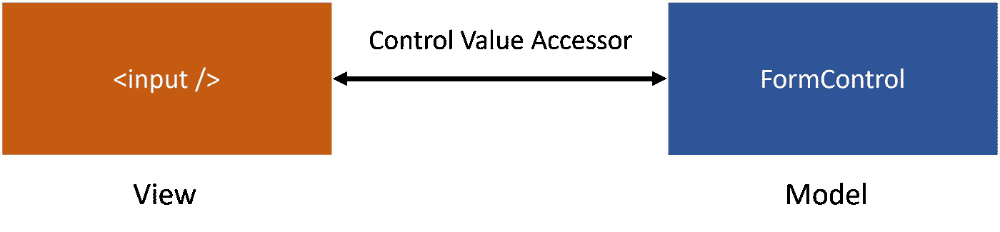

# 角度定制表单控件和嵌套表单组变得简单

> 原文：<https://javascript.plainenglish.io/angular-custom-form-controls-nested-form-groups-made-easy-2ac09e91cf67?source=collection_archive---------0----------------------->

## 如何让你的表单更具可重用性，拆分，让它们更具动态性。

Photo by [ALLVISIONN](https://www.istockphoto.com/portfolio/ALLVISIONN)

对于简单的案例，表单可以变得轻而易举。但是，一旦您开始构建比注册表单更复杂的东西，事情就会变得非常复杂。

当表单变得棘手时，有一些东西会让你的生活变得更容易，比如*自定义表单控件*和*嵌套表单组*。这将是本文的重点。如何让我们的表单更具可重用性，如何拆分它们，让它们更具动态性。

所以，让我们开始吧！

# 自定义窗体控件(控件值访问器)

自定义表单控件是与 Angular Forms API 兼容的指令。所谓兼容，我们的意思是它可以像任何其他本机表单控件元素一样在表单中使用。

或者等同于模板驱动的表单。

这看起来有多整洁干净？

最重要的是，这个自定义表单控件可以实现为与表单模块无关。它可以用于模板驱动的表单和反应式表单。

现在，假设我们的应用程序使用了很多表单，这些表单又有很多文本字段。大多数文本字段是相同的，需要有一致的显示和行为。

让我们首先构建一个简单的定制表单控件，名为`required-field`。顾名思义，它将是一个必需的输入字段，显示适当的验证消息，并根据其状态(有效或无效)调整其样式。

为此，我们需要实现三件事。

**1。支持原生文本元素所做的一切**

为了支持原生表单元素所做的一切，我们需要构建一个`ControlValueAccessor (CVA)`。该接口充当表单控件的视图和模型之间的桥梁。

Control Value Accessor (CVA) acts as a bridge between the view and the model

这两者需要同步，表单控件才能正常工作。当您在字段中键入一些内容时，需要将值发送回模型。当您以编程方式设置一个值时，该更改需要反映在视图中。

实现`ControlValueAccessor`接口很简单。我们只需要实现 3 个强制方法:

*   `writeValue(value)` —当请求从模型到视图的编程更改时，由表单 API 调用以写入视图
*   `registerOnChange(fn)` —提供一个回调函数`fn`，当我们的输入值发生变化时，就应该调用这个函数
*   `registerOnTouched(fn)` —提供一个回调函数`fn`，当我们的输入被认为被触摸或模糊时，应该调用这个函数

并且可选地还有 1 个:

*   `setDisabledState(value)` —当控件状态变为“禁用”或从“禁用”变为“禁用”时，由 forms API 调用

在前一个片段中发生了一些事情。我们使用`writeValue`将新值传递给显示视图。我们使用`setDisabledState`来存储禁用状态。最后，我们存储由`registerOnChange`和`registerOnTouched`提供的回调函数。

在模板 HTML 文件中，我们在`(input)`和`(blur)`上调用存储的回调函数，以允许表单 API 自我更新。

我们的`CVA`已经可以使用了，我们需要提供它。我们需要这样做，以便像`NgModel`和`FormControlName`这样的表单控制指令可以将我们的组件识别为值访问器。

**2。应用所需的验证**

您首先想到的可能是将`required`属性添加到内部文本字段中。但这不会如你所愿。

首先，我们不知道也不应该假设组件视图下面是什么。它可以是不支持表单验证属性的任何东西，比如 div 和 spans。

最重要的是，回想一下我们是如何需要实现一个特定的通信“协议”`CVA`接口来支持本地表单元素功能的？我们还需要使用各自的协议来支持验证。

我们需要实现`Validator`接口，它有一个强制方法:

*   `validate(ctrl: AbstractControl)` —对提供的控件执行同步验证

就是这样！我们的`Validator`已经可以使用了，我们需要提供它。我们需要这样做，以便像`NgModel`和`FormControlName`这样的表单控制指令可以将我们的组件识别为验证器。

**3。控制无效时显示错误信息并调整其样式**

在上一步中，用户可以在这个控件上添加我们不知道的任何自定义验证。在这种情况下，我们需要获得下面的模型，并检查它是有效还是无效。

最明显的方法是创建一个输入并传递表单控件实例本身。

那会工作得很好。除非它会违背创建自定义窗体控件的初衷。如果每次都要通过控件，过一会儿就开始变得有点烦了。

相反，我们希望有一种方法可以在内部访问表单控件，而不需要用户将它传入。但是，怎么做呢？进入*依赖注入*！

我们也说过我们的自定义窗体控件是窗体模块不可知的，不是吗？

为了实现这一点，我们需要为模板驱动的表单注入`[NgControl](https://angular.io/api/forms/NgControl)`而不是`NgModel`，或者为反应式表单注入`FormControlName`。我们可以这样做，因为`NgModel`和`FormControlName`都是`NgControl`的子类，并且将它们自己提供为`NgControl`。

他们称之为简单的例子。这个`@Self()`装饰工是什么？

我们使用`@Self()`装饰器将范围限制在我们当前所在的元素上。这是必要的，因为如果我们的自定义表单控件被包装在其他人的表单控件中，我们可能会得到一个错误的表单控件实例。

另一件事是`NgControl`正在注入值访问器和验证器。还记得我们说过需要将组件作为值访问器和验证器来提供吗？

嗯，我们不能同时做这两件事！

如果我们注入`NgControl`并且`NgControl`正在注入值访问器，其中包括我们提供的组件，这就是一个循环依赖！由于我们需要获得模型，我们确实需要注入`NgControl`。因此，我们应该删除提供者以避免循环依赖。

所以现在我们的工作是用正确的值访问器和验证器正确地设置`NgControl`。幸运的是，这很容易做到。

对于值访问器部分，我们只需将控制指令的`valueAccessor`属性设置为`this`。

对于验证器部分，我们可以以编程方式添加验证器。

我们还需要修改`writeValue`方法的实现，以便它使用注入的控制指令。

最后，在模板文件中，我们现在可以确定何时显示验证错误消息。在我们的例子中，如果控件被触摸并且无效。

***注意:*** *虽然也有一个* `*invalid*` *属性，但是我们仍然希望坚持使用*`*!valid*`**选项，这样我们就可以支持异步验证器。这是因为异步验证器在处理时有一个挂起状态。所以当控件挂起时，它既不是有效的也不是无效的。所以我们需要具体说“无效”。**

# *嵌套表单组(复合值访问器)*

*我们已经研究了如何创建带有单个输入字段的自定义表单控件。但是如果我们需要反复使用多个输入，一组字段呢？例如，如果我们需要应用程序中不同位置的个人信息字段，该怎么办？*

*我们要复制粘贴吗？绝不！*

*相反，我们可以用我们所学的来创造一个 ***的复合 CVA*** 。让我们创建一个名为`personal`的新组件。我们还可以在新组件中使用我们以前的定制表单控件`required-field`,让事情变得更加简单！*

*我们对自定义表单控件做了两处修改。我们向组件引入了一个名为 placeholder 的输入和一个名为 blur 的输出。该输出是将输入字段的`onTouched`事件从`required-field`内部冒泡到其父字段所必需的。*

*这个组件的 TypeScript 文件也有一些变化。我们将一个一个地介绍它们。*

*首先，我们需要定义表单及其验证。*

*所有字段都是必填的，如果用户为性别字段选择“其他”选项，他/她需要通过一个额外的字段指定性别，这也是必填的。*

*接下来，我们需要实现`CVA`接口方法。*

*我们修改方法以使用`form`变量。主要区别在于`registerOnChange`方法。回想一下，这个方法为我们提供了回调，只要输入值发生变化，就应该调用这个回调。不同之处在于，现在输入的是整个表单。因此，我们最好的选择是每当`valueChanges`发出时调用回调。*

*我们还需要实现`Validator`接口。*

*现在，你可能会想，这有必要吗？我们不是已经在表单中包含了验证吗？答案是，我们做到了，但只针对存在于这个组件中的形式。如果我们不实现这个接口，父窗体将无法知道这个嵌套窗体的状态。*

*因为我们这次没有注入`NgControl`，所以我们还需要使用`NG_VALUE_ACCESSOR`令牌将这个组件作为值访问器，使用`NG_VALIDATORS`令牌作为验证器。*

*就是这样！我们实现了一个表单组来收集用户的个人信息。表单组是可重用的，并且可以嵌套在现有的反应式表单中。*

*你可以在下面的 StackBlitz 找到一个工作演示。别忘了[订阅我的简讯](https://vkagklis.medium.com/subscribe)来关注更多类似的内容！*

**** *更新**:** 我们已经使用`NgControl`注入实现了`PersonalComponent`。你可以在这个 StackBlitz 链接中找到之前演示[的增强版。](https://stackblitz.com/edit/custom-form-controls-demo-enhanced)*

# *结论*

*在这篇文章中，我们检查了一些方法，使我们的生活更容易处理角形。我们看到了如何创建一个独立于表单模块的自定义表单控件。然后，我们使用这些知识来创建一个可重用的嵌套表单组，它由多个输入字段组成。*

*你可以在 AngularConnect 2017 的 [Kara Erickson](https://twitter.com/karaforthewin?lang=en) 精彩的[演讲](https://www.youtube.com/watch?v=CD_t3m2WMM8)中了解更多关于角形的知识。*

*感谢阅读！我希望你喜欢这篇文章，并且你学到了一些新的东西。*

*编码快乐！*

**更多内容请看*[***plain English . io***](https://plainenglish.io/)*。报名参加我们的* [***免费周报***](http://newsletter.plainenglish.io/) *。关注我们关于*[***Twitter***](https://twitter.com/inPlainEngHQ)*和*[***LinkedIn***](https://www.linkedin.com/company/inplainenglish/)*。查看我们的* [***社区不和谐***](https://discord.gg/GtDtUAvyhW) *加入我们的* [***人才集体***](https://inplainenglish.pallet.com/talent/welcome) *。**

****供进一步阅读:****

* [## 关于 Angular 你应该知道的 10 件事

### Zone.js 是什么？如何有角度地使用它？本问答指南将回答这些问题以及更多问题。

javascript.plainenglish.io](/angular-zone-js-3b5e2347b7)  [## 将角形嵌套形状拆分为子形状构件

### 如何将有角度的嵌套形状变成更小的子形状组件

better 编程. pub](https://betterprogramming.pub/split-angular-nested-forms-into-subform-components-dcf32d1fb10d)  [## 编写可维护代码的 7 条准则

### 遵循这 7 条准则来提高代码的可维护性。你未来的自己会感谢你的！

medium.com](https://medium.com/clean-code-practices/7-guidelines-to-write-maintainable-code-be78cd91b81)*