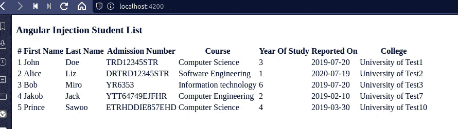

# 角度依赖注入

> 原文：<https://javascript.plainenglish.io/angular-dependency-injection-a12e1582486d?source=collection_archive---------6----------------------->

简单地说，依赖注入指的是引用其他类的类。这是一种允许单个类从其他来源请求依赖项的设计模式。

在本教程中，我们将构建一个使用依赖注入的示例学生列表 Angular 12 应用程序。

# 教程要求

*   安装在本地开发环境中的 Angular CLI(首选最新版本)。
*   角度的基本知识。
*   有 JavaScript 或 TypeScript 方面的知识。

# 期待结果

本教程旨在让你开始使用 Angular 12 依赖注入。通过阅读本教程，您将对 DI 有一个深入的了解，在您实现自己的项目时，您可能会有所进步。

# 角度依赖注入入门

依赖注入是关于资源共享的。

比方说，您有一个显示学校学生列表的`StudentService`和`StudentComponent`。我们可能会认为组件类依赖于服务类来显示数据，因为我们使用服务从 API 获取数据，这将在下一节中看到。

因此，一定要记住，依赖注入是一种编程方式，它使开发人员能够编写相互通信的代码。

因此，举例来说，当一个类没有给定的资源时，它可以很快地从另一个有资源的类中得到它，以此类推。

# 创建角度服务

现在我们已经有了 DI 的背景知识，让我们创建一个服务，我们将使用它返回给定公司的实习生名单。

> *服务是编程中广泛使用的一个术语，尤其是在微服务领域。它只是用于处理特定任务的一个函数或一组方法。*

让我们首先创建一个学生模型，如下所示:

```
cd injectionExample
ng g i student
```

输出:

```
CREATE src/app/student.ts (29 bytes)
```

接下来，将以下内容复制并添加到该模型中，如下所示:

```
export interface Student {
  studentFirstName: string;
  studentLastName: string;
  studentRegistrationNumber: string;
  studentCourse: string;
  studentYearOfStudy: number;
  reportingDate: string;
  college: string;
}
```

现在我们有了模型，让我们继续创建一个包含显示学生列表的函数的服务。

> 需要注意的是，我们创建这些服务的原因是为了松散地耦合我们的应用程序，并考虑到可重用性。

运行以下命令创建`studentListService`。

```
ng g service student-list
```

输出:

```
CREATE src/app/student-list.service.spec.ts (359 bytes)
CREATE src/app/student-list.service.ts (140 bytes)
```

现在我们有了一个服务，让我们添加一个函数，该函数返回实习生列表以及他们各自的详细信息。

```
import { Injectable } from '@angular/core';
import {Student} from './student';@Injectable({
  providedIn: 'root'
})
export class StudentListService { getInternsDetails(): Student[] {
    return [
      {
        studentFirstName: 'John',
        studentLastName: 'Doe',
        studentRegistrationNumber: 'TRD12345STR',
        studentCourse: 'Computer Science',
        studentYearOfStudy: 1,
        reportingDate: '2019-07-20',
        college: 'University of Test1',
      },
      {
        studentFirstName: 'Alice',
        studentLastName: 'Liz',
        studentRegistrationNumber: 'DRTRD12345STR',
        studentCourse: 'Software Engineering',
        studentYearOfStudy: 1,
        reportingDate: '2020-07-19',
        college: 'University of Test2',
      },
      {
        studentFirstName: 'Bob',
        studentLastName: 'Miro',
        studentRegistrationNumber: 'YR6353',
        studentCourse: 'Information technology',
        studentYearOfStudy: 1,
        reportingDate: '2019-07-20',
        college: 'University of Test3',
      },
      {
        studentFirstName: 'Jakob',
        studentLastName: 'Jack',
        studentRegistrationNumber: 'YTT64749EJFHR',
        studentCourse: 'Computer Engineering',
        studentYearOfStudy: 1,
        reportingDate: '2019-02-10',
        college: 'University of Test7',
      },
      {
        studentFirstName: 'Prince',
        studentLastName: 'Sawoo',
        studentRegistrationNumber: 'ETRHDDIE857EHD',
        studentCourse: 'Computer Science',
        studentYearOfStudy: 1,
        reportingDate: '2019-03-30',
        college: 'University of Test10',
      }
    ];
  }
}
```

让我们分析一下上面的服务:

*   **第 1 行** —我们正在导入`injectable`装饰机。没有这个装饰器，其他应用程序组件就不能注入(请求)这个服务。
*   **线 2** — `Student`模型从`./student`导入。通常的做法是将所有服务保存在一个`service`目录中。请随意测试。
*   **线 5**——我们有一个`StudentListService`班。在这个类中，我们定义了返回一组`Student`信息的`getInternsDetails()`方法。

# 如何在组件内部注入服务

现在我们已经有了一个可以使用的服务，让我们继续执行以下命令来创建一个学生组件:

```
ng g c student
```

输出:

```
CREATE src/app/student/student.component.css (0 bytes)
CREATE src/app/student/student.component.html (26 bytes)
CREATE src/app/student/student.component.spec.ts (635 bytes)
CREATE src/app/student/student.component.ts (273 bytes)
UPDATE src/app/app.module.ts (400 bytes)
```

编辑`src/app/student/student.component.ts`，如下图所示:

```
import { Component, OnInit } from '@angular/core';
import {StudentListService} from '../student-list.service';
import {Student} from '../student';@Component({
  selector: 'app-student',
  templateUrl: './student.component.html',
  styleUrls: ['./student.component.css']
})
export class StudentComponent implements OnInit {// local array tohold the list of students
  students: Student[];
  // we're injecting the studentListService (this is Dependency injection in action)
  constructor(private studentListService: StudentListService) { } ngOnInit() {
    this.getStudentsList();
  }
  //getting the list of students and assigning the list to students array
  getStudentsList() {
    this.students = this.studentListService.getInternsDetails();
  }
}
```

在上面的组件类中，我们定义了用于保存学生列表的`students`数组。

然后我们注入之前创建的`StudentListService`。这就是依赖注入在 Angular 中的实现方式。

我们还创建了用于从服务中获取学生详细信息的`getStudentsList()`方法。我们将结果分配给本地创建的学生数组。我们在`ngOnInit()`方法中调用这个方法来获取学生关于页面负载的详细信息。

# 显示来自服务的数据

既然我们已经使用了我们的服务，让我们继续在浏览器上显示这些数据。

如下图所示编辑`src/app/student/student.component.html`:

```
<div>
<table class="table table-stripped table-active">
  <thead class="thead-light">
  <th>#</th>
  <th>First Name</th>
  <th>Last Name</th>
  <th>Admission Number</th>
  <th>Course</th>
  <th>Year Of Study</th>
  <th>Reported On</th>
  <th>College</th>
  </thead>
  <tbody>
  <tr *ngFor="let student of students;let i=index">
    <td>{{i+1}}</td>
    <td>{{student.studentFirstName}}</td>
    <td>{{student.studentLastName}}</td>
    <td>{{student.studentRegistrationNumber}}</td>
    <td>{{student.studentCourse}}</td>
    <td>{{student.studentYearOfStudy}}</td>
    <td>{{student.reportingDate}}</td>
    <td>{{student.college}}</td>
  </tr>
  </tbody>
</table>
</div>
```

现在，通过在应用程序的根目录下执行以下命令来运行 Angular 应用程序:

```
ng serve --port 4200
```

预期产出:



# 结论

在本教程中，我们通过示例讨论了角度 DI 的广泛概念。我们已经看到了如何在一个组件中创建和消费服务。我们还更进一步，在浏览器上测试了我们的应用。

编码快乐！

*更多内容请看*[***plain English . io***](https://plainenglish.io/)*。报名参加我们的* [***免费周报***](http://newsletter.plainenglish.io/) *。关注我们关于*[***Twitter***](https://twitter.com/inPlainEngHQ)[***LinkedIn***](https://www.linkedin.com/company/inplainenglish/)*[***YouTube***](https://www.youtube.com/channel/UCtipWUghju290NWcn8jhyAw)*[***不和***](https://discord.gg/GtDtUAvyhW) ***。*****

*****对缩放您的软件启动感兴趣*** *？检查* [***电路***](https://circuit.ooo/?utm=publication-post-cta) *。***