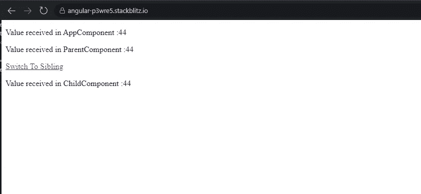
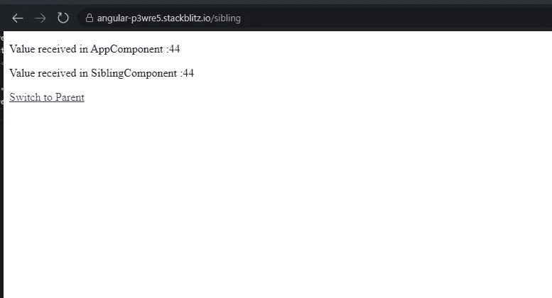
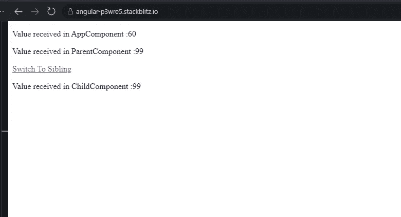
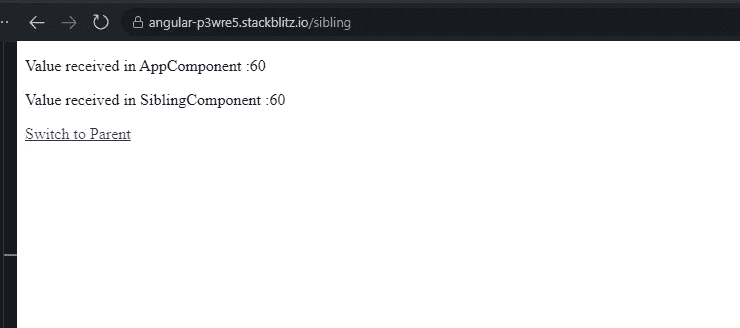

# Angular:您可以提供服务的不同方式和位置及其对服务的单体状态的影响——第二部分

> 原文：<https://javascript.plainenglish.io/angular-different-ways-and-places-you-can-provide-services-and-its-impact-on-singleton-status-of-1e9330c60744?source=collection_archive---------3----------------------->

这个故事只关注在一个加载功能模块中提供服务。如果你有兴趣用 AppModule 探索同样的概念，你可以看看下面的故事。

[](https://ramya-bala221190.medium.com/angular-different-ways-and-places-you-can-provide-services-and-their-impact-on-the-singleton-81fc2fe538bf) [## Angular:你可以提供服务的不同方式和地点以及它们对单身者的影响…

### 缺省情况下，Angular 中的服务是单例的。就这样结束了吗？不完全是。大多数时候，我们唯一的两个地方…

ramya-bala221190.medium.com](https://ramya-bala221190.medium.com/angular-different-ways-and-places-you-can-provide-services-and-their-impact-on-the-singleton-81fc2fe538bf) 

我已经创建了一个简单的项目，演示了在急切加载的功能模块中提供服务的不同方式以及它将产生的影响。

我创建了一个名为 **EagerModule** 的特性模块。该模块有三个组件: **ParentComponent、ChildComponent 和 SiblingComponent** 。

顾名思义，ChildComponent 是 ParentComponent 的子级，SiblingComponent 是 ParentComponent 的同级。

我们只有一项服务，**数据服务**。

下面是 **AppModule @NgModule()定义**。

```
export const routes: Routes = [];

@NgModule({
imports: [BrowserModule,FormsModule,EagerModule,RouterModule.forRoot(routes)],
declarations: [AppComponent],
bootstrap: [AppComponent],
providers: [DataService],
})

export class AppModule {}
```

我们已经在 AppModule 的**【imports】**中导入了 **EagerModule** 。这意味着该功能模块将被急切地加载。

我们已经将**数据服务**添加到 NgModule 的**【providers】**中。提供服务不会创建服务的实例。只有当服务被注入到需要它的类的构造函数中时，才会创建实例。

**这意味着每当 DataService 被注入到应用程序中任何类的构造函数中时，DataService 的同一个实例将对所有其他类可用。**

这种说法确实有例外。我们很快就会看到这一点。

移动到 **EagerModule @NgModule()定义**。

```
export const routes: Routes = [
{path: ‘’,component: ParentComponent},
{path: ‘sibling’,component: SiblingComponent}
];

@NgModule({
imports: [CommonModule, RouterModule.forChild(routes)],
declarations: [ParentComponent, ChildComponent, SiblingComponent],
providers: [DataService],
})

export class EagerModule {}
```

我们也通过[providers]在 EagerModule 中提供了数据服务。

这就是数据服务的样子。我们已经创建了一个属性 **randomNum** 来保存一个随机数。 **fetchNumber()** 返回这个随机生成的数字。

```
@Injectable()
export class DataService {
constructor() {}

public randomNum: number = Math.floor(Math.random() * 100);

fetchNumber() {
return this.randomNum;
}
}
```

如果 DataService 的**相同实例被注入到所有类中，那么所有类都必须接收到**相同的随机数**。**

转到组件，所有组件类都是彼此的精确副本。

让我只展示一下 **AppComponent 类**。我们调用了 DataService 的 **fetchNumber()** 来获取生成的随机数。这个随机数将显示在模板中。

其他组件类将遵循相同的模式。

```
@Component({
selector: ‘my-app’,
templateUrl: ‘./app.component.html’,
styleUrls: [ ‘./app.component.css’ ]
})

export class AppComponent {
constructor(private service: DataService) {}
public randomNumber: number;

ngOnInit() {
this.randomNumber = this.service.fetchNumber();
}
}
```

就组件模板而言，

EagerModule 的组件将被加载到 AppComponent 的 **<路由器出口>** 中。

ChildComponent 通过引用承载在 ParentComponent 内部。

这是应用程序的外观。AppComponent、ParentComponent 和 ChildComponent **从 DataService** 接收相同的随机数。



点击 ParentComponent 中的**“切换到同级”**链接，将加载<路由器出口>中的 **SiblingComponent** ，如下图所示。SiblingComponent 也和其他组件一样从 DataService 接收到了相同的随机数。



点击上面 SiblingComponent 中的 **"Switch to Parent"** 链接，将在<路由器出口>中再次加载 ParentComponent 和 ChildComponent。

有些人会认为**通过[providers]在 EagerModule 中再次单独提供 DataService 应该会为 EagerModule 创建一个新的 DataService 实例。**

为什么 **AppModule** 中的 AppComponent 和 **EagerModule** 中的 Parent、Child 和 Sibling 组件从 DataService 接收到相同的随机数？

1.  当您将一个功能模块导入到 AppModule 的**【imports】**中时，该功能模块将被急切地加载。
2.  导入特性模块的另一个效果是，**特性模块的[providers]的所有内容都将与 RootModuleInjector 相关联。**
3.  这个 **RootModuleInjector，**我们知道是和 AppModule 关联的。
4.  这意味着 AppModule 和 EagerModule 使用相同的注射器。这也意味着由注入器生成的 DataService 的同一个实例将被 AppModule 和 EagerModule 使用。
5.  如果将 DataService 注入到 app component/parent component/child component/sibling component 的构造函数中，那么使用的 DataService 实例将是相同的。因此，传递给这些组件的随机数的值也将是相同的。

让我稍微调整一下 ParentComponent，这样**也可以提供数据服务**。

```
@Component({
selector: ‘app-parent’,
templateUrl: ‘./parent.component.html’,
styleUrls: [‘./parent.component.css’],
providers:[DataService]
})

export class ParentComponent implements OnInit {
/*
Nothing changes here. The code remains the same.
*/
}
```

该应用程序现在将如下所示。



点击“切换到同级”加载 SiblingComponent。



可以观察到 AppComponent 和 SiblingComponent 中的**随机数是相同的**。但是它与 ParentComponent 和 ChildComponent 中的数字不同。

1.  当我将 DataService 注入到 AppComponent 的构造函数中时，DI 系统将检查服务实例对于与 AppComponent 关联的注入器是否可用。

由于 DataService 不是在 AppComponent 级别提供的，并且由于 AppComponent 没有任何父级，DI 系统将使用与 **AppModule** 相关联的 **RootModuleInjector** 来检查服务实例是否可用。

在 AppModule 的【providers】中提供了**数据服务。因此，DI 系统可以使用 **RootModuleInjector** 找到服务实例。**

2.当我将 DataService 注入到 **SiblingComponent** 的构造函数中时，DI 系统将检查服务实例是否可以与 SiblingComponent 关联的注入器一起使用。

不要！**在 SiblingComponent 级别**不提供数据服务。因此，DI 系统向上移动一个级别，并且**检查与 SiblingComponent(即 AppComponent)的父组件相关联的注入器。**

**在 AppComponent 级别没有提供 data service**，由于 AppComponent 没有任何父级，DI 系统将在模块级别开始检查。

它首先**检查数据服务是否在 EagerModule 级别**提供。**是的它提供了！**但是我们已经知道 EagerModule 和 AppModule 共享同一个注入器，即 RootModuleInjector。

此注入器生成的实例将用于 AppComponent 和 SiblingComponent。这解释了为什么 AppComponent 和 SiblingComponent 接收到相同的随机数。

3.当我将 DataService 注入到 **ParentComponent** 的构造函数中时，DI 系统将检查服务实例是否可以用与 **ParentComponent** 相关联的注入器获得。

是的，它是可用的！正如我们前面看到的， **DataService 是通过 ParentComponent** 中的【providers】提供的。因此与 ParentComponent 关联的**注入器将创建一个新的 DataService 实例。**

这解释了为什么 ParentComponent 收到的随机数不同于 AppComponent 和 SiblingComponent。

4.当我将 DataService 注入到**子组件**的构造函数中时，DI 系统将检查服务实例是否可以使用与**子组件**关联的注入器。

不，它不可用！因此，DI 系统向上移动一级，并且**检查该实例是否可用于与子组件的父组件(即父组件)相关联的注入器。**

是的，它是可用的！DataService 通过 ParentComponent 中的[providers]提供。因为与 ParentComponent 关联的 injector 已经创建了一个 DataService 实例，所以它不会再创建另一个实例。DI 系统为 ChildComponent 重用相同的 DataService 实例。

这解释了为什么 ParentComponent 和 ChildComponent 从 DataService 接收到相同的随机数。

所以现在我们有了数据服务的**两个不同的实例。您可以尝试下面的场景，看看输出有什么不同。**

= >在 SiblingComponent 和 ChildComponent 级别提供数据服务。

= >仅在 SiblingComponent 级别提供新服务，然后尝试在其他组件中访问它。

您可以在下面找到完整的工作示例。

[](https://stackblitz.com/edit/angular-gcaupq?file=src/app/eager/parent/parent.component.ts) [## 角形(叉形)堆叠

### 一个基于 rxjs，tslib，core-js，zone.js，@angular/core，@angular/forms，@angular/common 的 angular-cli 项目…

stackblitz.com](https://stackblitz.com/edit/angular-gcaupq?file=src/app/eager/parent/parent.component.ts) 

*更多内容看* [***说白了。报名参加我们的***](https://plainenglish.io/) **[***免费周报***](http://newsletter.plainenglish.io/) *。关注我们上* [***推特***](https://twitter.com/inPlainEngHQ)[***领英***](https://www.linkedin.com/company/inplainenglish/)*[***YouTube***](https://www.youtube.com/channel/UCtipWUghju290NWcn8jhyAw)**和* [***不和***](https://discord.gg/GtDtUAvyhW)**** ***对成长黑客感兴趣？检查出* [***电路***](https://circuit.ooo/) ***。*****