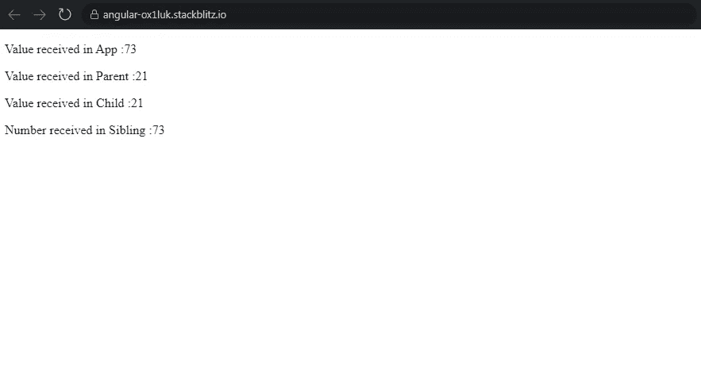
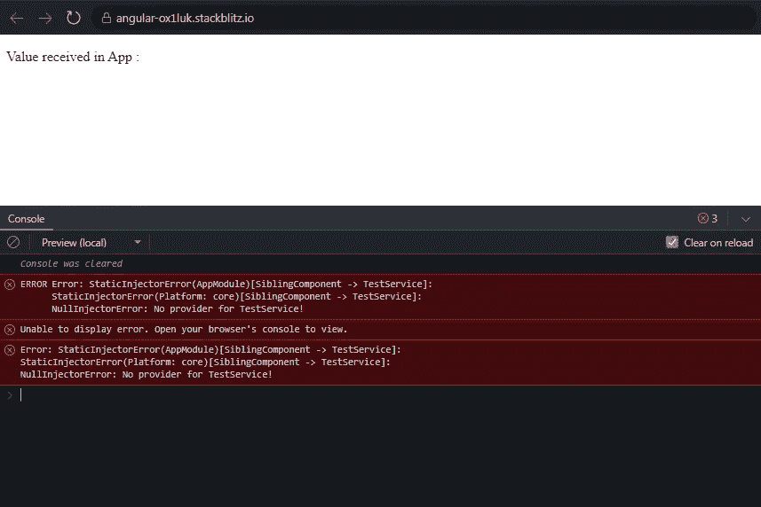

# Angular:可以提供服务的不同方式和位置，以及它们对服务的单体状态的影响

> 原文：<https://javascript.plainenglish.io/angular-different-ways-and-places-you-can-provide-services-and-their-impact-on-the-singleton-81fc2fe538bf?source=collection_archive---------2----------------------->

缺省情况下，Angular 中的服务是单例的。就这样结束了吗？不完全是。大多数情况下，我们只在以下两个地方提供服务:

1.  AppModule 中的 **@NgModule({})** 定义的 Providers 数组
2.  @ injectible({ })decorator 在服务类本身。

这两种方法几乎一样，做同样的工作，除了第二种方法有**摇树优势**而第一种方法没有。对于第二种方法，如果我不在应用程序的任何地方使用(即注入到一个类的构造函数中)该服务，该服务就不会包含在最终的包中。

这个故事的目标是**依赖注入系统在不同层级提供服务时如何反应**。我不会急于/懒惰地加载功能模块。这将在下一个故事中涉及。为了保持简单和避免混乱，我们只对 AppModule 进行了限制。

我已经创建了一个包含以下组件的项目:

**ParentComponent**

**子组件**-父组件的子组件

**Sibling component**-parent component 的同级

我们有两个服务:**数据服务**和**测试服务**。

这就是 **AppModule** 定义的样子。

```
@NgModule({
imports: [BrowserModule, FormsModule],
declarations: [
AppComponent,
ParentComponent,
ChildComponent,
SiblingComponent,
],
bootstrap: [AppComponent],
providers: [DataService],
})

export class AppModule {}
```

我们已经将**数据服务**添加到 NgModule 的**【提供者】**中。提供服务不会创建服务的实例。只有当服务被注入到需要它的类的构造函数中时，才会创建实例。

这意味着每当 DataService 被注入到应用程序中任何类的构造函数中时，DataService 的同一个实例将对所有其他类可用。

这种说法很少有例外。让我们来演示这些异常。

这就是 DataService 的样子。我们已经创建了一个属性 **randomNum** 来保存一个随机数。 **fetchNumber()** 返回这个随机生成的数字。

```
@Injectable()
export class DataService {
constructor() {}

public randomNum: number = Math.floor(Math.random() * 100);

fetchNumber() {
return this.randomNum;
}
}
```

如果 DataService 的**相同实例被注入到所有类中，那么所有类都必须接收到**相同的随机数**。**

**AppComponent 类:**我们已经调用了 DataService 的 **fetchNumber()** 来获取生成的随机数。

```
@Component({
selector: ‘my-app’,
templateUrl: ‘./app.component.html’,
styleUrls: [ ‘./app.component.css’ ]
})

export class AppComponent {
constructor(private service: DataService) {}
public randomNumber: number;

ngOnInit() {
this.randomNumber = this.service.fetchNumber();
}
}
```

**AppComponent 模板:**我们已经显示了随机数，并且还包含了对 **ParentComponent** 和 **SiblingComponent** 的引用。

```
<p>Value received in App :{{ randomNumber }}</p>
<app-parent></app-parent>
<app-sibling></app-sibling>
```

**ChildComponent 和 SiblingComponent** 是 AppComponent 的精确副本。正如所料，ChildComponent 将被托管在 **ParentComponent** 中。

最后，让我们看看 ParentComponent。

```
@Component({
selector: ‘app-parent’,
templateUrl: ‘./parent.component.html’,
styleUrls: [‘./parent.component.css’],
providers: [DataService]
})

export class ParentComponent implements OnInit {
constructor(private service: DataService){ }

public randomNumber: number;

ngOnInit() {
this.randomNumber = this.service.fetchNumber();
}
}
```

ParentComponent 看起来类似于 AppComponent，但是请注意，我们已经在 ParentComponent 的[providers]中提供了 DataService。

**ParentComponent 模板:**

```
<p>Value received in Parent :{{ randomNumber }}</p>
<app-child></app-child>
```



AppComponent 和 SiblingComponent 收到的随机数相同。

ParentComponent 和 ChildComponent 收到的随机数相同。

为什么结果会有差异？让我们看看 DI 系统是如何工作的。

1.  当我将 DataService 注入到 AppComponent 的构造函数中时，DI 系统将检查服务实例对于与 AppComponent 关联的注入器是否可用。

由于 DataService 不是在 AppComponent 级别提供的，并且由于 AppComponent 没有任何父级，DI 系统将使用与 **AppModule** 相关联的 **RootModuleInjector** 来检查服务实例是否可用。

在 AppModule 的【providers】中提供了**数据服务。因此，DI 系统可以使用 **RootModuleInjector** 找到服务实例。**

2.当我将 DataService 注入到 **SiblingComponent** 的构造函数中时，DI 系统将检查服务实例是否可以与 SiblingComponent 关联的注入器一起使用。

不要！**在 SiblingComponent 级别**不提供数据服务。因此，DI 系统向上移动一个级别，并且**检查与 SiblingComponent(即 AppComponent)的父组件相关联的注入器。**

**在 AppComponent 级别**不提供 DataService，由于 AppComponent 没有任何父级，DI 系统将使用与 **AppModule** 关联的 **RootModuleInjector** 检查服务实例是否可用。先前已经创建的实例将被 SiblingComponent 重用。

是的，它是可用的！所以 **AppComponent 和 SiblingComponent 共享数据服务**的同一个实例。这解释了两个组件如何从数据服务接收相同的随机数。

3.移动到**父组件**。当我将 DataService 注入到 **ParentComponent** 的构造函数中时，DI 系统将检查服务实例是否可以用与 **ParentComponent** 相关联的注入器获得。

是的，它是可用的！正如我们前面看到的， **DataService 是通过 ParentComponent** 中的【providers】提供的。因此，与 ParentComponent 关联的**注入器将创建一个新的 DataService 实例。**

这解释了为什么 ParentComponent 收到的随机数不同于 AppComponent 和 SiblingComponent。

4.移动到**子组件**。当我将 DataService 注入到**子组件**的构造函数中时，DI 系统将检查服务实例是否可用于与**子组件**相关联的注入器。

不，它不可用！因此，DI 系统向上移动一级，并且**检查该实例是否可用于与 ChildComponent 的父组件(即 ParentComponent)相关联的注入器。**

是的，它是可用的！DataService 通过 ParentComponent 中的[providers]提供。因为与 ParentComponent 关联的 injector 已经创建了一个 DataService 实例，所以它不会再创建另一个实例。DI 系统为 ChildComponent 重用相同的 DataService 实例。

这解释了为什么 ParentComponent 和 ChildComponent 从 DataService 接收到相同的随机数。

所以现在我们有了数据服务的 **2 个不同的实例。**

我想用**测试服务**展示另一个场景。这就是 TestService 的样子。我们使用 **fetchString()** 返回一个字符串“Hello World”。

```
@Injectable()
export class TestService {
constructor() { }

public someString:string=”Hello World”

fetchString() {
return this.someString;
}
}
```

请注意，TestService 不是在 **AppModule** 级别提供的，也不是在 TestService 类级别使用**@ injective()**中的 **providedIn 属性**提供的。那么在哪里提供呢？

我稍微修改了 SiblingComponent 以适应 TestService。我刚刚将 TestService 注入到构造器中，并在 **ngOnInit()** 中调用了 **fetchString()** 。

通过 SiblingComponent 中的[providers]提供测试服务。

```
@Component({
selector: ‘app-sibling’,
templateUrl: ‘./sibling.component.html’,
styleUrls: [‘./sibling.component.css’],
providers:[TestService]
})

export class SiblingComponent implements OnInit {
constructor(private dataService:DataService,private service: TestService) {}

public randomNumber:number;

ngOnInit() {
this.service.fetchString();
this.randomNumber = this.dataService.fetchNumber();
}
}
```

问题是，**任何其他类都可以访问 TestService 吗？让我们检查一下。**

我修改了 ParentComponent，在它的构造函数中注入了 TestService。

```
export class ParentComponent implements OnInit {
constructor(private service: DataService,private testService:TestService)
{ }
```

这是您将得到的错误。



我们来看看为什么？

当我将 **TestService** 注入到 **ParentComponent** 的构造函数中时，DI 系统将检查服务实例是否可以使用与 ParentComponent 关联的注入器。

**数据服务通过 ParentComponent 中的[providers]提供。不是测试服务**。因此，TestService 的一个实例在 ParentComponent 级别的注入器中不可用。

因此，DI 系统向上移动一个级别，**检查实例是否可用于与 ParentComponent(即 AppComponent)的父组件相关联的注入器。**

不，它不可用！**在 AppComponent 级别**不提供 TestService，由于 AppComponent 没有任何父级，DI 系统将使用与 **AppModule** 关联的 **RootModuleInjector** 检查服务实例是否可用。

不要！**app module 级别也不提供测试服务。**

当 DI 系统没有在任何注入器上找到 TestService 的实例时，它会抛出一个错误。

您可以在下面找到完整的工作示例。

[](https://stackblitz.com/edit/angular-ox1luk?file=src/app/app.component.ts) [## 角形(叉形)堆叠

### 一个基于 rxjs，tslib，core-js，zone.js，@angular/core，@angular/forms，@angular/common 的 angular-cli 项目…

stackblitz.com](https://stackblitz.com/edit/angular-ox1luk?file=src/app/app.component.ts) 

*更多内容看* [***说白了。报名参加我们的***](https://plainenglish.io/) **[***免费周报***](http://newsletter.plainenglish.io/) *。关注我们上* [***推特***](https://twitter.com/inPlainEngHQ) ，[***LinkedIn***](https://www.linkedin.com/company/inplainenglish/)***，***[***YouTube***](https://www.youtube.com/channel/UCtipWUghju290NWcn8jhyAw)***，*** *和 [***不和***](https://discord.gg/GtDtUAvyhW)*** *对成长黑客感兴趣？检查出* [***电路***](https://circuit.ooo/) ***。***