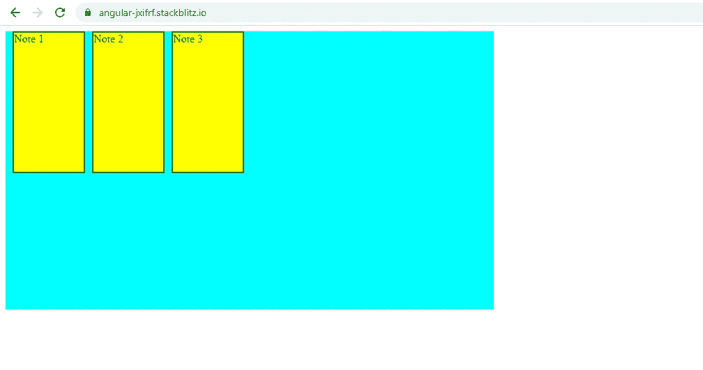
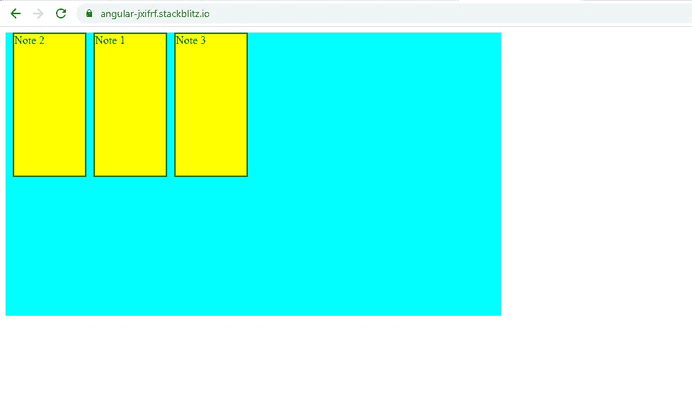

# Angular:使用可重用指令拖放和交换元素

> 原文：<https://javascript.plainenglish.io/angular-dragging-dropping-and-swapping-elements-using-a-reusable-directive-cb4b170d44cf?source=collection_archive---------4----------------------->

## 仅使用指令实现拖放和交换，以提高代码的可重用性。

我已经用 JavaScript 写了一个相同概念的故事。你可以看看下面的链接。

[](https://ramya-bala221190.medium.com/dragging-dropping-and-swapping-elements-with-javascript-11d9cdac2178) [## 用 Javascript 拖放和交换元素

### 我想分享一个工作解决方案，当拖放时，一个元素如何与另一个元素交换…

ramya-bala221190.medium.com](https://ramya-bala221190.medium.com/dragging-dropping-and-swapping-elements-with-javascript-11d9cdac2178) 

这个故事围绕着只使用指令实现拖放和交换来提高代码的可重用性。

我用了一个类似的例子，3 个盒子一个挨着一个浮动。目标是**每个音符可以被拖放到任何其他音符的位置，但不能放在自己身上。**



Drag, Drop, and Swap of Notes

**AppComponent 模板:**在这个模板中，我们正在遍历一个数组**的注释。**从上面的截图可以明显看出，因为有 3 个盒子，所以这是一个由 3 个对象组成的数组，属性名为**。**

我们已经将**dragdropswapdirect**应用于每个< div.note >标签。该指令将完全执行拖放和交换操作。我们向指令传递了 2 个输入来执行这项工作:

=>**将**数组注释为 **@Input ('list')** 和

=> **将< div.note >标签在 **notes** 数组中的位置**作为**@ Input(' ele imposition))**。

我们将在故事的稍后阶段回到 **returnUpdatedList** 。

**AppComponent 类:**该类不言自明。我们已经定义了数组**注释**，稍后将讨论方法 **returnUpdatedList()** 。

**dragdropswapdirect 类:**

1.  通过使用@HostBinding 将 **draggable 属性**设置为 true，每个<div.note>标签都可以拖动。</div.note>

```
@HostBinding(‘attr.draggable’) draggable = true;
```

2.让我们考虑一个实例，当包含 **Note1** 的<div.note>标签被拖放到包含 **Note2** 的< div.note >标签上。预期的行为是 Note2 取代 Note1，Note1 取代 Note2。</div.note>

```
**@HostListener(‘dragstart’, [‘$event’])**onDragStart(e) {
e.dataTransfer.setData(‘text’, this.elemPosition);
}
```

当我们开始**拖动 Note1** 时，触发 **dragstart** 事件，调用 **onDragStart()** 。在这个方法中，我们使用**数据传输**对象的 **setData()** 方法为类型 **"text"** 设置**element**中的数据。

一个**数据传输对象**用于保存在拖放操作中被拖动的数据。可以在所有拖动事件的**数据传输属性**中访问该对象。

**element position**包含 notes 数组中< div.note >标签的索引。因为我们正在拖动 **Note1** ，所以**element composition**包含了包含 Note1 的< div.note >标签的索引。

3.当 Note1 被**拖动到** Note2 上时，触发 **dragover** 事件，调用 **onDragOver()** 。

```
**@HostListener(‘dragover’, [‘$event’])****onDragOver(e) {**
e.preventDefault();
}
```

4.当 Note1 被**拖放**到 Note2 上时，包含 Note2 的< div.note >标签上触发 **drop** 事件，并调用 **onDrop()** 。

```
**@HostListener(‘drop’, [‘$event’])****onDrop(e) {**
e.preventDefault();let **sourceElementIndex** = e.dataTransfer.getData(‘text’);
let **destElementIndex** = this.elemPosition;
let **clonedList** = […this.list];if (sourceElementIndex !== destElementIndex) {
clonedList.splice(destElementIndex, 1, this.list[sourceElementIndex]);clonedList.splice(sourceElementIndex, 1, this.list[destElementIndex]);this.returnUpdatedList.emit(clonedList);
}
}
```

**sourceElementIndex** 存储包含被拖动的 Note1 的< div.note >标签的索引。

**destElementIndex** 包含 **notes** 数组中包含 Note2 的< div.note >标签的索引。

**克隆列表**包含数组**列表**的副本。

如果被拖动的<div.note>标签与被拖放到的<div.note>标签具有不同的索引，即注释不能被拖放到自身上，则执行下面的交换逻辑，并且通过 **returnUpdatedList** 事件发射器将更新的 **clonedList** 与注释 1 和注释交换的位置返回给组件。</div.note></div.note>

```
clonedList.splice(destElementIndex, 1, this.list[sourceElementIndex]);clonedList.splice(sourceElementIndex, 1, this.list[destElementIndex]);this.returnUpdatedList.emit(clonedList);
```

在 **AppComponent 类**中，我们用从指令接收到的更新后的 **clonedList** 数组来更新 **notes** 数组。

```
**returnUpdatedList(data) {**
this.notes = data;
}
```



Note1 and Note2 have been swapped

上面的例子可以在下面找到。

[](https://stackblitz.com/edit/angular-jxifrf?file=src/app/app.component.ts) [## 角形(叉形)堆叠

### 编辑描述

stackblitz.com](https://stackblitz.com/edit/angular-jxifrf?file=src/app/app.component.ts) 

*更多内容请看*[***plain English . io***](http://plainenglish.io/)*。报名参加我们的* [***免费周报***](http://newsletter.plainenglish.io/) *。在我们的* [***社区不和谐***](https://discord.gg/GtDtUAvyhW) *获取独家写作机会和建议。*